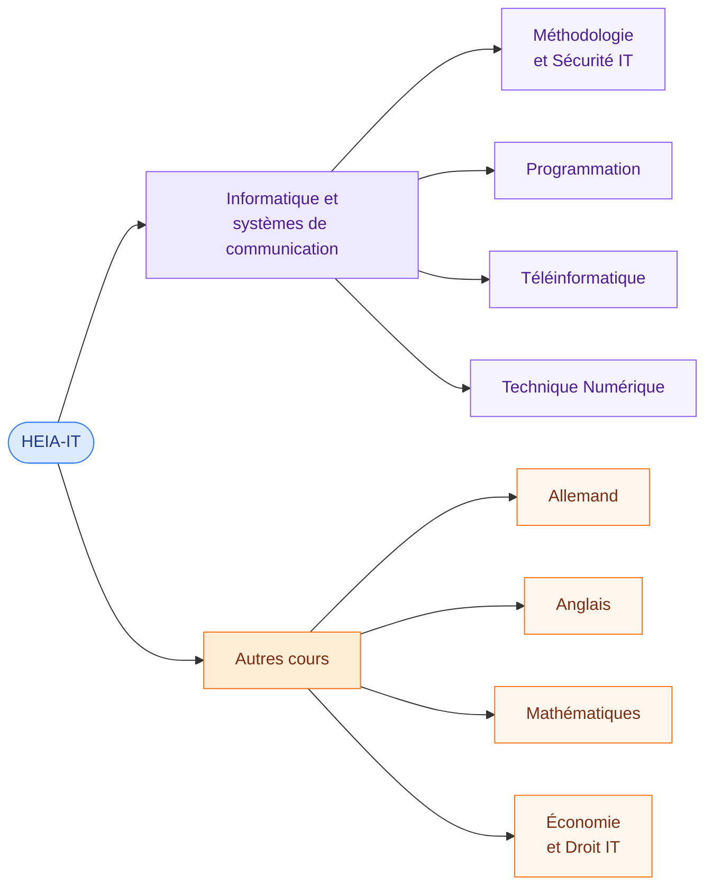

# Accueil

<mark style="color:blue;">**Toute la théorie de mes cours, expliquée simplement, au même endroit.**</mark>

Ce GitBook regroupe mes notes de la **HEIA-FR** (filière Informatique et systèmes de communication), réparties en **deux sections** : les modules d'informatique d'un côté, les autres cours (langues, maths, économie) de l'autre. Chaque page est pensée pour être **lue et comprise**, pas seulement relue avant l'examen : analogies, schémas, exemples et questions de révision.


**En bref**

Choisis une matière ci-dessous, lis les chapitres dans l'ordre, et termine par les **questions de révision** pour vérifier que tout est acquis.


***

## <mark style="color:purple;">01</mark> · Les matières



### Informatique et systèmes de communication



#### [Méthodologie et Sécurité IT](methodologie-securite-it/README.md)

Outils du quotidien (Linux, Docker…) et sécurité informatique.

#### [Programmation](programmation/README.md)

Java : bases du langage, orienté objet et bonnes pratiques.



#### [Téléinformatique](teleinformatique/README.md)

Réseaux, protocoles et communication de données.

#### [Technique Numérique](technique-numerique/README.md)

Logique, systèmes numériques et électronique digitale.



### Autres cours



#### [Allemand](allemand/conjugaison/01-present-verbes-reguliers.md)

[Conjugaison](allemand/conjugaison/01-present-verbes-reguliers.md), [grammaire](allemand/grammaire/01-place-du-verbe-et-questions.md) et [vocabulaire](allemand/vocabulaire/01-wortschatz-informatik.md) de l'informatique.

#### Anglais

À venir.



#### Mathématiques

À venir.

#### [Économie et Droit IT](economie-droit-it/README.md)

Culture générale d'entreprise et droit appliqué à l'informatique.



***

## <mark style="color:purple;">02</mark> · Avancement

| Section    | Matière                     | Statut                                                                |
| ---------- | --------------------------- | --------------------------------------------------------------------- |
| ISC        | Méthodologie et Sécurité IT | <mark style="color:green;">Linux & Shell, Docker</mark>               |
| ISC        | Programmation               | <mark style="color:green;">15 chapitres</mark>                        |
| ISC        | Téléinformatique            | À venir                                                               |
| ISC        | Technique Numérique         | À venir                                                               |
| Autres     | Allemand                    | <mark style="color:green;">Conjugaison, grammaire, vocabulaire</mark> |
| Autres     | Anglais                     | À venir                                                               |
| Autres     | Mathématiques               | À venir                                                               |
| Autres     | Économie et Droit IT        | <mark style="color:green;">Introduction (6 pages)</mark>              |

***

## <mark style="color:purple;">03</mark> · Comment lire une page

Toutes les pages suivent le même format :



### L'essentiel d'abord

Chaque page commence par un encadré **En bref** : l'idée principale en deux lignes.



### Des sections numérotées

<mark style="color:purple;">**01**</mark>, <mark style="color:purple;">**02**</mark>… avec des schémas, des analogies et des exemples.



### Un résumé pour finir

Les points à retenir, puis un lien vers la page suivante.



Les couleurs ont toujours un sens :

* <mark style="color:green;">**Vert**</mark> → bonne pratique, recommandé
* <mark style="color:orange;">**Orange**</mark> → à surveiller, piège fréquent
* <mark style="color:red;">**Rouge**</mark> → dangereux, irréversible
* <mark style="color:blue;">**Bleu**</mark> → terme clé

***

<details>

<summary>Organisation du dépôt</summary>

```
.
├── README.md                  # Page d'accueil (cette page)
├── SUMMARY.md                 # Table des matières GitBook
├── .gitbook.yaml              # Configuration de la synchronisation
├── .gitbook/assets/           # Images et fichiers joints
│
│   # Informatique et systèmes de communication
├── methodologie-securite-it/
│   ├── linux/
│   └── docker/
├── programmation/
├── teleinformatique/
├── technique-numerique/
│
│   # Autres cours
├── allemand/
│   ├── conjugaison/
│   ├── grammaire/
│   └── vocabulaire/
└── economie-droit-it/
    └── 01-introduction/
```

**Conventions :**

* Une page = un fichier `NN-nom-de-la-page.md`, numéroté pour garder l'ordre.
* Noms de fichiers en minuscules, sans accents ni espaces.
* Les sections du menu (**Informatique et systèmes de communication**, **Autres cours**) sont définies dans `SUMMARY.md`, pas par des dossiers.
* Les images vont dans `.gitbook/assets/`.
* Toute nouvelle page doit être ajoutée dans `SUMMARY.md`.
* Le style de référence est dans `template.md`.

</details>
