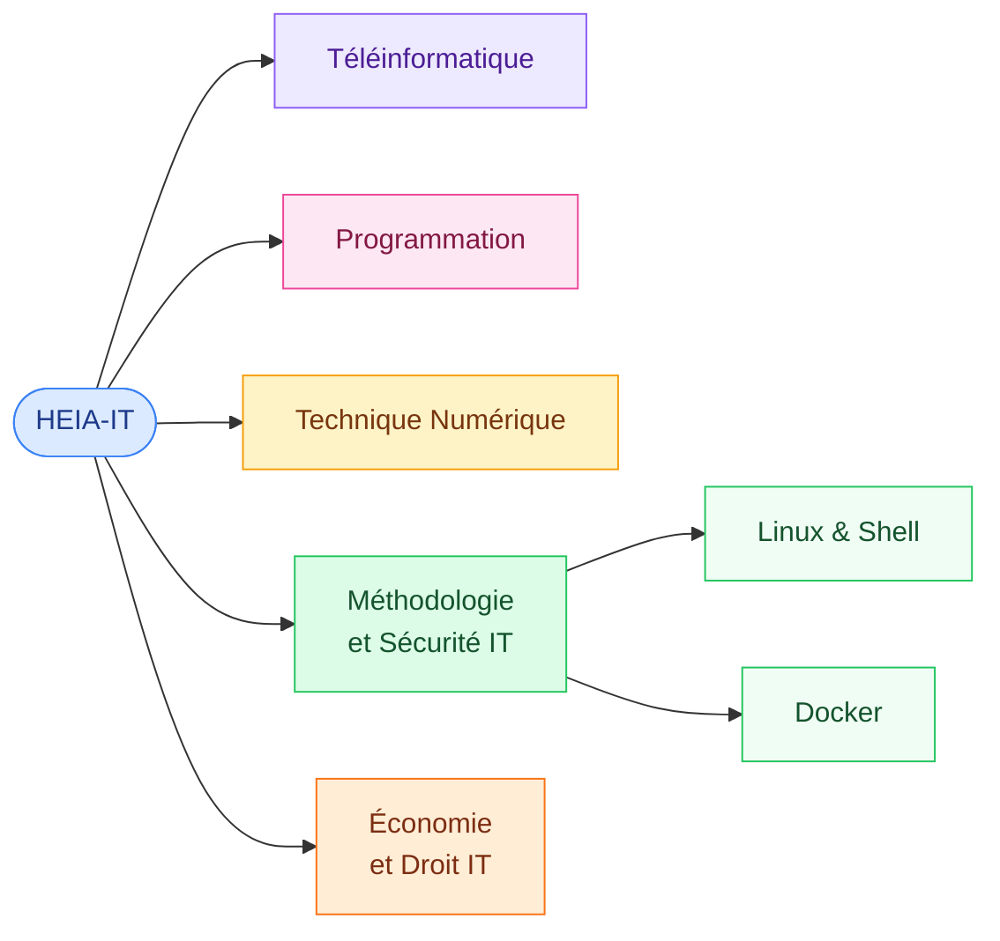

# HEIA-IT — Cours

<mark style="color:blue;">**Toute la théorie de mes cours, expliquée simplement, au même endroit.**</mark>

&#x20;

Ce GitBook regroupe mes notes de la **HEIA-FR** (filière Informatique), organisées par matière puis par chapitre. Chaque page est pensée pour être **lue et comprise**, pas seulement relue avant l'examen : analogies, schémas, exemples et questions de révision.

&#x20;


**En bref**

Choisis une matière ci-dessous, lis les chapitres dans l'ordre, et termine par les **questions de révision** pour vérifier que tout est acquis.


&#x20;

***

&#x20;

## <mark style="color:purple;">01</mark> · Les matières

&#x20;



&#x20;



### [Téléinformatique](teleinformatique/README.md)

Réseaux, protocoles et communication de données.

&#x20;

### [Programmation](programmation/README.md)

Langages, algorithmes et bonnes pratiques.

&#x20;

### [Économie et Droit IT](economie-droit-it/README.md)

Économie d'entreprise et droit appliqué à l'informatique.



### [Technique Numérique](technique-numerique/README.md)

Logique, systèmes numériques et électronique digitale.

&#x20;

### [Méthodologie et Sécurité IT](methodologie-securite-it/README.md)

Outils du quotidien (Linux, Docker…) et sécurité informatique.



&#x20;

***

&#x20;

## <mark style="color:purple;">02</mark> · Avancement

&#x20;

| Matière                        | Statut                                                      |
| ------------------------------ | ----------------------------------------------------------- |
| Téléinformatique            | À venir                                                  |
| Programmation               | <mark style="color:green;">15 chapitres</mark> |
| Technique Numérique         | À venir                                                  |
| Méthodologie et Sécurité IT | <mark style="color:green;">Linux & Shell, Docker</mark>  |
| Économie et Droit IT        | À venir                                                  |

&#x20;

***

&#x20;

## <mark style="color:purple;">03</mark> · Comment lire une page

&#x20;

Toutes les pages suivent le même format :

&#x20;



### L'essentiel d'abord

&#x20;

Chaque page commence par un encadré **En bref** : l'idée principale en deux lignes.



### Des sections numérotées

&#x20;

<mark style="color:purple;">**01**</mark>, <mark style="color:purple;">**02**</mark>… avec des schémas, des analogies et des exemples de commandes.



### Un résumé pour finir

&#x20;

Les points à retenir, puis un lien vers la page suivante.



&#x20;

Les couleurs ont toujours un sens :

&#x20;

* <mark style="color:green;">**Vert**</mark> → bonne pratique, recommandé
* <mark style="color:orange;">**Orange**</mark> → à surveiller, piège fréquent
* <mark style="color:red;">**Rouge**</mark> → dangereux, irréversible
* <mark style="color:blue;">**Bleu**</mark> → terme clé

&#x20;

***

&#x20;

<details>

<summary>Organisation du dépôt</summary>

&#x20;

```
.
├── README.md                  # Page d'accueil (cette page)
├── SUMMARY.md                 # Table des matières GitBook
├── .gitbook.yaml              # Configuration de la synchronisation
├── .gitbook/assets/           # Images et fichiers joints
├── teleinformatique/
├── programmation/
├── technique-numerique/
├── methodologie-securite-it/
│   ├── linux/
│   └── docker/
└── economie-droit-it/
```

&#x20;

**Conventions :**

* Chaque matière et chaque chapitre a un `README.md` d'introduction.
* Une page = un fichier `NN-nom-de-la-page.md`, numéroté pour garder l'ordre.
* Noms de fichiers en minuscules, sans accents ni espaces.
* Les images vont dans `.gitbook/assets/`.
* Toute nouvelle page doit être ajoutée dans `SUMMARY.md`.
* Le style de référence est dans `template.md`.

&#x20;

</details>
