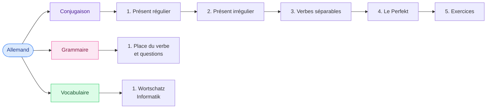

# Allemand

<mark style="color:blue;">**Parler de son métier d'informaticien en allemand, simplement.**</mark>

&#x20;


**En bref**

Le cours tourne autour de **trois piliers** : savoir **conjuguer** les verbes (présent et Perfekt), savoir **construire une phrase** (où va le verbe ?), et connaître le **vocabulaire de l'informatique**. Chaque page contient des exemples et des exercices dont la réponse est **cachée** : clique pour la voir.


&#x20;

***

&#x20;

## <mark style="color:purple;">01</mark> · Le parcours

&#x20;

&#x20;


**Ordre conseillé** — commence par le **vocabulaire** (tu en as besoin partout), puis la **conjugaison** dans l'ordre, et termine par la **grammaire**, qui explique où placer tout ça dans une phrase.


&#x20;

***

&#x20;

## <mark style="color:purple;">02</mark> · Les chapitres

&#x20;

| Partie      | Page                                                                                      | Ce que tu y apprends                                          |
| ----------- | ----------------------------------------------------------------------------------------- | ------------------------------------------------------------- |
| Conjugaison | [1. Présent — verbes réguliers](conjugaison/01-present-verbes-reguliers.md)                       | Les terminaisons de base : `-e, -st, -t, -en, -t, -en`        |
| Conjugaison | [2. Présent — verbes irréguliers](conjugaison/02-present-verbes-irreguliers.md)                   | Les verbes qui changent de voyelle, `sein`, `haben`, `können` |
| Conjugaison | [3. Verbes séparables et inséparables](conjugaison/03-verbes-separables-inseparables.md) | `umsetzen` → *er setzt … um*, mais `entwickeln` reste entier  |
| Conjugaison | [4. Le Perfekt](conjugaison/04-perfekt.md)                                                 | Le passé composé : `er hat … entwickelt`                      |
| Conjugaison | [5. Exercices de conjugaison](conjugaison/05-exercices-conjugaison.md)                                 | La fiche du cours corrigée + exercices mélangés               |
| Grammaire   | [1. Place du verbe et questions](grammaire/01-place-du-verbe-et-questions.md)             | Verbe en 2e position, la « parenthèse », poser une question   |
| Vocabulaire | [1. Wortschatz Informatik](vocabulaire/01-wortschatz-informatik.md)                        | Les mots de la liste 26-27, avec quiz                         |

&#x20;

***

&#x20;

## <mark style="color:purple;">03</mark> · Comment utiliser les exercices

&#x20;



### Cache et réfléchis

&#x20;

Lis la question, réponds **à voix haute ou par écrit** avant de cliquer.



### Ouvre la réponse

&#x20;

Clique sur la question : la réponse apparaît, avec une petite explication.



### Note tes erreurs

&#x20;

Si tu te trompes, relis la section indiquée. Une erreur comprise, c'est une erreur qui ne revient pas.



&#x20;

Exemple : comment on dit « je développe » ?

&#x20;

**Ich entwickle.** (et pas ~~ich entwickele~~ — on verra pourquoi dans la page 1.)

&#x20;

