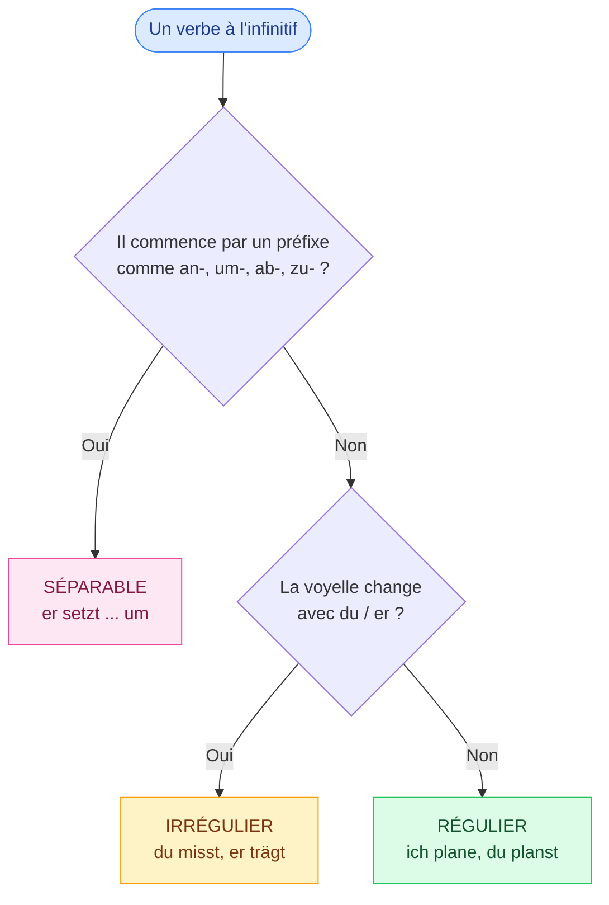

# Conjugaison

<mark style="color:blue;">**Un verbe allemand, c'est un radical + une terminaison. Le reste, ce sont des exceptions à connaître.**</mark>

&#x20;


**En bref**

Au **présent**, presque tous les verbes suivent le même schéma de terminaisons. Certains changent de voyelle (**irréguliers**), d'autres se coupent en deux (**séparables**). Le **Perfekt** (passé) se construit avec `haben` ou `sein` + un participe.


&#x20;

***

&#x20;

## <mark style="color:purple;">01</mark> · Quel type de verbe ?

&#x20;

Face à un nouveau verbe, pose-toi ces questions dans l'ordre :

&#x20;

&#x20;


**Un verbe peut être les deux** : `anwenden` est séparable **et** a des formes particulières au Perfekt. On regarde toujours les deux questions.


&#x20;

***

&#x20;

## <mark style="color:purple;">02</mark> · Les pages

&#x20;

| #  | Page                                                                          | Idée clé                                           |
| -- | ----------------------------------------------------------------------------- | -------------------------------------------------- |
| 1  | [Présent — verbes réguliers](conjugaison/01-present-verbes-reguliers.md)                         | `ich plane, du planst, er plant…`                  |
| 2  | [Présent — verbes irréguliers](conjugaison/02-present-verbes-irreguliers.md)                     | `ich messe, du misst, er misst…`                   |
| 3  | [Verbes séparables et inséparables](conjugaison/03-verbes-separables-inseparables.md)    | `ich passe an` / `ich entwerfe`                    |
| 4  | [Le Perfekt](conjugaison/04-perfekt.md)                                                   | `ich habe gespeichert`                             |
| 5  | [Exercices de conjugaison](conjugaison/05-exercices-conjugaison.md)                                   | La fiche du cours + entraînement                   |
