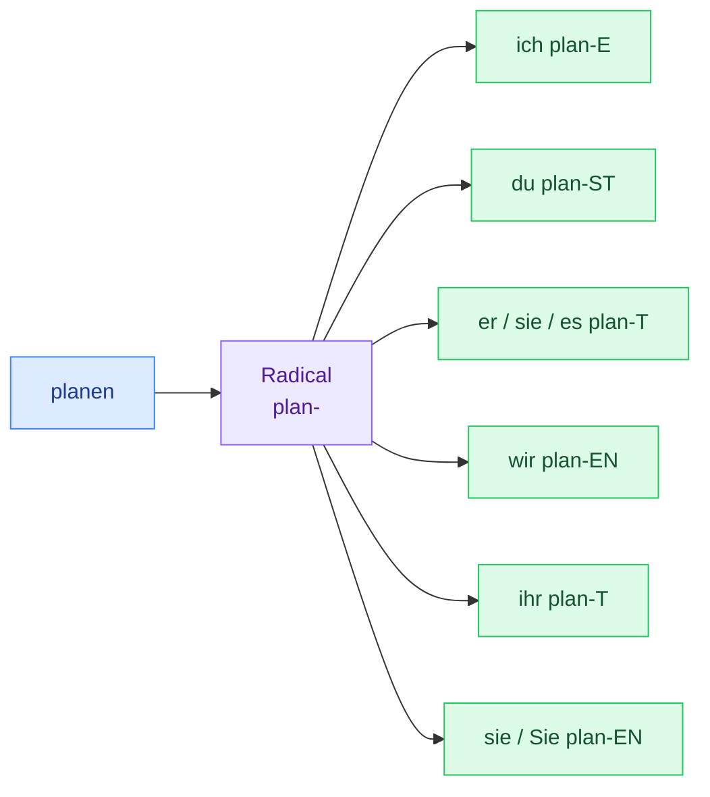

# 1. Présent — verbes réguliers

<mark style="color:blue;">**Enlève `-en`, ajoute la bonne terminaison. C'est tout.**</mark>

&#x20;


**En bref**

Un verbe régulier garde **le même radical** à toutes les personnes. Seule la **terminaison** change : `-e, -st, -t, -en, -t, -en`. Apprends ces six terminaisons par cœur : elles servent pour **presque tous** les verbes allemands, même les irréguliers.


&#x20;

***

&#x20;

## <mark style="color:purple;">01</mark> · La recette

&#x20;



### Prends l'infinitif

&#x20;

`planen` (planifier)



### Enlève `-en` → tu obtiens le radical

&#x20;

`planen` → **`plan-`**



### Ajoute la terminaison de la personne

&#x20;

`ich plan`**`e`** · `du plan`**`st`** · `er plan`**`t`** …



&#x20;

&#x20;

***

&#x20;

## <mark style="color:purple;">02</mark> · Le tableau à connaître par cœur

&#x20;

| Personne                   | Français         | Terminaison | `planen` (planifier) | `speichern`* (sauvegarder) | `programmieren` |
| -------------------------- | ---------------- | ----------- | -------------------- | -------------------------- | --------------- |
| **ich**                    | je               | **-e**      | ich plan**e**        | ich speicher**e**          | ich programmier**e** |
| **du**                     | tu               | **-st**     | du plan**st**        | du speicher**st**          | du programmier**st** |
| **er / sie / es / man**    | il / elle / on   | **-t**      | er plan**t**         | er speicher**t**           | er programmier**t** |
| **wir**                    | nous             | **-en**     | wir plan**en**       | wir speicher**n**          | wir programmier**en** |
| **ihr**                    | vous (tutoiement pluriel) | **-t** | ihr plan**t**    | ihr speicher**t**          | ihr programmier**t** |
| **sie / Sie**              | ils·elles / Vous (politesse) | **-en** | sie plan**en** | sie speicher**n**       | sie programmier**en** |

&#x20;

* Les verbes en <code>-ern</code> et <code>-eln</code> ne prennent que <b>-n</b> avec wir / sie : voir section 03.

&#x20;


**Astuce mémoire** — `wir` et `sie/Sie` ont **toujours** la même forme que l'infinitif. Si tu connais l'infinitif, tu as déjà deux personnes sur six.


&#x20;


**`sie` ou `Sie` ?**

* `sie` + verbe en **-t** → **elle** : *sie plant* = elle planifie
* `sie` + verbe en **-en** → **ils / elles** : *sie planen* = ils planifient
* `Sie` (majuscule) + **-en** → **Vous** de politesse : *Herr Meier, planen Sie das Projekt ?*


&#x20;

***

&#x20;

## <mark style="color:purple;">03</mark> · Les petits cas particuliers

&#x20;

Trois « accidents » à connaître. Ce ne sont **pas** des verbes irréguliers : ils existent juste pour que le mot se **prononce** facilement.

&#x20;



**On ajoute un `e`** devant `-st` et `-t`, sinon on ne pourrait pas le prononcer (*du arbeitst* ?!).

&#x20;

| | `arbeiten` (travailler) | `berechnen` (calculer) |
| --- | --- | --- |
| ich | arbeite | berechne |
| du | arbeit**e**st | berechn**e**st |
| er/sie/es | arbeit**e**t | berechn**e**t |
| wir | arbeiten | berechnen |
| ihr | arbeit**e**t | berechn**e**t |
| sie/Sie | arbeiten | berechnen |

&#x20;

*Ich arbeite bei Google. — Er berechnet die Kosten.*



Avec **du**, on n'ajoute que **`-t`** (le `s` est déjà là).

&#x20;

| | `setzen` (poser) | `anpassen` (adapter) |
| --- | --- | --- |
| ich | setze | passe an |
| du | set**zt** | pa**sst** an |
| er/sie/es | setzt | passt an |

&#x20;

*Du setzt das Projekt um. — Du passt den Code an.*



* **-eln** (`entwickeln`) : avec **ich**, le `e` du radical **tombe** → *ich entwick**le***.
* **-eln / -ern** : avec **wir** et **sie**, on ajoute seulement **`-n`**.

&#x20;

| | `entwickeln` (développer) | `speichern` (sauvegarder) |
| --- | --- | --- |
| ich | entwick**le** | speichere |
| du | entwickelst | speicherst |
| er/sie/es | entwickelt | speichert |
| wir | entwickel**n** | speicher**n** |
| ihr | entwickelt | speichert |
| sie/Sie | entwickel**n** | speicher**n** |

&#x20;

*Herr Meier, entwickeln Sie Programme ? — Ja, ich entwickle Apps.*



**Toujours réguliers**, sans exception. Ce sont souvent des mots proches du français — parfait pour l'informatique !

&#x20;

`programmieren` · `konfigurieren` · `analysieren` · `implementieren` · `optimieren` · `validieren` · `präsentieren` · `kontrollieren`

&#x20;

*Ich konfiguriere den Server. — Wir optimieren den Code. — Die Studierenden präsentieren ihr Modell.*



&#x20;

***

&#x20;

## <mark style="color:purple;">04</mark> · Exemples en contexte

&#x20;

| Allemand                                     | Français                                 |
| -------------------------------------------- | ---------------------------------------- |
| Ich **programmiere** in Java.                | Je programme en Java.                    |
| Du **speicherst** die Datei.                 | Tu sauvegardes le fichier.               |
| Sie **plant** ein neues Projekt.             | Elle planifie un nouveau projet.         |
| Wir **entwickeln** ein Sicherheitskonzept.   | Nous développons un concept de sécurité. |
| Ihr **analysiert** die Daten.                | Vous analysez les données.               |
| Die Firma **druckt** die Dokumente.          | L'entreprise imprime les documents.      |
| Man **drückt** auf den Knopf.                | On appuie sur le bouton.                 |
| Er **kennt** das Netzwerk.                   | Il connaît le réseau.                    |

&#x20;

***

&#x20;

## <mark style="color:purple;">05</mark> · Exercices

&#x20;


**Mode d'emploi** — réponds d'abord dans ta tête ou sur papier, **puis** clique pour vérifier.


&#x20;

### A. Conjugue le verbe

&#x20;

1. programmieren → du ___

&#x20;

**du programmierst** — verbe en `-ieren`, toujours régulier.

&#x20;

2. arbeiten → er ___

&#x20;

**er arbeitet** — radical en `-t`, on ajoute un `e` : *arbeit-e-t*.

&#x20;

3. entwickeln → ich ___

&#x20;

**ich entwickle** — verbe en `-eln`, le `e` tombe avec *ich*.

&#x20;

4. speichern → wir ___

&#x20;

**wir speichern** — verbe en `-ern`, seulement `-n`. (Même forme que l'infinitif !)

&#x20;

5. berechnen → du ___

&#x20;

**du berechnest** — radical en `-chn`, on ajoute un `e`.

&#x20;

6. kennen → ihr ___

&#x20;

**ihr kennt**

&#x20;

7. analysieren → sie (ils) ___

&#x20;

**sie analysieren**

&#x20;

8. drucken → es ___

&#x20;

**es druckt** — *Der Drucker druckt.* (L'imprimante imprime.)

&#x20;

&#x20;

### B. Complète la phrase

&#x20;

9. Herr Meier, ___ Sie Programme? (entwickeln)

&#x20;

**Herr Meier, entwickeln Sie Programme?** — `Sie` de politesse = même forme que l'infinitif.

&#x20;

10. Wir ___ die Kosten. (berechnen)

&#x20;

**Wir berechnen die Kosten.**

&#x20;

11. Ihr ___ den Router. (konfigurieren)

&#x20;

**Ihr konfiguriert den Router.**

&#x20;

12. Sie ___ bei einer Bank. (arbeiten — elle)

&#x20;

**Sie arbeitet bei einer Bank.** — *elle* → terminaison `-t`, avec le `e` en plus.

&#x20;

&#x20;

### C. Traduis en allemand

&#x20;

13. Je sauvegarde les données.

&#x20;

**Ich speichere die Daten.**

&#x20;

14. Tu optimises le programme.

&#x20;

**Du optimierst das Programm.**

&#x20;

15. Nous travaillons dans un réseau.

&#x20;

**Wir arbeiten in einem Netzwerk.**

&#x20;

&#x20;

***

&#x20;

## <mark style="color:purple;">06</mark> · À retenir

&#x20;

* Radical = infinitif **sans `-en`**.
* Terminaisons : <mark style="color:blue;">**-e, -st, -t, -en, -t, -en**</mark>.
* Radical en `-t/-d/-chn` → on glisse un **e** (*du arbeitest*).
* `-eln` → *ich entwick**le*** ; `-eln/-ern` → *wir entwickel**n***.
* Les verbes en **`-ieren`** sont toujours réguliers.

&#x20;


**Page suivante** → [2. Présent — verbes irréguliers](02-present-verbes-irreguliers.md)

