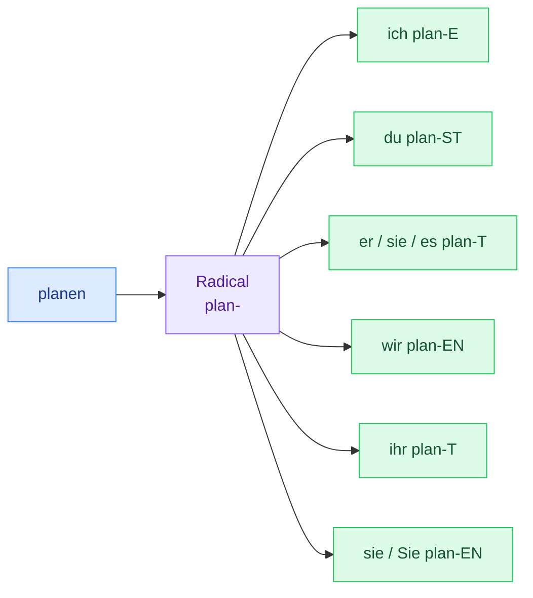

# 1. Présent — verbes réguliers

<mark style="color:blue;">**Enlève**</mark><mark style="color:blue;">**&#x20;**</mark><mark style="color:blue;">**`-en`**</mark><mark style="color:blue;">**, ajoute la bonne terminaison. C'est tout.**</mark>


**En bref**

Un verbe régulier garde **le même radical** à toutes les personnes. Seule la **terminaison** change : `-e, -st, -t, -en, -t, -en`. Apprends ces six terminaisons par cœur : elles servent pour **presque tous** les verbes allemands, même les irréguliers.


***

## <mark style="color:purple;">01</mark> · La recette



### Prends l'infinitif

`planen` (planifier)



### Enlève `-en` → tu obtiens le radical

`planen` → **`plan-`**



### Ajoute la terminaison de la personne

`ich plan`**`e`** · `du plan`**`st`** · `er plan`**`t`** …



***

## <mark style="color:purple;">02</mark> · Le tableau à connaître par cœur

| Personne                | Français                     | Terminaison | `planen` (planifier) | `speichern` (sauvegarder) | `programmieren`       |
| ----------------------- | ---------------------------- | ----------- | -------------------- | ------------------------- | --------------------- |
| **ich**                 | je                           | **-e**      | ich plan**e**        | ich speicher**e**         | ich programmier**e**  |
| **du**                  | tu                           | **-st**     | du plan**st**        | du speicher**st**         | du programmier**st**  |
| **er / sie / es / man** | il / elle / on               | **-t**      | er plan**t**         | er speicher**t**          | er programmier**t**   |
| **wir**                 | nous                         | **-en**     | wir plan**en**       | wir speicher**n**         | wir programmier**en** |
| **ihr**                 | vous (tutoiement pluriel)    | **-t**      | ihr plan**t**        | ihr speicher**t**         | ihr programmier**t**  |
| **sie / Sie**           | ils·elles / Vous (politesse) | **-en**     | sie plan**en**       | sie speicher**n**         | sie programmier**en** |

\* Les verbes en `-ern` et `-eln` ne prennent que -n avec wir / sie : voir section 03.


**Astuce mémoire** — `wir` et `sie/Sie` ont **toujours** la même forme que l'infinitif. Si tu connais l'infinitif, tu as déjà deux personnes sur six.



**`sie` ou `Sie` ?**

* `sie` + verbe en **-t** → **elle** : _sie plant_ = elle planifie
* `sie` + verbe en **-en** → **ils / elles** : _sie planen_ = ils planifient
* `Sie` (majuscule) + **-en** → **Vous** de politesse : _Herr Meier, planen Sie das Projekt ?_


***

## <mark style="color:purple;">03</mark> · Les petits cas particuliers

Trois « accidents » à connaître. Ce ne sont **pas** des verbes irréguliers : ils existent juste pour que le mot se **prononce** facilement.



**On ajoute un `e`** devant `-st` et `-t`, sinon on ne pourrait pas le prononcer (_du arbeitst_ ?!).

|           | `arbeiten` (travailler) | `berechnen` (calculer) |
| --------- | ----------------------- | ---------------------- |
| ich       | arbeite                 | berechne               |
| du        | arbeit**e**st           | berechn**e**st         |
| er/sie/es | arbeit**e**t            | berechn**e**t          |
| wir       | arbeiten                | berechnen              |
| ihr       | arbeit**e**t            | berechn**e**t          |
| sie/Sie   | arbeiten                | berechnen              |

_Ich arbeite bei Google. — Er berechnet die Kosten._



Avec **du**, on n'ajoute que **`-t`** (le `s` est déjà là).

|           | `setzen` (poser) | `anpassen` (adapter) |
| --------- | ---------------- | -------------------- |
| ich       | setze            | passe an             |
| du        | set**zt**        | pa**sst** an         |
| er/sie/es | setzt            | passt an             |

_Du setzt das Projekt um. — Du passt den Code an._



* **-eln** (`entwickeln`) : avec **ich**, le `e` du radical **tombe** → _ich entwick**le**_.
* **-eln / -ern** : avec **wir** et **sie**, on ajoute seulement **`-n`**.

|           | `entwickeln` (développer) | `speichern` (sauvegarder) |
| --------- | ------------------------- | ------------------------- |
| ich       | entwick**le**             | speichere                 |
| du        | entwickelst               | speicherst                |
| er/sie/es | entwickelt                | speichert                 |
| wir       | entwickel**n**            | speicher**n**             |
| ihr       | entwickelt                | speichert                 |
| sie/Sie   | entwickel**n**            | speicher**n**             |

_Herr Meier, entwickeln Sie Programme ? — Ja, ich entwickle Apps._



**Toujours réguliers**, sans exception. Ce sont souvent des mots proches du français — parfait pour l'informatique !

`programmieren` · `konfigurieren` · `analysieren` · `implementieren` · `optimieren` · `validieren` · `präsentieren` · `kontrollieren`

_Ich konfiguriere den Server. — Wir optimieren den Code. — Die Studierenden präsentieren ihr Modell._



***

## <mark style="color:purple;">04</mark> · Exemples en contexte

| Allemand                                   | Français                                 |
| ------------------------------------------ | ---------------------------------------- |
| Ich **programmiere** in Java.              | Je programme en Java.                    |
| Du **speicherst** die Datei.               | Tu sauvegardes le fichier.               |
| Sie **plant** ein neues Projekt.           | Elle planifie un nouveau projet.         |
| Wir **entwickeln** ein Sicherheitskonzept. | Nous développons un concept de sécurité. |
| Ihr **analysiert** die Daten.              | Vous analysez les données.               |
| Die Firma **druckt** die Dokumente.        | L'entreprise imprime les documents.      |
| Man **drückt** auf den Knopf.              | On appuie sur le bouton.                 |
| Er **kennt** das Netzwerk.                 | Il connaît le réseau.                    |

***

## <mark style="color:purple;">05</mark> · Exercices


**Mode d'emploi** — réponds d'abord dans ta tête ou sur papier, **puis** clique pour vérifier.


### A. Conjugue le verbe

1. programmieren → du ___

**du programmierst** — verbe en `-ieren`, toujours régulier.

2. arbeiten → er ___

**er arbeitet** — radical en `-t`, on ajoute un `e` : _arbeit-e-t_.

3. entwickeln → ich ___

**ich entwickle** — verbe en `-eln`, le `e` tombe avec _ich_.

4. speichern → wir ___

**wir speichern** — verbe en `-ern`, seulement `-n`. (Même forme que l'infinitif !)

5. berechnen → du ___

**du berechnest** — radical en `-chn`, on ajoute un `e`.

6. kennen → ihr ___

**ihr kennt**

7. analysieren → sie (ils) ___

**sie analysieren**

8. drucken → es ___

**es druckt** — _Der Drucker druckt._ (L'imprimante imprime.)

### B. Complète la phrase

9. Herr Meier, ___ Sie Programme? (entwickeln)

**Herr Meier, entwickeln Sie Programme?** — `Sie` de politesse = même forme que l'infinitif.

10. Wir ___ die Kosten. (berechnen)

**Wir berechnen die Kosten.**

11. Ihr ___ den Router. (konfigurieren)

**Ihr konfiguriert den Router.**

12. Sie ___ bei einer Bank. (arbeiten — elle)

**Sie arbeitet bei einer Bank.** — _elle_ → terminaison `-t`, avec le `e` en plus.

### C. Traduis en allemand

13. Je sauvegarde les données.

**Ich speichere die Daten.**

14. Tu optimises le programme.

**Du optimierst das Programm.**

15. Nous travaillons dans un réseau.

**Wir arbeiten in einem Netzwerk.**

***

## <mark style="color:purple;">06</mark> · À retenir

* Radical = infinitif **sans `-en`**.
* Terminaisons : <mark style="color:blue;">**-e, -st, -t, -en, -t, -en**</mark>.
* Radical en `-t/-d/-chn` → on glisse un **e** (_du arbeitest_).
* `-eln` → _ich entwick**le**_ ; `-eln/-ern` → _wir entwickel**n**_.
* Les verbes en **`-ieren`** sont toujours réguliers.


**Page suivante** → [2. Présent — verbes irréguliers](02-present-verbes-irreguliers.md)

