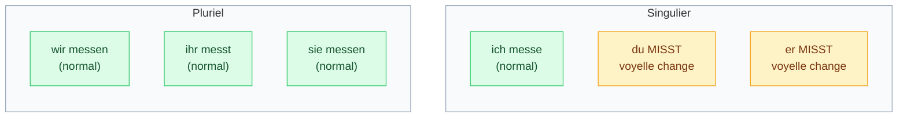

# 2. Présent — verbes irréguliers

<mark style="color:blue;">**Mêmes terminaisons, mais la voyelle change avec `du` et `er / sie / es`.**</mark>

&#x20;


**En bref**

Un verbe irrégulier au présent, c'est un verbe dont la **voyelle du radical change**, **uniquement** avec **du** et **er / sie / es / man**. Les terminaisons restent les mêmes qu'à la page 1. Trois verbes sont à part et à connaître par cœur : **sein**, **haben** et **können**.


&#x20;

***

&#x20;

## <mark style="color:purple;">01</mark> · Où ça change ?

&#x20;

Imagine le tableau de conjugaison : seules **deux cases** sont touchées.

&#x20;

&#x20;


**Astuce** — `ich` et **tout le pluriel** restent normaux. Si tu hésites avec *ich* ou *wir*, conjugue comme un verbe régulier : tu auras juste.


&#x20;

***

&#x20;

## <mark style="color:purple;">02</mark> · Les trois familles de changement

&#x20;



| | `tragen` (porter) | `fahren` (conduire, rouler) | `schlafen` (dormir) |
| --- | --- | --- | --- |
| ich | trage | fahre | schlafe |
| du | tr**ä**gst | f**ä**hrst | schl**ä**fst |
| er/sie/es | tr**ä**gt | f**ä**hrt | schl**ä**ft |
| wir | tragen | fahren | schlafen |
| ihr | tragt | fahrt | schlaft |
| sie/Sie | tragen | fahren | schlafen |

&#x20;

*Er trägt die Verantwortung für das Projekt.* — Il porte la responsabilité du projet.

Même famille : `laufen` → *du l**äu**fst, er l**äu**ft* (au → äu).



| | `messen` (mesurer) | `sprechen` (parler) | `entwerfen` (concevoir) |
| --- | --- | --- | --- |
| ich | messe | spreche | entwerfe |
| du | m**i**sst | spr**i**chst | entw**i**rfst |
| er/sie/es | m**i**sst | spr**i**cht | entw**i**rft |
| wir | messen | sprechen | entwerfen |
| ihr | messt | sprecht | entwerft |
| sie/Sie | messen | sprechen | entwerfen |

&#x20;

*Er entwirft eine neue Brücke.* — Il conçoit un nouveau pont.

Même famille : `besprechen` → *er bespr**i**cht* · `helfen` → *er h**i**lft* · `geben` → *er g**i**bt* · `vergessen` → *er verg**i**sst*



| | `lesen` (lire) | `sehen` (voir) | `empfehlen` (recommander) |
| --- | --- | --- | --- |
| ich | lese | sehe | empfehle |
| du | l**ie**st | s**ie**hst | empf**ie**hlst |
| er/sie/es | l**ie**st | s**ie**ht | empf**ie**hlt |
| wir | lesen | sehen | empfehlen |
| ihr | lest | seht | empfehlt |
| sie/Sie | lesen | sehen | empfehlen |

&#x20;

*Er empfiehlt ein Sicherheitsprogramm.* — Il recommande un programme de sécurité.



&#x20;


**Comment savoir si un verbe est irrégulier ?** On ne peut pas le deviner : il faut l'**apprendre avec le verbe**. Dans une liste de vocabulaire, on note souvent la 3e personne : `entwerfen — er entwirft`. Si la voyelle est différente de l'infinitif, c'est irrégulier.


&#x20;

***

&#x20;

## <mark style="color:purple;">03</mark> · Les trois verbes spéciaux : sein, haben, können

&#x20;

Ces verbes sont **complètement à part**. Ils sont partout (et `sein`/`haben` servent à construire le Perfekt, page 4) : à connaître **par cœur**.

&#x20;

| Personne   | `sein` (être) | `haben` (avoir) | `können` (pouvoir, savoir faire) |
| ---------- | ------------- | --------------- | -------------------------------- |
| ich        | **bin**       | habe            | **kann**                         |
| du         | **bist**      | **hast**        | **kannst**                       |
| er/sie/es  | **ist**       | **hat**         | **kann**                         |
| wir        | **sind**      | haben           | können                           |
| ihr        | **seid**      | habt            | könnt                            |
| sie/Sie    | **sind**      | haben           | können                           |

&#x20;



**Exemples avec sein et haben**

* *Ich **bin** Informatiker.* — Je suis informaticien.
* *Das Netzwerk **ist** langsam.* — Le réseau est lent.
* *Wir **haben** ein Problem.* — Nous avons un problème.
* *Du **hast** einen Termin.* — Tu as un rendez-vous.



**Exemples avec können**

* *Ich **kann** programmieren.* — Je sais programmer.
* *Er **kann** das Netzwerk konfigurieren.* — Il sait configurer le réseau.
* *Herr Meyer, **können** Sie programmieren?* — Savez-vous programmer ?



&#x20;


**Piège de `können`** : avec **ich** et **er**, il n'y a **pas de terminaison** → *ich kann*, *er kann* (jamais ~~ich kanne~~, ~~er kannt~~).

Et le **2e verbe** part **à la fin** de la phrase, à l'infinitif : *Ich **kann** gut **programmieren**.* (voir [Grammaire](../grammaire/01-place-du-verbe-et-questions.md)).


&#x20;

***

&#x20;

## <mark style="color:purple;">04</mark> · Exercices

&#x20;

### A. Conjugue le verbe

&#x20;

1. messen → du ___

&#x20;

**du misst** — e → i, et comme le radical finit par `-ss`, on n'ajoute que `-t`.

&#x20;

2. tragen → er ___

&#x20;

**er trägt** — a → ä.

&#x20;

3. entwerfen → sie (elle) ___

&#x20;

**sie entwirft** — e → i.

&#x20;

4. entwerfen → wir ___

&#x20;

**wir entwerfen** — piège ! Au pluriel, **rien ne change**.

&#x20;

5. empfehlen → du ___

&#x20;

**du empfiehlst** — e → ie.

&#x20;

6. besprechen → er ___

&#x20;

**er bespricht** — e → i (comme *sprechen*).

&#x20;

7. können → er ___

&#x20;

**er kann** — pas de terminaison.

&#x20;

8. sein → ihr ___

&#x20;

**ihr seid** — (à ne pas confondre avec *seit* = depuis).

&#x20;

9. haben → du ___

&#x20;

**du hast** — le `b` disparaît.

&#x20;

&#x20;

### B. Régulier ou irrégulier ?

&#x20;

10. Classe ces verbes : planen · messen · programmieren · empfehlen · arbeiten · tragen

&#x20;

* **Réguliers** : planen, programmieren, arbeiten
* **Irréguliers** : messen (*du misst*), empfehlen (*du empfiehlst*), tragen (*du trägst*)

&#x20;

&#x20;

### C. Complète et traduis

&#x20;

11. Er ___ die Temperatur. (messen)

&#x20;

**Er misst die Temperatur.** — Il mesure la température.

&#x20;

12. ___ du Java? (können) — Ja, ich ___ Java.

&#x20;

**Kannst du Java? — Ja, ich kann Java.** — Tu sais (faire du) Java ? Oui.

&#x20;

13. Traduis : Le professeur recommande un livre.

&#x20;

**Der Professor empfiehlt ein Buch.**

&#x20;

14. Traduis : Nous sommes étudiants et nous avons un stage.

&#x20;

**Wir sind Studenten (Studierende) und wir haben ein Praktikum.**

&#x20;

&#x20;

***

&#x20;

## <mark style="color:purple;">05</mark> · À retenir

&#x20;

* La voyelle change **seulement** avec **du** et **er/sie/es** : <mark style="color:orange;">**a → ä · e → i · e → ie**</mark>.
* `ich` et le pluriel restent **normaux**.
* `sein`, `haben`, `können` : **par cœur**.
* `können` + **infinitif à la fin**.

&#x20;


**Page suivante** → [3. Verbes séparables et inséparables](03-verbes-separables-inseparables.md)

