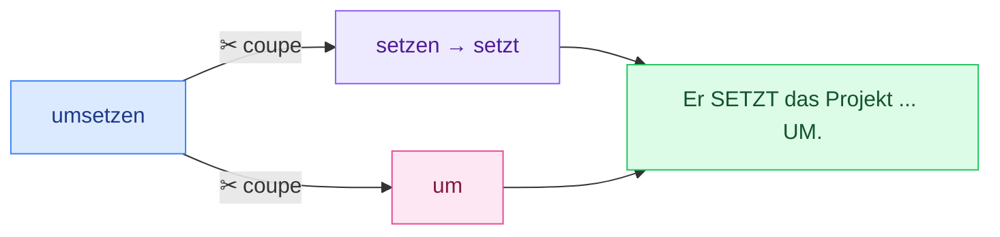
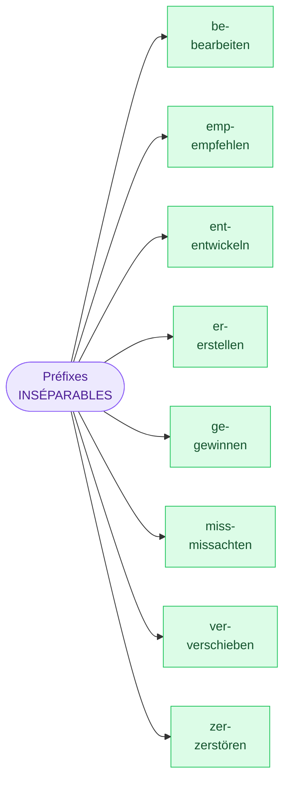

# 3. Verbes séparables et inséparables

<mark style="color:blue;">**Certains préfixes se détachent et partent à la fin de la phrase. D'autres restent collés.**</mark>

&#x20;


**En bref**

* **Séparable** (`umsetzen`, `anpassen`, `absagen`, `zugreifen`, `anwenden`) : au présent, le préfixe **se détache** et va **tout à la fin** de la phrase. → *Er **setzt** das Projekt **um**.*
* **Inséparable** (`be-, emp-, ent-, er-, ge-, miss-, ver-, zer-`) : le préfixe **reste collé**. → *Er **entwickelt** ein Programm.*


&#x20;

***

&#x20;

## <mark style="color:purple;">01</mark> · L'image à retenir : les ciseaux

&#x20;

Un verbe séparable, c'est comme un mot qu'on **coupe aux ciseaux** : la partie conjuguée reste en **2e position**, le préfixe est envoyé **en bout de phrase**.

&#x20;

&#x20;

| Position 1 | **Position 2** (verbe conjugué) | Le milieu              | **Fin** (préfixe) |
| ---------- | ------------------------------- | ---------------------- | ----------------- |
| Er         | **setzt**                       | das Projekt            | **um**.           |
| Ich        | **passe**                       | den Code               | **an**.           |
| Sie        | **sagt**                        | den Termin             | **ab**.           |
| Wir        | **greifen**                     | auf die Daten          | **zu**.           |
| Man        | **wendet**                      | die Regel              | **an**.           |

&#x20;

***

&#x20;

## <mark style="color:purple;">02</mark> · Conjuguer un verbe séparable

&#x20;

On conjugue **la partie verbe** normalement (règles des pages 1 et 2), et on met le préfixe à la fin.

&#x20;

| Personne   | `anpassen` (adapter) | `umsetzen` (réaliser) — *ein Projekt* |
| ---------- | -------------------- | ------------------------------------- |
| ich        | passe … **an**       | setze ein Projekt **um**              |
| du         | passt … **an**       | setzt ein Projekt **um**              |
| er/sie/es  | passt … **an**       | setzt ein Projekt **um**              |
| wir        | passen … **an**      | setzen ein Projekt **um**             |
| ihr        | passt … **an**       | setzt ein Projekt **um**              |
| sie/Sie    | passen … **an**      | setzen ein Projekt **um**             |

&#x20;


**Attention à l'orthographe** : c'est *sie **setzen** … um* (présent). *setz**t**en* avec un `t` en plus, c'est le **passé** (Präteritum) : à ne pas confondre.


&#x20;

**Les préfixes séparables les plus fréquents :**

&#x20;

`ab-` (absagen) · `an-` (anpassen, anwenden) · `auf-` (aufrufen) · `aus-` (ausdrucken) · `ein-` (einloggen) · `mit-` (mitarbeiten) · `um-` (umsetzen) · `vor-` (vorstellen) · `zu-` (zugreifen) · `zurück-` (zurücksetzen)

&#x20;


**Astuce à l'oral** — un préfixe séparable est **accentué** : *<u>UM</u>setzen, <u>AN</u>passen, <u>AB</u>sagen*. Un préfixe inséparable ne l'est jamais : *ent<u>WI</u>ckeln, be<u>HERR</u>schen*.


&#x20;

***

&#x20;

## <mark style="color:purple;">03</mark> · Les inséparables : le préfixe reste collé

&#x20;

Ces 8 préfixes ne se détachent **jamais** :

&#x20;

&#x20;


**Astuce** — ces préfixes ne sont **pas des mots seuls** en allemand (`ent`, `ver`, `be` ne veulent rien dire tout seuls). Les préfixes séparables, eux, sont souvent de **vrais petits mots** : `an`, `um`, `ab`, `zu`, `mit`… C'est pour ça qu'ils peuvent se promener seuls en fin de phrase.


&#x20;

| Personne  | `entwerfen` (concevoir, irrégulier) | `entwickeln` (développer) | `beherrschen` (maîtriser) |
| --------- | ----------------------------------- | ------------------------- | ------------------------- |
| ich       | entwerfe                            | entwickle                 | beherrsche                |
| du        | entw**i**rfst                       | entwickelst               | beherrschst               |
| er/sie/es | entw**i**rft                        | entwickelt                | beherrscht                |
| wir       | entwerfen                           | entwickeln                | beherrschen               |
| ihr       | entwerft                            | entwickelt                | beherrscht                |
| sie/Sie   | entwerfen                           | entwickeln                | beherrschen               |

&#x20;

**Exemples :**

* *Wir **bearbeiten** den Plan.* — Nous travaillons sur le plan.
* *Sie **entwerfen** ein Gebäude.* — Ils conçoivent un bâtiment.
* *Er **empfiehlt** ein Sicherheitsprogramm.* — Il recommande un programme de sécurité.
* *Der Betrüger **missachtet** die Gesetze.* — L'escroc ne respecte pas les lois.
* *Er **beherrscht** viele Computersprachen.* — Il maîtrise beaucoup de langages informatiques.
* *Wir **vereinbaren** einen Termin.* — Nous fixons un rendez-vous.
* *Sie **verschiebt** den Termin.* — Elle déplace le rendez-vous.

&#x20;

***

&#x20;

## <mark style="color:purple;">04</mark> · Et avec können ?

&#x20;

Quand il y a un verbe comme `können`, le verbe séparable reste **en un seul morceau**, à l'infinitif, à la fin :

&#x20;

| Sans können                              | Avec können                                     |
| ---------------------------------------- | ----------------------------------------------- |
| Wir **setzen** das Projekt **um**.       | Wir **können** das Projekt **umsetzen**.        |
| Er **sagt** den Termin **ab**.           | Er **kann** den Termin **absagen**.             |
| Du **greifst** auf die Daten **zu**.     | Du **kannst** auf die Daten **zugreifen**.      |

&#x20;

***

&#x20;

## <mark style="color:purple;">05</mark> · Exercices

&#x20;

### A. Séparable ou inséparable ?

&#x20;

1. Classe : umsetzen · entwickeln · absagen · verschieben · anwenden · beherrschen · zugreifen · vereinbaren

&#x20;

* **Séparables** : umsetzen, absagen, anwenden, zugreifen
* **Inséparables** : entwickeln (ent-), verschieben (ver-), beherrschen (be-), vereinbaren (ver-)

&#x20;

&#x20;

### B. Construis la phrase au présent

&#x20;

2. ich / den Code / anpassen

&#x20;

**Ich passe den Code an.**

&#x20;

3. er / den Termin / absagen

&#x20;

**Er sagt den Termin ab.** — Il annule le rendez-vous.

&#x20;

4. wir / das Projekt / umsetzen

&#x20;

**Wir setzen das Projekt um.**

&#x20;

5. du / auf die Datenbank / zugreifen

&#x20;

**Du greifst auf die Datenbank zu.** — Tu accèdes à la base de données.

&#x20;

6. sie (elle) / die Regel / anwenden

&#x20;

**Sie wendet die Regel an.** — radical en `-d` → *wend**e**t*.

&#x20;

7. er / eine App / entwickeln

&#x20;

**Er entwickelt eine App.** — `ent-` est inséparable : rien à la fin !

&#x20;

8. sie (elle) / den Termin / verschieben

&#x20;

**Sie verschiebt den Termin.** — `ver-` inséparable.

&#x20;

&#x20;

### C. Trouve l'erreur

&#x20;

9. ❌ « Er umsetzt das Projekt. »

&#x20;

✅ **Er setzt das Projekt um.** — `um-` est séparable, il doit partir à la fin.

&#x20;

10. ❌ « Wir wickeln ein Programm ent. »

&#x20;

✅ **Wir entwickeln ein Programm.** — `ent-` est inséparable, on ne coupe jamais.

&#x20;

11. ❌ « Ich kann den Termin sage ab. »

&#x20;

✅ **Ich kann den Termin absagen.** — avec `können`, le verbe reste entier et à l'infinitif, à la fin.

&#x20;

&#x20;

### D. Traduis

&#x20;

12. Nous réalisons le projet.

&#x20;

**Wir setzen das Projekt um.**

&#x20;

13. Tu annules le rendez-vous ?

&#x20;

**Sagst du den Termin ab?**

&#x20;

14. Il maîtrise Python.

&#x20;

**Er beherrscht Python.**

&#x20;

&#x20;

***

&#x20;

## <mark style="color:purple;">06</mark> · À retenir

&#x20;

* **Séparable** → verbe conjugué en 2e position, **préfixe à la fin** : *er setzt … **um***.
* **Inséparable** (`be- emp- ent- er- ge- miss- ver- zer-`) → **jamais coupé**.
* Avec `können` → le verbe séparable reste **entier** à la fin : *… **umsetzen***.

&#x20;


**Page suivante** → [4. Le Perfekt](04-perfekt.md)

