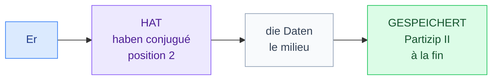
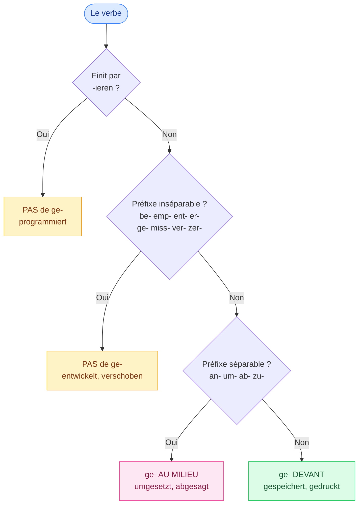

# 4. Le Perfekt

<mark style="color:blue;">**Le passé composé allemand : `haben` ou `sein` en 2e position, le participe tout à la fin.**</mark>

&#x20;


**En bref**

Le **Perfekt** = le passé qu'on utilise **à l'oral** et dans les e-mails. Il fonctionne comme le passé composé français (*j'**ai** développé*) :

**`haben` / `sein` conjugué** (position 2) + … + **Partizip II** (à la fin).

*Er **hat** eine App **entwickelt**.* — Il a développé une app.


&#x20;

***

&#x20;

## <mark style="color:purple;">01</mark> · La structure de la phrase

&#x20;

&#x20;

| Position 1 | **Position 2** (auxiliaire) | Le milieu               | **Fin** (Partizip II) | Français                          |
| ---------- | --------------------------- | ----------------------- | --------------------- | --------------------------------- |
| Ich        | **habe**                    | die Datei               | **gespeichert**.      | J'ai sauvegardé le fichier.       |
| Du         | **hast**                    | den Termin              | **abgesagt**.         | Tu as annulé le rendez-vous.      |
| Er         | **hat**                     | ein Programm            | **entwickelt**.       | Il a développé un programme.      |
| Wir        | **haben**                   | das Projekt             | **umgesetzt**.        | Nous avons réalisé le projet.     |
| Ihr        | **habt**                    | den Server              | **konfiguriert**.     | Vous avez configuré le serveur.   |
| Sie        | **haben**                   | auf die Daten           | **zugegriffen**.      | Ils ont accédé aux données.       |

&#x20;

Tu n'as besoin de conjuguer **que** `haben` (ou `sein`). Le participe, lui, **ne change jamais**.

&#x20;

***

&#x20;

## <mark style="color:purple;">02</mark> · Fabriquer le Partizip II

&#x20;

C'est **la** difficulté du Perfekt. Suis ce schéma :

&#x20;

&#x20;

Ensuite, la **fin** du participe dépend du type de verbe :

&#x20;



**Recette :** `ge-` + radical + **`-t`**

&#x20;

| Infinitif | Partizip II | Exemple |
| --- | --- | --- |
| speichern | **ge**speicher**t** | Er hat die Datei gespeichert. |
| drucken | **ge**druck**t** | Ich habe das Dokument gedruckt. |
| drücken | **ge**drück**t** | Du hast auf den Knopf gedrückt. |
| planen | **ge**plan**t** | Wir haben das Projekt geplant. |
| arbeiten | **ge**arbeit**et** | Sie hat bei Google gearbeitet. |

&#x20;

Radical en `-t/-d` → on ajoute un **e** : *gearbeit**e**t*, *angewend**e**t* (comme au présent).



**Recette :** radical + **`-t`**, **pas de `ge-`**

&#x20;

| Infinitif | Partizip II |
| --- | --- |
| programmieren | programmiert |
| konfigurieren | konfiguriert |
| analysieren | analysiert |
| implementieren | implementiert |
| optimieren | optimiert |
| validieren | validiert |
| präsentieren | präsentiert |

&#x20;

*Wir haben den Code optimiert.* — Nous avons optimisé le code.



**Recette :** `ge-` + radical (voyelle souvent changée) + **`-en`**. Ces participes s'**apprennent par cœur**.

&#x20;

| Infinitif | Partizip II | Remarque |
| --- | --- | --- |
| greifen | ge**griff**en | i |
| schieben | ge**schob**en | ie → o |
| werfen | ge**worf**en | e → o |
| sprechen | ge**sproch**en | e → o |
| gewinnen | ge**wonn**en | inséparable (ge-) → pas de ge- en plus |
| messen | ge**mess**en | ne change pas |
| tragen | ge**trag**en | ne change pas |
| lesen | ge**les**en | ne change pas |

&#x20;

**Cas mixte** : `kennen` → ge**kann**t (la voyelle change, **mais** finit en `-t`).



&#x20;

***

&#x20;

## <mark style="color:purple;">03</mark> · Les verbes à préfixe au Perfekt

&#x20;



### Séparables : `ge` au milieu

&#x20;

Le `ge-` se glisse **entre** le préfixe et le verbe.

&#x20;

| Infinitif | Partizip II |
| --- | --- |
| um\|setzen | um**ge**setzt |
| ab\|sagen | ab**ge**sagt |
| an\|passen | an**ge**passt |
| an\|wenden | an**ge**wendet |
| zu\|greifen | zu**ge**griffen |

&#x20;

*Er hat auf Daten zu**ge**griffen.*



### Inséparables : pas de `ge`

&#x20;

Le préfixe prend **la place** du `ge-`.

&#x20;

| Infinitif | Partizip II |
| --- | --- |
| entwickeln | entwickelt |
| beherrschen | beherrscht |
| vereinbaren | vereinbart |
| entwerfen | entworfen |
| verschieben | verschoben |
| besprechen | besprochen |
| empfehlen | empfohlen |

&#x20;

*Er hat den Termin verschoben.*



&#x20;


**Piège** — ~~geentwickelt~~, ~~geprogrammiert~~, ~~umsetztge~~ n'existent pas. Vérifie toujours avec le schéma de la section 02.


&#x20;

***

&#x20;

## <mark style="color:purple;">04</mark> · haben ou sein ?

&#x20;


**Règle simple** — dans 90 % des cas, c'est **`haben`**. Tous les verbes du vocabulaire informatique (*entwickeln, speichern, programmieren, umsetzen…*) prennent **haben**.


&#x20;

On utilise **`sein`** seulement pour :

&#x20;

* un **déplacement** d'un point A à un point B : `gehen` → *ich **bin** gegangen* · `fahren` → *er **ist** gefahren* · `kommen` → *sie **ist** gekommen* · `fliegen` → *wir **sind** geflogen*
* un **changement d'état** : `werden` → *er **ist** Informatiker geworden* (il est devenu informaticien)
* `sein` et `bleiben` : *ich **bin** krank gewesen* · *er **ist** zu Hause geblieben*

&#x20;

| haben (le plus fréquent)                        | sein (mouvement / changement)                  |
| ----------------------------------------------- | ---------------------------------------------- |
| Ich **habe** programmiert.                      | Ich **bin** nach Freiburg gefahren.            |
| Er **hat** den Termin vereinbart.               | Er **ist** zur Fachhochschule gegangen.        |
| Wir **haben** ein Praktikum gemacht.            | Wir **sind** Ingenieure geworden.              |

&#x20;

***

&#x20;

## <mark style="color:purple;">05</mark> · Le Perfekt en question

&#x20;

L'auxiliaire passe en **position 1**, le participe reste **à la fin** :

&#x20;

* ***Hast** du die Datei **gespeichert**?* — As-tu sauvegardé le fichier ?
* ***Haben** Sie den Termin **abgesagt**?* — Avez-vous annulé le rendez-vous ?
* *Was **hat** er **entwickelt**?* — Qu'a-t-il développé ?

&#x20;

***

&#x20;

## <mark style="color:purple;">06</mark> · Exercices

&#x20;

### A. Donne le Partizip II

&#x20;

1. speichern

&#x20;

**gespeichert** — régulier.

&#x20;

2. programmieren

&#x20;

**programmiert** — `-ieren` → pas de ge-.

&#x20;

3. entwickeln

&#x20;

**entwickelt** — `ent-` inséparable → pas de ge-.

&#x20;

4. umsetzen

&#x20;

**umgesetzt** — séparable → ge au milieu.

&#x20;

5. zugreifen

&#x20;

**zugegriffen** — séparable **et** irrégulier.

&#x20;

6. entwerfen

&#x20;

**entworfen** — inséparable et irrégulier (e → o).

&#x20;

7. kennen

&#x20;

**gekannt** — verbe mixte.

&#x20;

8. absagen

&#x20;

**abgesagt**

&#x20;

9. vereinbaren

&#x20;

**vereinbart** — `ver-` inséparable.

&#x20;

10. drucken / drücken

&#x20;

**gedruckt** (imprimé) / **gedrückt** (appuyé) — attention au tréma !

&#x20;

&#x20;

### B. Mets la phrase au Perfekt

&#x20;

11. Ich speichere die Datei.

&#x20;

**Ich habe die Datei gespeichert.**

&#x20;

12. Er setzt das Projekt um.

&#x20;

**Er hat das Projekt umgesetzt.** — le préfixe `um` revient se coller au participe.

&#x20;

13. Wir konfigurieren den Router.

&#x20;

**Wir haben den Router konfiguriert.**

&#x20;

14. Sie verschiebt den Termin.

&#x20;

**Sie hat den Termin verschoben.**

&#x20;

15. Du wendest die Regel an.

&#x20;

**Du hast die Regel angewendet.** (*angewandt* est aussi correct.)

&#x20;

16. Ich fahre nach Freiburg.

&#x20;

**Ich bin nach Freiburg gefahren.** — déplacement → `sein`.

&#x20;

&#x20;

### C. Traduis

&#x20;

17. Il a analysé les données.

&#x20;

**Er hat die Daten analysiert.**

&#x20;

18. Avez-vous (Sie) fixé un rendez-vous ?

&#x20;

**Haben Sie einen Termin vereinbart?**

&#x20;

19. Nous avons développé une application.

&#x20;

**Wir haben eine Anwendung entwickelt.**

&#x20;

&#x20;

***

&#x20;

## <mark style="color:purple;">07</mark> · À retenir

&#x20;

* **haben/sein** (position 2) + … + **Partizip II** (fin).
* Régulier : <mark style="color:green;">**ge- … -t**</mark> · Irrégulier : <mark style="color:orange;">**ge- … -en**</mark> (par cœur).
* **Pas de ge-** : verbes en `-ieren` et verbes inséparables.
* Séparable : **ge au milieu** (*um**ge**setzt*).
* Presque toujours **haben** ; **sein** pour le mouvement et le changement d'état.

&#x20;


**Page suivante** → [5. Exercices de conjugaison](05-exercices-conjugaison.md)

