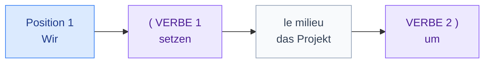
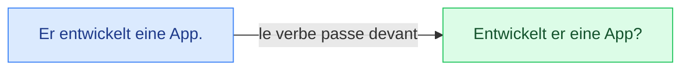

# 1. Place du verbe et questions

<mark style="color:blue;">**Position 2 pour le verbe conjugué, la fin pour tout le reste.**</mark>

&#x20;


**En bref**

* **Phrase normale** → le verbe conjugué est **toujours en position 2**.
* **Question oui/non** → le verbe passe en **position 1**.
* **Question avec un mot en W-** (*was, wo, wer…*) → mot W en 1, **verbe en 2**.
* Le « 2e morceau » du verbe (préfixe, infinitif, participe) va **tout à la fin** : c'est la **parenthèse**.


&#x20;

***

&#x20;

## <mark style="color:purple;">01</mark> · Règle n°1 : le verbe en position 2

&#x20;

« Position 2 » ne veut pas dire « 2e mot », mais **2e bloc**. Le 1er bloc peut être le sujet, un complément de temps, un lieu…

&#x20;

| Position 1 (un bloc)   | **Position 2** (verbe) | Le reste                        |
| ---------------------- | ---------------------- | ------------------------------- |
| Ich                    | **arbeite**            | bei Google.                     |
| Heute                  | **arbeite**            | ich bei Google.                 |
| Bei Google             | **arbeite**            | ich seit zwei Jahren.           |
| Der neue Informatiker  | **entwickelt**         | eine App.                       |

&#x20;


**Différence avec le français** — si on commence par *Heute* (aujourd'hui), le sujet passe **après** le verbe : *Heute **arbeite ich**…* et jamais ~~Heute ich arbeite~~. Le verbe ne lâche jamais sa position 2 !


&#x20;

***

&#x20;

## <mark style="color:purple;">02</mark> · Règle n°2 : la parenthèse (Satzklammer)

&#x20;

Quand le verbe est en **deux morceaux**, les deux morceaux **encadrent** la phrase comme une parenthèse.

&#x20;

&#x20;

On retrouve cette parenthèse dans **trois situations** que tu connais déjà :

&#x20;

| Situation                  | Position 1 | **Verbe 1** (pos. 2)  | Milieu                | **Verbe 2** (fin)  |
| -------------------------- | ---------- | --------------------- | --------------------- | ------------------ |
| Verbe **séparable**        | Er         | **sagt**              | den Termin            | **ab**.            |
| **können** + infinitif     | Ich        | **kann**              | gut                   | **programmieren**. |
| **Perfekt**                | Wir        | **haben**             | das Projekt           | **umgesetzt**.     |

&#x20;


**Méthode** — repère d'abord **le verbe conjugué** (il va en 2), puis demande-toi : *reste-t-il un morceau de verbe ?* Si oui → **à la fin**.


&#x20;

***

&#x20;

## <mark style="color:purple;">03</mark> · Poser une question oui/non

&#x20;

On met simplement **le verbe conjugué en premier**. Pas besoin de « est-ce que ».

&#x20;

&#x20;

| Affirmation                              | Question                                    | Français                                  |
| ---------------------------------------- | ------------------------------------------- | ----------------------------------------- |
| Sie entwickeln Programme.                | **Entwickeln** Sie Programme?               | Développez-vous des programmes ?          |
| Du konfigurierst den Router.             | **Konfigurierst** du den Router?            | Tu configures le routeur ?                |
| Er setzt das Projekt um.                 | **Setzt** er das Projekt **um**?            | Est-ce qu'il réalise le projet ?          |
| Sie können programmieren.                | **Können** Sie **programmieren**?           | Savez-vous programmer ?                   |
| Du hast die Datei gespeichert.           | **Hast** du die Datei **gespeichert**?      | As-tu sauvegardé le fichier ?             |

&#x20;

La parenthèse reste la même : le 2e morceau **ne bouge pas** de la fin.

&#x20;

***

&#x20;

## <mark style="color:purple;">04</mark> · Poser une question avec un mot en W-

&#x20;

**Mot W** (position 1) + **verbe** (position 2) + sujet + …

&#x20;

| Mot W       | Sens         | Exemple                                  | Français                          |
| ----------- | ------------ | ---------------------------------------- | --------------------------------- |
| **Was**     | quoi, que    | Was **entwickelt** er?                   | Que développe-t-il ?              |
| **Wer**     | qui          | Wer **programmiert** die App?            | Qui programme l'app ?             |
| **Wo**      | où           | Wo **arbeiten** Sie?                     | Où travaillez-vous ?              |
| **Wann**    | quand        | Wann **haben** wir einen Termin?         | Quand avons-nous rendez-vous ?    |
| **Wie**     | comment      | Wie **speichert** man die Datei?         | Comment sauvegarde-t-on le fichier ? |
| **Warum**   | pourquoi     | Warum **sagt** er den Termin **ab**?     | Pourquoi annule-t-il le rdv ?     |
| **Worum**   | de quoi      | Worum **geht** es?                       | De quoi s'agit-il ?               |

&#x20;


**Expressions toutes faites du cours**

* *Worum geht es?* — De quoi s'agit-il ? → *Es geht um das neue Projekt.* — Il s'agit du nouveau projet.
* *Wo liegt das Problem?* — Où est le problème ?


&#x20;

***

&#x20;

## <mark style="color:purple;">05</mark> · Le « Sie » de politesse

&#x20;

* **`Sie`** avec majuscule = **Vous** (une personne qu'on vouvoie, ou plusieurs).
* Il se conjugue **exactement comme `sie` pluriel** (ils) → même forme que l'infinitif.
* Dans le monde professionnel (entretien, client, professeur) : **toujours `Sie`**.

&#x20;

*Herr Meier, **entwickeln Sie** Programme?* · *Frau Keller, **können Sie** den Termin **verschieben**?*

&#x20;

***

&#x20;

## <mark style="color:purple;">06</mark> · Exercices

&#x20;

### A. Remets les mots dans l'ordre

&#x20;

1. eine App / heute / ich / entwickle

&#x20;

**Heute entwickle ich eine App.** ou **Ich entwickle heute eine App.** — dans les deux cas, verbe en position 2.

&#x20;

2. um / wir / das Projekt / setzen

&#x20;

**Wir setzen das Projekt um.**

&#x20;

3. programmieren / kann / er / gut

&#x20;

**Er kann gut programmieren.**

&#x20;

4. gespeichert / die Daten / hat / sie

&#x20;

**Sie hat die Daten gespeichert.**

&#x20;

5. morgen / den Termin / ab / sagt / er

&#x20;

**Morgen sagt er den Termin ab.** ou **Er sagt morgen den Termin ab.**

&#x20;

&#x20;

### B. Transforme en question oui/non

&#x20;

6. Du arbeitest bei Google.

&#x20;

**Arbeitest du bei Google?**

&#x20;

7. Sie beherrschen Java. (Vous)

&#x20;

**Beherrschen Sie Java?**

&#x20;

8. Er greift auf die Datenbank zu.

&#x20;

**Greift er auf die Datenbank zu?**

&#x20;

9. Ihr habt den Code optimiert.

&#x20;

**Habt ihr den Code optimiert?**

&#x20;

&#x20;

### C. Pose la question qui correspond à la réponse soulignée

&#x20;

10. Ich arbeite <u>in Freiburg</u>.

&#x20;

**Wo arbeitest du?** (ou *Wo arbeiten Sie?*)

&#x20;

11. Er entwickelt <u>ein Sicherheitskonzept</u>.

&#x20;

**Was entwickelt er?**

&#x20;

12. <u>Frau Keller</u> vereinbart den Termin.

&#x20;

**Wer vereinbart den Termin?**

&#x20;

13. Es geht <u>um das Netzwerk</u>.

&#x20;

**Worum geht es?**

&#x20;

&#x20;

### D. Trouve l'erreur

&#x20;

14. ❌ « Heute ich arbeite im Büro. »

&#x20;

✅ **Heute arbeite ich im Büro.** — le verbe doit rester en position 2.

&#x20;

15. ❌ « Ich habe gespeichert die Datei. »

&#x20;

✅ **Ich habe die Datei gespeichert.** — le participe va à la fin.

&#x20;

16. ❌ « Kannst du programmieren Java? »

&#x20;

✅ **Kannst du Java programmieren?** — l'infinitif va à la fin.

&#x20;

&#x20;

***

&#x20;

## <mark style="color:purple;">07</mark> · À retenir

&#x20;

* Phrase normale : **verbe conjugué en position 2**, même si on commence par *heute*.
* Question oui/non : **verbe en position 1**.
* Question W- : **mot W + verbe + sujet**.
* Préfixe séparable, infinitif après `können`, participe du Perfekt : <mark style="color:blue;">**à la fin**</mark>.

&#x20;


**Retour au sommaire** → [Allemand](../allemand.md)

