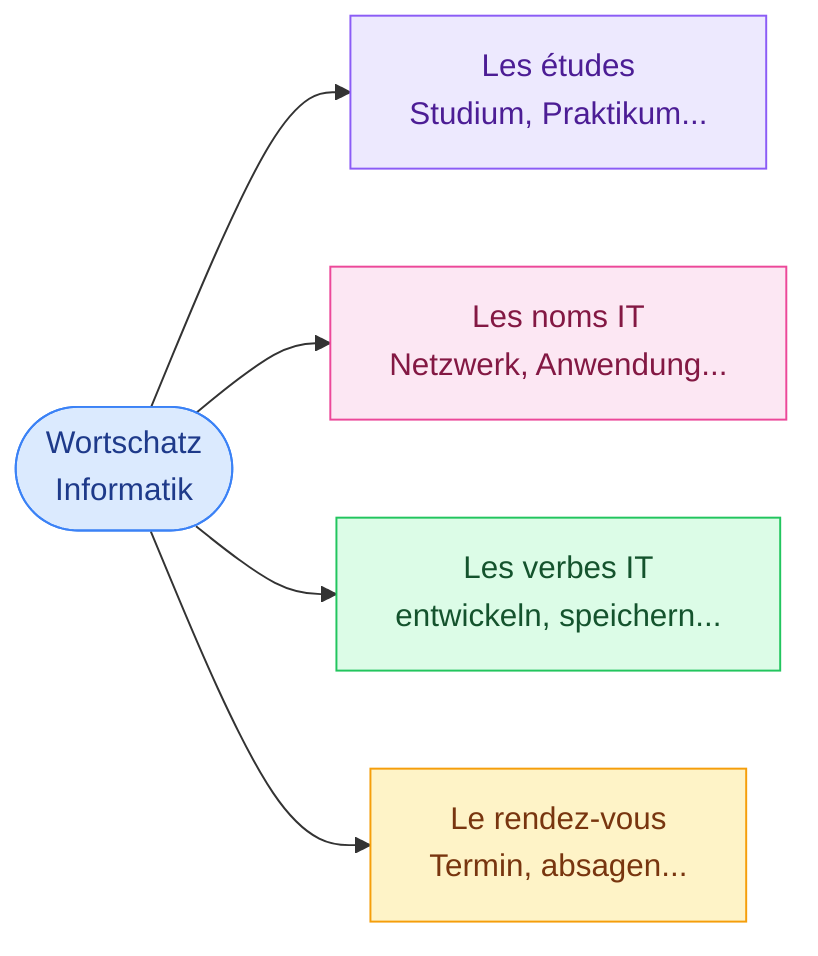
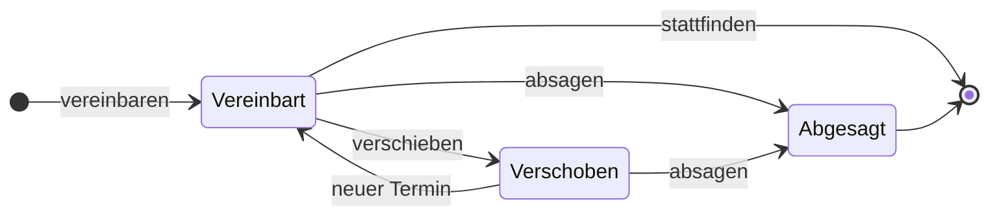

# 1. Wortschatz Informatik 26-27

<mark style="color:blue;">**Parler de ses études, de son métier et organiser un rendez-vous.**</mark>

&#x20;


**En bref**

La liste se divise en **quatre blocs** : les **études**, les **noms** de l'informatique, les **verbes** de l'informatique, et le **rendez-vous professionnel**. Les verbes sont donnés avec leur forme au **présent** (er) et au **Perfekt**.


&#x20;

&#x20;

***

&#x20;

## <mark style="color:purple;">01</mark> · Les études

&#x20;

| Allemand (article, pluriel)                                  | Français                                        |
| ------------------------------------------------------------ | ----------------------------------------------- |
| **die** Ausbildung, **-en**                                  | la formation                                    |
| **das** Studium, *die Studien*                               | les études (tertiaires)                         |
| **die** Fachhochschule, **-n**                               | la haute école spécialisée (HES)                |
| **die** Hochschule für Technik und Architektur Freiburg      | la Haute école d'ingénierie et d'architecture de Fribourg |
| **der** Studiengang, **-gänge**                              | la filière                                      |
| **das** Praktikum, *die Praktika*                            | le stage                                        |
| eine Lehre als …                                             | un apprentissage comme …                        |
| Informatik und Kommunikationssysteme                         | informatique et systèmes de communication       |

&#x20;

**Exemples :**

* *Ich studiere an **der Hochschule für Technik und Architektur Freiburg**.* — J'étudie à la HEIA-FR.
* *Mein **Studiengang** heißt Informatik und Kommunikationssysteme.* — Ma filière s'appelle…
* *Ich habe **eine Lehre als** Informatiker gemacht.* — J'ai fait un apprentissage d'informaticien.
* *Im Sommer mache ich **ein Praktikum**.* — En été, je fais un stage.

&#x20;

***

&#x20;

## <mark style="color:purple;">02</mark> · Les noms de l'informatique

&#x20;

| Allemand                          | Français                 |
| --------------------------------- | ------------------------ |
| **die** Entwicklung, **-en**      | le développement         |
| **die** Anwendung, **-en**        | l'application            |
| **das** Netzwerk, **-e**          | le réseau                |
| **die** Datenbearbeitung          | le traitement de données |

&#x20;


**Astuce article** — tous les noms en **`-ung`** sont **féminins** : *die* Entwicklung, *die* Anwendung, *die* Ausbildung, *die* Datenbearbeitung. Et souvent, ils viennent d'un verbe : *entwickeln → die Entwicklung*, *anwenden → die Anwendung*.


&#x20;

***

&#x20;

## <mark style="color:purple;">03</mark> · Les verbes de l'informatique

&#x20;

Légende : <mark style="color:green;">**R**</mark> régulier · <mark style="color:orange;">**I**</mark> irrégulier · <mark style="color:purple;">**S**</mark> séparable

&#x20;

| Infinitif                  | Présent (er)           | Perfekt                      | Français                     | Type |
| -------------------------- | ---------------------- | ---------------------------- | ---------------------------- | ---- |
| entwickeln                 | er entwickelt          | er hat entwickelt            | développer                   | R    |
| umsetzen                   | er setzt … um          | er hat umgesetzt             | réaliser, mettre en œuvre    | S    |
| können                     | er kann                | —                            | savoir (faire), pouvoir      | I    |
| entwerfen                  | er entwirft            | er hat entworfen             | concevoir                    | I    |
| anwenden                   | er wendet … an         | er hat angewendet            | appliquer                    | S    |
| beherrschen                | er beherrscht          | er hat beherrscht            | maîtriser                    | R    |
| konfigurieren              | er konfiguriert        | er hat konfiguriert          | configurer                   | R    |
| kennen                     | er kennt               | er hat gekannt               | connaître                    | mixte |
| speichern                  | er speichert           | er hat gespeichert           | enregistrer, sauvegarder     | R    |
| zugreifen auf              | er greift auf … zu     | er hat auf … zugegriffen     | accéder à                    | S + I |
| programmieren              | er programmiert        | er hat programmiert          | programmer                   | R    |
| analysieren                | er analysiert          | er hat analysiert            | analyser                     | R    |
| implementieren             | er implementiert       | er hat implementiert         | implémenter                  | R    |
| optimieren                 | er optimiert           | er hat optimiert             | optimiser                    | R    |
| drucken                    | er druckt              | er hat gedruckt              | imprimer                     | R    |
| drücken                    | er drückt              | er hat gedrückt              | appuyer, pousser             | R    |

&#x20;


**drucken ≠ drücken** — un seul tréma de différence !

* *Der Drucker **druckt** das Dokument.* — L'imprimante **imprime** le document.
* *Ich **drücke** auf die Enter-Taste.* — J'**appuie** sur la touche Entrée.


&#x20;


**zugreifen auf** — ce verbe s'utilise toujours avec **auf** : *Er greift **auf** die Daten zu.* — Il accède **aux** données.


&#x20;

Formes au Präteritum données dans la liste (pour plus tard)

&#x20;

Le **Präteritum** est un autre temps du passé, surtout utilisé à l'écrit. Il n'est pas encore au programme, mais la liste en donne quelques-uns :

&#x20;

| Infinitif   | Präteritum (er) |
| ----------- | --------------- |
| entwerfen   | er entwarf      |
| anwenden    | er wandte an    |
| drucken     | er druckte      |
| drücken     | er drückte      |
| absagen     | er sagte ab     |
| verschieben | er verschob     |
| vereinbaren | er vereinbarte  |

&#x20;

&#x20;

**Exemples :**

* *Herr Meier, **entwickeln** Sie Programme?* — Monsieur Meier, développez-vous des programmes ?
* *Herr Meyer, **können** Sie programmieren?* — Monsieur Meyer, savez-vous programmer ?
* *Wir **setzen** ein Projekt **um**.* — Nous réalisons un projet.
* *Er **beherrscht** viele Programmiersprachen.* — Il maîtrise beaucoup de langages de programmation.
* *Sie **kennt** das Netzwerk sehr gut.* — Elle connaît très bien le réseau.
* *Er hat **auf** die Daten **zugegriffen**.* — Il a accédé aux données.

&#x20;

***

&#x20;

## <mark style="color:purple;">04</mark> · Le rendez-vous professionnel

&#x20;

| Allemand                                              | Français                           |
| ----------------------------------------------------- | ---------------------------------- |
| **der** Termin, **-e**                                | le rendez-vous (professionnel)     |
| vereinbaren — er vereinbart — er hat vereinbart       | fixer (un rendez-vous)             |
| absagen — er sagt … ab — er hat abgesagt              | annuler                            |
| verschieben — er verschiebt — er hat verschoben       | déplacer, reporter                 |
| Worum geht es?                                        | De quoi s'agit-il ?                |
| Es geht um …                                          | Il s'agit de …                     |
| Wo liegt das Problem?                                 | Où est le problème ?               |

&#x20;


**Le cycle d'un rendez-vous** : on le **fixe** (*vereinbaren*), parfois on le **déplace** (*verschieben*), et au pire on l'**annule** (*absagen*).


&#x20;

&#x20;

**Mini-dialogue :**

> — Guten Tag, Frau Keller. Ich möchte einen **Termin vereinbaren**.
> — Gerne. **Worum geht es?**
> — **Es geht um** mein Praktikum.
> — Am Montag um 10 Uhr?
> — Leider kann ich am Montag nicht. Können wir den Termin **verschieben**?

&#x20;

***

&#x20;

## <mark style="color:purple;">05</mark> · Quiz

&#x20;


**Flashcards Quizlet**

Tout le vocabulaire de la liste est aussi disponible en cartes à réviser : [HEIA Allemand – Flashcards sur Quizlet](https://quizlet.com/ch/1215156150/heia-allemand-flash-cards/?i=3qz2td&x=1jqt).


&#x20;

### A. Allemand → français

&#x20;

1. der Studiengang

&#x20;

**la filière**

&#x20;

2. die Anwendung

&#x20;

**l'application**

&#x20;

3. absagen

&#x20;

**annuler**

&#x20;

4. zugreifen auf

&#x20;

**accéder à**

&#x20;

5. Wo liegt das Problem?

&#x20;

**Où est le problème ?**

&#x20;

&#x20;

### B. Français → allemand (avec l'article !)

&#x20;

6. le stage

&#x20;

**das Praktikum** (pl. die Praktika)

&#x20;

7. le réseau

&#x20;

**das Netzwerk** (pl. die Netzwerke)

&#x20;

8. le développement

&#x20;

**die Entwicklung** — en `-ung` → féminin.

&#x20;

9. la formation

&#x20;

**die Ausbildung**

&#x20;

10. le rendez-vous professionnel

&#x20;

**der Termin** (pl. die Termine)

&#x20;

11. concevoir

&#x20;

**entwerfen** — er entwirft, er hat entworfen

&#x20;

12. maîtriser

&#x20;

**beherrschen** — er beherrscht, er hat beherrscht

&#x20;

&#x20;

### C. der, die ou das ?

&#x20;

13. ___ Fachhochschule · ___ Studium · ___ Termin · ___ Datenbearbeitung

&#x20;

**die** Fachhochschule · **das** Studium · **der** Termin · **die** Datenbearbeitung

&#x20;

&#x20;

### D. drucken ou drücken ?

&#x20;

14. Ich ___ die Präsentation für das Meeting.

&#x20;

**drucke** — j'imprime la présentation.

&#x20;

15. ___ Sie bitte auf den grünen Knopf!

&#x20;

**Drücken** — appuyez sur le bouton vert !

&#x20;

&#x20;

### E. Complète le dialogue

&#x20;

16. — ___ geht es? — Es ___ um die neue Anwendung. — Gut, wir ___ einen Termin. (vereinbaren)

&#x20;

— **Worum** geht es?
— Es **geht** um die neue Anwendung.
— Gut, wir **vereinbaren** einen Termin.

&#x20;

17. Traduis : Il a fixé le rendez-vous, mais elle a déplacé le rendez-vous.

&#x20;

**Er hat den Termin vereinbart, aber sie hat den Termin verschoben.**

&#x20;

&#x20;

***

&#x20;


**Pour conjuguer ces verbes** → [Conjugaison — présent des verbes réguliers](../conjugaison/01-present-verbes-reguliers.md)

