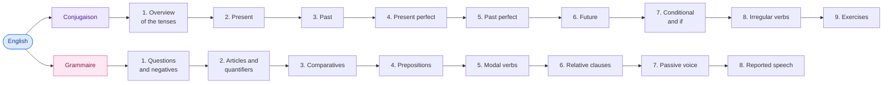

# Anglais

<mark style="color:blue;">**All the English tenses and grammar you need, explained simply.**</mark>

&#x20;


**In short**

The course has **two parts**: **Conjugaison** (all the tenses + the irregular verbs) and **Grammaire** (questions, articles, comparatives, modals, passive…). The level is **A2-B1**. The pages are written in **simple English**; when a point is difficult, there is an **explanation in French** in a box like this one.


&#x20;

***

&#x20;

## <mark style="color:purple;">01</mark> · The course map

&#x20;

&#x20;


**Recommended order** — start with **Conjugaison 1** (the overview of all the tenses), then learn the **irregular verbs** little by little (page 8) while you read the other pages. The grammar pages can be read in any order.


&#x20;

***

&#x20;

## <mark style="color:purple;">02</mark> · The pages

&#x20;

| Part        | Page                                                                                 | What you learn                                           |
| ----------- | ------------------------------------------------------------------------------------ | -------------------------------------------------------- |
| Conjugaison | [1. Overview of the tenses](conjugaison/01-vue-ensemble-des-temps.md)                | The 12 tenses on one timeline, and how they are built    |
| Conjugaison | [2. Present simple and continuous](conjugaison/02-present.md)                        | *I work* vs *I am working*                               |
| Conjugaison | [3. Past simple and continuous](conjugaison/03-passe.md)                             | *I worked* vs *I was working*, and *used to*             |
| Conjugaison | [4. Present perfect](conjugaison/04-present-perfect.md)                              | *I have worked*, *for / since*, and vs the past simple   |
| Conjugaison | [5. Past perfect](conjugaison/05-past-perfect.md)                                    | *I had worked* — the past of the past                    |
| Conjugaison | [6. The future](conjugaison/06-futur.md)                                             | *will*, *going to*, present continuous, future perfect   |
| Conjugaison | [7. Conditional and if-sentences](conjugaison/07-conditionnel-et-if.md)              | *would*, and the conditionals 0, 1, 2 and 3              |
| Conjugaison | [8. Irregular verbs](conjugaison/08-verbes-irreguliers.md)                           | *put put put*, *freeze froze frozen*… sorted by pattern  |
| Conjugaison | [9. Exercises](conjugaison/09-exercices-conjugaison.md)                              | All the tenses mixed, with answers                       |
| Grammaire   | [1. Questions and negatives](grammaire/01-questions-et-negations.md)                 | *do / does / did*, question words, question tags         |
| Grammaire   | [2. Articles and quantifiers](grammaire/02-articles-et-quantifieurs.md)              | *a / an / the*, *some / any*, *much / many*              |
| Grammaire   | [3. Comparatives and superlatives](grammaire/03-comparatifs-superlatifs.md)          | *faster*, *more reliable*, *the best*                    |
| Grammaire   | [4. Prepositions of time and place](grammaire/04-prepositions.md)                    | *in / on / at*, *for / since / during*                   |
| Grammaire   | [5. Modal verbs](grammaire/05-verbes-modaux.md)                                      | *can, must, have to, should, might…*                     |
| Grammaire   | [6. Relative clauses](grammaire/06-propositions-relatives.md)                        | *who, which, that, whose, where*                         |
| Grammaire   | [7. The passive voice](grammaire/07-voix-passive.md)                                 | *The file was deleted.*                                  |
| Grammaire   | [8. Reported speech](grammaire/08-discours-indirect.md)                              | *He said that he was tired.*                             |

&#x20;

***

&#x20;

## <mark style="color:purple;">03</mark> · How to use the exercises

&#x20;



### Think first

Read the question and answer **out loud or on paper** before you click.



### Open the answer

Click on the question: the answer appears, with a short explanation.



### Note your mistakes

If you are wrong, read the section again. A mistake you understand is a mistake that does not come back.



&#x20;

Example: "Je travaille ici depuis 2022." How do you say it?

&#x20;

**I have worked here since 2022.** (and not ~~I work here since 2022~~ — see [4. Present perfect](conjugaison/04-present-perfect.md).)

&#x20;

