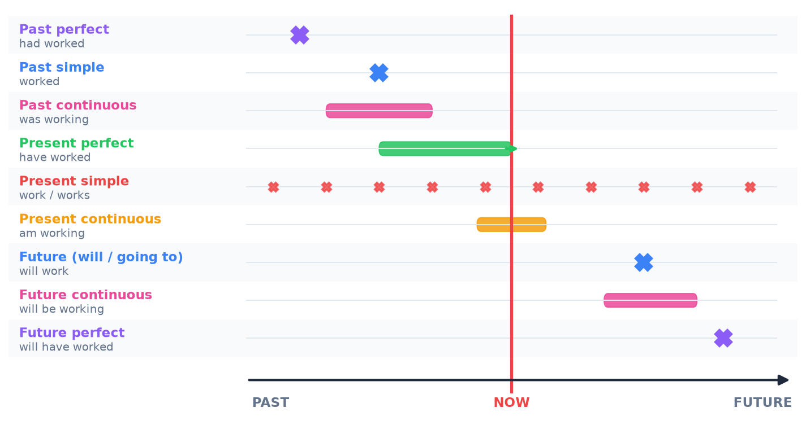
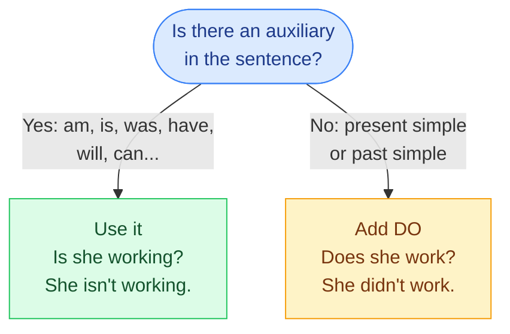

# 1. Overview of the tenses

<mark style="color:blue;">**12 tenses, but only 3 building blocks: once you see the system, it is easy.**</mark>

&#x20;


**In short**

An English tense = a **time** (past, present, future) + an **aspect** (simple, continuous, perfect, perfect continuous).

3 × 4 = **12 tenses**. At level A2-B1, you use **8 of them** all the time.


&#x20;

***

&#x20;

## <mark style="color:purple;">01</mark> · All the tenses on one timeline

&#x20;

<figure><figcaption>
A cross = a finished, short action. A bar = an action in progress (continuous). The green arrow = an action that goes until NOW (present perfect).
</figcaption></figure>

&#x20;

***

&#x20;

## <mark style="color:purple;">02</mark> · The 3 building blocks

&#x20;

Every tense is made with one (or two) of these blocks:

&#x20;



### <mark style="color:blue;">Simple</mark>

&#x20;

The **verb alone**.

&#x20;

*I **work**.*
*I **worked**.*
*I **will work**.*

&#x20;

A fact, a habit, a finished action.



### <mark style="color:blue;">Continuous</mark>

&#x20;

**be** + verb-**ing**

&#x20;

*I **am working**.*
*I **was working**.*
*I **will be working**.*

&#x20;

An action **in progress** at a moment.



### <mark style="color:blue;">Perfect</mark>

&#x20;

**have** + **past participle**

&#x20;

*I **have worked**.*
*I **had worked**.*
*I **will have worked**.*

&#x20;

An action **before** another moment.



&#x20;


**En français** — l'anglais « empile » des briques. Le temps (passé / présent / futur) se voit **toujours sur le premier verbe** : *I **am** working* (présent), *I **was** working* (passé), *I **will be** working* (futur). Le reste de la forme ne change pas.


&#x20;

***

&#x20;

## <mark style="color:purple;">03</mark> · The big table

&#x20;

Example with the verb **to work** (regular) and **to write** (irregular: *write – wrote – written*).

&#x20;

| Tense                          | Form                        | Example                              | Use it for…                                 |
| ------------------------------ | --------------------------- | ------------------------------------ | ------------------------------------------- |
| **Present simple**             | work / works                | She **writes** code every day.       | habits, facts                               |
| **Present continuous**         | am / is / are + -ing        | She **is writing** code right now.   | now, temporary                              |
| **Past simple**                | worked / wrote              | She **wrote** a script yesterday.    | finished past, with a date                  |
| **Past continuous**            | was / were + -ing           | She **was writing** when I called.   | in progress in the past                     |
| **Present perfect**            | have / has + participle     | She **has written** three apps.      | past → now, no date, experience             |
| **Present perfect continuous** | have / has been + -ing      | She **has been writing** for 2 hours.| duration until now                          |
| **Past perfect**               | had + participle            | She **had written** it before 9.     | before another past action                  |
| **Future (will)**              | will + verb                 | She **will write** it tomorrow.      | decision now, prediction, promise           |
| **Future (going to)**          | am / is / are going to + verb | She **is going to write** a book.  | plan, evidence                              |
| **Future continuous**          | will be + -ing              | She **will be writing** at 10.       | in progress in the future                   |
| **Future perfect**             | will have + participle      | She **will have written** it by Friday. | finished before a future moment          |
| **Conditional**                | would + verb                | She **would write** more if she had time. | imaginary situation                    |

&#x20;

<mark style="color:green;">**Most important at A2-B1**</mark> : present simple, present continuous, past simple, past continuous, present perfect, *will*, *going to*, conditional.

&#x20;

***

&#x20;

## <mark style="color:purple;">04</mark> · The 3 auxiliaries: be, have, do

&#x20;

English uses **three helper verbs** (auxiliaries) to make questions and negatives:

&#x20;

&#x20;

| Sentence                    | Question                     | Negative                         |
| --------------------------- | ---------------------------- | -------------------------------- |
| She **is** working.         | **Is** she working?          | She **isn't** working.           |
| They **have** finished.     | **Have** they finished?      | They **haven't** finished.       |
| He **will** come.           | **Will** he come?            | He **won't** come.               |
| She works.                  | **Does** she work?           | She **doesn't** work.            |
| They worked.                | **Did** they work?           | They **didn't** work.            |

&#x20;


**Trap** — after **does / did**, the verb goes back to the **base form**: *Does she ~~works~~ **work**?* · *He didn't ~~went~~ **go**.* The *-s* or the past is already in the auxiliary.


&#x20;

More details: [Grammaire — 1. Questions and negatives](../grammaire/01-questions-et-negations.md).

&#x20;

***

&#x20;

## <mark style="color:purple;">05</mark> · Stative verbs: no -ing!

&#x20;

Some verbs describe a **state** (a feeling, an opinion, a possession), not an action. They are **almost never** used in the continuous form.

&#x20;

| Type          | Verbs                                             |
| ------------- | ------------------------------------------------- |
| Feelings      | like, love, hate, want, prefer, need              |
| Mind          | know, understand, believe, think (= opinion), remember, mean |
| Possession    | have (= possess), own, belong                     |
| Senses        | see, hear, smell, taste                           |
| Other         | be, seem, cost, contain                           |

&#x20;

* <mark style="color:green;">I **know** the answer.</mark> — <mark style="color:red;">~~I am knowing~~</mark>
* <mark style="color:green;">This laptop **costs** 900 francs.</mark> — <mark style="color:red;">~~is costing~~</mark>
* <mark style="color:green;">I **think** it's a good idea.</mark> (opinion) — but: *I **am thinking** about the project.* (action of thinking = OK)

&#x20;

***

&#x20;

## <mark style="color:purple;">06</mark> · Key points

&#x20;

* Tense = **time** (past / present / future) + **aspect** (simple / continuous / perfect).
* Continuous = **be + -ing** · Perfect = **have + past participle**.
* The time is shown on the **first verb** (the auxiliary).
* No auxiliary? Use **do / does / did** for questions and negatives.
* Stative verbs (*know, like, want, need…*) → **no -ing**.

&#x20;


**Next page** → [2. Present simple and continuous](02-present.md)

