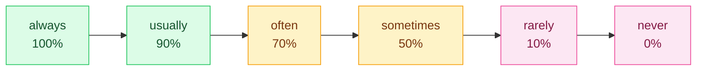

# 2. Present simple and continuous

<mark style="color:blue;">**"I work" is always true. "I am working" is true now.**</mark>

&#x20;


**In short**

* **Present simple** (*I work, she works*) → habits, routines, facts, timetables.
* **Present continuous** (*I am working*) → an action happening **now**, or a **temporary** situation.

En français, les deux se traduisent par « je travaille ». Pour dire que c'est **en ce moment**, l'anglais utilise la forme en **-ing** (« je suis en train de travailler »).


&#x20;

***

&#x20;

## <mark style="color:purple;">01</mark> · Present simple — the form

&#x20;

The verb is the **base form**, but with **he / she / it** you add **-s**.

&#x20;

| Person        | Positive              | Negative                        | Question                    |
| ------------- | --------------------- | ------------------------------- | --------------------------- |
| I             | I **work**            | I **don't** work                | **Do** I work?              |
| you           | you **work**          | you **don't** work              | **Do** you work?            |
| he / she / it | she **works**         | she **doesn't** work            | **Does** she work?          |
| we            | we **work**           | we **don't** work               | **Do** we work?             |
| they          | they **work**         | they **don't** work             | **Do** they work?           |

&#x20;


**The most frequent mistake** — forgetting the **-s** with he / she / it: *My brother ~~work~~ **works** in Bern.* · *The server ~~run~~ **runs** on Linux.*


&#x20;

### Spelling of the -s

&#x20;

| Verb ends in…                     | Rule        | Examples                              |
| --------------------------------- | ----------- | ------------------------------------- |
| most verbs                        | + **s**     | work → works, code → codes            |
| -s, -sh, -ch, -x, -o              | + **es**    | fix → fix**es**, watch → watch**es**, go → go**es**, do → do**es** |
| consonant + **y**                 | y → **ies** | study → stud**ies**, try → tr**ies**  |
| vowel + **y**                     | + **s**     | play → plays, enjoy → enjoys          |
| **have**                          | irregular   | have → **has**                        |

&#x20;

### The verb "to be" (irregular)

&#x20;

| Positive          | Negative              | Question        |
| ----------------- | --------------------- | --------------- |
| I **am** (I'm)    | I'm **not**           | **Am** I…?      |
| you / we / they **are** | **aren't**      | **Are** you…?   |
| he / she / it **is** | **isn't**          | **Is** she…?    |

&#x20;

With **be**, no *do*: *~~Do you are~~* → ***Are** you a student?*

&#x20;

***

&#x20;

## <mark style="color:purple;">02</mark> · Present simple — when?

&#x20;



Things you do **regularly**.

&#x20;

* I **check** my emails every morning.
* She **goes** to the gym twice a week.
* We **don't work** on Sundays.



Things that are **always true**.

&#x20;

* Water **boils** at 100 degrees.
* A byte **contains** 8 bits.
* Fribourg **is** a bilingual city.



**Official** times (trains, courses) — even in the future!

&#x20;

* The train **leaves** at 7:42.
* The exam **starts** at 8:15 tomorrow.



&#x20;

**Signal words** (adverbs of frequency):

&#x20;

&#x20;

Also: *every day, on Mondays, once a week, twice a month*.

&#x20;


**Place of the adverb** — **before** the main verb, but **after** *be*:

* I **often** work late. (before *work*)
* I am **often** tired. (after *am*)

En français on dit « je travaille souvent » ; en anglais, *~~I work often late~~* est faux.


&#x20;

***

&#x20;

## <mark style="color:purple;">03</mark> · Present continuous — the form

&#x20;

**am / is / are** + verb-**ing**

&#x20;

| Person        | Positive                    | Negative                         | Question                  |
| ------------- | --------------------------- | -------------------------------- | ------------------------- |
| I             | I **am** (I'm) work**ing**  | I'm **not** working              | **Am** I working?         |
| you / we / they | they **are** work**ing**  | they **aren't** working          | **Are** they working?     |
| he / she / it | he **is** work**ing**       | he **isn't** working             | **Is** he working?        |

&#x20;

### Spelling of -ing

&#x20;

| Verb ends in…                           | Rule                  | Examples                                 |
| --------------------------------------- | --------------------- | ---------------------------------------- |
| most verbs                              | + **ing**             | work → working, read → reading           |
| silent **-e**                           | remove e + ing        | code → cod**ing**, write → writ**ing**   |
| **-ie**                                 | ie → **ying**         | lie → l**ying**, die → d**ying**         |
| 1 vowel + 1 consonant (stressed)        | **double** consonant  | run → ru**nn**ing, stop → sto**pp**ing, plan → pla**nn**ing |

&#x20;

***

&#x20;

## <mark style="color:purple;">04</mark> · Present continuous — when?

&#x20;



An action **in progress** at the moment of speaking.

&#x20;

* Sorry, I can't talk, I**'m driving**.
* Look! It**'s snowing**.
* The computer **is installing** updates.



A situation that is **true for a limited time** (these days, this semester).

&#x20;

* I**'m learning** Java this semester.
* She**'s living** with her parents until she finds a flat.



A situation that is **changing**.

&#x20;

* Prices **are going up**.
* AI **is becoming** more and more powerful.



A **fixed plan** with a date (see [6. The future](06-futur.md)).

&#x20;

* I**'m meeting** my supervisor tomorrow at 10.



&#x20;

**Signal words**: *now, right now, at the moment, today, this week, currently, Look!, Listen!*

&#x20;

***

&#x20;

## <mark style="color:purple;">05</mark> · Simple or continuous?

&#x20;

| Present simple                                 | Present continuous                               |
| ---------------------------------------------- | ------------------------------------------------ |
| I **work** in Fribourg. (my job, permanent)    | I**'m working** in Bern this month. (temporary)  |
| She **codes** in Python. (her skill, habit)    | She**'s coding** a game. (now)                   |
| It **rains** a lot in November. (fact)         | It**'s raining**. Take an umbrella! (now)        |
| What **do** you **do**? (= your job)           | What **are** you **doing**? (= now)              |

&#x20;


**Trap** — *What do you do?* does **not** mean "Qu'est-ce que tu fais ?" but **"Quel est ton métier ?"**. For "what are you doing right now?", say ***What are you doing?***


&#x20;

Remember: **stative verbs** (*know, like, want, need, understand…*) stay in the simple form, even "now": *I **need** help now.* — ~~I'm needing~~.

&#x20;

***

&#x20;

## <mark style="color:purple;">06</mark> · Exercises

&#x20;

### A. Present simple or continuous?

&#x20;

1. Listen! Someone (knock) at the door.

&#x20;

**is knocking** — *Listen!* = right now.

&#x20;

2. My sister (work) for a bank in Zurich.

&#x20;

**works** — permanent job, he/she → -s.

&#x20;

3. I (not / understand) this error message.

&#x20;

**don't understand** — *understand* is a stative verb.

&#x20;

4. (you / usually / take) the bus to school?

&#x20;

**Do you usually take** — habit. The adverb goes before the main verb.

&#x20;

5. Be quiet, the teacher (explain) the exercise.

&#x20;

**is explaining**

&#x20;

6. The course (start) at 8:15 every Monday.

&#x20;

**starts** — timetable, habit.

&#x20;

7. This semester we (study) networks.

&#x20;

**are studying** — temporary situation.

&#x20;

8. He (not / like) meetings.

&#x20;

**doesn't like** — *like* is stative; *doesn't* + base form.

&#x20;

&#x20;

### B. Find the mistake

&#x20;

1. She don't speak German.

&#x20;

She **doesn't** speak German.

&#x20;

2. Does he works here?

&#x20;

Does he **work** here? — after *does*, base form.

&#x20;

3. I am knowing the answer.

&#x20;

I **know** the answer. — stative verb.

&#x20;

4. He studys computer science.

&#x20;

He **studies** computer science. — consonant + y → ies.

&#x20;

&#x20;

***

&#x20;

## <mark style="color:purple;">07</mark> · Key points

&#x20;

* **Present simple**: habits, facts, timetables. **he / she / it + -s**.
* Questions and negatives: **do / does** + base form.
* **Present continuous**: **am / is / are + -ing** → now, temporary, changes.
* *What do you do?* = your job · *What are you doing?* = now.
* Stative verbs → simple form.

&#x20;


**Next page** → [3. Past simple and continuous](03-passe.md)

