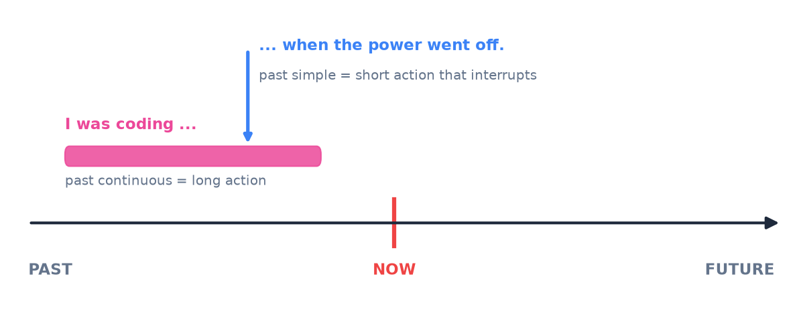

# 3. Past simple and continuous

<mark style="color:blue;">**Tell a story: the past simple for the events, the past continuous for the background.**</mark>

&#x20;


**In short**

* **Past simple** (*I worked, I went*) → a **finished** action at a **finished** time (*yesterday, last year, in 2020*).
* **Past continuous** (*I was working*) → an action **in progress** at a moment in the past.
* **used to** (*I used to play*) → an **old habit** that is finished now.

En français : le past simple ressemble au **passé composé / passé simple** (« j'ai travaillé »), le past continuous à l'**imparfait** (« je travaillais »).


&#x20;

***

&#x20;

## <mark style="color:purple;">01</mark> · Past simple — the form

&#x20;

**Regular verbs**: base form + **-ed**. It is the **same for all persons** (no -s!).

&#x20;

| Positive             | Negative                        | Question                    |
| -------------------- | ------------------------------- | --------------------------- |
| I / she / they **worked** | I / she / they **didn't** work | **Did** you work?        |
| I **went** (irregular) | I **didn't go**               | **Did** you **go**?         |

&#x20;

### Spelling of -ed

&#x20;

| Verb ends in…                     | Rule                  | Examples                                    |
| --------------------------------- | --------------------- | ------------------------------------------- |
| most verbs                        | + **ed**              | work → worked, install → installed          |
| **-e**                            | + **d**               | save → saved, delete → deleted              |
| consonant + **y**                 | y → **ied**           | study → stud**ied**, copy → cop**ied**      |
| vowel + **y**                     | + **ed**              | play → played                               |
| 1 vowel + 1 consonant (stressed)  | **double** consonant  | stop → sto**pp**ed, plan → pla**nn**ed, prefer → prefe**rr**ed |

&#x20;


**Pronunciation of -ed** — three sounds:

* **/t/** after p, k, s, sh, ch, f : work**ed**, stopp**ed**, fix**ed**
* **/d/** after the other sounds : play**ed**, sav**ed**, open**ed**
* **/ɪd/** (a new syllable) after **t** and **d** only : start**ed**, need**ed**, download**ed**

Ne dis pas « work-ède » : on n'entend une syllabe en plus que si le verbe finit par *t* ou *d*.


&#x20;

**Irregular verbs** have their own past form: *go → **went**, see → **saw**, write → **wrote**, buy → **bought***. You must learn them → [8. Irregular verbs](08-verbes-irreguliers.md).

&#x20;

### The verb "to be" in the past

&#x20;

| Positive                          | Negative                 | Question        |
| --------------------------------- | ------------------------ | --------------- |
| I / he / she / it **was**         | **wasn't**               | **Was** he…?    |
| you / we / they **were**          | **weren't**              | **Were** you…?  |

&#x20;

***

&#x20;

## <mark style="color:purple;">02</mark> · Past simple — when?

&#x20;

A **finished** action, at a **finished** time. Often with a **time expression**:

&#x20;

*yesterday · last week / month / year · two days **ago** · in 2021 · when I was a child · on Monday*

&#x20;

* I **installed** Linux **last week**.
* She **graduated in 2023**.
* We **didn't go** to the party **yesterday**.
* **Did** you **see** the email this morning? — Yes, I **did**.

&#x20;

A **list of events** one after the other (a story):

&#x20;

* I **woke up**, **took** a shower, **had** breakfast and **left** the house.

&#x20;


**Trap: ago** — *ago* goes **after** the time: *two years **ago*** (= il y a deux ans). ~~ago two years~~.


&#x20;

***

&#x20;

## <mark style="color:purple;">03</mark> · Past continuous — the form

&#x20;

**was / were** + verb-**ing**

&#x20;

| Person                  | Positive                 | Negative              | Question               |
| ----------------------- | ------------------------ | --------------------- | ---------------------- |
| I / he / she / it       | she **was working**      | she **wasn't** working | **Was** she working?  |
| you / we / they         | they **were working**    | they **weren't** working | **Were** they working? |

&#x20;

***

&#x20;

## <mark style="color:purple;">04</mark> · Past continuous — when?

&#x20;

### An action in progress at a precise moment

&#x20;

* At 10 pm yesterday, I **was studying**.
* What **were** you **doing** at 8 this morning?

&#x20;

### A long action interrupted by a short action

&#x20;

<figure><figcaption>
The long action (past continuous) is the background; the short action (past simple) interrupts it.
</figcaption></figure>

&#x20;

* I **was coding** **when** the power **went** off.
* **While** she **was walking** home, she **met** an old friend.

&#x20;


**when / while**

* **while** + long action (past continuous) : *While I was sleeping, …*
* **when** + short action (past simple) : *…, when the phone rang.*

C'est exactement comme en français : « Je **dormais** (imparfait) **quand** le téléphone **a sonné** (passé composé). »


&#x20;

### Two actions at the same time

&#x20;

* **While** I **was cooking**, my brother **was playing** video games.

&#x20;

### The background of a story

&#x20;

* It **was raining** and people **were running** to the station. Suddenly, a man **shouted**…

&#x20;

***

&#x20;

## <mark style="color:purple;">05</mark> · Order matters

&#x20;

Compare:

&#x20;

| Sentence                                          | Meaning                                              |
| ------------------------------------------------- | ---------------------------------------------------- |
| When the teacher arrived, we **were writing**.    | We started **before** she arrived (in progress).     |
| When the teacher arrived, we **wrote**.           | She arrived, **then** we started to write.           |

&#x20;

***

&#x20;

## <mark style="color:purple;">06</mark> · used to — old habits

&#x20;

**used to + base form** = something that was **true or habitual in the past**, but **not anymore**.

&#x20;

* I **used to play** football. (Now I don't.)
* There **used to be** a cinema here.
* **Did** you **use to** have long hair? — Question and negative: ***use to*** (no -d).
* I **didn't use to** like coffee.

&#x20;


**En français** — *used to* se traduit souvent par l'**imparfait d'habitude** + « avant » : *I used to live in Geneva* = « Avant, j'habitais à Genève ».

À ne pas confondre avec ***be used to + -ing*** = **être habitué à** : *I'm used to working at night.*


&#x20;

***

&#x20;

## <mark style="color:purple;">07</mark> · Exercises

&#x20;

### A. Past simple: give the past form

&#x20;

1. study · stop · play · save

&#x20;

**studied · stopped · played · saved**

&#x20;

2. go · buy · write · make

&#x20;

**went · bought · wrote · made** (irregular)

&#x20;

&#x20;

### B. Past simple or past continuous?

&#x20;

1. I (read) the documentation when my computer (crash).

&#x20;

I **was reading** the documentation when my computer **crashed**.

&#x20;

2. What (you / do) at 11 pm last night?

&#x20;

What **were you doing** at 11 pm last night?

&#x20;

3. She (finish) her project two days ago.

&#x20;

She **finished** her project two days ago. — *ago* = finished time.

&#x20;

4. While we (have) lunch, it (start) to rain.

&#x20;

While we **were having** lunch, it **started** to rain.

&#x20;

5. (you / go) to the lecture yesterday? — No, I (not / go).

&#x20;

**Did you go** to the lecture yesterday? — No, I **didn't go**.

&#x20;

6. The sun (shine) and the birds (sing).

&#x20;

The sun **was shining** and the birds **were singing**. — background.

&#x20;

&#x20;

### C. Translate

&#x20;

1. Avant, je jouais aux jeux vidéo tous les jours.

&#x20;

**I used to play** video games every day.

&#x20;

2. Il y a trois ans, j'ai commencé mes études.

&#x20;

**Three years ago, I started** my studies.

&#x20;

&#x20;

***

&#x20;

## <mark style="color:purple;">08</mark> · Key points

&#x20;

* **Past simple**: verb-**ed** or irregular form, **same for all persons**. Finished time: *yesterday, ago, last…, in 2020*.
* Questions and negatives: **did / didn't + base form**.
* **Past continuous**: **was / were + -ing** → in progress, background, interrupted action.
* **while** + long action · **when** + short action.
* **used to** + base form → old habit, finished now.

&#x20;


**Next page** → [4. Present perfect](04-present-perfect.md)

