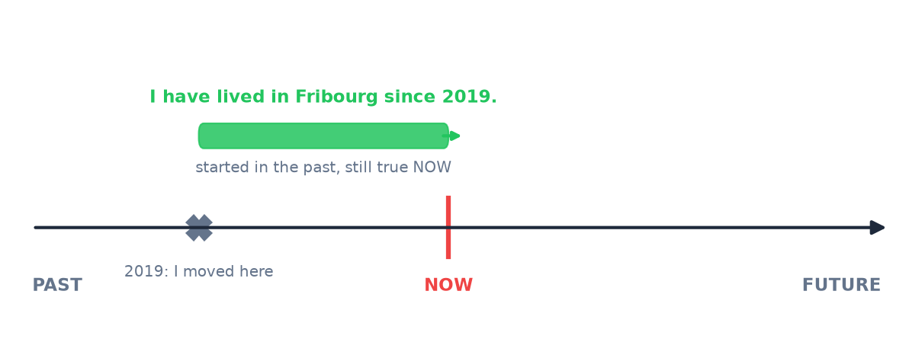
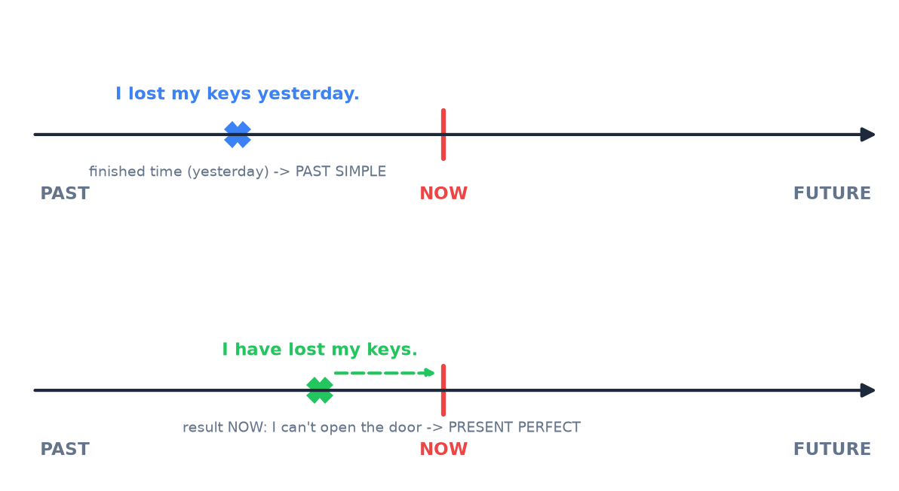
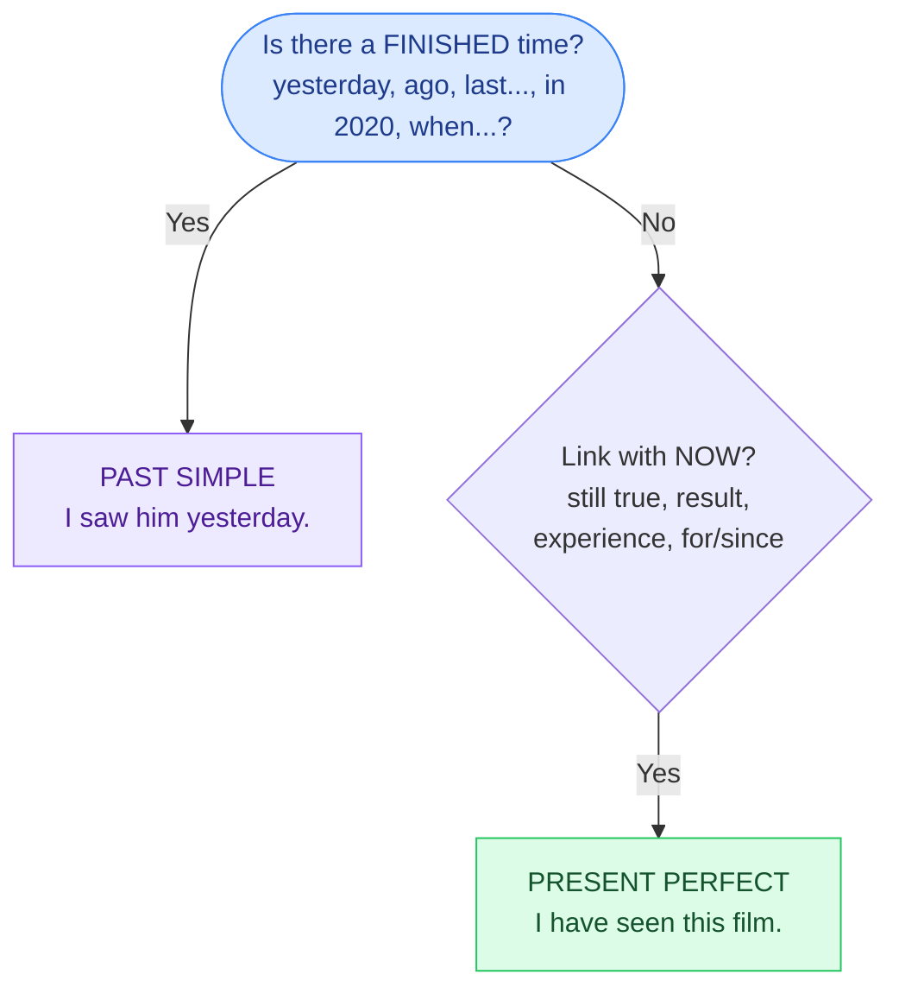

# 4. Present perfect

<mark style="color:blue;">**The tense that connects the past to NOW — and the hardest one for French speakers.**</mark>

&#x20;


**In short**

**have / has + past participle** (*I have worked, she has written*).

We use it when the past action has a **link with now**: it is still true, we see the result now, or we talk about **experience** in life. **No precise past time** (*yesterday, in 2020…*) with this tense!


&#x20;

***

&#x20;

## <mark style="color:purple;">01</mark> · The form

&#x20;

| Person          | Positive                      | Negative                         | Question                     |
| --------------- | ----------------------------- | -------------------------------- | ---------------------------- |
| I / you / we / they | they **have** (they've) **finished** | they **haven't** finished   | **Have** they finished?      |
| he / she / it   | she **has** (she's) **finished** | she **hasn't** finished       | **Has** she finished?        |

&#x20;

The **past participle**:

&#x20;

* regular verbs: same as the past simple → work**ed**, instal**led**, stud**ied**
* irregular verbs: the **3rd column** → *go – went – **gone***, *write – wrote – **written*** → [8. Irregular verbs](08-verbes-irreguliers.md)

&#x20;


**he's** can mean **he is** or **he has**. Look at the next word: *He's **working*** (is) · *He's **worked*** (has).


&#x20;

***

&#x20;

## <mark style="color:purple;">02</mark> · The 3 uses

&#x20;



An action that **started in the past** and **continues now**. With **for** and **since**.

&#x20;

<figure><figcaption>
The action started in 2019 and it is still true now.
</figcaption></figure>

&#x20;

* I **have lived** in Fribourg **since** 2019.
* She **has worked** here **for** three years.
* **How long have** you **known** him?



A past action with a **visible result now**. The time is **not important**.

&#x20;

* I**'ve lost** my keys. (→ I can't open the door now.)
* Someone **has deleted** the file! (→ the file is not there now.)
* The price **has gone up**. (→ it is more expensive now.)



Things you have done (or not) **in your life until now**. With **ever** and **never**.

&#x20;

* **Have** you **ever been** to London?
* I**'ve never eaten** sushi.
* She **has visited** ten countries.



&#x20;

***

&#x20;

## <mark style="color:purple;">03</mark> · for or since?

&#x20;



### for + a duration

&#x20;

*(pendant / depuis + durée)*

&#x20;

* for **two hours**
* for **three years**
* for **a long time**
* for **ages**



### since + a starting point

&#x20;

*(depuis + date / moment)*

&#x20;

* since **9 o'clock**
* since **2019**
* since **Monday**
* since **I was a child**



&#x20;


**The number one mistake of French speakers**

« J'habite ici **depuis** 5 ans » → en français, on utilise le **présent**. En anglais, c'est **impossible** : il faut le **present perfect**.

* <mark style="color:red;">~~I live here since 5 years.~~</mark>
* <mark style="color:green;">**I have lived** here **for** 5 years.</mark>

Règle : « depuis » + une action qui dure encore → **present perfect** + **for** (durée) ou **since** (point de départ).


&#x20;

***

&#x20;

## <mark style="color:purple;">04</mark> · The small words

&#x20;

| Word        | Meaning                        | Place                         | Example                                     |
| ----------- | ------------------------------ | ----------------------------- | ------------------------------------------- |
| **ever**    | déjà (dans ta vie ?) — questions | before the participle       | Have you **ever** used Docker?              |
| **never**   | jamais                         | before the participle         | I have **never** used Docker.               |
| **already** | déjà (plus tôt que prévu)      | before the participle         | I have **already** finished.                |
| **yet**     | déjà ? / pas encore            | **end** — questions and negatives | Have you finished **yet**? · I haven't finished **yet**. |
| **just**    | venir de                       | before the participle         | I have **just** sent the email. (= je viens d'envoyer) |
| **so far**  | jusqu'à maintenant             | end                           | We have written 300 lines **so far**.       |

&#x20;


**En français** — « je **viens de** finir » se dit ***I have just finished***. Ne traduis pas mot à mot (~~I come from finish~~).


&#x20;

***

&#x20;

## <mark style="color:purple;">05</mark> · Present perfect or past simple?

&#x20;

This is **the** big question. Look at the time:

&#x20;

<figure><figcaption>
Top: a finished time is mentioned → past simple. Bottom: no time, the result is important now → present perfect.
</figcaption></figure>

&#x20;

&#x20;

| Present perfect (link with now)                    | Past simple (finished time)                       |
| -------------------------------------------------- | ------------------------------------------------- |
| I **have been** to Paris. (in my life)             | I **went** to Paris **last summer**.              |
| She **has worked** here for 2 years. (still here)  | She **worked** here for 2 years. (she left)       |
| **Have** you **seen** my phone? (I need it now)    | **Did** you **see** the match **yesterday**?      |
| I**'ve finished** the report **this week**. (week not finished) | I **finished** the report **last week**. |

&#x20;


**Never** use the present perfect with a finished time:

* <mark style="color:red;">~~I have seen him yesterday.~~</mark> → <mark style="color:green;">I **saw** him yesterday.</mark>
* <mark style="color:red;">~~When have you arrived?~~</mark> → <mark style="color:green;">When **did** you **arrive**?</mark> (*when* = a precise moment)

Attention : le **passé composé** français (« je l'ai vu hier ») se traduit très souvent par le **past simple**.


&#x20;

A typical conversation: we **start** with the present perfect (general), then we give **details** with the past simple.

&#x20;

> — **Have** you ever **been** to the USA?
> — Yes, I **have**. I **went** to New York in 2022. It **was** amazing!

&#x20;

***

&#x20;

## <mark style="color:purple;">06</mark> · Present perfect continuous

&#x20;

**have / has been + -ing** → we insist on the **duration** of an action that continues until now (or just stopped).

&#x20;

* I**'ve been waiting** for you **for** 40 minutes!
* She **has been coding since** this morning.
* You look tired. **Have** you **been working** all night?

&#x20;

| Present perfect simple → **result** / how many | Present perfect continuous → **duration** / activity |
| ---------------------------------------------- | ---------------------------------------------------- |
| I**'ve written** 3 pages.                      | I**'ve been writing** for 3 hours.                   |
| He **has fixed** the bug.                      | He **has been fixing** bugs all day.                 |

&#x20;

***

&#x20;

## <mark style="color:purple;">07</mark> · Exercises

&#x20;

### A. for or since?

&#x20;

1. ___ 2020 · ___ ten minutes · ___ last Friday · ___ a week

&#x20;

**since** 2020 · **for** ten minutes · **since** last Friday · **for** a week

&#x20;

&#x20;

### B. Present perfect or past simple?

&#x20;

1. I (never / see) snow in July.

&#x20;

I **have never seen** snow in July. — life experience.

&#x20;

2. We (meet) our new teacher last Monday.

&#x20;

We **met** our new teacher last Monday. — *last Monday* = finished time.

&#x20;

3. (you / finish) the exercise yet?

&#x20;

**Have you finished** the exercise yet?

&#x20;

4. She (work) at Swisscom for five years, then she moved to Google.

&#x20;

She **worked** at Swisscom for five years. — she doesn't work there anymore.

&#x20;

5. Oh no! I (forget) my password.

&#x20;

I**'ve forgotten** my password. — result now.

&#x20;

6. When (you / buy) this laptop?

&#x20;

When **did you buy** this laptop? — *when* → past simple.

&#x20;

&#x20;

### C. Translate

&#x20;

1. J'étudie l'anglais depuis six ans.

&#x20;

**I have studied / I have been studying English for six years.**

&#x20;

2. Il vient de partir.

&#x20;

**He has just left.**

&#x20;

3. Tu as déjà utilisé Linux ?

&#x20;

**Have you ever used Linux?**

&#x20;

&#x20;

***

&#x20;

## <mark style="color:purple;">08</mark> · Key points

&#x20;

* **have / has + past participle**.
* Uses: **still true** (for / since), **result now**, **life experience** (ever / never).
* « depuis » + action qui continue → **present perfect** (jamais le présent).
* **Finished time** (*yesterday, ago, last…, when?*) → **past simple**, never present perfect.
* *just, already, ever, never* before the participle · *yet* at the end.

&#x20;


**Next page** → [5. Past perfect](05-past-perfect.md)

