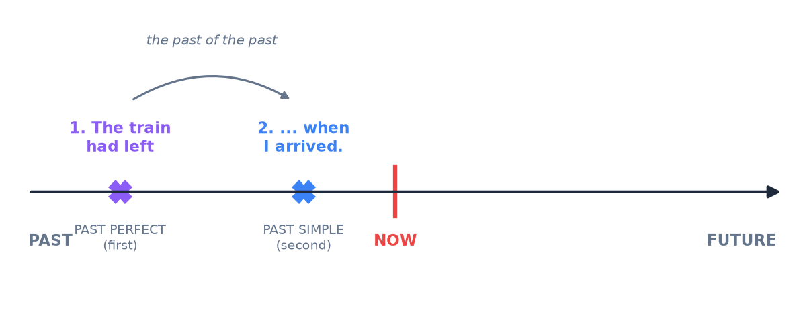

# 5. Past perfect

<mark style="color:blue;">**When you tell a story in the past and need to go back even further.**</mark>

&#x20;


**In short**

**had + past participle** (*I had worked, she had left*) — the same for all persons.

It shows that an action happened **before another past action**. En français, c'est le **plus-que-parfait** : « le train **était parti** quand je suis arrivé ».


&#x20;

***

&#x20;

## <mark style="color:purple;">01</mark> · The form

&#x20;

| Positive                           | Negative                          | Question                  |
| ---------------------------------- | --------------------------------- | ------------------------- |
| I / she / they **had** (I'd) **left** | I / she / they **hadn't** left | **Had** you left?         |

&#x20;

Very easy: **had** never changes, and the participle is the same as in the present perfect (*worked, gone, written, seen…*).

&#x20;

***

&#x20;

## <mark style="color:purple;">02</mark> · When?

&#x20;

<figure><figcaption>
Two actions in the past: the first one is in the past perfect, the second one in the past simple.
</figcaption></figure>

&#x20;

* The train **had left** when I **arrived** at the station. (first the train left, then I arrived)
* I **couldn't** log in because I **had forgotten** my password.
* She **had** never **seen** the sea before she **went** to Spain.

&#x20;

Compare:

&#x20;

| Sentence                                     | What happened                                            |
| -------------------------------------------- | -------------------------------------------------------- |
| When I arrived, the meeting **started**.     | I arrived → **then** the meeting started. (I saw the start) |
| When I arrived, the meeting **had started**. | The meeting started → **then** I arrived. (I was late)   |

&#x20;

***

&#x20;

## <mark style="color:purple;">03</mark> · Signal words

&#x20;

| Word               | Example                                                         |
| ------------------ | --------------------------------------------------------------- |
| **before**         | I **had** never **used** Git **before** I started at HEIA.      |
| **after**          | **After** she **had finished** her exam, she went home.         |
| **already**        | When we got there, the film **had already started**.            |
| **by the time**    | **By the time** the police arrived, the thief **had escaped**.  |
| **just**           | I **had just switched off** the PC when it started to update.   |
| **because**        | He was tired **because** he **hadn't slept** well.              |

&#x20;


**Good news** — with **before** and **after**, the order is already clear, so the past simple is also OK: *After she **finished** her exam, she went home.* The past perfect is **necessary** only when the order is not clear without it.


&#x20;

***

&#x20;

## <mark style="color:purple;">04</mark> · Past perfect continuous (B1+)

&#x20;

**had been + -ing** → the **duration** of an action before a past moment.

&#x20;

* I **had been waiting** for an hour when the bus finally arrived.
* Her eyes were red: she **had been crying**.

&#x20;

***

&#x20;

## <mark style="color:purple;">05</mark> · Exercises

&#x20;

1. When I got to the cinema, the film (already / start).

&#x20;

The film **had already started**.

&#x20;

2. I (never / fly) before I went to Canada.

&#x20;

I **had never flown** before I went to Canada. — *fly – flew – flown*.

&#x20;

3. He failed the test because he (not / study).

&#x20;

He failed the test because he **hadn't studied**.

&#x20;

4. By the time we arrived, everybody (go) home.

&#x20;

Everybody **had gone** home.

&#x20;

5. Put the two actions in one sentence: "The program crashed. I didn't save my work before."

&#x20;

**The program crashed and I hadn't saved my work.** / **When the program crashed, I hadn't saved my work.**

&#x20;

6. Translate: Quand je suis arrivé, ils avaient déjà mangé.

&#x20;

**When I arrived, they had already eaten.**

&#x20;

&#x20;

***

&#x20;

## <mark style="color:purple;">06</mark> · Key points

&#x20;

* **had + past participle**, same for all persons.
* The **first** of two past actions → past perfect · the **second** → past simple.
* Signal words: *before, after, already, by the time, because*.
* = le **plus-que-parfait** français.

&#x20;


**Next page** → [6. The future](06-futur.md)

