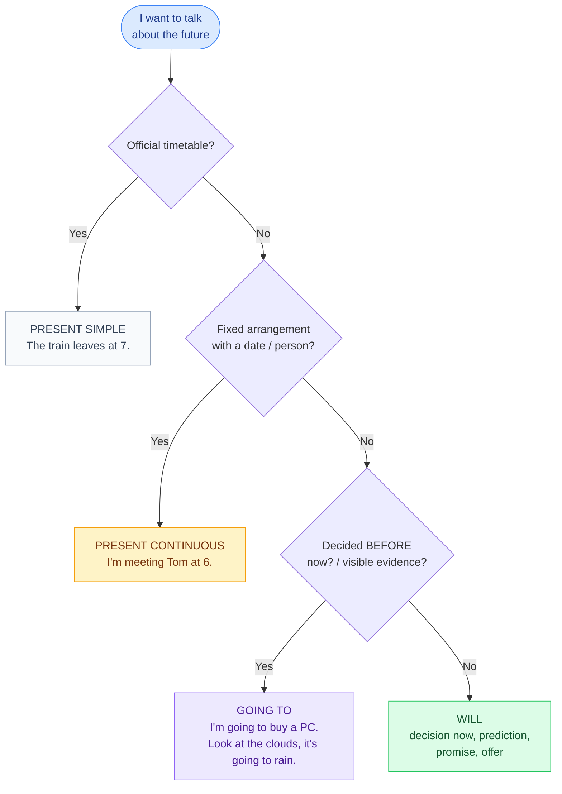

# 6. The future

<mark style="color:blue;">**English has no single future tense: you choose the form according to what you want to say.**</mark>

&#x20;


**In short**

* **will** → a decision **now**, a prediction, a promise, an offer.
* **be going to** → a **plan** (already decided), or a prediction with **evidence**.
* **present continuous** → an **arrangement** (fixed date, other people involved).
* **present simple** → a **timetable** (trains, courses).


&#x20;

***

&#x20;

## <mark style="color:purple;">01</mark> · Which form? The decision tree

&#x20;

&#x20;

***

&#x20;

## <mark style="color:purple;">02</mark> · will

&#x20;

**will + base form** — the same for all persons.

&#x20;

| Positive                  | Negative                       | Question            |
| ------------------------- | ------------------------------ | ------------------- |
| I / she / they **will** (I'll) **help** | I **won't** (= will not) help | **Will** you help? |

&#x20;



You decide **at the moment of speaking**.

&#x20;

* — The printer isn't working. — OK, I**'ll call** the IT support.
* I'm hungry. I think I**'ll order** a pizza.



What you **think** or **believe** (often with *I think, probably, I'm sure*).

&#x20;

* I think AI **will change** our jobs.
* She**'ll** probably **pass** the exam.



* I **won't tell** anyone, I promise.
* **Shall** I open the window? / I**'ll carry** your bag.



* I**'ll be** 21 next month.
* The course **will end** in June.



&#x20;


**won't** = will not. Ne confonds pas avec **want** (vouloir) : *I **won't** go* (je n'irai pas) ≠ *I don't **want** to go* (je ne veux pas y aller).


&#x20;

***

&#x20;

## <mark style="color:purple;">03</mark> · be going to

&#x20;

**am / is / are going to + base form**

&#x20;

| Positive                           | Negative                          | Question                         |
| ---------------------------------- | --------------------------------- | -------------------------------- |
| I**'m going to study** tonight.    | I**'m not going to study**.       | **Are** you **going to study**?  |
| She**'s going to** buy a new laptop. | She **isn't going to** buy it.  | **Is** she **going to** buy it?  |

&#x20;

Two uses:

&#x20;

* **Plan / intention** (decided before): *I**'m going to learn** Spanish next year.*
* **Prediction with evidence** (you can see it): *Look at the battery: the phone **is going to die**.*

&#x20;

### will or going to?

&#x20;

| will (decision now)                                  | going to (decided before)                              |
| ---------------------------------------------------- | ------------------------------------------------------ |
| — We need milk. — Really? I**'ll buy** some.         | — Why are you taking your bag? — I**'m going to buy** milk. |
| I think it **will rain** tomorrow. (opinion)         | Look at those clouds! It**'s going to rain**. (evidence) |

&#x20;

***

&#x20;

## <mark style="color:purple;">04</mark> · Present continuous and present simple for the future

&#x20;



### Present continuous

&#x20;

A **fixed arrangement** (in your agenda).

&#x20;

* I**'m meeting** my supervisor **tomorrow at 10**.
* We**'re flying** to Rome **on Friday**.
* What **are** you **doing this weekend**?



### Present simple

&#x20;

An **official timetable**.

&#x20;

* The bus **leaves** at 7:42.
* The exam **starts** at 8:15.
* The shop **opens** at 9.



&#x20;


**After when, if, as soon as, before, after, until** → **present**, not *will*!

* <mark style="color:red;">~~When I will finish, I will call you.~~</mark>
* <mark style="color:green;">**When** I **finish**, I'll call you.</mark>
* <mark style="color:green;">I'll wait **until** you **come** back.</mark>

En français on dit « quand j'**aurai** fini » (futur) ; en anglais, c'est le **présent** après *when*.


&#x20;

***

&#x20;

## <mark style="color:purple;">05</mark> · Future continuous and future perfect (B1)

&#x20;



### Future continuous

&#x20;

**will be + -ing** → an action **in progress** at a moment in the future.

&#x20;

* This time tomorrow, I**'ll be sitting** my exam.
* Don't call at 8, we**'ll be having** dinner.



### Future perfect

&#x20;

**will have + past participle** → an action **finished before** a moment in the future. Often with **by**.

&#x20;

* **By** June, I**'ll have finished** my first year.
* **By** the time you arrive, we**'ll have eaten**.



&#x20;


**by** + moment = **au plus tard à / d'ici** : *by Friday* = d'ici vendredi (au plus tard).


&#x20;

***

&#x20;

## <mark style="color:purple;">06</mark> · Exercises

&#x20;

1. — The phone is ringing. — OK, I (answer) it.

&#x20;

I**'ll answer** it. — decision now.

&#x20;

2. I've decided: I (apply) for an internship at Logitech.

&#x20;

I**'m going to apply** — plan decided before.

&#x20;

3. Look out! You (fall)!

&#x20;

You**'re going to fall**! — evidence.

&#x20;

4. I (see) the dentist on Thursday at 3 pm.

&#x20;

I**'m seeing** the dentist on Thursday at 3 pm. — arrangement.

&#x20;

5. The lecture (begin) at 10:15 tomorrow.

&#x20;

The lecture **begins** at 10:15. — timetable.

&#x20;

6. I'll send you the file when I (get) home.

&#x20;

when I **get** home — present after *when*.

&#x20;

7. By 2030, I (finish) my studies.

&#x20;

By 2030, I**'ll have finished** my studies. — future perfect.

&#x20;

8. Translate: Je pense qu'il ne viendra pas.

&#x20;

**I don't think he'll come.** (more natural than *I think he won't come*)

&#x20;

&#x20;

***

&#x20;

## <mark style="color:purple;">07</mark> · Key points

&#x20;

* **will**: decision now, prediction, promise. **won't** = will not.
* **going to**: plan decided before, evidence.
* **present continuous**: arrangement · **present simple**: timetable.
* After **when / if / until / as soon as** → **present**, not *will*.
* **will be + -ing** (in progress) · **will have + participle** (finished before, *by*).

&#x20;


**Next page** → [7. Conditional and if-sentences](07-conditionnel-et-if.md)

