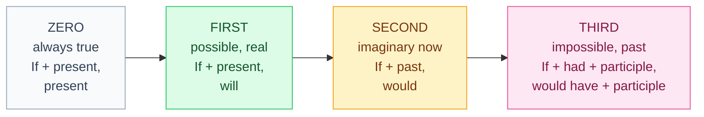

# 7. Conditional and if-sentences

<mark style="color:blue;">**If you learn one rule on this page: NEVER "would" after "if".**</mark>

&#x20;


**In short**

* **would + base form** = the conditional (*I would buy* = j'achèterais).
* There are **4 types** of if-sentences, from "always true" to "impossible, it's in the past".
* The tense after **if** is always **one step back** in the past compared to the other part of the sentence.


&#x20;

***

&#x20;

## <mark style="color:purple;">01</mark> · would — the conditional

&#x20;

**would + base form** — the same for all persons. Short form: **'d**.

&#x20;

| Positive                           | Negative                              | Question                 |
| ---------------------------------- | ------------------------------------- | ------------------------ |
| I **would** (I'd) **like** a coffee. | I **wouldn't** (= would not) do that. | **Would** you **help** me? |

&#x20;

Uses:

&#x20;

* **Imaginary situations**: *I **would travel** around the world.* (but I don't have money)
* **Polite requests**: ***Would** you **open** the window, please?* · *I**'d like** a ticket to Bern.*
* **Advice**: *If I were you, I**'d** talk to the teacher.*

&#x20;

**Past conditional**: **would have + past participle** (*I would have come* = je serais venu).

&#x20;

***

&#x20;

## <mark style="color:purple;">02</mark> · The four if-sentences

&#x20;

&#x20;

| Type       | if-part                  | main part                         | Example                                                         |
| ---------- | ------------------------ | --------------------------------- | --------------------------------------------------------------- |
| **Zero**   | **present**              | **present**                       | If you **heat** ice, it **melts**.                              |
| **First**  | **present**              | **will** + verb                   | If it **rains**, I**'ll take** the bus.                         |
| **Second** | **past**                 | **would** + verb                  | If I **had** more time, I **would learn** Japanese.             |
| **Third**  | **had** + participle     | **would have** + participle       | If I **had studied**, I **would have passed** the exam.         |

&#x20;


**No would / will after if**

* <mark style="color:red;">~~If I would have money, I would buy it.~~</mark> → <mark style="color:green;">If I **had** money, I would buy it.</mark>
* <mark style="color:red;">~~If it will rain, …~~</mark> → <mark style="color:green;">If it **rains**, …</mark>

C'est comme en français : on ne dit pas « si j'aurais » !


&#x20;

The two parts can change places. With **if** first, put a **comma**:

&#x20;

* **If** I see him, I'll tell him. = I'll tell him **if** I see him.

&#x20;

***

&#x20;

## <mark style="color:purple;">03</mark> · Each type in detail

&#x20;



Scientific facts, general truths, instructions. **if** = **when** (chaque fois que).

&#x20;

* If you **press** Ctrl + S, the file **is** saved.
* If you **don't water** plants, they **die**.



A **possible** situation in the future and its **result**.

&#x20;

* If you **finish** early, you **can** go home.
* If the server **crashes**, we**'ll lose** the data.
* I **won't come** **unless** you invite me. (*unless* = if … not = à moins que)

&#x20;

En français : « Si + **présent**, **futur** ». Pareil en anglais.



A situation that is **not real now** or **unlikely**.

&#x20;

* If I **won** the lottery, I **would buy** a house. (but I probably won't win)
* If I **knew** the answer, I **would tell** you. (but I don't know)
* If I **were** you, I **wouldn't do** that.

&#x20;

En français : « Si + **imparfait**, **conditionnel** » → « Si j'**avais** de l'argent, j'**achèterais**… ». Exactement la même logique.

&#x20;

With **be**: we often use **were** for all persons: *If I **were** rich… · If she **were** here…*



A situation in the **past** that did **not** happen, and its imaginary result. **Regret**.

&#x20;

* If I **had woken up** earlier, I **wouldn't have missed** the train. (but I woke up late, and I missed it)
* If you **had told** me, I **would have helped** you.

&#x20;

En français : « Si + **plus-que-parfait**, **conditionnel passé** » → « Si j'**avais su**, je **serais venu** ».



&#x20;

***

&#x20;

## <mark style="color:purple;">04</mark> · I wish / If only

&#x20;

To say you want a situation to be **different** (regret):

&#x20;

| Regret about…   | Form                         | Example                                              |
| --------------- | ---------------------------- | ---------------------------------------------------- |
| the **present** | wish + **past**              | I **wish** I **had** a car. (I don't have one)       |
| the **past**    | wish + **had + participle**  | I **wish** I **had studied** more. (I didn't)        |

&#x20;


**En français** — *I wish I had a car* = « **J'aimerais** avoir une voiture / **Si seulement** j'avais une voiture ». Le temps « recule » d'un cran, comme dans les phrases en *if*.


&#x20;

***

&#x20;

## <mark style="color:purple;">05</mark> · Exercises

&#x20;

### A. Which type? Complete.

&#x20;

1. If you (mix) blue and yellow, you (get) green.

&#x20;

If you **mix** blue and yellow, you **get** green. — zero.

&#x20;

2. If I (have) time tomorrow, I (help) you.

&#x20;

If I **have** time tomorrow, I**'ll help** you. — first.

&#x20;

3. If I (be) the boss, I (let) everyone work from home.

&#x20;

If I **were** the boss, I **would let** everyone work from home. — second.

&#x20;

4. If she (not / forget) her password, she (not / lose) her account.

&#x20;

If she **hadn't forgotten** her password, she **wouldn't have lost** her account. — third.

&#x20;

5. What (you / do) if you (find) 1000 francs in the street?

&#x20;

What **would you do** if you **found** 1000 francs in the street? — second.

&#x20;

&#x20;

### B. Find the mistake

&#x20;

1. If I would know, I would tell you.

&#x20;

If I **knew**, I would tell you.

&#x20;

2. If it will be sunny, we'll go to the lake.

&#x20;

If it **is** sunny, we'll go to the lake.

&#x20;

&#x20;

### C. Translate

&#x20;

1. Si j'avais su, je ne serais pas venu.

&#x20;

**If I had known, I wouldn't have come.**

&#x20;

2. J'aimerais parler mieux anglais.

&#x20;

**I wish I spoke English better.** / **I would like to speak English better.**

&#x20;

&#x20;

***

&#x20;

## <mark style="color:purple;">06</mark> · Key points

&#x20;

* **would + verb** = conditionnel · **would have + participle** = conditionnel passé.
* Zero: present / present · First: present / **will** · Second: **past** / **would** · Third: **had + participle** / **would have + participle**.
* **Never** *will / would* in the *if*-part.
* *If I were you…* for advice.
* *I wish* + past (present regret) · *I wish* + had + participle (past regret).

&#x20;


**Next page** → [8. Irregular verbs](08-verbes-irreguliers.md)

