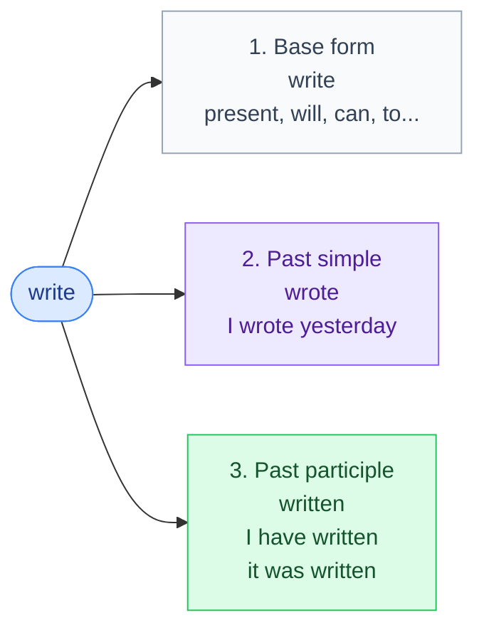

# 8. Irregular verbs

<mark style="color:blue;">**About 100 verbs to know by heart — but they follow patterns, and patterns are easier to learn.**</mark>

&#x20;


**In short**

Every verb has **3 forms**: **base form** (infinitive) – **past simple** – **past participle**.

* Regular: *work – work**ed** – work**ed***.
* Irregular: *write – **wrote** – **written***.

The **past simple** is used alone (*I wrote*). The **past participle** is used after **have** (present / past perfect) and in the **passive** (*it was written*).


&#x20;

***

&#x20;

## <mark style="color:purple;">01</mark> · Where do we use each column?

&#x20;

&#x20;


**Classic mistake** — using the past simple after *have*: <mark style="color:red;">~~I have wrote~~</mark> → <mark style="color:green;">I have **written**</mark> · <mark style="color:red;">~~She has went~~</mark> → <mark style="color:green;">She has **gone**</mark>.


&#x20;

***

&#x20;

## <mark style="color:purple;">02</mark> · The table, sorted by pattern

&#x20;

The verbs are sorted in **4 families**. Learn one family at a time.

&#x20;



**The 3 forms are identical.** The easiest family.

&#x20;

| Base form   | Past simple | Past participle | Français                |
| ----------- | ----------- | --------------- | ----------------------- |
| bet         | bet         | bet             | parier                  |
| broadcast   | broadcast   | broadcast       | diffuser                |
| burst       | burst       | burst           | éclater                 |
| cost        | cost        | cost            | coûter                  |
| cut         | cut         | cut             | couper                  |
| hit         | hit         | hit             | frapper                 |
| hurt        | hurt        | hurt            | blesser, faire mal      |
| let         | let         | let             | laisser                 |
| put         | put         | put             | mettre, poser           |
| quit        | quit        | quit            | quitter, arrêter        |
| read        | read        | read            | lire                    |
| set         | set         | set             | régler, placer          |
| shut        | shut        | shut            | fermer                  |
| split       | split       | split           | diviser                 |
| spread      | spread      | spread          | répandre, étaler        |
| upset       | upset       | upset           | contrarier              |

&#x20;

**read** is written the same, but pronounced differently: *read* /riːd/ – *read* /rɛd/ – *read* /rɛd/ (comme la couleur *red*).



**Past simple and past participle are the same.** The biggest family.

&#x20;

**Sound "-ought / -aught"**

&#x20;

| Base form | Past simple | Past participle | Français           |
| --------- | ----------- | --------------- | ------------------ |
| bring     | brought     | brought         | apporter           |
| buy       | bought      | bought          | acheter            |
| catch     | caught      | caught          | attraper           |
| fight     | fought      | fought          | se battre          |
| seek      | sought      | sought          | chercher           |
| teach     | taught      | taught          | enseigner          |
| think     | thought     | thought         | penser             |

&#x20;

**-d becomes -t**

&#x20;

| Base form | Past simple | Past participle | Français           |
| --------- | ----------- | --------------- | ------------------ |
| bend      | bent        | bent            | plier              |
| build     | built       | built           | construire         |
| lend      | lent        | lent            | prêter             |
| send      | sent        | sent            | envoyer            |
| spend     | spent       | spent           | dépenser, passer (du temps) |

&#x20;

**Short vowel + -t**

&#x20;

| Base form | Past simple | Past participle | Français           |
| --------- | ----------- | --------------- | ------------------ |
| deal      | dealt       | dealt           | traiter            |
| feel      | felt        | felt            | (se) sentir        |
| keep      | kept        | kept            | garder             |
| leave     | left        | left            | partir, laisser    |
| lose      | lost        | lost            | perdre             |
| mean      | meant       | meant           | signifier, vouloir dire |
| meet      | met         | met             | rencontrer         |
| sleep     | slept       | slept           | dormir             |
| sweep     | swept       | swept           | balayer            |

&#x20;

**-ay becomes -aid**

&#x20;

| Base form | Past simple | Past participle | Français           |
| --------- | ----------- | --------------- | ------------------ |
| lay       | laid        | laid            | poser, étendre     |
| pay       | paid        | paid            | payer              |
| say       | said        | said            | dire               |

&#x20;

**Others**

&#x20;

| Base form   | Past simple | Past participle | Français             |
| ----------- | ----------- | --------------- | -------------------- |
| dig         | dug         | dug             | creuser              |
| feed        | fed         | fed             | nourrir              |
| find        | found       | found           | trouver              |
| get         | got         | got (US: gotten)| obtenir, devenir     |
| hang        | hung        | hung            | accrocher, pendre    |
| have        | had         | had             | avoir                |
| hear        | heard       | heard           | entendre             |
| hold        | held        | held            | tenir                |
| lead        | led         | led             | mener, diriger       |
| light       | lit         | lit             | allumer              |
| make        | made        | made            | faire, fabriquer     |
| sell        | sold        | sold            | vendre               |
| shine       | shone       | shone           | briller              |
| shoot       | shot        | shot            | tirer                |
| sit         | sat         | sat             | être assis           |
| stand       | stood       | stood           | être debout          |
| stick       | stuck       | stuck           | coller               |
| strike      | struck      | struck          | frapper              |
| swing       | swung       | swung           | se balancer          |
| tell        | told        | told            | dire, raconter       |
| understand  | understood  | understood      | comprendre           |
| win         | won         | won             | gagner               |

&#x20;

Some verbs are **also regular** in British English: *learn – learnt / learned*, *dream – dreamt / dreamed*, *burn – burnt / burned*, *spell – spelt / spelled*, *smell – smelt / smelled*. Both are correct.



**The past participle is the same as the base form.** Only a few verbs.

&#x20;

| Base form | Past simple | Past participle | Français           |
| --------- | ----------- | --------------- | ------------------ |
| become    | became      | become          | devenir            |
| come      | came        | come            | venir              |
| overcome  | overcame    | overcome        | surmonter          |
| run       | ran         | run             | courir             |



**The 3 forms are different.** But there are still patterns!

&#x20;

**i – a – u**

&#x20;

| Base form | Past simple | Past participle | Français           |
| --------- | ----------- | --------------- | ------------------ |
| begin     | began       | begun           | commencer          |
| drink     | drank       | drunk           | boire              |
| ring      | rang        | rung            | sonner             |
| shrink    | shrank      | shrunk          | rétrécir           |
| sing      | sang        | sung            | chanter            |
| sink      | sank        | sunk            | couler             |
| swim      | swam        | swum            | nager              |

&#x20;

**-ew – -own**

&#x20;

| Base form | Past simple | Past participle | Français           |
| --------- | ----------- | --------------- | ------------------ |
| blow      | blew        | blown           | souffler           |
| draw      | drew        | drawn           | dessiner           |
| fly       | flew        | flown           | voler (en avion)   |
| grow      | grew        | grown           | grandir, pousser   |
| know      | knew        | known           | savoir, connaître  |
| show      | showed      | shown           | montrer            |
| throw     | threw       | thrown          | lancer, jeter      |

&#x20;

**-o- – -o-en**

&#x20;

| Base form | Past simple | Past participle | Français           |
| --------- | ----------- | --------------- | ------------------ |
| break     | broke       | broken          | casser             |
| choose    | chose       | chosen          | choisir            |
| forget    | forgot      | forgotten       | oublier            |
| freeze    | froze       | frozen          | geler, (se) figer  |
| speak     | spoke       | spoken          | parler             |
| steal     | stole       | stolen          | voler (dérober)    |
| wake      | woke        | woken           | (se) réveiller     |

&#x20;

**Participle in -en**

&#x20;

| Base form | Past simple | Past participle | Français           |
| --------- | ----------- | --------------- | ------------------ |
| beat      | beat        | beaten          | battre             |
| bite      | bit         | bitten          | mordre             |
| drive     | drove       | driven          | conduire           |
| eat       | ate         | eaten           | manger             |
| fall      | fell        | fallen          | tomber             |
| forbid    | forbade     | forbidden       | interdire          |
| forgive   | forgave     | forgiven        | pardonner          |
| give      | gave        | given           | donner             |
| hide      | hid         | hidden          | cacher             |
| ride      | rode        | ridden          | monter (à vélo, cheval) |
| rise      | rose        | risen           | se lever, monter   |
| see       | saw         | seen            | voir               |
| shake     | shook       | shaken          | secouer            |
| take      | took        | taken           | prendre            |
| write     | wrote       | written         | écrire             |

&#x20;

**Special ones**

&#x20;

| Base form | Past simple  | Past participle | Français           |
| --------- | ------------ | --------------- | ------------------ |
| be        | was / were   | been            | être               |
| do        | did          | done            | faire              |
| go        | went         | gone            | aller              |
| lie       | lay          | lain            | être allongé       |
| tear      | tore         | torn            | déchirer           |
| wear      | wore         | worn            | porter (vêtement)  |



&#x20;

***

&#x20;

## <mark style="color:purple;">03</mark> · The top 30 to learn first

&#x20;

If you don't have time, learn **these** first — they are in almost every conversation:

&#x20;

| | | |
| --- | --- | --- |
| be – was/were – been | have – had – had | do – did – done |
| go – went – gone | get – got – got | make – made – made |
| say – said – said | know – knew – known | think – thought – thought |
| take – took – taken | see – saw – seen | come – came – come |
| give – gave – given | find – found – found | tell – told – told |
| become – became – become | leave – left – left | feel – felt – felt |
| put – put – put | bring – brought – brought | begin – began – begun |
| keep – kept – kept | write – wrote – written | buy – bought – bought |
| send – sent – sent | pay – paid – paid | meet – met – met |
| build – built – built | lose – lost – lost | choose – chose – chosen |

&#x20;

***

&#x20;

## <mark style="color:purple;">04</mark> · How to learn them

&#x20;



### One family per day

Learn the **A-A-A** family first (easy), then **A-B-B**, **A-B-A**, and **A-B-C**.



### Say them out loud, in rhythm

*sing – sang – sung*, *drink – drank – drunk*: the rhythm helps the memory.



### Make a sentence

For each verb, one sentence in the past and one in the present perfect: *I **froze** yesterday. · The screen has **frozen**.*



### Test yourself

Hide columns 2 and 3 and check with the exercises below.



&#x20;

***

&#x20;

## <mark style="color:purple;">05</mark> · Exercises

&#x20;

### A. Give the past simple and the past participle

&#x20;

1. freeze · choose · break

&#x20;

**froze – frozen · chose – chosen · broke – broken**

&#x20;

2. put · cut · let

&#x20;

**put – put · cut – cut · let – let** (A-A-A)

&#x20;

3. teach · catch · bring

&#x20;

**taught – taught · caught – caught · brought – brought**

&#x20;

4. begin · swim · drink

&#x20;

**began – begun · swam – swum · drank – drunk** (i – a – u)

&#x20;

5. fly · throw · know

&#x20;

**flew – flown · threw – thrown · knew – known**

&#x20;

6. run · come · become

&#x20;

**ran – run · came – come · became – become** (A-B-A)

&#x20;

7. lose · leave · lend

&#x20;

**lost – lost · left – left · lent – lent**

&#x20;

8. go · be · do

&#x20;

**went – gone · was/were – been · did – done**

&#x20;

&#x20;

### B. Complete with the right form

&#x20;

1. My computer has (freeze) again!

&#x20;

has **frozen** — after *have* → participle.

&#x20;

2. I (buy) a new keyboard last week.

&#x20;

I **bought** — past simple.

&#x20;

3. Have you ever (ride) a horse?

&#x20;

Have you ever **ridden** a horse?

&#x20;

4. She (write) the report and (send) it to the boss.

&#x20;

She **wrote** the report and **sent** it to the boss.

&#x20;

5. The window was (break) by the storm.

&#x20;

was **broken** — passive → participle.

&#x20;

&#x20;

***

&#x20;

## <mark style="color:purple;">06</mark> · Key points

&#x20;

* 3 forms: **base – past simple – past participle**.
* Past simple alone (*I **wrote***) · participle after **have** and in the passive (*has **written**, was **written***).
* 4 families: **A-A-A** (*put*), **A-B-B** (*buy bought bought*), **A-B-A** (*come came come*), **A-B-C** (*freeze froze frozen*).
* Learn the **top 30** first.

&#x20;


**Next page** → [9. Exercises](09-exercices-conjugaison.md)

