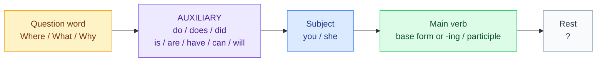

# 1. Questions and negatives

<mark style="color:blue;">**In English, you can't just say "You like pizza?" — you need an auxiliary.**</mark>

&#x20;


**In short**

* **Question** = (question word) + **auxiliary** + **subject** + verb: *Where **do** you live?*
* **Negative** = subject + **auxiliary + not** + verb: *I **don't** live here.*
* No auxiliary in the sentence? Use **do / does / did**.


&#x20;

***

&#x20;

## <mark style="color:purple;">01</mark> · The word order

&#x20;

&#x20;

| Question word | Auxiliary  | Subject   | Verb          | Rest            |
| ------------- | ---------- | --------- | ------------- | --------------- |
| —             | **Do**     | you       | speak         | German?         |
| Where         | **does**   | she       | work?         |                 |
| What          | **did**    | they      | say?          |                 |
| Why           | **are**    | you       | laughing?     |                 |
| How long      | **have**   | you       | lived         | here?           |
| When          | **will**   | the results | be          | published?      |
| —             | **Can**    | I         | use           | your charger?   |

&#x20;


**En français** on peut dire « Tu viens ? » avec juste l'intonation. En anglais, *~~You come?~~* est faux à l'écrit : il faut ***Are** you coming?* ou ***Do** you come here often?*


&#x20;

***

&#x20;

## <mark style="color:purple;">02</mark> · Negatives

&#x20;

| Tense              | Positive                | Negative                          |
| ------------------ | ----------------------- | --------------------------------- |
| Present simple     | She works.              | She **doesn't** (does not) work.  |
| Past simple        | He called.              | He **didn't** (did not) call.     |
| be                 | I'm ready.              | I'm **not** ready.                |
| Present continuous | They're coming.         | They **aren't** coming.           |
| Present perfect    | We've finished.         | We **haven't** finished.          |
| will               | It will work.           | It **won't** work.                |
| can                | I can swim.             | I **can't** (cannot) swim.        |

&#x20;


**Only one negative** — English doesn't use double negatives:

* <mark style="color:red;">~~I don't know nothing.~~</mark> → <mark style="color:green;">I don't know **anything**.</mark> / <mark style="color:green;">I know **nothing**.</mark>
* <mark style="color:red;">~~Nobody didn't come.~~</mark> → <mark style="color:green;">Nobody **came**.</mark>

En français « ne … rien » a deux mots ; en anglais, un seul mot négatif suffit.


&#x20;

***

&#x20;

## <mark style="color:purple;">03</mark> · Question words

&#x20;

| Word            | Français                | Example                                  |
| --------------- | ----------------------- | ---------------------------------------- |
| **What**        | que, quoi, quel         | What do you study?                       |
| **Which**       | lequel, quel (choix limité) | Which laptop did you choose, the Dell or the Mac? |
| **Who**         | qui                     | Who did you meet?                        |
| **Whose**       | à qui                   | Whose phone is this?                     |
| **Where**       | où                      | Where do you live?                       |
| **When**        | quand                   | When does the course start?              |
| **Why**         | pourquoi                | Why are you late? — **Because** the train was late. |
| **How**         | comment                 | How do you spell your name?              |
| **How much**    | combien (non comptable) | How much **money** / How much is it?     |
| **How many**    | combien (comptable)     | How many **students** are there?         |
| **How long**    | combien de temps        | How long does the trip take?             |
| **How often**   | à quelle fréquence      | How often do you go to the gym?          |
| **How old**     | quel âge                | How old are you?                         |
| **What time**   | à quelle heure          | What time is it?                         |

&#x20;

***

&#x20;

## <mark style="color:purple;">04</mark> · Subject questions: no do!

&#x20;

When **who** or **what** is the **subject** (the person who does the action), there is **no do / does / did**.

&#x20;



### who = object → do

&#x20;

*Tom called **someone**. Who?*

&#x20;

→ Who **did** Tom **call**?

&#x20;

(Qui Tom a-t-il appelé ?)



### who = subject → no do

&#x20;

***Someone** called Tom. Who?*

&#x20;

→ Who **called** Tom?

&#x20;

(Qui a appelé Tom ?)



&#x20;

* **What happened?** — <mark style="color:red;">~~What did happen?~~</mark>
* **Who wants** a coffee? — <mark style="color:red;">~~Who does want~~</mark>

&#x20;

***

&#x20;

## <mark style="color:purple;">05</mark> · Short answers

&#x20;

In English, we don't just say "Yes" or "No": we repeat the **auxiliary**.

&#x20;

| Question                       | Short answer                          |
| ------------------------------ | ------------------------------------- |
| **Do** you like jazz?          | Yes, I **do**. / No, I **don't**.     |
| **Is** she German?             | Yes, she **is**. / No, she **isn't**. |
| **Have** you finished?         | Yes, I **have**. / No, I **haven't**. |
| **Did** they win?              | Yes, they **did**. / No, they **didn't**. |
| **Can** you help me?           | Yes, I **can**. / No, I **can't**.    |

&#x20;

***

&#x20;

## <mark style="color:purple;">06</mark> · Question tags (B1)

&#x20;

A small question at the **end** of a sentence, to check or get agreement — like « **n'est-ce pas ?** » or « **hein ?** ».

&#x20;


**Rule**: positive sentence → **negative** tag · negative sentence → **positive** tag. Use the **same auxiliary**.


&#x20;

* You **are** a student, **aren't you**?
* She **works** here, **doesn't she**?
* They **didn't** come, **did they**?
* You**'ve** seen this film, **haven't you**?
* It **won't** rain, **will it**?
* Special: I **am** right, **aren't I**? · **Let's** go, **shall we**?

&#x20;

***

&#x20;

## <mark style="color:purple;">07</mark> · Indirect questions (polite)

&#x20;

After *Can you tell me…? / Do you know…? / I wonder…*, the order becomes **normal** (subject + verb), and there is **no do**.

&#x20;

* Where **is the station**? → Can you tell me where **the station is**?
* What time **does the shop open**? → Do you know what time **the shop opens**?
* **Is** he coming? → I wonder **if** he **is** coming.

&#x20;

***

&#x20;

## <mark style="color:purple;">08</mark> · Exercises

&#x20;

### A. Make questions

&#x20;

1. She lives in Lausanne. (Where…?)

&#x20;

**Where does she live?**

&#x20;

2. They arrived at 9. (When…?)

&#x20;

**When did they arrive?**

&#x20;

3. Someone broke the printer. (Who…?)

&#x20;

**Who broke the printer?** — subject question, no *did*.

&#x20;

4. He has three brothers. (How many…?)

&#x20;

**How many brothers does he have?**

&#x20;

&#x20;

### B. Add the question tag

&#x20;

1. You speak French, ___?

&#x20;

**don't you**

&#x20;

2. He can't swim, ___?

&#x20;

**can he**

&#x20;

3. They went to the party, ___?

&#x20;

**didn't they**

&#x20;

&#x20;

### C. Correct

&#x20;

1. Where you live?

&#x20;

Where **do you** live?

&#x20;

2. Can you tell me where is the library?

&#x20;

Can you tell me where **the library is**?

&#x20;

3. I didn't see nobody.

&#x20;

I didn't see **anybody**. / I saw **nobody**.

&#x20;

&#x20;

***

&#x20;

## <mark style="color:purple;">09</mark> · Key points

&#x20;

* Question: **(QW) + auxiliary + subject + verb**. No auxiliary → **do / does / did**.
* Negative: **auxiliary + not**. Only **one** negative word.
* **Who / What** as subject → no *do*: *Who called?*
* Short answers repeat the auxiliary: *Yes, I do.*
* Tags: positive → negative tag, and vice versa.

&#x20;


**Next page** → [2. Articles and quantifiers](02-articles-et-quantifieurs.md)

