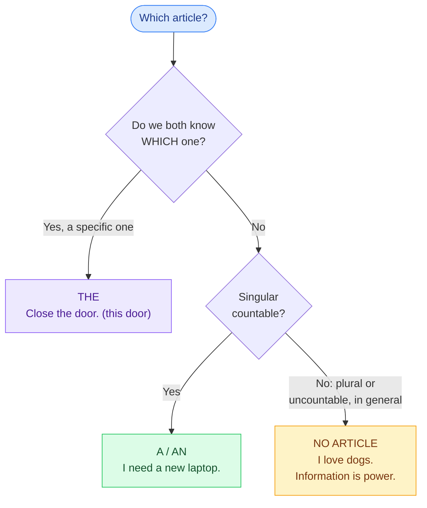

# 2. Articles and quantifiers

<mark style="color:blue;">**Small words, big mistakes: when to say "the", and when to say nothing at all.**</mark>

&#x20;


**In short**

* **a / an** = one thing, not specific · **the** = a specific thing we both know · **no article** = things **in general**.
* **Countable** nouns (*a laptop, two laptops*) vs **uncountable** nouns (*information, software, advice*).
* **many / few** + countable · **much / little** + uncountable · **a lot of / some / any** + both.


&#x20;

***

&#x20;

## <mark style="color:purple;">01</mark> · a or an?

&#x20;

It depends on the **sound**, not the letter.

&#x20;

| **a** + consonant sound             | **an** + vowel sound                   |
| ----------------------------------- | -------------------------------------- |
| **a** laptop, **a** server          | **an** app, **an** error, **an** idea  |
| **a** **u**niversity (/juː/)        | **an** **h**our (h is silent)          |
| **a** **U**SB stick (/juː/)         | **an** **S**QL query (/ɛs/)            |
| **a** European country (/jʊ/)       | **an** honest person                   |

&#x20;

***

&#x20;

## <mark style="color:purple;">02</mark> · a / an, the, or nothing?

&#x20;

&#x20;

* I bought **a** laptop and **a** mouse. **The** laptop is great, but **the** mouse doesn't work. (1st time: *a* → 2nd time: *the*)
* **The** sun, **the** internet, **the** world (only one exists).

&#x20;


**The big difference with French — general ideas: NO article**

En français : « **Les** chats sont mignons », « **La** musique me détend », « J'aime **le** café ». En anglais, quand on parle **en général**, on ne met **pas** d'article :

* <mark style="color:green;">**Cats** are cute.</mark> — <mark style="color:red;">~~The cats are cute.~~</mark> (= ces chats-là précisément)
* <mark style="color:green;">**Music** relaxes me.</mark>
* <mark style="color:green;">I like **coffee**.</mark>
* <mark style="color:green;">**Computer science** is interesting.</mark>


&#x20;

### No article with…

&#x20;

* **languages, school subjects**: *I speak **English**. I study **maths**.*
* **meals**: *We have **lunch** at 12.*
* **most countries and cities**: *in **Switzerland**, in **Fribourg*** — but ***the** USA, **the** UK, **the** Netherlands*
* **go to school / work / bed / university**: *I go to **work** by train.*
* **jobs after "a"**: *She is **an** engineer.* — <mark style="color:red;">~~She is engineer.~~</mark> (en français : « elle est ingénieure », sans article)

&#x20;

***

&#x20;

## <mark style="color:purple;">03</mark> · Countable and uncountable

&#x20;



### Countable

&#x20;

You can **count** them: *one, two, three…*

&#x20;

* a file → two file**s**
* a computer → computer**s**
* a job → job**s**
* a suggestion → suggestion**s**



### Uncountable

&#x20;

**No plural, no a / an.**

&#x20;

* **information** (not ~~informations~~)
* **software, hardware, equipment**
* **advice** (not ~~an advice~~)
* **news, research, homework, work, furniture, luggage, money, water, bread**



&#x20;


**Trap for French speakers** — in French, *informations, conseils, recherches, meubles, bagages* are plural. In English, they are **uncountable**:

* <mark style="color:red;">~~an information / informations~~</mark> → <mark style="color:green;">**some** information / **a piece of** information</mark>
* <mark style="color:red;">~~an advice~~</mark> → <mark style="color:green;">**a piece of** advice / **some** advice</mark>
* The news **is** good. (singular verb!)


&#x20;

***

&#x20;

## <mark style="color:purple;">04</mark> · Quantifiers

&#x20;

| Quantity         | + Countable (plural)         | + Uncountable                 |
| ---------------- | ---------------------------- | ----------------------------- |
| a big quantity   | **many** / **a lot of**      | **much** / **a lot of**       |
| a small quantity (positive idea) | **a few** (quelques) | **a little** (un peu de) |
| not enough (negative idea) | **few** (peu de)   | **little** (peu de)           |
| too much         | **too many**                 | **too much**                  |
| enough           | **enough**                   | **enough**                    |

&#x20;

* **How many** files? — **How much** memory?
* There are **a lot of** bugs in this code. (positive sentence: *a lot of* is more natural than *many*)
* I don't have **much** time. (*much* mostly in questions and negatives)
* I have **a few** friends in Bern. (some, positive) — **Few** people understand this. (almost nobody)

&#x20;

### some or any?

&#x20;

| **some**                                            | **any**                                       |
| --------------------------------------------------- | --------------------------------------------- |
| positive sentences: *I have **some** questions.*    | negatives: *I don't have **any** questions.*  |
| offers and requests: *Would you like **some** tea?* | questions: *Do you have **any** questions?*   |

&#x20;

Same system: **something / anything**, **someone / anyone**, **somewhere / anywhere**. And **no / nothing / nobody** = *not any*.

&#x20;

***

&#x20;

## <mark style="color:purple;">05</mark> · Exercises

&#x20;

1. a or an? ___ hour · ___ user · ___ HTML file · ___ error

&#x20;

**an** hour · **a** user · **an** HTML file (/eɪtʃ/) · **an** error

&#x20;

2. ___ Life is short. / ___ life of Einstein was interesting.

&#x20;

**Life** is short. (general, no article) / **The** life of Einstein (specific).

&#x20;

3. Can you give me an advice?

&#x20;

Can you give me **some advice** / **a piece of advice**?

&#x20;

4. How (much / many) information do you need?

&#x20;

How **much** information — uncountable.

&#x20;

5. There aren't (some / any) tickets left.

&#x20;

**any** — negative.

&#x20;

6. My sister is ___ developer.

&#x20;

**a** developer — jobs need *a / an*.

&#x20;

7. Translate: J'adore les jeux vidéo.

&#x20;

**I love video games.** — general, no article.

&#x20;

&#x20;

***

&#x20;

## <mark style="color:purple;">06</mark> · Key points

&#x20;

* **a / an** depends on the **sound**: *a university, an hour*.
* **General** ideas → **no article**: *I like music.*
* **the** = specific, known, unique.
* Uncountable: *information, advice, software, news, homework* → no plural, no *a*.
* **many / few** + countable · **much / little** + uncountable · **some** (positive) / **any** (negative, question).

&#x20;


**Next page** → [3. Comparatives and superlatives](03-comparatifs-superlatifs.md)

