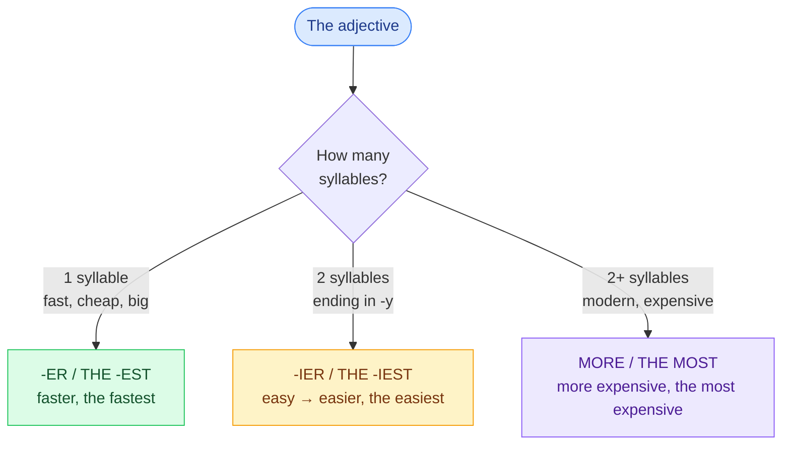

# 3. Comparatives and superlatives

<mark style="color:blue;">**Short adjective → -er / -est. Long adjective → more / most.**</mark>

&#x20;


**In short**

* Comparative: *faster **than***, *more expensive **than*** (plus … que).
* Superlative: ***the** fastest*, ***the** most expensive* (le plus …).
* Equality: *as fast **as*** (aussi … que).


&#x20;

***

&#x20;

## <mark style="color:purple;">01</mark> · Which form?

&#x20;

&#x20;

| Type                              | Adjective   | Comparative         | Superlative              |
| --------------------------------- | ----------- | ------------------- | ------------------------ |
| 1 syllable                        | fast        | fast**er**          | the fast**est**          |
| 1 syllable, ends in **-e**        | large       | larg**er**          | the larg**est**          |
| 1 vowel + 1 consonant             | big         | bi**gg**er          | the bi**gg**est          |
|                                   | hot         | ho**tt**er          | the ho**tt**est          |
| 2 syllables, ends in **-y**       | easy        | eas**ier**          | the eas**iest**          |
|                                   | busy        | bus**ier**          | the bus**iest**          |
| 2+ syllables                      | modern      | **more** modern     | **the most** modern      |
|                                   | reliable    | **more** reliable   | **the most** reliable    |
|                                   | expensive   | **more** expensive  | **the most** expensive   |

&#x20;

***

&#x20;

## <mark style="color:purple;">02</mark> · The irregular ones

&#x20;

| Adjective / adverb | Comparative | Superlative   | Français                  |
| ------------------ | ----------- | ------------- | ------------------------- |
| good / well        | **better**  | **the best**  | bon / bien → meilleur / mieux |
| bad / badly        | **worse**   | **the worst** | mauvais / mal → pire      |
| far                | **further** / farther | **the furthest** | loin → plus loin |
| much / many        | **more**    | **the most**  | beaucoup → plus           |
| little             | **less**    | **the least** | peu → moins               |

&#x20;


**Trap** — <mark style="color:red;">~~more better~~</mark>, <mark style="color:red;">~~more easier~~</mark>, <mark style="color:red;">~~the most fastest~~</mark>: **never** both *more* and *-er*.


&#x20;

***

&#x20;

## <mark style="color:purple;">03</mark> · In a sentence

&#x20;



* An SSD is **faster than** a hard drive.
* Linux is **more secure than** Windows? Maybe!
* My new phone is **better than** my old one.
* This exam was **less difficult than** the last one. (*less* = moins)



* Python is **the most popular** language **in** the world.
* This is **the best** pizza I've **ever** eaten. (superlative + present perfect + ever)
* She is **the youngest of** the group.

&#x20;

**in** + a place or group (*in the class, in Switzerland*) · **of** + a number or period (*of the three, of the year*).



* My laptop is **as fast as** yours. (aussi rapide que)
* This course is**n't as hard as** I thought. (pas aussi … que = moins … que)
* Come **as soon as** possible.



* **much / a lot / far** + comparative = **beaucoup** plus: *It's **much** cheaper.*
* **a bit / slightly** + comparative = un peu plus: *It's **a bit** slower.*
* **the … the …** = plus … plus: ***The more** you practise, **the better** you get.*
* **-er and -er** = de plus en plus: *It's getting **colder and colder**.* / ***more and more** expensive*



&#x20;


**En français** — « plus … **que** » = ***than*** (pas *that* !). *She is taller **than** me.* Et « **de plus en plus** » = *more and more* ou *-er and -er*.


&#x20;

***

&#x20;

## <mark style="color:purple;">04</mark> · Exercises

&#x20;

1. Give the comparative: cheap · big · happy · difficult · good

&#x20;

**cheaper · bigger · happier · more difficult · better**

&#x20;

2. Give the superlative: fast · heavy · interesting · bad

&#x20;

**the fastest · the heaviest · the most interesting · the worst**

&#x20;

3. Zurich is (expensive) Fribourg.

&#x20;

Zurich is **more expensive than** Fribourg.

&#x20;

4. It's (good) film I've ever seen.

&#x20;

It's **the best** film I've ever seen.

&#x20;

5. My code is not (clean) yours. (equality)

&#x20;

My code is not **as clean as** yours.

&#x20;

6. Correct: This task is more easier than the other.

&#x20;

This task is **easier than** the other.

&#x20;

7. Translate: Plus tu t'entraînes, plus tu progresses.

&#x20;

**The more you practise, the more you improve / the better you get.**

&#x20;

&#x20;

***

&#x20;

## <mark style="color:purple;">05</mark> · Key points

&#x20;

* 1 syllable → **-er / the -est** · 2 syllables in -y → **-ier / the -iest** · long → **more / the most**.
* Irregular: **good – better – the best**, **bad – worse – the worst**, **far – further – the furthest**.
* **than** after a comparative · **as … as** for equality.
* Never *more* + *-er* together.

&#x20;


**Next page** → [4. Prepositions of time and place](04-prepositions.md)

