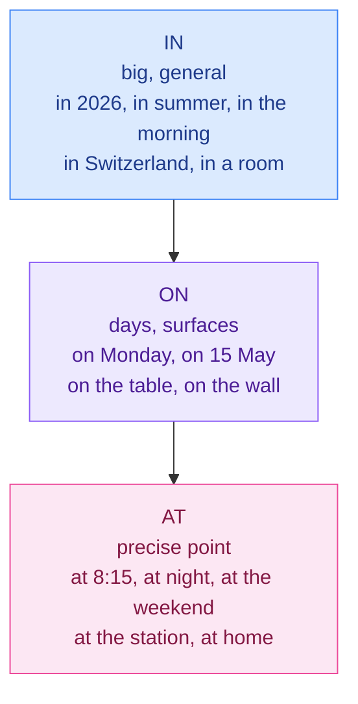

# 4. Prepositions of time and place

<mark style="color:blue;">**in, on, at: from the biggest to the most precise.**</mark>

&#x20;


**In short**

Think of a **pyramid**: **in** for big / general things, **on** for days and surfaces, **at** for precise points.

***in** 2026 → **in** September → **on** Monday → **at** 8:15*


&#x20;

***

&#x20;

## <mark style="color:purple;">01</mark> · The pyramid

&#x20;

&#x20;

***

&#x20;

## <mark style="color:purple;">02</mark> · Time

&#x20;

| Preposition | Used with                                          | Examples                                            |
| ----------- | -------------------------------------------------- | --------------------------------------------------- |
| **in**      | years, months, seasons, centuries, parts of the day | in 2026, in May, in winter, in the 21st century, **in** the morning / afternoon / evening |
| **on**      | days, dates, special days                          | on Monday, on 3 June, on my birthday, on Christmas Day, on Friday morning |
| **at**      | clock times, night, weekend (UK), holidays         | at 10 o'clock, at noon, **at night**, at the weekend, at Christmas |

&#x20;


**No preposition** with *this, next, last, every, tomorrow, yesterday*:

* <mark style="color:red;">~~on next Monday~~</mark> → <mark style="color:green;">**next** Monday</mark>
* <mark style="color:red;">~~in last year~~</mark> → <mark style="color:green;">**last** year</mark>
* <mark style="color:red;">~~at this morning~~</mark> → <mark style="color:green;">**this** morning</mark>


&#x20;

### for, since, during, ago

&#x20;

| Word       | Meaning                               | Example                                    |
| ---------- | ------------------------------------- | ------------------------------------------ |
| **for**    | a duration (pendant, depuis + durée)  | I studied **for** 3 hours. · I've lived here **for** 2 years. |
| **since**  | a starting point (depuis + date)      | I've lived here **since** 2024.            |
| **during** | at some time in a period (pendant + nom) | He fell asleep **during** the lecture.  |
| **ago**    | back from now (il y a) — **after** the time | I arrived two weeks **ago**.         |
| **until / till** | up to a moment (jusqu'à)        | The shop is open **until** 7.              |
| **by**     | not later than (d'ici, au plus tard)  | Send it **by** Friday.                     |

&#x20;


**En français, « pendant » a deux traductions**

* « pendant + **durée** » → **for** : *for two hours*
* « pendant + **un événement** » → **during** : *during the exam, during the summer*

Et « depuis » : **for** + durée, **since** + point de départ (voir [Conjugaison 4](../conjugaison/04-present-perfect.md)).


&#x20;

***

&#x20;

## <mark style="color:purple;">03</mark> · Place

&#x20;



### in

&#x20;

**Inside** something, a closed space or a big area.

&#x20;

* in the room, in a box, in the car
* in Fribourg, in Switzerland
* in the folder, in the file
* in the picture, in the book



### on

&#x20;

On a **surface** or a line.

&#x20;

* on the desk, on the wall, on the floor
* on the screen, on the website, **on** the internet
* on page 5, on the left / right
* on the bus / train / plane



### at

&#x20;

A **point**, a place where an activity happens.

&#x20;

* at the station, at the bus stop
* at home, at work, at school, at university
* at the door, at the top / bottom
* at a party, at a concert



&#x20;


**Transport** — ***on*** the bus / train / plane (big vehicles you can walk in), but ***in*** the car / taxi. And **by** + transport without article: *I go to school **by** train / bus / bike*, but ***on** foot*.


&#x20;

### Other prepositions of place

&#x20;

| Preposition      | Français            | Example                                 |
| ---------------- | ------------------- | --------------------------------------- |
| under            | sous                | The cable is **under** the desk.        |
| above / over     | au-dessus de        | The shelf is **above** the monitor.     |
| next to / beside | à côté de           | Sit **next to** me.                     |
| between          | entre (deux)        | **between** the bank and the café       |
| behind           | derrière            | **behind** the building                 |
| in front of      | devant              | **in front of** the station             |
| opposite         | en face de          | The café is **opposite** the school.    |

&#x20;

### Movement

&#x20;

* **to** (vers un lieu): *I'm going **to** Bern.* — but **go home** (no *to*!)
* **into** (entrer dans): *She walked **into** the room.*
* **out of** (sortir de): *Get **out of** the car.*
* **from … to …** (de … à …): ***from** Fribourg **to** Lausanne*
* **arrive in** a city / country, **arrive at** a building: *We arrived **in** London / **at** the airport.* (never ~~arrive to~~)

&#x20;

***

&#x20;

## <mark style="color:purple;">04</mark> · Exercises

&#x20;

1. ___ 2025 · ___ Tuesday · ___ 7 pm · ___ the evening · ___ night

&#x20;

**in** 2025 · **on** Tuesday · **at** 7 pm · **in** the evening · **at** night

&#x20;

2. I've been waiting ___ 20 minutes.

&#x20;

**for** — duration.

&#x20;

3. She slept ___ the whole film.

&#x20;

**during** (or *through*) — an event.

&#x20;

4. The file is ___ the "Documents" folder.

&#x20;

**in** the folder.

&#x20;

5. I found the information ___ the internet.

&#x20;

**on** the internet.

&#x20;

6. We arrived ___ Geneva ___ midnight.

&#x20;

We arrived **in** Geneva **at** midnight.

&#x20;

7. Correct: I will see you on next Friday.

&#x20;

I will see you **next Friday**. — no preposition before *next*.

&#x20;

&#x20;

***

&#x20;

## <mark style="color:purple;">05</mark> · Key points

&#x20;

* Time: **in** (year, month, season, morning) · **on** (day, date) · **at** (hour, night, weekend).
* No preposition before *this / next / last / every*.
* **for** + duration · **since** + start · **during** + event · **ago** after the time.
* Place: **in** (inside, city, country) · **on** (surface, screen, internet, bus) · **at** (point, home, work, station).

&#x20;


**Next page** → [5. Modal verbs](05-verbes-modaux.md)

