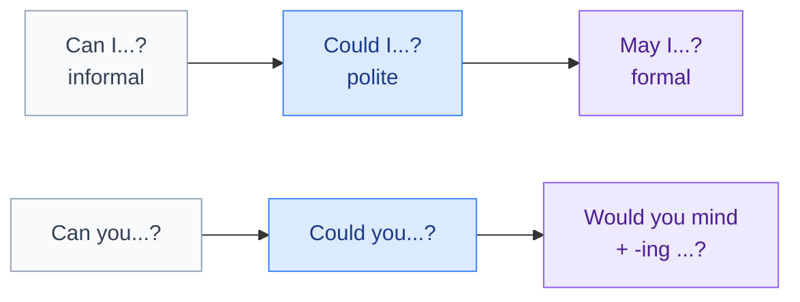

# 5. Modal verbs

<mark style="color:blue;">**Small verbs that change the meaning of the whole sentence: can, must, should, might…**</mark>

&#x20;


**In short**

Modal verbs have **3 special rules**:

1. **No -s** with he / she / it: *she **can** swim* (~~cans~~).
2. Followed by the **base form without "to"**: *you **must go*** (~~must to go~~).
3. **No do** for questions and negatives: ***Can** you…? · I **can't**…*


&#x20;

***

&#x20;

## <mark style="color:purple;">01</mark> · Overview

&#x20;

| Modal                  | Meaning                           | Example                                    | Français             |
| ---------------------- | --------------------------------- | ------------------------------------------ | -------------------- |
| **can**                | ability, permission, possibility  | I **can** code in Java.                    | pouvoir, savoir      |
| **could**              | past ability, polite request, possibility | **Could** you help me?             | pourrais, pouvais    |
| **must**               | strong obligation (from the speaker), deduction | I **must** study tonight.    | devoir               |
| **have to**            | obligation (from outside: rules)  | We **have to** wear a badge.               | être obligé de       |
| **should**             | advice                            | You **should** sleep more.                 | devrais              |
| **may**                | permission (formal), possibility  | **May** I come in?                         | puis-je, il se peut  |
| **might**              | weak possibility                  | It **might** rain later.                   | il se pourrait que   |
| **would**              | conditional, polite request       | **Would** you like a coffee?               | -rais (conditionnel) |
| **will / shall**       | future / offer                    | **Shall** I open the window?               | futur / proposition  |

&#x20;

***

&#x20;

## <mark style="color:purple;">02</mark> · Ability: can, could, be able to

&#x20;

* **Present**: I **can** speak three languages. / I **can't** swim.
* **Past**: When I was 10, I **could** already use a computer.
* **Other tenses** → **be able to**: I**'ll be able to** help you tomorrow. · I **haven't been able to** sleep.

&#x20;

***

&#x20;

## <mark style="color:purple;">03</mark> · Obligation: must, have to, mustn't, don't have to

&#x20;



### must

&#x20;

Obligation that **the speaker** feels.

&#x20;

* I **must** call my mother. (I think it's important)
* You **must** try this restaurant! (strong recommendation)



### have to

&#x20;

Obligation from **outside** (rules, laws, the boss).

&#x20;

* Students **have to** register before 30 September.
* She **has to** work on Saturdays.
* Past: I **had to** wait an hour. (*must* has no past!)



&#x20;


**mustn't ≠ don't have to** — the most important trap of this page

* **mustn't** = it is **forbidden** (interdit) : *You **mustn't** smoke here.*
* **don't have to** = it is **not necessary** (pas obligé) : *You **don't have to** come, it's optional.*

En français, « tu ne dois pas venir » peut vouloir dire les deux. En anglais, il faut choisir !


&#x20;

***

&#x20;

## <mark style="color:purple;">04</mark> · Advice: should, ought to, had better

&#x20;

* You **should** back up your files. (conseil — tu devrais)
* You **shouldn't** use the same password everywhere.
* **Should** I take the job? — What do you think?
* You **ought to** see a doctor. (= should, a bit more formal)
* You**'d better** hurry, or you'll miss the train. (warning — tu ferais mieux de)

&#x20;

**Past advice / regret**: **should have + participle** = « j'aurais dû » : *I **should have** studied more.*

&#x20;

***

&#x20;

## <mark style="color:purple;">05</mark> · Permission and requests

&#x20;

From the least to the most polite:

&#x20;

&#x20;

* **Can I** borrow your pen?
* **Could you** send me the slides, please?
* **May I** ask a question?
* **Would you mind** clos**ing** the door? — No, not at all. (= OK, I'll do it)

&#x20;

***

&#x20;

## <mark style="color:purple;">06</mark> · Probability: must, might, can't

&#x20;

How **sure** are you?

&#x20;

| Certainty | Modal                   | Example                                        |
| --------- | ----------------------- | ---------------------------------------------- |
| ~100 %    | **must**                | The lights are on. He **must** be at home.     |
| ~50 %     | **may / might / could** | He **might** be at the library. I'm not sure.  |
| ~0 %      | **can't**               | He **can't** be at home — I just saw him in town. |

&#x20;


**En français** — *He must be tired* = « Il **doit** être fatigué » (je le déduis), pas une obligation ! Le contraire est ***can't*** (« il ne peut pas être… »), **pas** *mustn't*.


&#x20;

***

&#x20;

## <mark style="color:purple;">07</mark> · Exercises

&#x20;

1. You ___ touch that cable, it's dangerous! (mustn't / don't have to)

&#x20;

**mustn't** — forbidden.

&#x20;

2. Tomorrow is Sunday, so I ___ get up early. (mustn't / don't have to)

&#x20;

**don't have to** — not necessary.

&#x20;

3. You look tired. You ___ go to bed earlier.

&#x20;

**should** — advice.

&#x20;

4. Yesterday I ___ finish my report before 5. (obligation, past)

&#x20;

**had to** — *must* has no past form.

&#x20;

5. Correct: She cans speak Chinese.

&#x20;

She **can** speak Chinese.

&#x20;

6. Correct: You must to register online.

&#x20;

You **must register** online. — no *to* after a modal.

&#x20;

7. He's not answering. He ___ be in a meeting. (I'm not sure)

&#x20;

**might / may / could**

&#x20;

8. Translate: J'aurais dû faire une sauvegarde.

&#x20;

**I should have made a backup.**

&#x20;

&#x20;

***

&#x20;

## <mark style="color:purple;">08</mark> · Key points

&#x20;

* Modal + **base form**, **no to**, **no -s**, **no do**.
* **can / could / be able to** = ability.
* **must** (personal) / **have to** (rules) · **mustn't** = forbidden · **don't have to** = not necessary.
* **should** = advice · **should have + participle** = regret.
* **must** (sure) · **might** (maybe) · **can't** (impossible).

&#x20;


**Next page** → [6. Relative clauses](06-propositions-relatives.md)

