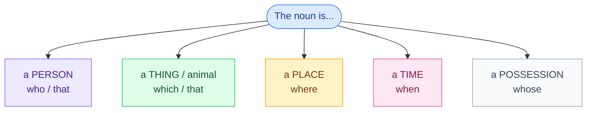

# 6. Relative clauses

<mark style="color:blue;">**Join two sentences into one: "The student who sits next to me is from Bern."**</mark>

&#x20;


**In short**

A relative clause gives **more information** about a noun. It starts with a **relative pronoun**:

* **who** → people · **which** → things · **that** → people or things
* **whose** → possession · **where** → places · **when** → times

En français : **qui, que, dont, où**.


&#x20;

***

&#x20;

## <mark style="color:purple;">01</mark> · The pronouns

&#x20;

&#x20;

| Pronoun   | For               | Example                                                      |
| --------- | ----------------- | ------------------------------------------------------------ |
| **who**   | people            | The teacher **who** teaches us Java is very clear.           |
| **which** | things            | The laptop **which** I bought last year is already slow.     |
| **that**  | people **and** things | The app **that** you recommended is great.              |
| **whose** | possession (dont le/la) | That's the student **whose** laptop was stolen.        |
| **where** | places (où)       | This is the room **where** we have the exam.                 |
| **when**  | times (où, quand) | I remember the day **when** I got my first computer.         |

&#x20;


**Trap for French speakers** — « le jour **où** » = *the day **when*** (not ~~where~~). *where* is only for **places**.


&#x20;

***

&#x20;

## <mark style="color:purple;">02</mark> · When can we omit the pronoun?

&#x20;

Look at what comes **after** the pronoun:

&#x20;



### Pronoun = subject → keep it

&#x20;

The pronoun is followed by a **verb**.

&#x20;

* The man **who called** you is my boss.
* The file **that contains** the passwords.

&#x20;

(= **qui** en français)



### Pronoun = object → you can omit it

&#x20;

The pronoun is followed by a **subject** (+ verb).

&#x20;

* The man (**who**) **you met** is my boss.
* The book (**that**) **I'm reading** is good.

&#x20;

(= **que** en français)



&#x20;

In spoken English, people very often **omit** the object pronoun: *The film **I saw** yesterday was boring.*

&#x20;

***

&#x20;

## <mark style="color:purple;">03</mark> · Defining and non-defining (B1)

&#x20;



The information is **necessary** to know **which** person / thing we mean.

&#x20;

* The students **who passed the exam** can go to the next level. (only those students)
* I lost the key **that opens the server room**.

&#x20;

You can use **that**.



The information is **extra**. Without it, the sentence is still clear.

&#x20;

* My brother, **who lives in Zurich**, is a nurse. (I have one brother)
* Fribourg, **which is a bilingual city**, has a university and a HES.

&#x20;

**Commas** + **who / which** only. **Never that**, and you **can't** omit the pronoun.



&#x20;


**which pour toute une phrase** — *which* peut reprendre **toute l'idée précédente** (« ce qui ») : *He passed all his exams, **which** surprised everyone.* (Il a réussi tous ses examens, ce qui a surpris tout le monde.)


&#x20;

***

&#x20;

## <mark style="color:purple;">04</mark> · Prepositions at the end

&#x20;

In English, the preposition often goes to the **end** of the relative clause:

&#x20;

* This is the project **(that) I'm working on**. (le projet sur lequel je travaille)
* The person **(who) I spoke to** was very kind. (la personne à qui j'ai parlé)

&#x20;

Formal: *The person **to whom** I spoke…* — correct, but rare in everyday English.

&#x20;

***

&#x20;

## <mark style="color:purple;">05</mark> · Exercises

&#x20;

1. The woman ___ lives next door is a doctor.

&#x20;

**who / that** — person, subject.

&#x20;

2. Where is the USB stick ___ I gave you?

&#x20;

**that / which / (nothing)** — object, can be omitted.

&#x20;

3. That's the café ___ we met for the first time.

&#x20;

**where** — place.

&#x20;

4. I have a friend ___ father works at CERN.

&#x20;

**whose** — possession.

&#x20;

5. Join: "Bern is the capital of Switzerland. It is not the biggest city."

&#x20;

**Bern, which is the capital of Switzerland, is not the biggest city.** — non-defining: commas, *which*.

&#x20;

6. Correct: My sister, that works in a bank, is 25.

&#x20;

My sister, **who** works in a bank, is 25. — no *that* with commas.

&#x20;

7. Translate: Je me souviens du jour où j'ai commencé à HEIA.

&#x20;

**I remember the day when I started at HEIA.**

&#x20;

&#x20;

***

&#x20;

## <mark style="color:purple;">06</mark> · Key points

&#x20;

* **who** (people), **which** (things), **that** (both), **whose** (possession), **where** (place), **when** (time).
* Object pronoun (followed by a subject) → can be **omitted**.
* Non-defining = **commas** + **who / which**, never *that*.
* « le jour **où** » = *the day **when***.

&#x20;


**Next page** → [7. The passive voice](07-voix-passive.md)

