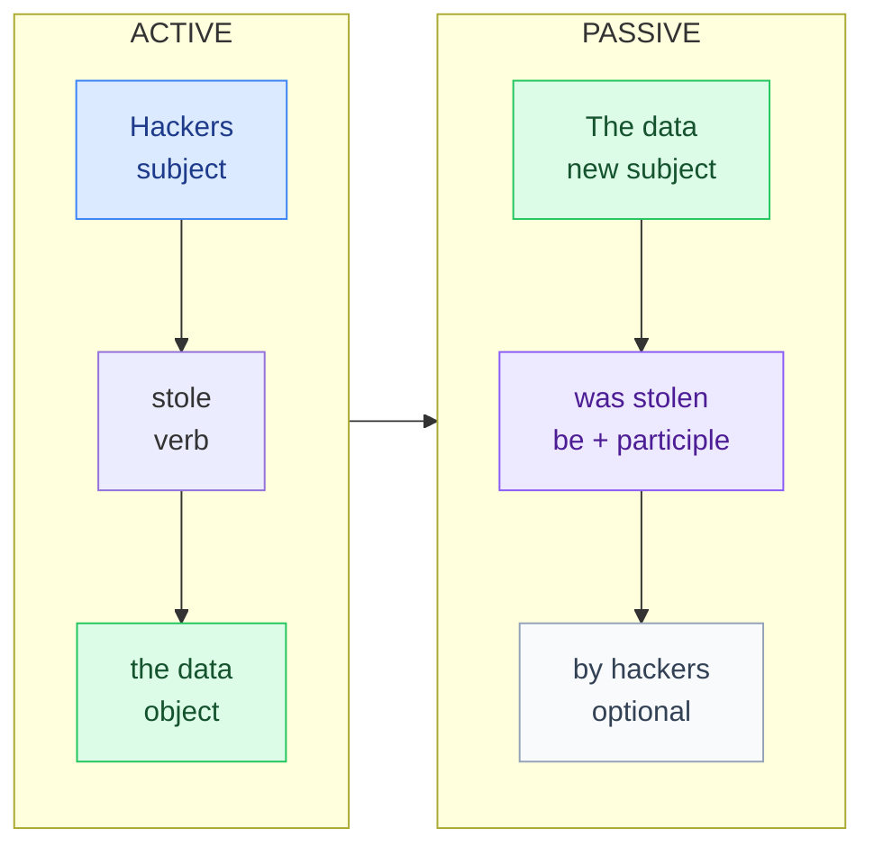

# 7. The passive voice

<mark style="color:blue;">**"Someone deleted the file" → "The file was deleted." The action is more important than the person.**</mark>

&#x20;


**In short**

Passive = **be** (in the right tense) + **past participle**.

We use it when **who** does the action is **unknown**, **not important**, or **obvious**. Very common in technical and scientific texts.


&#x20;

***

&#x20;

## <mark style="color:purple;">01</mark> · From active to passive

&#x20;

&#x20;



### The object becomes the subject

*the data* → ***The data***



### Put "be" in the same tense as the active verb

*stole* (past simple) → ***was***



### Add the past participle

*steal – stole – **stolen*** → *was **stolen***



### Add "by + agent" only if it's important

*…by hackers.*



&#x20;

***

&#x20;

## <mark style="color:purple;">02</mark> · The passive in all the tenses

&#x20;

Only **be** changes. The participle stays the same.

&#x20;

| Tense              | Active                                 | Passive                                       |
| ------------------ | -------------------------------------- | --------------------------------------------- |
| Present simple     | They **make** iPhones in China.        | iPhones **are made** in China.                |
| Present continuous | They **are repairing** the server.     | The server **is being repaired**.             |
| Past simple        | Someone **deleted** the file.          | The file **was deleted**.                     |
| Past continuous    | They **were testing** the app.         | The app **was being tested**.                 |
| Present perfect    | They **have fixed** the bug.           | The bug **has been fixed**.                   |
| Past perfect       | They **had sent** the email.           | The email **had been sent**.                  |
| will               | They **will publish** the results.     | The results **will be published**.            |
| going to           | They **are going to build** a new lab. | A new lab **is going to be built**.           |
| Modal              | You **must wear** a badge.             | A badge **must be worn**.                     |

&#x20;

***

&#x20;

## <mark style="color:purple;">03</mark> · When do we use it?

&#x20;



* My bike **was stolen** last night. (I don't know who)
* This castle **was built** in the 13th century.



* The criminal **was arrested**. (by the police, obviously)
* English **is spoken** in many countries.



Instructions, documentation, reports — the **process** is important, not the person.

&#x20;

* The data **is encrypted** before it **is sent** to the server.
* The results **were analysed** using Python.
* Passwords **should** never **be stored** in plain text.



When the agent is **new or important** information.

&#x20;

* *Hamlet* **was written by** Shakespeare.
* Linux **was created by** Linus Torvalds in 1991.



&#x20;


**En français** on utilise souvent **« on »** là où l'anglais met un passif :

* « **On** parle anglais ici » → *English **is spoken** here.*
* « **On** m'a dit que… » → *I **was told** that…*
* « **On** a volé mon vélo » → *My bike **was stolen**.*


&#x20;

***

&#x20;

## <mark style="color:purple;">04</mark> · Special structures (B1)

&#x20;

* **Verbs with two objects** (*give, send, tell, offer, show*) — the **person** usually becomes the subject:
  * They gave **me** a laptop. → **I was given** a laptop. (on m'a donné)
  * They told **us** the results. → **We were told** the results.
* **It is said / believed / thought that…** (on dit que…):
  * **It is said that** the exam is difficult.
* **have something done** (faire faire) — someone else does it for you:
  * I **had my computer repaired**. (j'ai fait réparer mon ordinateur)
  * She's **having her hair cut** tomorrow.

&#x20;

***

&#x20;

## <mark style="color:purple;">05</mark> · Exercises

&#x20;

1. Passive: Someone cleans the offices every evening.

&#x20;

**The offices are cleaned every evening.**

&#x20;

2. Passive: They built this bridge in 1834.

&#x20;

**This bridge was built in 1834.**

&#x20;

3. Passive: They have cancelled the meeting.

&#x20;

**The meeting has been cancelled.**

&#x20;

4. Passive: The IT team will install the new software.

&#x20;

**The new software will be installed (by the IT team).**

&#x20;

5. Passive: They are updating the website.

&#x20;

**The website is being updated.**

&#x20;

6. Correct: The email was send yesterday.

&#x20;

The email was **sent** yesterday. — participle of *send* = *sent*.

&#x20;

7. Translate: On m'a proposé un stage.

&#x20;

**I was offered an internship.**

&#x20;

8. Translate: J'ai fait réparer mon téléphone.

&#x20;

**I had my phone repaired.**

&#x20;

&#x20;

***

&#x20;

## <mark style="color:purple;">06</mark> · Key points

&#x20;

* Passive = **be** (right tense) + **past participle**.
* The object of the active sentence becomes the subject.
* **by + agent** only if it's useful.
* French **« on »** → often an English passive.
* **have something done** = faire faire.

&#x20;


**Next page** → [8. Reported speech](08-discours-indirect.md)

