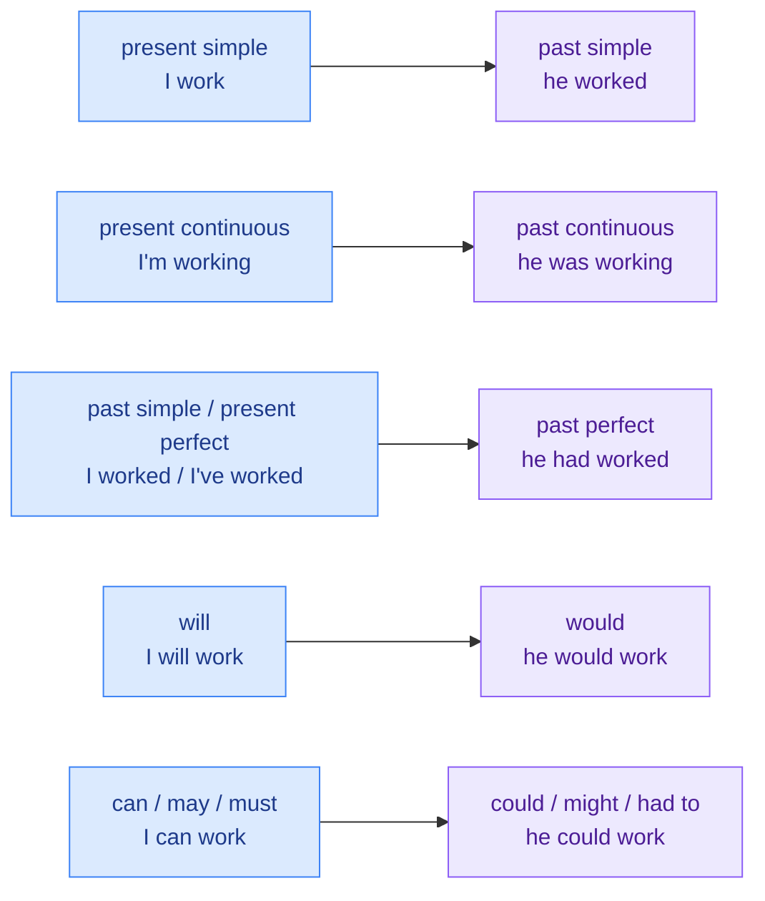

# 8. Reported speech

<mark style="color:blue;">**"I'm tired," she said. → She said (that) she was tired.**</mark>

&#x20;


**In short**

To report what someone said **in the past**, we move the tenses **one step back** into the past (the **backshift**), and we change the pronouns and the time words.

C'est la même chose qu'en français : « Je suis fatiguée » → Elle a dit qu'elle **était** fatiguée.


&#x20;

***

&#x20;

## <mark style="color:purple;">01</mark> · say or tell?

&#x20;



### say (something)

&#x20;

**No person** directly after *say*.

&#x20;

* She **said** (that) she was tired.
* He **said to me** that he was late.



### tell (someone)

&#x20;

*tell* **needs a person** after it.

&#x20;

* She **told me** (that) she was tired.
* He **told us** a story.



&#x20;


**Trap** — <mark style="color:red;">~~She said me~~</mark> → <mark style="color:green;">She **told me**</mark> / <mark style="color:green;">She **said to me**</mark>. <mark style="color:red;">~~He told that…~~</mark> → <mark style="color:green;">He **told me** that… / He **said** that…</mark>


&#x20;

***

&#x20;

## <mark style="color:purple;">02</mark> · The backshift

&#x20;

Each tense goes **one step back** into the past:

&#x20;

&#x20;

| Direct speech                           | Reported speech                                        |
| --------------------------------------- | ------------------------------------------------------ |
| "I **like** Python."                    | He said he **liked** Python.                           |
| "I**'m working** on it."                | She said she **was working** on it.                    |
| "I **finished** the report."            | He said he **had finished** the report.                |
| "I**'ve lost** my phone."               | She said she **had lost** her phone.                   |
| "I**'ll call** you."                    | He said he **would call** me.                          |
| "I **can** help."                       | She said she **could** help.                           |
| "You **must** come."                    | He said I **had to** come.                             |

&#x20;


**No backshift needed** if the situation is **still true** now, or if the reporting verb is in the present:

* "The Earth **is** round." → He said the Earth **is** round. (still true)
* She **says** she **is** tired. (*says* = present → no change)


&#x20;

***

&#x20;

## <mark style="color:purple;">03</mark> · Pronouns, time and place words

&#x20;

The words also change, because the **moment** and the **speaker** are different.

&#x20;

| Direct          | Reported                           |
| --------------- | ---------------------------------- |
| I / my          | he, she / his, her                 |
| now             | then                               |
| today           | that day                           |
| tonight         | that night                         |
| yesterday       | the day before / the previous day  |
| tomorrow        | the next day / the following day   |
| last week       | the week before                    |
| next week       | the following week                 |
| ago             | before                             |
| here            | there                              |
| this            | that                               |

&#x20;

*"I'll send it **tomorrow**," **I** said.* → *I said I would send it **the next day**.*

&#x20;

***

&#x20;

## <mark style="color:purple;">04</mark> · Reported questions

&#x20;

A reported question is **not a question anymore**: normal word order (**subject + verb**), **no do / does / did**, **no question mark**.

&#x20;



Keep the question word.

&#x20;

* "Where **do you live**?" → She asked me where **I lived**.
* "What **are you doing**?" → He asked what **I was doing**.
* "Why **did you leave**?" → They asked why **I had left**.



Add **if** or **whether** (si).

&#x20;

* "**Are** you ready?" → He asked **if** I **was** ready.
* "**Did** you **finish** the exercise?" → The teacher asked **whether** we **had finished** the exercise.



&#x20;


**Trap** — <mark style="color:red;">~~She asked me where did I live.~~</mark> → <mark style="color:green;">She asked me where **I lived**.</mark>


&#x20;

***

&#x20;

## <mark style="color:purple;">05</mark> · Orders and requests

&#x20;

**tell / ask + person + (not) to + base form**

&#x20;

* "**Close** the door." → She **told me to close** the door.
* "**Don't touch** the server." → He **told us not to touch** the server.
* "**Can you help** me, please?" → She **asked me to help** her.

&#x20;

Other useful reporting verbs: *explain, reply, promise (to), suggest, advise (someone to), remind (someone to), warn (someone not to)*.

&#x20;

***

&#x20;

## <mark style="color:purple;">06</mark> · Exercises

&#x20;

1. "I'm hungry," said Tom.

&#x20;

**Tom said (that) he was hungry.**

&#x20;

2. "We will finish the project tomorrow," they said.

&#x20;

**They said (that) they would finish the project the next day.**

&#x20;

3. "I have never been to Italy," she told me.

&#x20;

**She told me (that) she had never been to Italy.**

&#x20;

4. "Where is the lab?" he asked.

&#x20;

**He asked where the lab was.**

&#x20;

5. "Do you speak German?" she asked me.

&#x20;

**She asked me if / whether I spoke German.**

&#x20;

6. "Don't forget your badge," the teacher said to us.

&#x20;

**The teacher told us not to forget our badge(s).**

&#x20;

7. Correct: He said me that he was late.

&#x20;

He **told me** that he was late. / He **said** that he was late.

&#x20;

&#x20;

***

&#x20;

## <mark style="color:purple;">07</mark> · Key points

&#x20;

* **say** (something) / **tell** (someone).
* **Backshift**: present → past, past / present perfect → past perfect, will → would, can → could, must → had to.
* Change pronouns and time words: *tomorrow → the next day, here → there*.
* Reported questions: **subject + verb**, **if / whether** for yes / no questions, no *do*.
* Orders: **tell / ask someone (not) to + verb**.

&#x20;


**End of the grammar part.** Go back to the [course home page](../anglais.md) or test your tenses with the [conjugation exercises](../conjugaison/09-exercices-conjugaison.md).

