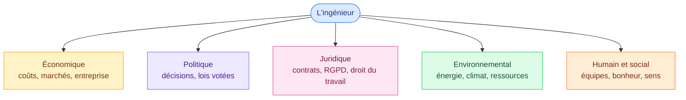

# 1. L'esprit du cours

<mark style="color:blue;">**Un technicien applique. Un ingénieur comprend — y compris le monde économique autour de lui.**</mark>

&#x20;


**En bref**

Le cours est une **culture générale d'entreprise, non technique**. Le but : te donner une **vision transversale** (économie, politique, droit, environnement, humain) pour que tu comprennes ton environnement de travail, que tu saches **reconstituer** les notions de base, et que tu développes une « **agilité économique** ».


&#x20;

***

&#x20;

## <mark style="color:purple;">01</mark> · Technicien ou ingénieur ?

&#x20;

C'est **la** comparaison qui justifie tout le cours.

&#x20;

| Technicien                    | Ingénieur                        |
| ----------------------------- | -------------------------------- |
| **Applique**                  | **Comprend**                     |
| **Identifie** des problèmes   | **Résout** des problèmes         |
| Suit une **procédure**        | S'**adapte**                     |
| Vision **monoculaire** (un seul domaine) | Vision **transversale** (plusieurs domaines) |
| **Déontologie** (règles du métier) | **Éthique** (se demander ce qui est juste) |

&#x20;


**Analogie** — le technicien, c'est le mécanicien qui répare parfaitement un moteur. L'ingénieur, c'est celui qui se demande aussi : *combien ça coûte ? qui va l'acheter ? est-ce légal ? est-ce que ça pollue ? est-ce qu'on devrait le construire ?* L'économie fait partie de ces questions.


&#x20;

***

&#x20;

## <mark style="color:purple;">02</mark> · La vision transversale

&#x20;

Un ingénieur **comprend, analyse, anticipe**. Pour ça, il doit comprendre tout ce qui entoure son travail technique :

&#x20;

&#x20;

***

&#x20;

## <mark style="color:purple;">03</mark> · Les objectifs du cours

&#x20;



* Comprendre les notions d'**économie, finance, comptabilité, marketing, ressources humaines**…
* Savoir les **reconstituer** soi-même (comprendre plutôt que réciter).
* Développer des **réflexes** : l'« **agilité économique** ».



Réussir en entreprise (réussite **sociale**, **professionnelle**), mais aussi réussir sa vie (**personnelle**). Le prof aborde donc des sujets variés :

&#x20;

* savoir-être, intelligence sociale, apparence, personnalité ;
* **biais cognitifs**, prise de décision, métacognition (« maîtriser sa pensée ») ;
* rapport au travail : procrastination, perte de sens, burn-out ;
* **distinction entre besoin et envie**, éducation financière ;
* gouvernance, jeux de pouvoir, géopolitique…



Comprendre aussi les **aberrations du système économique actuel** (néolibéral) : selon le prof, **la réalité physique** (énergie, ressources, climat) **n'est pas compatible** avec l'idée d'une croissance sans fin. C'est tout le sujet des pages 3 et 4.



&#x20;


**Un « Pareto-cours »** — le principe de **Pareto** (dit « 80/20 ») : **20 % des efforts donnent 80 % du résultat**. Le cours vise donc **l'essentiel utile**, pas l'exhaustivité. Et pour aller plus loin : **suis l'actualité** et parles-en en classe.


&#x20;

***

&#x20;

## <mark style="color:purple;">04</mark> · Les cinq avertissements du prof

&#x20;



### Dire ≠ approuver

&#x20;

Ce n'est pas parce que le prof **décrit** quelque chose qu'il le **trouve bien**. Exemple : « votre sourire sur le CV compte plus que vos notes » (l'**effet de halo** : une seule qualité visible, comme l'apparence, influence tout le jugement). C'est un **constat**, pas un conseil moral.



### Le plan n'est pas linéaire

&#x20;

Comme des **poupées russes** ou un **oignon** : les sujets s'emboîtent en couches et reviennent.



### Pas de recette miracle

&#x20;

Méfie-toi des « 10 conseils pour réussir sa startup ». L'économie, « **c'est pas si simple** ». Attention à l'**effet Dunning-Kruger** : **moins on connaît un sujet, plus on croit le maîtriser**.



### Des avis personnels

&#x20;

Le prof donne parfois son avis. Tu peux ne pas être d'accord → **interviens**, le cours sera plus intéressant.



### Les histoires qui reviennent

&#x20;

« Dites-moi si je vous ai déjà raconté cette histoire ! »



&#x20;

***

&#x20;

## <mark style="color:purple;">05</mark> · Les règles pratiques

&#x20;



**En classe**

* **Ordinateurs fermés**.
* Absences : à annoncer **avant**.
* Communication de base via **Teams**.
* Les supports arrivent sur Teams **après** les cours.



**Pour bien retenir**

* Tu n'es **pas multitâche** : une chose à la fois.
* Pendant les pauses : **lève-toi, aère-toi**.
* Notes **sur papier**, seulement **l'important**.
* Juste après le cours : **2 à 5 points à retenir**.



&#x20;


**Les slides ne sont pas un script** — ce sont des supports de discours. Ne compte pas tout comprendre après coup avec seulement le PDF : **ta présence et tes notes** sont indispensables.


&#x20;

***

&#x20;

## <mark style="color:purple;">06</mark> · Mini-quiz

&#x20;

1. Cite trois différences entre un technicien et un ingénieur.

&#x20;

Au choix : le technicien **applique** / l'ingénieur **comprend** ; **identifie** / **résout** les problèmes ; **procédure** / **adaptation** ; vision **monoculaire** / **transversale** ; **déontologie** / **éthique**.

&#x20;

2. Que veut dire « vision transversale » ?

&#x20;

Voir un problème **sous plusieurs angles à la fois** (économique, politique, juridique, environnemental, humain), et pas seulement sous l'angle technique.

&#x20;

3. Pourquoi parle-t-on d'un « Pareto-cours » ?

&#x20;

Selon le **principe de Pareto** (80/20), une petite partie des efforts produit la plus grande partie du résultat. Le cours se concentre sur **l'essentiel utile** plutôt que sur tous les détails.

&#x20;

4. Qu'est-ce que l'effet Dunning-Kruger ?

&#x20;

Un **biais cognitif** : **moins on connaît un sujet, plus on a tendance à surestimer ses connaissances**. Les vrais experts, eux, savent que « c'est pas si simple ».

&#x20;

5. Qu'est-ce que l'effet de halo ? Donne un exemple.

&#x20;

Une **seule caractéristique visible** (ex. l'apparence physique, un sourire sur la photo du CV) **influence tout le jugement** qu'on porte sur une personne (on la croit aussi plus compétente, plus sympathique…).

&#x20;

&#x20;


**Page suivante** → [2. L'argent, c'est éthique ?](02-argent-et-ethique.md)

