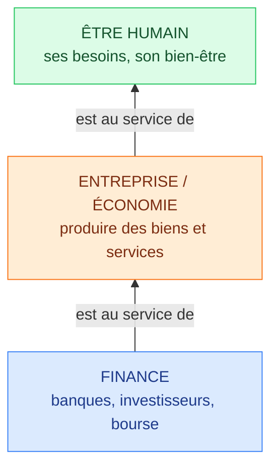
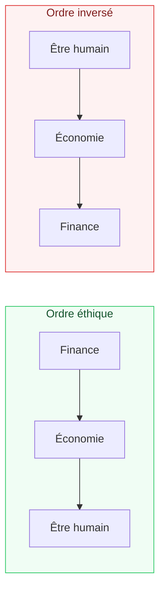

# 2. L'argent, c'est éthique ?

<mark style="color:blue;">**L'argent n'est ni bon ni mauvais. Tout dépend de qui sert qui.**</mark>

&#x20;


**En bref**

Trois acteurs : l'**être humain**, l'**entreprise** (l'économie) et la **finance**. Il existe un **ordre éthique** entre eux :

**La finance est au service de l'économie, et l'économie est au service de l'être humain.**

Quand cet ordre s'**inverse** (l'humain au service de la finance), on a un problème éthique.


&#x20;

***

&#x20;

## <mark style="color:purple;">01</mark> · Les trois étages

&#x20;

Imagine une **pyramide à l'envers** : chaque étage existe pour servir celui du dessus.

&#x20;

&#x20;

| Étage           | Son rôle (« à quoi il sert »)                                                        |
| --------------- | ------------------------------------------------------------------------------------ |
| **Être humain** | C'est **le but**. Tout le reste n'existe que pour lui.                               |
| **Économie**    | Produire ce dont les humains ont besoin : nourriture, logement, soins, logiciels…    |
| **Finance**     | Fournir l'**argent** (le carburant) pour que les entreprises puissent fonctionner.   |

&#x20;


**Analogie** — la finance, c'est l'**essence** ; l'entreprise, c'est la **voiture** ; l'être humain, c'est le **passager** qui veut aller quelque part. L'essence sert la voiture, qui sert le passager. Personne n'achète une voiture pour « faire tourner de l'essence »… et pourtant, c'est parfois ce que fait l'économie quand la finance devient le but.


&#x20;

***

&#x20;

## <mark style="color:purple;">02</mark> · Quand l'ordre s'inverse

&#x20;

L'argent devient **non éthique** quand un étage du bas prend le pouvoir sur celui du haut.

&#x20;

&#x20;

**Exemples d'inversion :**

* Une entreprise **rentable** licencie des employés **uniquement** pour augmenter les dividendes des actionnaires → l'humain sert la finance.
* Un réseau social conçu pour **capter ton attention** le plus longtemps possible afin de vendre de la publicité → tu deviens le **produit**, pas le client.
* Une banque qui spécule sur le prix de la nourriture → la finance ne sert plus l'économie réelle.

&#x20;

**Exemples d'ordre respecté :**

* Une banque prête de l'argent à une PME pour qu'elle construise une usine → la finance sert l'économie.
* L'usine produit des panneaux solaires, crée des emplois → l'économie sert l'humain.

&#x20;

***

&#x20;

## <mark style="color:purple;">03</mark> · Ce que disent les salaires

&#x20;

Le cours montre le **salaire médian mensuel brut par branche** en Suisse (Office fédéral de la statistique, 2022).

&#x20;


**Salaire médian** — le salaire du « milieu » : **la moitié des gens gagnent moins, l'autre moitié gagnent plus**. On l'utilise plutôt que la moyenne car il n'est pas faussé par quelques très hauts salaires.


&#x20;

| Branche                    | Salaire médian (CHF / mois) |
| -------------------------- | --------------------------- |
| Services à la personne     | 4 384                       |
| Hébergement                | 4 572                       |
| Restauration               | 4 601                       |
| Commerce de détail         | 5 095                       |
| Construction               | 6 410                       |
| <mark style="color:orange;">**Salaire médian suisse**</mark> | <mark style="color:orange;">**6 788**</mark> |
| Transport aérien           | 6 980                       |
| Industrie des machines     | 7 245                       |
| Commerce de gros           | 7 414                       |
| <mark style="color:blue;">**Activités informatiques**</mark> | <mark style="color:blue;">**9 412**</mark> |
| Industrie pharmaceutique   | 10 296                      |
| Banques                    | 10 491                      |
| Industrie du tabac         | 13 299                      |

&#x20;

**Ce qu'il faut remarquer :**

* Les métiers **au contact direct des humains** (soins à la personne, restauration) sont **les moins payés**.
* L'**industrie du tabac** — qui produit quelque chose de **nocif** — est **la mieux payée**.
* La **finance** (banques) est tout en haut, alors qu'elle devrait être « au service ».
* L'**informatique** est bien placée : tu es du côté favorisé.

&#x20;


**La question éthique** — le salaire mesure ce que le **marché** est prêt à payer, **pas l'utilité sociale** d'un métier. Un salaire élevé ne veut pas dire « ce métier est plus utile à la société ».


&#x20;

***

&#x20;

## <mark style="color:purple;">04</mark> · Exercices

&#x20;

1. Dans quel ordre éthique se placent l'être humain, l'économie et la finance ?

&#x20;

**La finance est au service de l'économie, et l'économie est au service de l'être humain.** L'être humain est le but ; la finance est l'outil.

&#x20;

2. Donne un exemple où cet ordre est inversé.

&#x20;

Par exemple : une entreprise qui fait des bénéfices mais **licencie** pour augmenter la **valeur de l'action** → les humains servent la finance au lieu de l'inverse.

&#x20;

3. Pourquoi utilise-t-on le salaire médian plutôt que le salaire moyen ?

&#x20;

Parce que la **moyenne** est tirée vers le haut par quelques **très hauts salaires** (ex. patrons). Le **médian** coupe la population en deux moitiés égales : il représente mieux la personne « typique ».

&#x20;

4. Qu'est-ce qui choque dans le classement des salaires par branche ?

&#x20;

Les métiers **utiles et humains** (services à la personne, restauration) sont **les moins bien payés**, tandis que l'**industrie du tabac** (nocive) et les **banques** (finance) sont **les mieux payées**. Le salaire reflète le marché, pas l'utilité sociale.

&#x20;

5. Analogie : si la finance est l'essence et l'entreprise la voiture, qui est l'être humain ?

&#x20;

Le **passager** : c'est pour lui que la voiture roule. L'essence n'est qu'un moyen.

&#x20;

&#x20;


**Page suivante** → [3. La croissance permanente](03-croissance-permanente.md)

