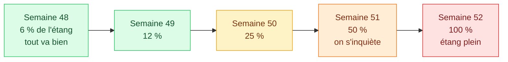
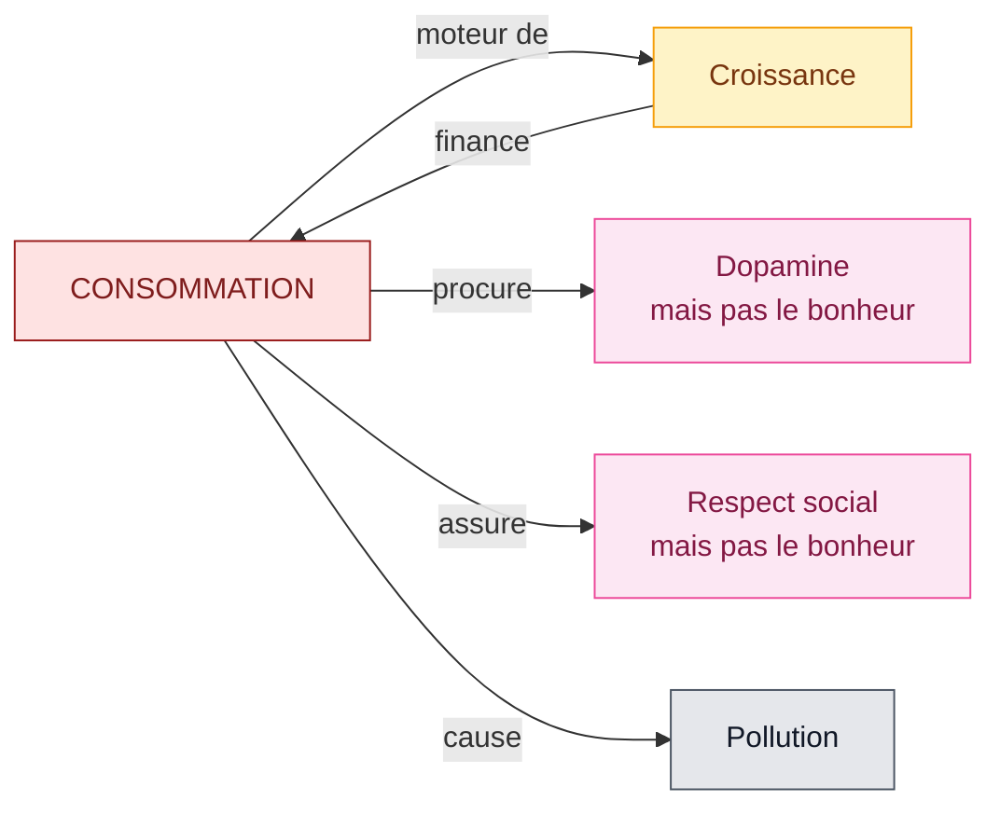
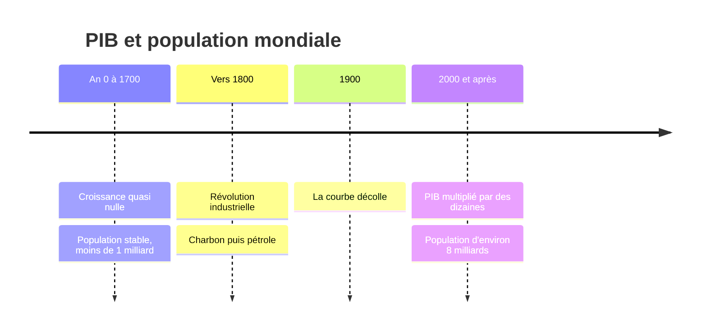
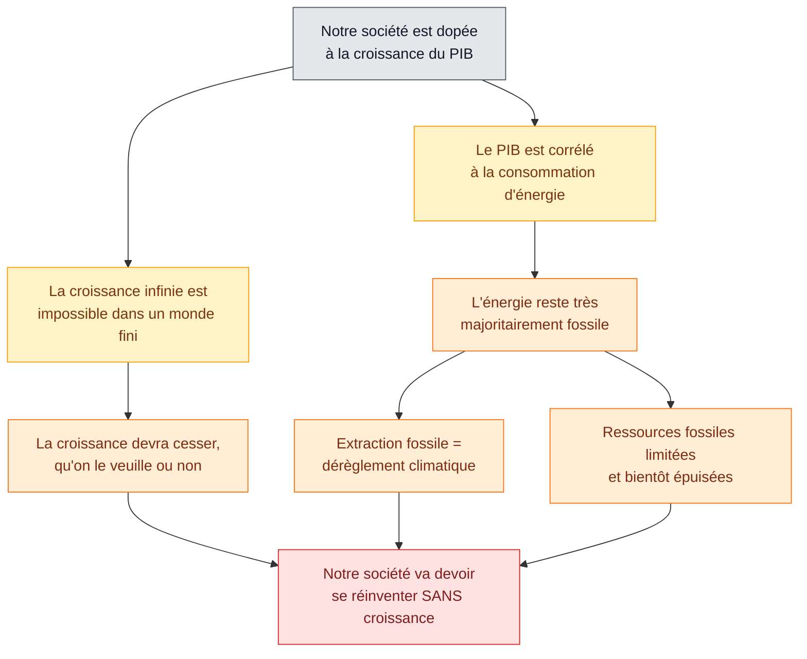

# 3. La croissance permanente

<mark style="color:blue;">**Une croissance infinie dans un monde fini, c'est impossible. La vraie question : qu'est-ce qu'on fait quand elle s'arrête ?**</mark>

&#x20;


**En bref**

* La **croissance économique** = l'augmentation du **PIB** d'une année à l'autre (en %).
* Une croissance de quelques % par an est **exponentielle** : elle **double** régulièrement, et devient vite gigantesque.
* Le PIB est **lié à l'énergie**, et l'énergie est surtout **fossile** → climat + ressources limitées.
* Réponse du cours : la croissance permanente est-elle possible ? <mark style="color:red;">**NON**</mark>. Est-ce grave ? <mark style="color:orange;">**Oui… si on ne s'y prépare pas.**</mark>


&#x20;

***

&#x20;

## <mark style="color:purple;">01</mark> · Les mots de base : PIB et croissance

&#x20;

| Terme                     | Définition simple                                                                                      |
| ------------------------- | ------------------------------------------------------------------------------------------------------ |
| **PIB** (Produit Intérieur Brut) | La **valeur de tout ce qui est produit** (biens et services) dans un pays **en une année**. C'est la « taille » de l'économie. |
| **Croissance économique** | L'**augmentation du PIB** par rapport à l'année précédente, exprimée en **%**.                          |
| **Ordre de grandeur**     | Ces dernières décennies : environ **2 à 3 % par an** au niveau mondial (pas 20 % !).                    |

&#x20;


**Analogie** — le PIB, c'est comme le **chiffre d'affaires d'un pays entier**. La croissance, c'est de combien ce chiffre a augmenté cette année.


&#x20;

***

&#x20;

## <mark style="color:purple;">02</mark> · L'énigme des nénuphars

&#x20;

> Le **1er janvier**, il y a **1 nénuphar** dans l'étang. **Chaque semaine**, le nombre de nénuphars **double**. Combien y en aura-t-il le soir du **31 décembre** ?

&#x20;

Le cours compare trois façons de répondre :

&#x20;



« Ça double chaque semaine → ça va continuer → **tant mieux** ! La main invisible va exploiter cette richesse et le monde ira mieux. »

&#x20;

<mark style="color:red;">**Problème**</mark> : il ne se demande jamais s'il y a une **limite**.



« Ça double toutes les semaines → après **52 semaines** : n = **2⁵²**. »

&#x20;

<mark style="color:orange;">**Juste mathématiquement**</mark>, mais il applique la formule sans regarder la réalité.



« **Ça dépend de la taille de l'étang.** »

&#x20;

2⁵² ≈ **4 500 000 000 000 000** nénuphars (4,5 millions de milliards). Avec 15 cm de diamètre chacun, ça couvre environ **80 millions de km²**, soit **~2 000 fois la Suisse** (et plus que la moitié des terres émergées de la planète).

&#x20;

<mark style="color:green;">**La bonne réponse**</mark> : il **confronte le calcul à la réalité physique**. L'étang sera plein bien avant.



&#x20;


**Le piège de l'exponentielle** — si l'étang est plein à la semaine 52, il était **à moitié plein à la semaine 51**, et **seulement au quart** à la semaine 50. Tout semble aller bien… jusqu'aux toutes dernières semaines. On ne voit le problème **que quand il est trop tard**.


&#x20;

&#x20;

***

&#x20;

## <mark style="color:purple;">03</mark> · Même 3 % par an, c'est une exponentielle

&#x20;

Une croissance de **x % par an**, c'est comme des **intérêts composés** : chaque année, on multiplie par (1 + x %).

&#x20;


**La règle de 70** (astuce de calcul mental) : le temps pour **doubler** ≈ **70 ÷ taux de croissance**.

* à **2 %** par an → double en **35 ans**
* à **3 %** par an → double en **~23 ans**
* à **7 %** par an → double en **10 ans**


&#x20;

**Exemple (question d'examen)** : si l'économie mondiale croît de **3 % par an**, combien produira-t-elle dans **100 ans** ?

&#x20;

* Sur la calculatrice : **1,03 ^ 100 ≈ 19**
* Avec la règle de 70 : ~4 doublements en 100 ans → 2⁴ = **16**, donc **environ 15 à 20 fois plus** qu'aujourd'hui.
* À 2 % : 1,02 ^ 100 ≈ **7 fois plus**.

&#x20;

**Question à se poser en ingénieur** : a-t-on **20 fois plus** de matières premières, d'énergie et d'espace pour absorber la pollution ? <mark style="color:red;">**Non.**</mark>

&#x20;

***

&#x20;

## <mark style="color:purple;">04</mark> · Pourquoi on veut toujours plus : la dopamine

&#x20;



### L'expérience d'Olds et Milner (1954)

&#x20;

Des chercheurs placent une électrode dans le **circuit de la récompense** du cerveau d'un rat. En appuyant sur un levier, le rat se donne du **plaisir** (libération de **dopamine**). Résultat : il appuie **sans arrêt**, au point d'**oublier de manger**.



### Chez l'humain, c'est pareil

&#x20;

Le même mécanisme fonctionne avec la drogue… mais aussi avec un **nouvel iPhone**, le **scroll sur smartphone**, un **week-end easyJet** à Barcelone. On cherche le prochain « shot » de plaisir.



### Le cerveau des jeunes est plus exposé

&#x20;

Le **striatum** (centre de la récompense, « l'accélérateur ») se développe **tôt**. Le **cortex préfrontal** (contrôle, raison, « le frein ») mûrit **lentement**, jusqu'à ~25 ans. Chez l'adolescent, l'accélérateur est plus fort que le frein.



&#x20;

**Le cercle de la consommation :**

&#x20;

&#x20;

La consommation **fait tourner** la croissance, et la croissance **finance** encore plus de consommation : c'est une **boucle**. Elle nous donne du plaisir (dopamine) et un statut (respect social)… mais **pas le bonheur**, et elle **pollue**.

&#x20;

***

&#x20;

## <mark style="color:purple;">05</mark> · Une explosion très récente

&#x20;

Pendant presque toute l'histoire humaine, le **PIB mondial** et la **population** sont restés **presque plats**. Puis, en ~200 ans, ils ont **explosé**.

&#x20;

&#x20;

**Grâce à quoi ?** Espérance de vie, nourriture suffisante, baisse de la mortalité infantile… tout ça a été rendu possible par l'**énergie abondante et bon marché** : les **énergies fossiles** (charbon, pétrole, gaz).

&#x20;


**Analogie** — les énergies fossiles, c'est comme un **héritage** gigantesque trouvé dans le grenier. On vit très bien en le dépensant… mais il n'est pas renouvelable, et le dépenser **pollue** la maison.


&#x20;

***

&#x20;

## <mark style="color:purple;">06</mark> · Le raisonnement complet (à savoir refaire)

&#x20;

&#x20;

Le prof ajoute : et ça ne se fera **sans doute pas dans la joie et la bonne humeur**.

&#x20;

***

&#x20;

## <mark style="color:purple;">07</mark> · Les références à connaître

&#x20;



Ingénieur français, spécialiste **énergie-climat** (fondateur de Carbone 4 et du think tank The Shift Project).

&#x20;

**Ses idées principales :**

* **Pas de croissance sans énergie**, et **pas d'énergie** (aujourd'hui) **sans CO₂** : environ 80 % de l'énergie mondiale est fossile.
* Donc : **« CO₂ ou PIB, il faut choisir »** (titre de sa conférence à Sciences Po, 2019, à visionner pour le cours).
* Il vulgarise ces idées dans la BD **« Le Monde sans fin »** (avec Christophe Blain).

&#x20;

**Est-ce crédible ?** Oui sur le fond : son raisonnement s'appuie sur la **physique** (conservation de l'énergie) et des **données** publiques. On peut discuter certaines de ses **positions** (ex. son soutien fort au nucléaire, son scepticisme sur les renouvelables), mais le lien énergie → PIB → CO₂ est largement admis.



* **Le Club de Rome** : un groupe de réflexion fondé en **1968**, qui réunit des scientifiques, économistes, industriels et hauts fonctionnaires préoccupés par l'avenir de la planète.
* **Le rapport Meadows** (**1972**), en anglais *« The Limits to Growth »* (« Les limites à la croissance ») : commandé par le Club de Rome à une équipe du **MIT** (Dennis et Donella Meadows). Ils ont simulé sur ordinateur l'évolution du monde (population, industrie, nourriture, ressources, pollution).
* **Conclusion** : si la croissance continue au même rythme, le système **s'effondre au cours du XXIe siècle** à cause des **ressources limitées** et de la **pollution**.

&#x20;

**Lien avec Jancovici** : même message, 50 ans d'écart. Meadows montrait les **limites physiques** de la croissance ; Jancovici montre **concrètement** pourquoi, par l'**énergie** et le **climat**.



&#x20;

***

&#x20;

## <mark style="color:purple;">08</mark> · Exercices

&#x20;

1. Définis la croissance économique.

&#x20;

C'est l'**augmentation du PIB** (la valeur de tout ce qui est produit dans un pays en un an) **par rapport à l'année précédente**, exprimée en **pourcentage**.

&#x20;

2. Quelle est la réponse du « bon ingénieur » à l'énigme des nénuphars, et pourquoi ?

&#x20;

« **Ça dépend de la taille de l'étang.** » Parce qu'il confronte le calcul (2⁵²) à la **réalité physique** : aucune croissance exponentielle ne peut continuer dans un espace **limité**.

&#x20;

3. Si l'étang est plein à la semaine 52, quand était-il à moitié plein ?

&#x20;

À la **semaine 51**. C'est le piège de l'exponentielle : le problème devient visible **juste avant la fin**.

&#x20;

4. Avec la règle de 70, en combien de temps une économie qui croît de 2 % par an double-t-elle ?

&#x20;

70 ÷ 2 = **35 ans**.

&#x20;

5. À 3 % par an, combien produira-t-on dans 100 ans ? Que taperais-tu sur la calculatrice ?

&#x20;

**1,03 ^ 100 ≈ 19** → environ **20 fois plus** qu'aujourd'hui. (Vérification mentale : doublement tous les ~23 ans → ~4 doublements → ×16.)

&#x20;

6. Qu'a montré l'expérience d'Olds et Milner, et quel lien avec l'économie ?

&#x20;

Un rat qui peut stimuler son **circuit de la récompense** (dopamine) le fait **sans arrêt**, jusqu'à oublier de manger. Lien : la **consommation** (nouveau smartphone, voyages…) active le même circuit → on en veut **toujours plus**, ce qui alimente la **croissance**.

&#x20;

7. La consommation apporte-t-elle le bonheur selon le cours ?

&#x20;

**Non** : elle procure de la **dopamine** (plaisir court) et du **respect social** (statut), **mais pas le bonheur**. Et elle cause de la **pollution**.

&#x20;

8. Pourquoi le PIB est-il lié à l'énergie ?

&#x20;

Parce que **produire** quoi que ce soit (transformer, transporter, fabriquer) **demande de l'énergie**. Plus d'énergie = plus de machines au travail = plus de production. Et comme cette énergie est surtout **fossile**, plus de PIB = plus de **CO₂**.

&#x20;

9. Qu'est-ce que le Club de Rome et le rapport Meadows ?

&#x20;

* **Club de Rome** : groupe de réflexion international fondé en **1968**.
* **Rapport Meadows** (1972, « The Limits to Growth ») : étude du **MIT** commandée par le Club de Rome, qui a simulé l'évolution du monde et conclu que la croissance **ne peut pas continuer** indéfiniment à cause des **ressources limitées** et de la **pollution**.

&#x20;

10. Résume le raisonnement complet du cours en 3 phrases.

&#x20;

1. Notre société dépend de la **croissance du PIB**, mais une croissance infinie est **impossible dans un monde fini**.
2. Le PIB dépend de l'**énergie**, qui est surtout **fossile** → **dérèglement climatique** et **épuisement des ressources**.
3. Donc la croissance **devra s'arrêter** et la société devra **se réinventer sans croissance**.

&#x20;

&#x20;


**Page suivante** → [4. Sobriété et bonheur](04-sobriete-et-bonheur.md)

