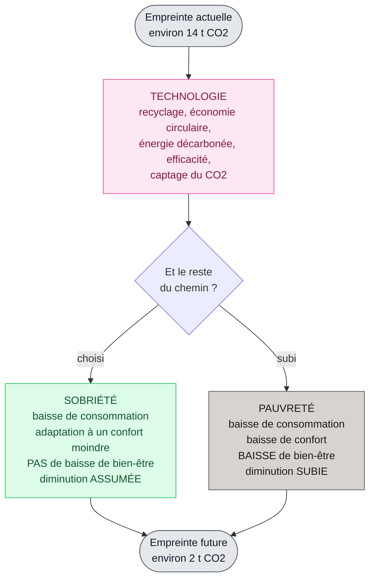
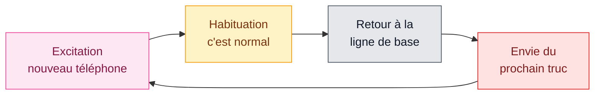
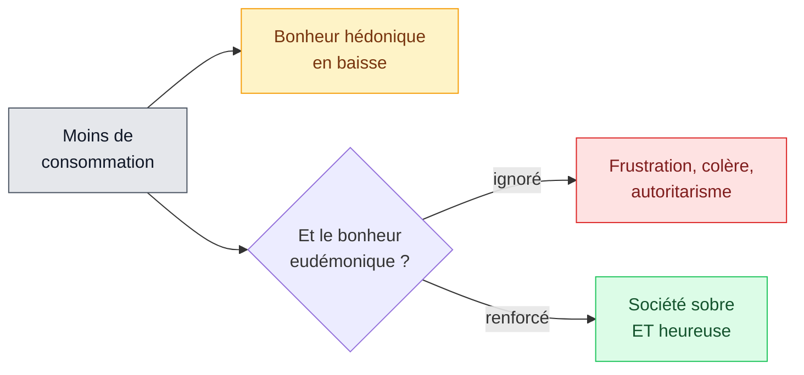

# 4. Sobriété et bonheur

<mark style="color:blue;">**Consommer moins, ce n'est pas forcément être moins heureux — à condition de savoir ce qu'est le bonheur.**</mark>


**En bref**

* Il faudra réduire fortement notre empreinte (de \~14 à \~2 tonnes de CO₂ par personne et par an).
* La **technologie seule** ne suffira pas : croire le contraire, c'est du **technosolutionnisme**.
* Il reste deux chemins : la **sobriété** (baisse **choisie**) ou la **pauvreté** (baisse **subie**).
* La clé : distinguer le bonheur **hédonique** (plaisir, confort) du bonheur **eudémonique** (sens, liens, accomplissement). La sobriété peut réduire le premier sans toucher au second.


***

## <mark style="color:purple;">01</mark> · Le technosolutionnisme, c'est « bisounours » ?

**Technosolutionnisme** = l'idée que **la technologie va tout résoudre** et qu'on pourra passer de \~**14 tonnes** à \~**2 tonnes de CO₂** par personne **sans aucune baisse de confort**.

Les formules typiques (que le prof met dans la bouche d'un bisounours) :

* « croissance verte », « économie circulaire », « développement durable »
* « zéro baisse de confort », « post-croissance »
* « investissements ESG » (placements dits responsables)
* « j'ai posé des panneaux solaires », « merci l'industrie de demain », « merci les ingénieurs »


**Attention, nuance** — le cours ne dit pas que la technologie est **inutile**. Recyclage, énergie décarbonée, efficacité énergétique **aident**. Il dit qu'elle **ne suffit pas** : elle fait une partie du chemin, pas tout.



**Analogie** — c'est comme vouloir perdre 30 kg en achetant uniquement des produits « light », sans rien changer à ce qu'on mange. Ça aide un peu, mais ça ne suffit pas.


***

## <mark style="color:purple;">02</mark> · Deux chemins pour descendre : sobriété ou pauvreté

Entre notre **empreinte actuelle** et l'**empreinte future** (obligatoire), la technologie fait une partie du trajet. Pour le reste, deux options :

|              | <mark style="color:green;">**Sobriété**</mark> | <mark style="color:red;">**Pauvreté**</mark> |
| ------------ | ---------------------------------------------- | -------------------------------------------- |
| Consommation | baisse                                         | baisse                                       |
| Confort      | adaptation à moins                             | baisse                                       |
| Bien-être    | **pas de baisse**                              | **baisse**                                   |
| Comment ?    | **choisi, assumé**, préparé                    | **subi**, imposé par les événements          |


**L'idée clé** — sobriété et pauvreté ont **le même résultat matériel** (on consomme moins). La différence, c'est **le choix** et **la préparation**. Un régime qu'on choisit n'est pas la même chose qu'une famine.


***

## <mark style="color:purple;">03</mark> · Consommer plus rend-il plus heureux ?

Le cours pose deux questions en montrant des photos de générations successives (années 1940 → aujourd'hui) :

* Quelle est la génération **qui consomme le plus** ? → la plus **récente**, clairement.
* Quelle est la génération **la plus heureuse** ? → **pas évident du tout** !

On consomme **beaucoup plus** que nos grands-parents, mais on n'est **pas beaucoup plus heureux**. Pourquoi ? Parce qu'**on a oublié de définir le bonheur**.

***

## <mark style="color:purple;">04</mark> · Deux sortes de bonheur



### Bonheur hédonique

_(Aristippe de Cyrène)_

**Plaisir, confort, stimulation.**

Satisfaction immédiate, plaisir des sens, nouveauté, gratification.

Exemples : un bon repas, une voiture neuve, des vacances, un smartphone, le chauffage, un canapé moelleux, la machine à café qui fait « pschhht ».

<mark style="color:green;">La croissance économique est</mark> <mark style="color:green;"></mark><mark style="color:green;">**extrêmement efficace**</mark> <mark style="color:green;"></mark><mark style="color:green;">pour produire ça.</mark>

<mark style="color:red;">**MAIS**</mark> <mark style="color:red;"></mark><mark style="color:red;">: l'</mark><mark style="color:red;">**adaptation hédonique**</mark><mark style="color:red;">.</mark> Le cerveau **s'habitue** : le luxe devient normal, la nouveauté devient routine, l'exception devient un dû.



### Bonheur eudémonique

_(Aristote)_

**Sens, cohérence, accomplissement.**

Relations profondes, utilité sociale, autonomie, transmission, engagement, maîtrise, sentiment d'avoir sa place, une vie qui a un fil conducteur.

Cela demande : des liens durables, des communautés, une identité stable, du **temps lent**.

<mark style="color:orange;">La croissance économique</mark> <mark style="color:orange;"></mark><mark style="color:orange;">**n'a presque aucun effet**</mark> <mark style="color:orange;"></mark><mark style="color:orange;">sur tout ça — voire l'abîme.</mark>

<mark style="color:blue;">**DONC**</mark> : agir sur les **trois piliers** de l'eudémonisme (voir ci-dessous).



**Le tapis roulant hédonique :**


**Analogie** — le bonheur hédonique, c'est courir sur un **tapis roulant** : on court de plus en plus vite (on consomme plus) mais on reste **au même endroit** (même niveau de bonheur).


**Les trois piliers du bonheur eudémonique :**

| Pilier             | Signification                                                        | Exemple                                      |
| ------------------ | -------------------------------------------------------------------- | -------------------------------------------- |
| **1. Affiliation** | Être **entouré**, faire partie d'un groupe                           | Amis, famille, équipe, association           |
| **2. Autonomie**   | Avoir l'**impression d'avoir choisi**, même des choses peu agréables | Choisir ses études, décider de moins voyager |
| **3. Compétence**  | **Progresser**, plutôt que chercher à être le meilleur               | Apprendre un instrument, s'améliorer en code |

***

## <mark style="color:purple;">05</mark> · La sobriété, une catastrophe sociale ?



<mark style="color:red;">**La sobriété subie peut produire :**</mark>

* frustration
* colère
* conflits
* déclassement
* ressentiment
* autoritarisme



<mark style="color:blue;">**… sauf si on maintient ou augmente le bonheur eudémonique :**</mark>

* augmenter les **liens sociaux**
* rendre disponible **plus de temps**
* faire **diminuer les inégalités**
* redonner un **sens au travail**
* renforcer les **communautés**
* redonner de l'**autonomie réelle** aux individus



***

## <mark style="color:purple;">06</mark> · « Vous allez vivre une époque formidable »

Le cours se termine sur un **jeu de mots**. Aujourd'hui, « formidable » veut dire « génial ». Mais dans le **dictionnaire de l'Académie française** (1814), **formidable** voulait dire : **« redoutable, qui est à craindre »** (du latin _formido_ = la peur).

Votre époque sera donc « formidable » **dans les deux sens** : **redoutable** (climat, fin de la croissance) **et** pleine d'occasions de **réinventer** les choses.

***

## <mark style="color:purple;">07</mark> · Exercices

1. Qu'est-ce que le technosolutionnisme ?

La croyance que **la technologie seule** (croissance verte, recyclage, panneaux solaires…) permettra de réduire notre empreinte **sans aucune baisse de confort**. Le cours la juge trop optimiste (« bisounours ») : la technologie aide mais **ne suffit pas**.

2. Quelle est la différence entre sobriété et pauvreté ?

Les deux font **baisser la consommation**. Mais la **sobriété** est **choisie et assumée**, sans baisse de bien-être ; la **pauvreté** est **subie**, avec baisse de confort **et** de bien-être.

3. Définis le bonheur hédonique et le bonheur eudémonique. Qui sont les philosophes associés ?

* **Hédonique** (Aristippe de Cyrène) : **plaisir, confort, stimulation** — satisfaction immédiate.
* **Eudémonique** (Aristote) : **sens, cohérence, accomplissement** — relations, utilité, autonomie.

4. Qu'est-ce que l'adaptation hédonique ? Donne un exemple.

Le cerveau **s'habitue** à ce qui lui faisait plaisir : le luxe devient **standard**, la nouveauté devient **routine**. Exemple : le nouveau téléphone rend heureux quelques jours, puis devient « normal », et on veut déjà le suivant.

5. Cite les trois piliers du bonheur eudémonique.

1. **Affiliation** (l'entourage)
2. **Autonomie** (impression d'avoir choisi)
3. **Compétence** (progresser plutôt qu'être le meilleur)

6. Pourquoi la croissance économique n'améliore-t-elle pas forcément le bonheur ?

Parce qu'elle produit surtout du bonheur **hédonique**, auquel on **s'habitue** (adaptation hédonique). Elle n'a presque **aucun effet** sur le bonheur **eudémonique** (liens, sens, autonomie), qui est le plus durable.

7. Comment éviter que la sobriété devienne une catastrophe sociale ?

En **renforçant le bonheur eudémonique** : plus de liens sociaux, plus de temps libre, moins d'inégalités, du sens au travail, des communautés fortes, plus d'autonomie réelle.

8. Que voulait dire « formidable » à l'origine ?

**Redoutable, qui est à craindre** (latin _formido_ = peur). D'où la phrase à double sens : « vous allez vivre une époque formidable ».


**Page suivante** → [5. Questions de révision](05-questions-revision.md)

