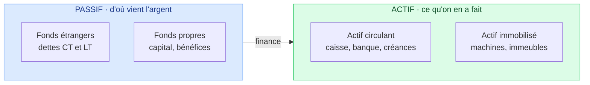

# 6. L'examen 2022 corrigé

<mark style="color:blue;">**Les vraies questions d'un ancien examen, pour savoir à quoi t'attendre.**</mark>

&#x20;


**En bref**

Interrogation de fin de semestre (automne 2022) : **sans document, sans calculatrice, sans ordinateur**. La consigne insiste : réponses **très claires et particulièrement synthétiques**. Chaque page a une zone de **brouillon** pour que tes phrases soient parfaites avant de les recopier.

Certaines questions portent sur des chapitres **pas encore vus** (comptabilité, marketing, RGPD) : elles sont signalées. Tu peux les garder pour plus tard.


&#x20;

***

&#x20;

## <mark style="color:purple;">01</mark> · Ce qu'on apprend d'une copie corrigée

&#x20;

En regardant une copie notée de 2022, voici où les points se perdent :

&#x20;

| Erreur constatée                                                       | Leçon                                                                  |
| ---------------------------------------------------------------------- | ---------------------------------------------------------------------- |
| Croissance mondiale estimée à « 20 % par an »                          | <mark style="color:red;">Connaître les **ordres de grandeur**</mark> : ~2-3 %, pas 20 % |
| « Exemple : » laissé vide dans la question éthique                     | <mark style="color:orange;">Si on demande un exemple, **en donner un**</mark> (la moitié des points) |
| Boileau placé au XVIIIe siècle                                         | Vérifier les **dates** : c'est le **XVIIe** (1674)                     |
| Rapport Meadows daté de 1970 et mal expliqué                           | Donner **qui, quand, quoi** : Club de Rome 1968, rapport **1972**, MIT |
| Commentaires du bilan trop courts                                      | Donner **plusieurs** constats **chiffrés**, puis une **solution**      |

&#x20;


**Méthode pour chaque réponse** — 1) **définir** le terme demandé, 2) **expliquer** en une ou deux phrases, 3) **illustrer** avec un exemple ou un chiffre. Et utiliser le brouillon pour relire.


&#x20;

***

&#x20;

## <mark style="color:purple;">02</mark> · Les questions liées à l'introduction

&#x20;

Q1. Synthétisez les théories de Jean-Marc Jancovici. Sont-elles crédibles ? Faites un lien avec le Club de Rome et le rapport Meadows, en précisant ce que sont ces deux choses.

&#x20;

**Réponse modèle :**

Pour Jancovici, **il n'y a pas de croissance sans énergie**, et comme l'énergie mondiale est à ~80 % **fossile**, **pas de croissance sans CO₂**. La croissance infinie est donc impossible : elle épuise des **ressources limitées** et provoque un **dérèglement climatique**. Ses théories sont **crédibles** car fondées sur la **physique** et des **données** mesurables, même si certaines de ses positions (nucléaire) sont débattues.

Le **Club de Rome** est un groupe de réflexion international (scientifiques, économistes, industriels) fondé en **1968**. Il a commandé au **MIT** le **rapport Meadows** (*The Limits to Growth*, **1972**), qui a simulé l'évolution du monde et prévu un **effondrement** au XXIe siècle si la croissance continuait. **Lien** : Jancovici et Meadows arrivent à la même conclusion — **la croissance se heurte aux limites physiques de la planète**.

&#x20;

Q2. Définissez la croissance économique. À combien s'élève-t-elle approximativement ces dernières décennies ? Si ce rythme est maintenu, quelle devrait être la production de richesse mondiale en 2123 par rapport à aujourd'hui ? Précisez ce que vous auriez tapé sur une calculatrice.

&#x20;

**Réponse modèle :**

* **Définition** : augmentation du **PIB** (valeur des biens et services produits en un an) d'une année à l'autre, en %.
* **Rythme** : environ **3 % par an** au niveau mondial.
* **Calcul** (100 ans) : **1,03 ^ 100 ≈ 19**.
* **Ordre de grandeur** : environ **20 fois plus** de richesse produite qu'aujourd'hui (vérification : doublement tous les 70/3 ≈ 23 ans → ~4 doublements → ×16).

&#x20;

Q3. Que pensez-vous de ces deux questions ? (« La croissance permanente, c'est possible ou pas ? C'est grave ? »)

&#x20;

**Réponse modèle :**

Ce sont des questions **essentielles**. La croissance permanente est **impossible** dans un monde fini (ressources, énergie, climat). C'est **grave** car toute notre société en dépend (emplois, retraites, dettes). La solution n'est ni seulement la technologie (technosolutionnisme) ni la pauvreté subie, mais une combinaison de **technologie** et de **sobriété choisie**, en renforçant le **bonheur eudémonique**.

&#x20;

Q4. Économie, Finance, Être humain. Comment ces trois termes peuvent-ils être utilisés dans le cadre de questions éthiques ? Illustrez avec un exemple.

&#x20;

**Réponse modèle :**

D'un point de vue éthique, **la finance doit être au service de l'économie, qui doit être au service de l'être humain**. Une décision est problématique quand cet ordre s'**inverse**.

**Exemple** : une entreprise rentable qui délocalise et licencie uniquement pour augmenter le dividende des actionnaires met l'humain au service de la finance. À l'inverse, une banque qui prête à une PME pour créer des emplois respecte l'ordre.

&#x20;


Sans exemple, cette question ne rapporte que **la moitié des points**.


&#x20;

Q5. À quoi sert une Rolex ?

&#x20;

**Réponse modèle :**

À **afficher un statut social** et une richesse, pas à lire l'heure. C'est un bien de consommation qui **assure le respect social** et procure de la **dopamine**, **mais pas le bonheur** (et auquel on s'habitue vite : adaptation hédonique).

&#x20;

&#x20;

***

&#x20;

## <mark style="color:purple;">03</mark> · Les questions des autres chapitres

&#x20;


Ces questions seront expliquées en détail dans les chapitres **Marketing**, **Comptabilité** et **Méthodes de présentation**. Voici déjà des réponses modèles pour t'orienter.


&#x20;

Q6. À quoi sert une étude de marché non directive ? Pourquoi une des méthodes peut-elle être utilisée agréablement aussi dans vos relations avec vos connaissances ? <em>(Marketing)</em>

&#x20;

**Réponse modèle :**

Une étude **non directive** est un **entretien libre** : on laisse la personne parler sans l'orienter, pour découvrir ses **vraies motivations, besoins et freins**, y compris ceux qu'on n'avait pas imaginés. Elle sert souvent à **trouver les bonnes questions** avant une étude **directive** (questionnaire fermé).

Une de ses techniques, la **reformulation** (dite **rogérienne**, du psychologue Carl Rogers), consiste à **répéter avec ses mots** ce que l'autre vient de dire. Dans la vie courante, elle montre qu'on **écoute vraiment**, fait parler l'autre et évite les malentendus.

&#x20;

Q7. RGPD… Qu'est-ce que c'est ? À qui s'adresse-t-il ? <em>(Droit)</em>

&#x20;

**Réponse modèle :**

Le **RGPD** (Règlement général sur la protection des données) est un **règlement européen** en vigueur depuis **mai 2018**. Il protège les **données personnelles** et la vie privée (consentement, droit d'accès, de rectification, d'effacement…), avec des amendes pouvant aller jusqu'à **4 % du chiffre d'affaires mondial**.

Il s'adresse à **toute organisation**, même hors UE (donc aussi suisse), **qui traite des données de personnes se trouvant dans l'UE**. En Suisse, l'équivalent est la **nouvelle LPD** (depuis septembre 2023).

&#x20;

Q8. Où peut-on lire la structure du financement d'une entreprise ? Quelle typologie y trouve-t-on ? Où peut-on lire ce que l'entreprise a fait avec ce financement ? <em>(Comptabilité)</em>

&#x20;

**Réponse modèle :**

Dans le **bilan**.

* Le **passif** montre **d'où vient l'argent** (le financement) : **fonds étrangers** (dettes à court terme, dettes à long terme) et **fonds propres** (capital, réserves, bénéfices).
* L'**actif** montre **ce que l'entreprise en a fait** : **actif circulant** (caisse, banque, créances, stocks) et **actif immobilisé** (machines, véhicules, immeubles).

&#x20;

&#x20;

**Analogie** : le passif, c'est **ton porte-monnaie et tes emprunts** ; l'actif, c'est **ce que tu as acheté avec**. Les deux côtés sont toujours égaux.

&#x20;

Q9. Voici les états financiers d'une entreprise. Précisez le nom de ces deux tableaux et faites quelques commentaires pertinents. <em>(Comptabilité)</em>

&#x20;

**Les données de l'examen (en milliers) :**



**Tableau 1**

| Actif | | Passif | |
| --- | --- | --- | --- |
| Caisse | 5 | Dettes fournisseurs | 180 |
| Banque | 60 | À payer AVS et fisc | 60 |
| Créances clients | 120 | Provision conflit en cours | 60 |
| Véhicules | 15 | Emprunt hypothécaire | 1 500 |
| Machines | 100 | Résultat reporté | 60 |
| Immeubles | 1 800 | Capital | 100 |
| | | Résultat de l'année | 140 |
| **Total** | **2 100** | **Total** | **2 100** |



**Tableau 2**

| Poste | |
| --- | --- |
| Ventes + abonnements + propriété intellectuelle | 850 |
| Matières premières et commissions | −110 |
| **Marge brute** | **740** |
| Loyers et salaires | −500 |
| **EBITDA** | **240** |
| Amortissements | −50 |
| **EBIT** | **190** |
| Frais financiers et sous-location | −40 |
| Prix pronostics Qatar (exceptionnel) | +10 |
| Impôts | −20 |
| **Résultat net** | **140** |



&#x20;

**Réponse modèle :**

* **Noms** : le **bilan** et le **compte de résultat** (aussi appelé compte de **pertes et profits**).

&#x20;

**Commentaires pertinents :**

1. <mark style="color:red;">**Problème de liquidité**</mark> : l'actif circulant (5 + 60 + 120 = **185**) est **inférieur** aux dettes à court terme (180 + 60 + 60 = **300**). L'entreprise risque de **ne pas pouvoir payer** ses fournisseurs, l'AVS et le fisc à court terme.
2. <mark style="color:orange;">**Fonds propres faibles**</mark> : 100 + 60 + 140 = **300**, soit ~**14 %** du total. L'entreprise est **très endettée**, surtout via l'hypothèque (1 500).
3. **Actif très immobilier** : les immeubles (1 800) représentent ~**86 %** de l'actif. Beaucoup d'argent « bloqué » dans la pierre.
4. <mark style="color:green;">**Mais l'entreprise est rentable**</mark> : résultat net de **140** sur 850 de chiffre d'affaires (~16 %), EBITDA de 240.
5. **Points d'attention** : une **provision pour conflit** (un litige en cours = risque) et un **produit exceptionnel** (prix Qatar) qui ne se reproduira pas.

&#x20;

**Solution possible** : **vendre les immeubles puis les relouer** (*sale and leaseback*) pour transformer l'immobilier en liquidités, ou **augmenter le capital**, ou **encaisser plus vite** les créances clients (120).

&#x20;

Q10. Citez deux éléments importants ou astuces utiles dans la qualité d'une présentation orale. <em>(Méthodes de présentation)</em>

&#x20;

**Réponse modèle** (deux au choix) :

* **Annoncer la conclusion dès le début** : le public sait où on va.
* **Une idée par slide**, peu de texte, des images et des chiffres parlants.
* Partir de **constats simples**, puis **nuancer** (« c'est pas si simple »).
* **Regarder le public**, parler lentement, **répéter** avant.
* **Raconter une histoire** : les gens retiennent les histoires, pas les listes.

&#x20;

Q11. Que retenir du documentaire « Derrière nos écrans de fumée » ?

&#x20;

**Réponse modèle :**

Documentaire Netflix (2020, titre original *The Social Dilemma*). À retenir :

* Les réseaux sociaux sont **gratuits** car **les clients sont les annonceurs** : **l'utilisateur est le produit** (« si c'est gratuit, c'est toi le produit »).
* Ils sont **conçus pour capter l'attention** et **modifier les comportements** (notifications, scroll infini, algorithmes), en exploitant le **circuit de la dopamine**.
* Ce fonctionnement découle de l'**objectif de rentabilité** → lien avec la page 2 : la finance commande à l'humain au lieu de le servir.

&#x20;

Q12. Question subsidiaire : complétez le texte, donnez l'auteur, l'époque, et à quoi il sert de l'avoir appris par cœur.

&#x20;

**Texte complet :**

> Il est certains esprits dont les sombres pensées
> **Sont d'un nuage épais** toujours embarrassées ;
> Le jour de la raison ne le saurait percer.
> Avant donc que d'écrire, **apprenez à penser**.
> Selon que notre idée est plus ou moins **obscure**,
> L'expression la suit, ou moins nette, ou plus pure.
> Ce que l'on conçoit bien **s'énonce clairement**,
> Et les mots pour le dire **arrivent aisément**.

&#x20;

* **Auteur** : **Nicolas Boileau**, *L'Art poétique*, **1674** → **XVIIe siècle** (pas le XVIIIe !).
* **À quoi ça sert** : c'est une règle pour **écrire et présenter** : si tu n'arrives pas à expliquer clairement, c'est que **tu n'as pas encore bien compris**. Pense d'abord, écris ensuite — exactement ce que demande le prof avec la zone de brouillon.

&#x20;

&#x20;


**Retour au chapitre** → [1. Introduction](introduction.md)

