```mermaid
flowchart LR
    A["1. L'esprit du cours<br/>technicien vs ingénieur"] --> B["2. Argent et éthique<br/>humain, économie, finance"]
    B --> C["3. La croissance<br/>nénuphars, PIB, énergie"]
    C --> D["4. Sobriété et bonheur<br/>hédonique vs eudémonique"]
    D --> E["5. Révision"]
    E --> F["6. Examen 2022 corrigé"]

    style A fill:#f1f5f9,stroke:#64748b,color:#0f172a
    style B fill:#dcfce7,stroke:#22c55e,color:#14532d
    style C fill:#fef3c7,stroke:#f59e0b,color:#78350f
    style D fill:#dbeafe,stroke:#3b82f6,color:#1e3a8a
    style E fill:#ede9fe,stroke:#8b5cf6,color:#4c1d95
    style F fill:#fce7f3,stroke:#ec4899,color:#831843
```

# 1. Introduction

<mark style="color:blue;">**Avant de parler de comptabilité ou de marketing : à quoi sert l'économie, et vers où va-t-elle ?**</mark>

&#x20;


**En bref**

L'introduction présente **l'esprit du cours** (pourquoi un ingénieur doit comprendre l'économie), puis pose **trois questions dérangeantes** qui serviront de fil rouge toute l'année :

1. L'argent, c'est **éthique** ou pas ?
2. La **croissance permanente**, c'est possible ? Et c'est grave ?
3. La **sobriété**, ça fait mal ?


&#x20;

***

&#x20;

## <mark style="color:purple;">01</mark> · Le fil du chapitre

&#x20;

&#x20;

***

&#x20;

## <mark style="color:purple;">02</mark> · Les pages

&#x20;

| #  | Page                                                          | Idée clé                                                          |
| -- | ------------------------------------------------------------- | ----------------------------------------------------------------- |
| 1  | [L'esprit du cours](01-esprit-du-cours.md)                    | L'ingénieur **comprend** et a une **vision transversale**         |
| 2  | [L'argent, c'est éthique ?](02-argent-et-ethique.md)          | La finance sert l'économie, qui sert l'**être humain**            |
| 3  | [La croissance permanente](03-croissance-permanente.md)       | Une croissance **exponentielle** ne peut pas durer dans un monde fini |
| 4  | [Sobriété et bonheur](04-sobriete-et-bonheur.md)              | Sobriété **choisie** ≠ pauvreté **subie**                         |
| 5  | [Questions de révision](05-questions-revision.md)             | Teste-toi, réponses cachées                                       |
| 6  | [L'examen 2022 corrigé](06-examen-2022-corrige.md)            | Les vraies questions d'examen, avec des réponses modèles         |

&#x20;


**Conseil du prof pour suivre le cours** — les slides ne suffisent **pas** à elles seules : ce sont des supports de discours. Prends des notes (idéalement sur papier, seulement l'essentiel) et, **juste après le cours**, écris **2 à 5 points à retenir**.

