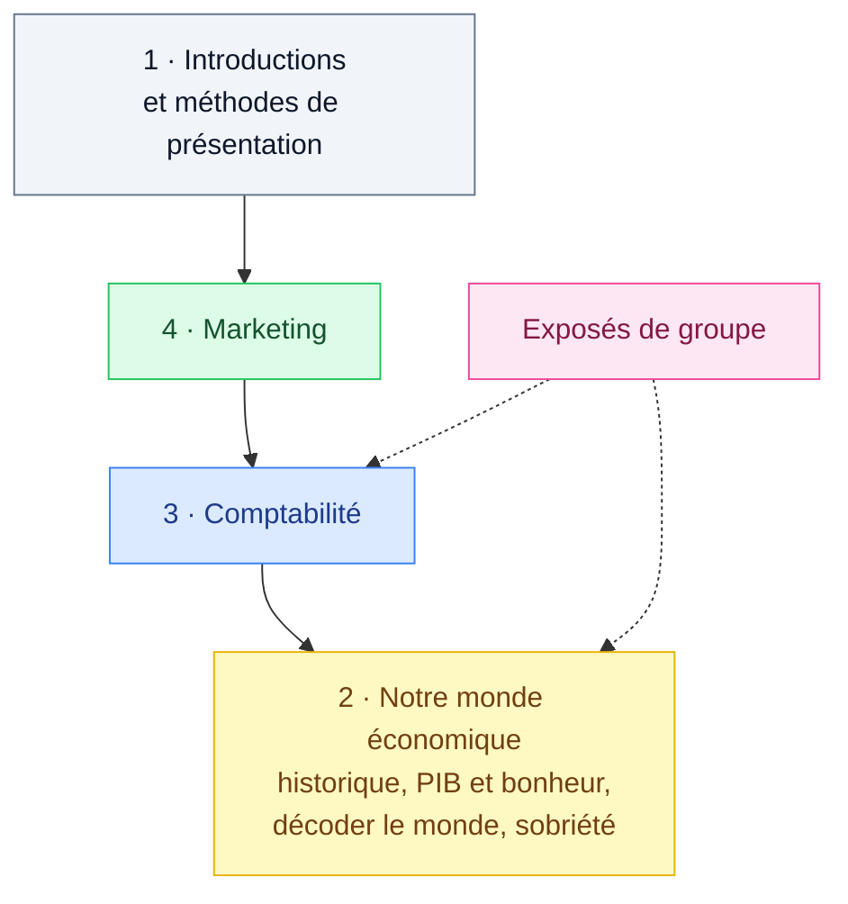

# Économie et Droit IT

<mark style="color:blue;">**Ce qu'un ingénieur doit comprendre de l'entreprise et du monde économique qui l'entoure.**</mark>

&#x20;


**En bref**

Ce n'est **pas** un cours technique : c'est une **culture générale d'entreprise**. On y apprend les notions de base (économie, comptabilité, marketing…) et on se pose les grandes questions : l'argent est-il éthique ? la croissance peut-elle durer ? qu'est-ce que le bonheur ?


&#x20;

***

&#x20;

## <mark style="color:purple;">01</mark> · Le programme du semestre (ISC1)

&#x20;

&#x20;


**Le plan n'est pas linéaire** — le prof le dit lui-même : les sujets s'emboîtent comme des poupées russes et reviennent plusieurs fois. Ne panique pas si un thème réapparaît plus tard.


&#x20;

***

&#x20;

## <mark style="color:purple;">02</mark> · Chapitres

&#x20;

| #  | Chapitre                                                           | Statut                                       |
| -- | ------------------------------------------------------------------ | -------------------------------------------- |
| 1  | [Introduction](01-introduction/introduction.md)                    | <mark style="color:green;">**Rédigé**</mark> |
| 2  | Notre monde économique (historique, PIB, sobriété…)                | À venir                                      |
| 3  | Comptabilité                                                       | À venir                                      |
| 4  | Marketing                                                          | À venir                                      |

&#x20;

***

&#x20;

## <mark style="color:purple;">03</mark> · Évaluation

&#x20;

* **1 travail de groupe** : une présentation + une vidéo.
* **1 à 3 interrogations** sur place et/ou quelques **interros surprise**.

&#x20;


**Trois avertissements du prof** : ce sera **exigeant**, **la forme compte autant que le fond** (une réponse juste mais mal écrite perd des points), et **triche / plagiat** sont sanctionnés.

