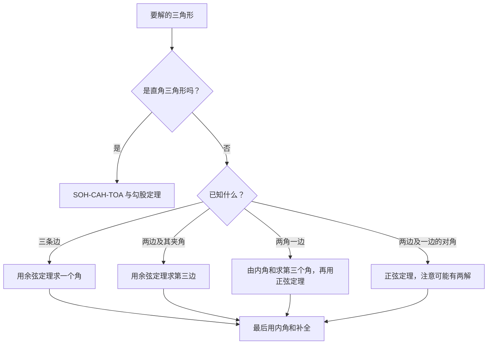
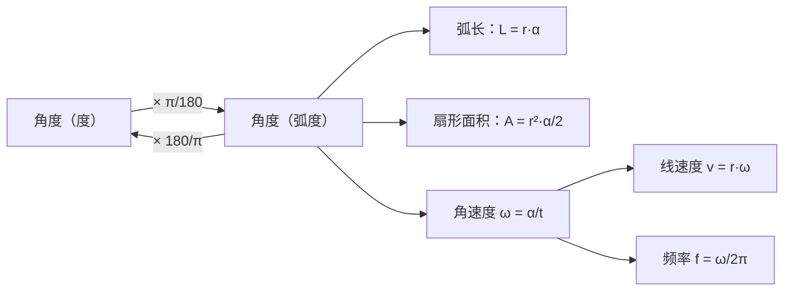

# 1. 角、三角形与圆周运动

> **目标**：掌握角的单位、圆的几何（弧、扇形、圆周角）以及任意三角形的求解。这些工具出现在**每一次**线性代数第一次小测（« Test 1 Pb 1 »）和 TE F-1 的 « Triangle & Co » 题中。

---

## 1. 引言与定义

### 1.1 角的度量：度与弧度

角表示两条射线之间的**张开程度**。常用两种单位：

- **度**（degré）：一整圈为 $$360°$$；
- **弧度**（radian）：一整圈为 $$2\pi$$ rad。

弧度是「最自然」的单位：**在半径为 $$r$$ 的圆上，1 rad 的角所对的弧长恰好等于 $$r$$**。由此得到必须牢记的换算关系：

$$\pi \text{ rad} = 180°$$

因此两种单位之间只需用比例换算：

$$\alpha_{\text{rad}} = \alpha_{\text{deg}} \cdot \frac{\pi}{180} \qquad \alpha_{\text{deg}} = \alpha_{\text{rad}} \cdot \frac{180}{\pi}$$

度还可以细分为**分**（$$1° = 60'$$）和**秒**（$$1' = 60''$$）。例如 $$7{,}5° = 7°30'$$，因为 $$0{,}5 \cdot 60 = 30$$。

> 注意：法国和瑞士的写法用**逗号**表示小数点，$$7{,}5$$ 就是 7.5。

| 度 | $$0°$$ | $$30°$$ | $$45°$$ | $$60°$$ | $$90°$$ | $$180°$$ | $$270°$$ | $$360°$$ |
| --- | --- | --- | --- | --- | --- | --- | --- | --- |
| 弧度 | $$0$$ | $$\frac{\pi}{6}$$ | $$\frac{\pi}{4}$$ | $$\frac{\pi}{3}$$ | $$\frac{\pi}{2}$$ | $$\pi$$ | $$\frac{3\pi}{2}$$ | $$2\pi$$ |

### 1.2 弧与扇形

在半径为 $$r$$ 的圆上，圆心角 $$\alpha$$（**必须用弧度！**）所对的：

- **弧**（arc）长为 $$L = r\,\alpha$$；
- **扇形**（secteur，像一块披萨）面积为 $$A = \frac{1}{2} r^2 \alpha$$。

> 这两个公式**只在弧度下**成立。如果用度，要写成 $$L = 2\pi r \cdot \frac{\alpha}{360}$$。

### 1.3 圆心角与圆周角

**圆周角**（angle inscrit）的顶点在圆**上**；**圆心角**（angle au centre）的顶点在圆心 $$O$$。

> **圆心角定理**：圆心角等于对同一段弧的圆周角的**两倍**。

特例（泰勒斯定理，théorème de Thalès）：对着**半圆**的圆周角等于 $$90°$$。因此以直径为一边、内接于半圆的三角形一定是**直角三角形**。

### 1.4 直角三角形中的三角函数

在直角三角形中，对锐角 $$\alpha$$：

$$\sin\alpha = \frac{\text{对边}}{\text{斜边}} \qquad \cos\alpha = \frac{\text{邻边}}{\text{斜边}} \qquad \tan\alpha = \frac{\text{对边}}{\text{邻边}}$$

还有三个**倒数函数**（测验中很常见）：

$$\sec\alpha = \frac{1}{\cos\alpha} \qquad \csc\alpha = \frac{1}{\sin\alpha} \qquad \cot\alpha = \frac{1}{\tan\alpha} = \frac{\cos\alpha}{\sin\alpha}$$

记忆口诀（法语）：**SOH-CAH-TOA**（Sinus = Opposé/Hypoténuse 正弦=对边/斜边，Cosinus = Adjacent/Hypoténuse 余弦=邻边/斜边，Tangente = Opposé/Adjacent 正切=对边/邻边）。

### 1.5 任意三角形

设三角形三边为 $$a, b, c$$，它们所对的角为 $$\alpha, \beta, \gamma$$。

**正弦定理**（loi des sinus）：

$$\frac{a}{\sin\alpha} = \frac{b}{\sin\beta} = \frac{c}{\sin\gamma}$$

**余弦定理**（loi des cosinus，「推广的勾股定理」）：

$$c^2 = a^2 + b^2 - 2ab\cos\gamma$$

**内角和**：$$\alpha + \beta + \gamma = \pi$$（即 $$180°$$）。

> **正弦定理的陷阱**：$$\arcsin$$ 只给出 $$\left[-\frac{\pi}{2}, \frac{\pi}{2}\right]$$ 中的角。如果要求的角可能是**钝角**，还存在第二个解 $$\pi - \beta$$。求角时最好用**余弦定理**：$$\arccos$$ 直接给出 $$[0, \pi]$$ 中的角，不会有歧义。

### 1.6 圆周运动：角速度与线速度

转动的物体（车轮、指针、圆盘）用以下量描述：

- **角速度** $$\omega$$（rad/s）：单位时间转过的角度；
- **频率** $$f$$（转/秒 = Hz）：每秒转的圈数；
- 距离圆心 $$r$$ 的点的**线速度** $$v$$（m/s）。

$$\omega = 2\pi f \qquad v = r\,\omega \qquad T = \frac{1}{f} = \frac{2\pi}{\omega}$$

> **纯滚动**（不打滑）的车轮每转一圈前进的距离等于它的周长：车的速度就是轮缘上一点的线速度 $$v = r\omega$$。

---

## 2. 解题方法

### 方法 A：已知弧长和圆周角，求半径

1. 找出对着这段弧的圆周角 $$\theta$$。
2. 圆心角：$$\alpha = 2\theta$$。
3. 把 $$\alpha$$ 换算成弧度。
4. 用 $$L = r\alpha$$，得 $$r = \frac{L}{\alpha}$$。

### 方法 B：解三角形

### 方法 C：车轮、指针、速度问题

1. 全部换成国际单位：km/h → m/s（除以 $$3{,}6$$），cm → m，分钟 → 秒。
2. 写出关键关系 $$v = r\omega$$ 和 $$\omega = 2\pi f$$。
3. 同一辆车上的两个轮子，**线速度**相同：$$v = r_A\omega_A = r_B\omega_B$$。
4. 钟表指针问题：先算出每根指针**从 12 点起**的角位置，再求差。

---

## 3. 详细计算示例

### 示例 1：求圆的半径（Test 1，A 卷）

*弧 $$BC$$ 长 $$10$$ cm，从圆上一点 $$A$$ 看它的角为 $$20°$$。求 $$r$$。*

**第 1 步：圆心角。** $$20°$$ 是**圆周角**（顶点 $$A$$ 在圆上），所以对同一段弧的圆心角是它的两倍：

$$\alpha = 2 \cdot 20° = 40°$$

**第 2 步：换算。** 弧长公式要求弧度：

$$\alpha = 40 \cdot \frac{\pi}{180} = \frac{2\pi}{9} \text{ rad}$$

**第 3 步：弧长公式。** 由 $$L = r\alpha$$ 得：

$$r = \frac{L}{\alpha} = \frac{10}{2\pi/9} = \frac{90}{2\pi} = \frac{45}{\pi} \text{ cm} \approx 14{,}3 \text{ cm}$$

### 示例 2：内接于半圆的三角形（TE F-1）

*$$ADC$$ 是以 $$AC$$ 为直径的半圆，$$AD = 25$$，$$DC = \sqrt{131{,}25}$$。求 $$AC$$ 以及角 $$\alpha = \angle DAC$$。*

**第 1 步：认出直角。** $$D$$ 在以 $$AC$$ 为直径的半圆上，所以（泰勒斯定理）$$D$$ 处是直角。

**第 2 步：勾股定理**求斜边 $$AC$$：

$$AC = \sqrt{AD^2 + DC^2} = \sqrt{625 + 131{,}25} = \sqrt{756{,}25} = 27{,}5$$

**第 3 步：求角。** 在以 $$D$$ 为直角的三角形中，$$\alpha$$ 的对边是 $$DC$$：

$$\alpha = \arcsin\left(\frac{DC}{AC}\right) = \arcsin\left(\frac{11{,}456}{27{,}5}\right) \approx 0{,}43 \text{ rad} \approx 24{,}6°$$

这里用 $$\arcsin$$ 没有危险：直角三角形的锐角一定在 $$\left]0, \frac{\pi}{2}\right[$$ 中。

### 示例 3：购物车的轮子（« Vous avez dit crétins ? »）

*购物车要以 $$79{,}2$$ km/h 的速度冲出坡道。a) 直径 $$10$$ cm 的后轮每秒转几圈？b) 前轮每秒转 $$50$$ 圈，它的直径是多少？*

**a) 换算**成 m/s：

$$v = \frac{79{,}2}{3{,}6} = 22 \text{ m/s}$$

后轮半径 $$r_B = 0{,}05$$ m。由 $$v = r\omega$$：

$$\omega_B = \frac{v}{r_B} = \frac{22}{0{,}05} = 440 \text{ rad/s}$$

再由 $$f = \frac{\omega}{2\pi}$$：

$$f_B = \frac{440}{2\pi} \approx 70{,}0 \text{ 转/秒}$$

**b)** 前轮以**相同速度** $$v = 22$$ m/s 前进（在同一辆车上）。$$f_A = 50$$ 转/秒，所以 $$\omega_A = 2\pi \cdot 50 = 100\pi$$ rad/s：

$$r_A = \frac{v}{\omega_A} = \frac{22}{100\pi} \approx 0{,}070 \text{ m}$$

所以直径约为 $$14$$ cm。**检验**：前轮更大，在车速相同时转得更慢，合理。

### 示例 4：钟表的指针（TE F-1，2023）

*现在是 2 点 38 分。时针长 $$20$$ cm，分针长 $$30$$ cm。a) 两针的角速度？b) 两针之间的夹角？c) 两针尖端之间的距离？*

**a)** 分针 $$60$$ 分钟转一圈，时针 $$12$$ 小时 $$= 720$$ 分钟转一圈：

$$\omega_M = \frac{360°}{60 \text{ min}} = 6°/\text{min} \qquad \omega_H = \frac{360°}{720 \text{ min}} = 0{,}5°/\text{min}$$

换成 rad/s：$$\omega_M = \frac{2\pi}{3600} \approx 1{,}75 \cdot 10^{-3}$$ rad/s，$$\omega_H = \frac{2\pi}{43\,200} \approx 1{,}45 \cdot 10^{-4}$$ rad/s。

**b)** 从 12 点起（顺时针）的位置。从 12 点到现在经过了 $$2 \cdot 60 + 38 = 158$$ 分钟：

$$\theta_M = 38 \cdot 6° = 228° \qquad \theta_H = 158 \cdot 0{,}5° = 79°$$

两针夹角为 $$228° - 79° = 149°$$。

**c)** 圆心与两个针尖构成的三角形中，已知两边（$$0{,}2$$ m 与 $$0{,}3$$ m）及**其夹角**：用余弦定理：

$$\delta^2 = 0{,}2^2 + 0{,}3^2 - 2 \cdot 0{,}2 \cdot 0{,}3 \cdot \cos(149°) \approx 0{,}13 + 0{,}1029 = 0{,}2329$$

$$\delta \approx 0{,}483 \text{ m}$$

---

## 4. 可视化：本章的「工具箱」

---

## 5. 练习

### 练习 1：圆弧

长 $$30$$ cm 的弧 $$BC$$ 所对的圆周角为 $$40°$$。求圆的半径 $$r$$，再求扇形 $$BOC$$ 的面积。

点击查看提示

圆心角是圆周角的两倍。先换成弧度，再用 $$L = r\alpha$$ 和 $$A = \frac{1}{2}r^2\alpha$$。

**详细解答**

1. 圆心角：$$\alpha = 2 \cdot 40° = 80°$$。
2. 换成弧度：$$\alpha = 80 \cdot \frac{\pi}{180} = \frac{4\pi}{9}$$。
3. 半径：

$$r = \frac{L}{\alpha} = \frac{30}{4\pi/9} = \frac{270}{4\pi} = \frac{135}{2\pi} \text{ cm} \approx 21{,}5 \text{ cm}$$

4. 扇形面积：

$$A = \frac{1}{2} r^2 \alpha = \frac{1}{2} r \cdot (r\alpha) = \frac{1}{2} r L = \frac{1}{2} \cdot \frac{135}{2\pi} \cdot 30 = \frac{2025}{2\pi} \approx 322 \text{ cm}^2$$

技巧：利用 $$r\alpha = L$$，可以避免重新计算 $$r^2$$。

### 练习 2：任意三角形

在三角形 $$ABC$$ 中，已知 $$b = 8$$，$$c = 5$$，以及它们的夹角 $$\alpha = 60°$$。求 $$a$$，再求角 $$\beta$$。

点击查看提示

已知两边及**夹角**：用余弦定理求第三边。求角时也用余弦定理，而不用正弦定理（避免两解的情况）。

**详细解答**

1. 余弦定理：

$$a^2 = b^2 + c^2 - 2bc\cos\alpha = 64 + 25 - 2 \cdot 8 \cdot 5 \cdot \frac{1}{2} = 89 - 40 = 49$$

所以 $$a = 7$$。

2. 求 $$\beta$$（$$b$$ 的对角）：由 $$b^2 = a^2 + c^2 - 2ac\cos\beta$$ 解出 $$\cos\beta$$：

$$\cos\beta = \frac{a^2 + c^2 - b^2}{2ac} = \frac{49 + 25 - 64}{70} = \frac{10}{70} = \frac{1}{7}$$

$$\beta = \arccos\left(\frac{1}{7}\right) \approx 81{,}8°$$

3. 检验：$$\gamma = 180° - 60° - 81{,}8° = 38{,}2°$$；最短边（$$c = 5$$）正好对着最小的角。

### 练习 3：汽车的速度

汽车轮子直径 $$60$$ cm，每秒转 $$12$$ 圈。汽车的速度是多少 km/h？$$5$$ 分钟行驶多远？

点击查看提示

先算 $$\omega = 2\pi f$$，再算 $$v = r\omega$$（$$r$$ 用米）。乘以 $$3{,}6$$ 得到 km/h。

**详细解答**

1. $$r = 0{,}30$$ m，$$\omega = 2\pi \cdot 12 = 24\pi$$ rad/s。
2. 线速度：

$$v = r\omega = 0{,}30 \cdot 24\pi = 7{,}2\pi \approx 22{,}6 \text{ m/s}$$

3. 换成 km/h：$$v \approx 22{,}6 \cdot 3{,}6 \approx 81{,}4$$ km/h。
4. $$5$$ 分钟 $$= 300$$ 秒：$$d = v \cdot t \approx 22{,}6 \cdot 300 \approx 6786$$ m，约 $$6{,}8$$ km。
