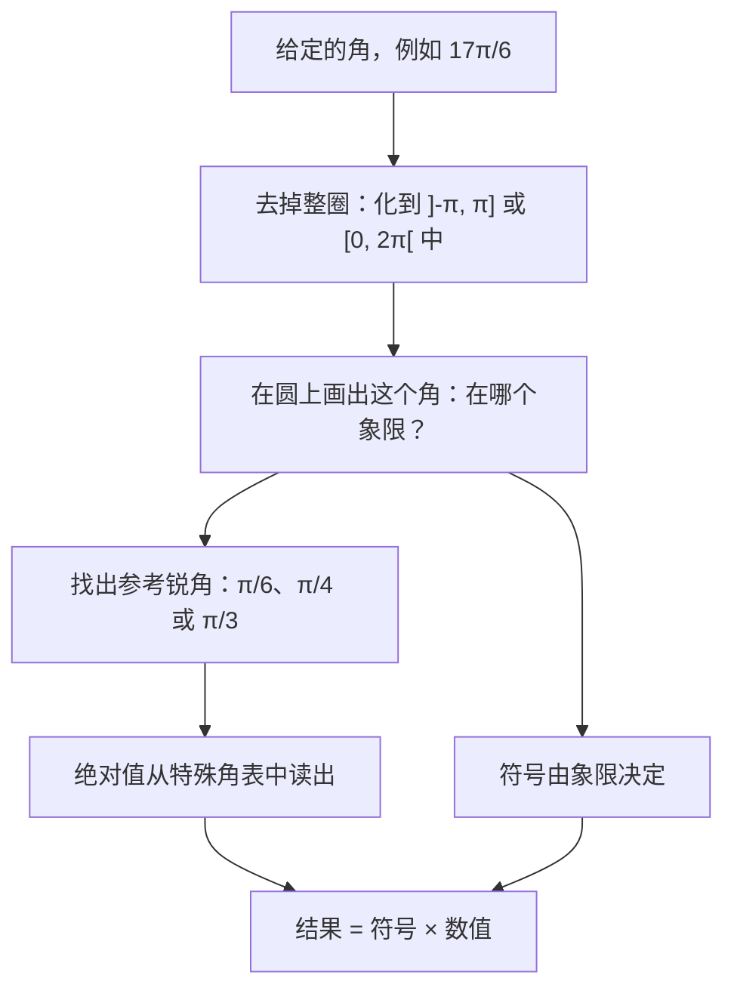
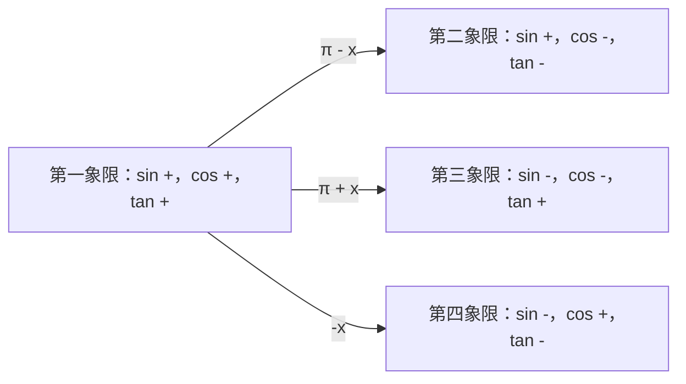

# 2. 三角函数单位圆

> **目标**：在单位圆上读出**任意角**的正弦、余弦和正切，利用对称性化归到特殊角，并在不用计算器的情况下比较大小。小测都是**不允许用计算器**的：一切都建立在本章之上。

---

## 1. 引言与定义

### 1.1 单位圆

**三角函数单位圆**（cercle trigonométrique）是圆心为 $$O(0;0)$$、半径为 $$1$$ 的圆。在它上面度量角：

- 从 $$Ox$$ 轴正方向开始；
- **逆时针**为正方向；负角按顺时针方向转。

每个角 $$\alpha$$ 对应圆上的一个点 $$M$$。**按定义**：

$$\cos\alpha = M \text{ 的横坐标} \qquad \sin\alpha = M \text{ 的纵坐标} \qquad \tan\alpha = \frac{\sin\alpha}{\cos\alpha}$$

几何上，$$\tan\alpha$$ 可以在**竖直线 $$x = 1$$** 上读出：它是直线 $$(OM)$$ 与这条切线交点的纵坐标。

因为 $$M$$ 在半径为 $$1$$ 的圆上，由勾股定理立即得到**基本恒等式**：

$$\sin^2\alpha + \cos^2\alpha = 1$$

两边分别除以 $$\cos^2\alpha$$ 和 $$\sin^2\alpha$$，得到两个有用的恒等式：

$$1 + \tan^2\alpha = \sec^2\alpha \qquad 1 + \cot^2\alpha = \csc^2\alpha$$

### 1.2 四个象限与符号

| 象限 | 角的范围 | $$\sin$$ | $$\cos$$ | $$\tan$$ |
| --- | --- | --- | --- | --- |
| I | $$\left]0, \frac{\pi}{2}\right[$$ | $$+$$ | $$+$$ | $$+$$ |
| II | $$\left]\frac{\pi}{2}, \pi\right[$$ | $$+$$ | $$-$$ | $$-$$ |
| III | $$\left]\pi, \frac{3\pi}{2}\right[$$ | $$-$$ | $$-$$ | $$+$$ |
| IV | $$\left]\frac{3\pi}{2}, 2\pi\right[$$ | $$-$$ | $$+$$ | $$-$$ |

$$\sec$$、$$\csc$$、$$\cot$$ 分别与 $$\cos$$、$$\sin$$、$$\tan$$ 同号。

> 法式区间写法：$$]a, b[$$ 表示开区间 $$(a, b)$$，$$[a, b]$$ 表示闭区间。

### 1.3 特殊角

| $$\alpha$$ | $$0$$ | $$\frac{\pi}{6}$$ | $$\frac{\pi}{4}$$ | $$\frac{\pi}{3}$$ | $$\frac{\pi}{2}$$ |
| --- | --- | --- | --- | --- | --- |
| $$\sin\alpha$$ | $$0$$ | $$\frac{1}{2}$$ | $$\frac{\sqrt{2}}{2}$$ | $$\frac{\sqrt{3}}{2}$$ | $$1$$ |
| $$\cos\alpha$$ | $$1$$ | $$\frac{\sqrt{3}}{2}$$ | $$\frac{\sqrt{2}}{2}$$ | $$\frac{1}{2}$$ | $$0$$ |
| $$\tan\alpha$$ | $$0$$ | $$\frac{\sqrt{3}}{3}$$ | $$1$$ | $$\sqrt{3}$$ | 无定义 |

> **记忆技巧**：正弦依次是 $$\frac{\sqrt{0}}{2}, \frac{\sqrt{1}}{2}, \frac{\sqrt{2}}{2}, \frac{\sqrt{3}}{2}, \frac{\sqrt{4}}{2}$$；余弦是同一列数倒过来。

### 1.4 对称性（诱导公式，« angles associés »）

所有这些公式都可以在圆上**读出来**：只要画出角 $$x$$ 和变换后的角即可。

| 变换 | 圆上的对称 | 结果 |
| --- | --- | --- |
| $$-x$$ | 关于 $$Ox$$ 轴对称 | $$\sin(-x) = -\sin x$$，$$\cos(-x) = \cos x$$ |
| $$\pi - x$$ | 关于 $$Oy$$ 轴对称 | $$\sin(\pi - x) = \sin x$$，$$\cos(\pi - x) = -\cos x$$ |
| $$\pi + x$$ | 关于原点对称 | $$\sin(\pi + x) = -\sin x$$，$$\cos(\pi + x) = -\cos x$$ |
| $$\frac{\pi}{2} - x$$ | 关于直线 $$y = x$$ 对称 | $$\sin\left(\frac{\pi}{2} - x\right) = \cos x$$，$$\cos\left(\frac{\pi}{2} - x\right) = \sin x$$ |
| $$\frac{\pi}{2} + x$$ | 旋转四分之一圈 | $$\sin\left(\frac{\pi}{2} + x\right) = \cos x$$，$$\cos\left(\frac{\pi}{2} + x\right) = -\sin x$$ |
| $$x + 2k\pi$$ | 转一圈或多圈 | 值不变（**周期** $$2\pi$$） |

正切的相应结论：$$\tan(-x) = -\tan x$$，$$\tan(\pi + x) = \tan x$$（周期 $$\pi$$），$$\tan\left(\frac{\pi}{2} + x\right) = -\cot x$$，$$\tan(\pi - x) = -\tan x$$。

---

## 2. 解题方法

### 方法 A：计算任意角的 $$\sin$$、$$\cos$$、$$\tan$$

### 方法 B：已知一个三角函数值，求其他所有函数值

1. 把角放到题目给出的**象限**中：这决定了**所有的符号**。
2. 画一个带正长度的「参考」直角三角形（例如 $$\cos\alpha = \frac{4}{5}$$：邻边 $$4$$，斜边 $$5$$，由勾股定理对边为 $$3$$）。
3. 用三角形的边长写出每个函数，再**加上**象限决定的符号。

### 方法 C：不用计算器估值（« 排除错误的数值 »）

1. 在圆上画出角：**符号**已经能排除一半的选项。
2. 把角夹在两个特殊角之间，利用函数在该象限中的**单调性**。

### 方法 D：比较两个表达式（$$<$$、$$>$$ 或 $$=$$）

1. 用对称性改写两个表达式（例如 $$\tan\left(\frac{\pi}{2} + \alpha\right) = -\cot\alpha$$）。
2. 由象限确定每个表达式的**符号**。
3. 如果符号相同，就在图上比较**绝对值**（圆上线段的长度）。

---

## 3. 详细计算示例

### 示例 1：负角的值（Test 1，A 卷）

*求 $$\sin\left(-\frac{2\pi}{3}\right)$$、$$\cos\left(-\frac{2\pi}{3}\right)$$ 和 $$\tan\left(-\frac{2\pi}{3}\right)$$。*

- $$-\frac{2\pi}{3} = -120°$$：顺时针转 $$120°$$，到达**第三象限**（$$\sin < 0$$，$$\cos < 0$$）。
- 参考角：$$\pi - \frac{2\pi}{3} = \frac{\pi}{3}$$。

$$\sin\left(-\frac{2\pi}{3}\right) = -\frac{\sqrt{3}}{2} \qquad \cos\left(-\frac{2\pi}{3}\right) = -\frac{1}{2}$$

$$\tan\left(-\frac{2\pi}{3}\right) = \frac{-\sqrt{3}/2}{-1/2} = \sqrt{3}$$

正切为正，与第三象限一致。

### 示例 2：求出所有函数值（Test 1，A 卷）

*$$\alpha \in \left[\frac{3\pi}{2}, 2\pi\right]$$ 且 $$\cos\alpha = \frac{4}{5}$$。求其他三角函数值。*

**第 1 步：第四象限**：$$\cos > 0$$，$$\sin < 0$$，所以 $$\tan < 0$$。

**第 2 步：由基本恒等式求正弦**：

$$\sin^2\alpha = 1 - \frac{16}{25} = \frac{9}{25} \quad\Rightarrow\quad \sin\alpha = -\frac{3}{5}$$

（因为象限的原因取**负**根）。

**第 3 步：其余**由定义得到：

$$\tan\alpha = \frac{-3/5}{4/5} = -\frac{3}{4} \qquad \cot\alpha = -\frac{4}{3} \qquad \sec\alpha = \frac{5}{4} \qquad \csc\alpha = -\frac{5}{3}$$

### 示例 3：化简大角

*求 $$\sin\left(\frac{17\pi}{6}\right)$$ 和 $$\tan\left(\frac{5\pi}{4}\right)$$。*

- $$\frac{17\pi}{6} = 2\pi + \frac{5\pi}{6}$$：多转一整圈不改变任何值，只需研究 $$\frac{5\pi}{6}$$（第二象限，参考角 $$\frac{\pi}{6}$$）。正弦为正：

$$\sin\left(\frac{17\pi}{6}\right) = \sin\left(\frac{5\pi}{6}\right) = \sin\left(\pi - \frac{\pi}{6}\right) = \sin\left(\frac{\pi}{6}\right) = \frac{1}{2}$$

- $$\frac{5\pi}{4} = \pi + \frac{\pi}{4}$$，而正切的周期是 $$\pi$$：

$$\tan\left(\frac{5\pi}{4}\right) = \tan\left(\frac{\pi}{4}\right) = 1$$

### 示例 4：估值（Test 1）

*$$\cos\left(\frac{4\pi}{5}\right)$$ 保留一位小数是 $$0{,}3$$、$$-0{,}3$$、$$0{,}8$$ 还是 $$-0{,}8$$？*

- $$\frac{4\pi}{5} = 144°$$ 在第二象限：余弦为**负**。只剩 $$-0{,}3$$ 或 $$-0{,}8$$。
- $$144°$$ 靠近 $$180°$$（那里 $$\cos = -1$$）；更准确地说 $$144° > 135°$$，而 $$\cos(135°) = -\frac{\sqrt{2}}{2} \approx -0{,}71$$。余弦在第二象限递减，所以 $$\cos(144°) < -0{,}71$$。
- 答案：$$-0{,}8$$。

*$$\sin\left(\frac{6\pi}{7}\right)$$ 是 $$0{,}4$$、$$-0{,}4$$、$$0{,}6$$ 还是 $$-0{,}6$$？*

- $$\frac{6\pi}{7} = \pi - \frac{\pi}{7}$$，所以 $$\sin\left(\frac{6\pi}{7}\right) = \sin\left(\frac{\pi}{7}\right) > 0$$。
- 又 $$\frac{\pi}{7} < \frac{\pi}{6}$$ 且 $$\sin\left(\frac{\pi}{6}\right) = 0{,}5$$：值小于 $$0{,}5$$。答案：$$0{,}4$$。

### 示例 5：比较大小（TE F-1，« Comparaison d'angles »）

*$$\gamma$$ 是第二象限的角。填空：$$\sec(\gamma) \;\square\; \cos(\gamma)$$。*

- 在第二象限，$$\cos\gamma \in \left]-1, 0\right[$$。
- 所以 $$\sec\gamma = \frac{1}{\cos\gamma} < -1$$（介于 $$-1$$ 和 $$0$$ 之间的数的倒数小于 $$-1$$）。
- 因此 $$\sec\gamma < -1 < \cos\gamma$$：填 $$\sec(\gamma) < \cos(\gamma)$$。

*$$\alpha$$ 是第一象限的角。填空：$$\tan\left(\frac{\pi}{2} + \alpha\right) \;\square\; \cot(\alpha)$$。*

- 对称性：$$\tan\left(\frac{\pi}{2} + \alpha\right) = -\cot\alpha$$。
- 在第一象限 $$\cot\alpha > 0$$，所以 $$-\cot\alpha < 0 < \cot\alpha$$：填 $$<$$。

---

## 4. 可视化：在圆上定位

每个箭头表示第一象限的参考角 $$x$$ 如何「搬到」其他象限：**绝对值**与 $$x$$ 的相同，只有**符号**改变。

---

## 5. 练习

### 练习 1：求其他函数值

角 $$\alpha$$ 在 $$\left[-\frac{3\pi}{2}, -\pi\right]$$ 中，且 $$\sin\alpha = \frac{3}{5}$$。精确计算 $$\cos\alpha$$、$$\tan\alpha$$、$$\cot\alpha$$、$$\sec\alpha$$ 和 $$\csc\alpha$$。

点击查看提示

加上 $$2\pi$$，看区间 $$\left[-\frac{3\pi}{2}, -\pi\right]$$ 对应「通常」的哪个象限。余弦的符号由此得出。

**详细解答**

1. $$\left[-\frac{3\pi}{2}, -\pi\right] + 2\pi = \left[\frac{\pi}{2}, \pi\right]$$：这是**第二象限**（$$\sin > 0$$ ✓，$$\cos < 0$$）。
2. $$\cos^2\alpha = 1 - \frac{9}{25} = \frac{16}{25}$$，所以 $$\cos\alpha = -\frac{4}{5}$$。
3. 其他函数：

$$\tan\alpha = \frac{3/5}{-4/5} = -\frac{3}{4} \qquad \cot\alpha = -\frac{4}{3} \qquad \sec\alpha = -\frac{5}{4} \qquad \csc\alpha = \frac{5}{3}$$

### 练习 2：精确值

不用计算器计算：a) $$\cos\left(\frac{4\pi}{3}\right)$$；b) $$\sin\left(-\frac{5\pi}{6}\right)$$；c) $$\tan\left(\frac{5\pi}{6}\right)$$；d) $$\sec\left(\frac{7\pi}{4}\right)$$。

点击查看提示

对每个角：先看象限（→ 符号），再找 $$\frac{\pi}{6}$$、$$\frac{\pi}{4}$$、$$\frac{\pi}{3}$$ 中的参考角（→ 绝对值）。

**详细解答**

a) $$\frac{4\pi}{3} = \pi + \frac{\pi}{3}$$，第三象限，余弦为负：$$\cos\left(\frac{4\pi}{3}\right) = -\cos\left(\frac{\pi}{3}\right) = -\frac{1}{2}$$。

b) $$-\frac{5\pi}{6}$$ 在第三象限（顺时针转 $$150°$$），正弦为负，参考角 $$\frac{\pi}{6}$$：$$\sin\left(-\frac{5\pi}{6}\right) = -\frac{1}{2}$$。

c) $$\frac{5\pi}{6} = \pi - \frac{\pi}{6}$$，第二象限，正切为负：$$\tan\left(\frac{5\pi}{6}\right) = -\tan\left(\frac{\pi}{6}\right) = -\frac{\sqrt{3}}{3}$$。

d) $$\frac{7\pi}{4} = 2\pi - \frac{\pi}{4}$$，第四象限，余弦为正：$$\cos\left(\frac{7\pi}{4}\right) = \frac{\sqrt{2}}{2}$$，所以 $$\sec\left(\frac{7\pi}{4}\right) = \frac{2}{\sqrt{2}} = \sqrt{2}$$。

### 练习 3：比较大小

设 $$\beta \in \left]\frac{\pi}{2}, \pi\right[$$（第二象限），$$\delta \in \left]-\frac{\pi}{2}, 0\right[$$（第四象限）。用 $$<$$、$$>$$ 或 $$=$$ 填空：

a) $$\cos(\beta) \;\square\; \tan(\pi - \beta)$$；b) $$\sin(\beta) \;\square\; \sin(\pi - \beta)$$；c) $$\tan(\delta) \;\square\; \tan(-\delta)$$。

点击查看提示

利用 $$\tan(\pi - \beta) = -\tan\beta$$ 和 $$\sin(\pi - \beta) = \sin\beta$$，再根据符号推理。

**详细解答**

a) $$\beta$$ 在第二象限：$$\cos\beta < 0$$。又 $$\tan(\pi - \beta) = -\tan\beta$$；第二象限中 $$\tan\beta < 0$$，所以 $$-\tan\beta > 0$$。因此 $$\cos(\beta) < \tan(\pi - \beta)$$。

b) 关于 $$Oy$$ 轴的对称保持正弦不变：$$\sin(\pi - \beta) = \sin\beta$$。填 $$=$$。

c) $$\delta$$ 在第四象限：$$\tan\delta < 0$$；而 $$\tan(-\delta) = -\tan\delta > 0$$。因此 $$\tan(\delta) < \tan(-\delta)$$。
