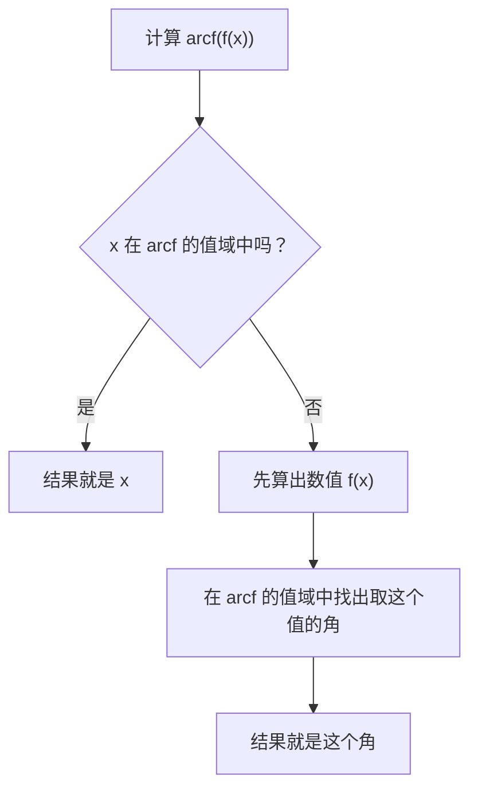
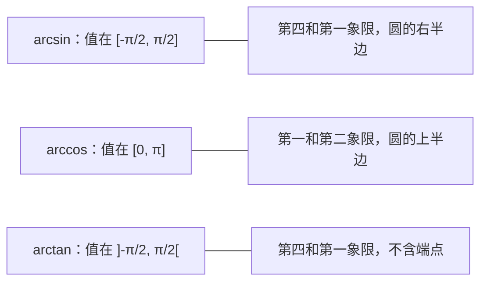

# 3. 反三角函数

> **目标**：掌握 $$\arcsin$$、$$\arccos$$、$$\arctan$$（定义域、值域、图像），计算它们的精确值，识破 $$\arcsin(\sin x)$$ 这类陷阱，并用它们表示未知角（飞机问题）。本章对应 « Test 1 Pb 2 »。

---

## 1. 引言与定义

### 1.1 为什么要「限制」定义域？

我们想「撤销」正弦：找出使 $$\sin x = y$$ 的角 $$x$$。问题是答案有**无穷多个**（例如 $$\sin x = \frac{1}{2}$$ 对 $$x = \frac{\pi}{6}, \frac{5\pi}{6}, \frac{13\pi}{6}, \dots$$ 都成立）。而一个函数只能返回**一个**值。

所以我们把每个函数限制在一个使它成为**双射**（bijective，严格单调且每个值只取一次）的区间上。这样它的反函数（fonction réciproque）就有明确定义。

### 1.2 三个反三角函数

| 函数 | 定义域 | 值域 | 读作「……的角」 |
| --- | --- | --- | --- |
| $$\arcsin x$$ | $$[-1, 1]$$ | $$\left[-\frac{\pi}{2}, \frac{\pi}{2}\right]$$ | $$[-90°, 90°]$$ 中正弦等于 $$x$$ 的角 |
| $$\arccos x$$ | $$[-1, 1]$$ | $$[0, \pi]$$ | $$[0°, 180°]$$ 中余弦等于 $$x$$ 的角 |
| $$\arctan x$$ | $$\mathbb{R}$$ | $$\left]-\frac{\pi}{2}, \frac{\pi}{2}\right[$$ | $$]-90°, 90°[$$ 中正切等于 $$x$$ 的角 |

所以按定义：

$$y = \arcsin x \iff \left(\sin y = x \text{ 且 } y \in \left[-\tfrac{\pi}{2}, \tfrac{\pi}{2}\right]\right)$$

### 1.3 图像与性质

反函数的图像是原函数（限制后）的图像关于直线 $$y = x$$ 的**对称图形**。

- $$\arcsin$$：递增，奇函数（$$\arcsin(-x) = -\arcsin x$$），经过 $$(-1; -\frac{\pi}{2})$$、$$(0; 0)$$、$$(1; \frac{\pi}{2})$$；两端有竖直切线。
- $$\arccos$$：递减，经过 $$(-1; \pi)$$、$$(0; \frac{\pi}{2})$$、$$(1; 0)$$；既非奇也非偶，但 $$\arccos(-x) = \pi - \arccos x$$。
- $$\arctan$$：递增，奇函数，定义在整个 $$\mathbb{R}$$ 上，有两条**水平渐近线** $$y = -\frac{\pi}{2}$$（在 $$-\infty$$）和 $$y = \frac{\pi}{2}$$（在 $$+\infty$$）。

| 函数 | 最小值 | 最大值 | 渐近线 |
| --- | --- | --- | --- |
| $$\arcsin$$ | $$x = -1$$ 时为 $$-\frac{\pi}{2}$$ | $$x = 1$$ 时为 $$\frac{\pi}{2}$$ | 无 |
| $$\arccos$$ | $$x = 1$$ 时为 $$0$$ | $$x = -1$$ 时为 $$\pi$$ | 无 |
| $$\arctan$$ | 无（下确界 $$-\frac{\pi}{2}$$） | 无（上确界 $$\frac{\pi}{2}$$） | $$y = \pm\frac{\pi}{2}$$ |

### 1.4 复合：经典陷阱

- $$\sin(\arcsin x) = x$$ **对所有** $$x \in [-1, 1]$$ 成立：从一个数出发，取角，再回到这个数。永远正确。
- $$\arcsin(\sin x) = x$$ **只在** $$x \in \left[-\frac{\pi}{2}, \frac{\pi}{2}\right]$$ 时成立。否则结果是**值域** $$\left[-\frac{\pi}{2}, \frac{\pi}{2}\right]$$ 中与 $$x$$ 正弦相同的那个角。

$$\arccos$$（值域 $$[0, \pi]$$）和 $$\arctan$$（值域 $$\left]-\frac{\pi}{2}, \frac{\pi}{2}\right[$$）规则相同。

---

## 2. 解题方法

### 方法 A：求 $$\arcsin a$$、$$\arccos a$$、$$\arctan a$$ 的精确值

1. 找出函数值为 $$\lvert a \rvert$$ 的参考特殊角。
2. **在反函数的值域中**选出符号正确的角。

### 方法 B：计算 $$\arcsin(\sin x)$$、$$\arccos(\cos x)$$、$$\arctan(\tan x)$$

### 方法 C：计算 $$\sin(\arccos a)$$、$$\tan(\arcsin a)$$ 等

1. 设 $$\theta = \arccos a$$：我们知道 $$\cos\theta = a$$ **并且** $$\theta \in [0, \pi]$$。
2. 用 $$\sin^2\theta + \cos^2\theta = 1$$ 得到绝对值。
3. 由 $$\theta$$ 所在区间确定符号（例如在 $$[0, \pi]$$ 上 $$\sin\theta \geq 0$$）。

### 方法 D：表示未知角（观测问题）

1. 画草图，引入未知距离（高度 $$y$$，水平距离 $$x$$、$$d$$）。
2. 对**每一个**仰角写一个关于 $$\tan$$（或 $$\cot = \frac{1}{\tan}$$）的方程。
3. 通过方程组合消去辅助未知数。
4. 用 $$\arctan$$ 得出结论（所求角为锐角时成立）。

---

## 3. 详细计算示例

### 示例 1：精确值（Test 1，A 卷）

- $$\arcsin\left(-\frac{\sqrt{3}}{2}\right)$$：参考角 $$\frac{\pi}{3}$$；在 $$\left[-\frac{\pi}{2}, \frac{\pi}{2}\right]$$ 中找正弦为**负**的角：$$-\frac{\pi}{3}$$。
- $$\arccos\left(-\frac{\sqrt{2}}{2}\right)$$：参考角 $$\frac{\pi}{4}$$；在 $$[0, \pi]$$ 中余弦为负的角在第二象限：$$\pi - \frac{\pi}{4} = \frac{3\pi}{4}$$。
- $$\arctan(-\sqrt{3})$$：参考角 $$\frac{\pi}{3}$$；在 $$\left]-\frac{\pi}{2}, \frac{\pi}{2}\right[$$ 中：$$-\frac{\pi}{3}$$。

### 示例 2：复合（Test 1，A 卷）

取第二象限的 $$x = \frac{2\pi}{3}$$。

- $$\arcsin\left(\sin\frac{2\pi}{3}\right)$$：$$\frac{2\pi}{3} \notin \left[-\frac{\pi}{2}, \frac{\pi}{2}\right]$$。先算 $$\sin\frac{2\pi}{3} = \frac{\sqrt{3}}{2}$$，再得 $$\arcsin\frac{\sqrt{3}}{2} = \frac{\pi}{3}$$。
- $$\arccos\left(\cos\frac{2\pi}{3}\right)$$：$$\frac{2\pi}{3} \in [0, \pi]$$，结果直接是 $$\frac{2\pi}{3}$$。
- $$\arctan\left(\tan\frac{2\pi}{3}\right)$$：$$\tan\frac{2\pi}{3} = -\sqrt{3}$$，而 $$\arctan(-\sqrt{3}) = -\frac{\pi}{3}$$（正切周期为 $$\pi$$：$$\frac{2\pi}{3} - \pi = -\frac{\pi}{3}$$）。

### 示例 3：反正切的正弦

*求 $$\sin(\arctan(-1))$$。*

$$\arctan(-1) = -\frac{\pi}{4}$$，所以 $$\sin\left(-\frac{\pi}{4}\right) = -\frac{\sqrt{2}}{2}$$。

> 试卷中常见的错误：答 $$\sin\left(\frac{3\pi}{4}\right)$$。角 $$\frac{3\pi}{4}$$ 的正切确实等于 $$-1$$，但它**不在** $$\arctan$$ 的值域中。

### 示例 4：被观测的飞机（Test 1 Pb 2）

*一架飞机以未知高度 $$y$$ 和恒定速度水平飞行。观测者在 $$O$$ 点，时刻 $$t$$ 看到它的仰角为 $$\alpha$$，一分钟后为 $$\beta$$，再过一分钟为 $$\gamma$$。三个角都是锐角。用 $$\alpha$$ 和 $$\beta$$ 表示 $$\gamma$$。*

**第 1 步：记号。** 飞机向 $$O$$ 靠近。设第 3 个时刻它到 $$O$$ 的水平距离为 $$x$$，一分钟飞行的距离为 $$d$$。三个时刻的水平距离分别为 $$x + 2d$$、$$x + d$$ 和 $$x$$。

**第 2 步：每个角一个方程**（直角三角形：$$\tan = \frac{\text{对边}}{\text{邻边}}$$）：

$$\tan\alpha = \frac{y}{x + 2d} \qquad \tan\beta = \frac{y}{x + d} \qquad \tan\gamma = \frac{y}{x}$$

把前两个取倒数，得到简单的比值：

$$\frac{1}{\tan\alpha} = \frac{x}{y} + 2\frac{d}{y} \quad (1) \qquad \frac{1}{\tan\beta} = \frac{x}{y} + \frac{d}{y} \quad (2)$$

**第 3 步：消去 $$d$$。** $$(1) - (2)$$ 得 $$\frac{d}{y} = \frac{1}{\tan\alpha} - \frac{1}{\tan\beta}$$。代入 $$(2)$$：

$$\frac{x}{y} = \frac{1}{\tan\beta} - \frac{d}{y} = \frac{2}{\tan\beta} - \frac{1}{\tan\alpha}$$

**第 4 步：结论。** 因为 $$\tan\gamma = \frac{y}{x}$$：

$$\tan\gamma = \frac{1}{\frac{2}{\tan\beta} - \frac{1}{\tan\alpha}} = \frac{\tan\alpha\tan\beta}{2\tan\alpha - \tan\beta}$$

$$\gamma$$ 是锐角，属于 $$\arctan$$ 的值域：

$$\gamma = \arctan\left(\frac{\tan\alpha \tan\beta}{2\tan\alpha - \tan\beta}\right)$$

**合理性检验**：若 $$\alpha = \beta$$（飞机很远，角度几乎不变），得到 $$\tan\gamma = \tan\alpha$$。合理。

---

## 4. 可视化：结果「住」在哪里

记住这张图能避免 90% 的错误：**arcsin 和 arctan 给出「右边」的角，arccos 给出「上边」的角**。

---

## 5. 练习

### 练习 1：反三角函数值（Test 1，B 卷）

计算：a) $$\arcsin\left(-\frac{\sqrt{2}}{2}\right)$$；b) $$\arccos\left(-\frac{\sqrt{3}}{2}\right)$$；c) $$\arctan\left(-\frac{\sqrt{3}}{3}\right)$$；d) $$\arcsin\left(\sin\frac{7\pi}{6}\right)$$；e) $$\arccos\left(\cos\frac{7\pi}{6}\right)$$；f) $$\arctan\left(\tan\frac{7\pi}{6}\right)$$。

点击查看提示

d)、e)、f)：先算 $$\sin\frac{7\pi}{6}$$、$$\cos\frac{7\pi}{6}$$、$$\tan\frac{7\pi}{6}$$（$$\frac{7\pi}{6}$$ 在第三象限，参考角 $$\frac{\pi}{6}$$），再在正确的值域中找角。

**详细解答**

a) 参考角 $$\frac{\pi}{4}$$，在 $$\left[-\frac{\pi}{2}, \frac{\pi}{2}\right]$$ 中正弦为负：$$-\frac{\pi}{4}$$。

b) 参考角 $$\frac{\pi}{6}$$，在 $$[0, \pi]$$ 中余弦为负：$$\pi - \frac{\pi}{6} = \frac{5\pi}{6}$$。

c) 参考角 $$\frac{\pi}{6}$$：$$-\frac{\pi}{6}$$。

d) $$\sin\frac{7\pi}{6} = -\frac{1}{2}$$，然后 $$\arcsin\left(-\frac{1}{2}\right) = -\frac{\pi}{6}$$。

e) $$\cos\frac{7\pi}{6} = -\frac{\sqrt{3}}{2}$$，然后 $$\arccos\left(-\frac{\sqrt{3}}{2}\right) = \frac{5\pi}{6}$$。

f) $$\tan\frac{7\pi}{6} = \tan\frac{\pi}{6} = \frac{\sqrt{3}}{3}$$，然后 $$\arctan\frac{\sqrt{3}}{3} = \frac{\pi}{6}$$。

### 练习 2：混合复合

精确计算：a) $$\cos\left(\arcsin\left(-\frac{1}{3}\right)\right)$$；b) $$\sin\left(\arctan\frac{3}{4}\right)$$；c) $$\tan\left(\arccos\left(-\frac{3}{5}\right)\right)$$。

点击查看提示

设 $$\theta$$ 等于反三角函数。写出关于 $$\theta$$ 的已知信息（一个三角函数值**和**一个区间），再用 $$\sin^2 + \cos^2 = 1$$ 或参考直角三角形。

**详细解答**

a) $$\theta = \arcsin\left(-\frac{1}{3}\right)$$：$$\sin\theta = -\frac{1}{3}$$ 且 $$\theta \in \left[-\frac{\pi}{2}, 0\right]$$，此处余弦为正：

$$\cos\theta = +\sqrt{1 - \frac{1}{9}} = \sqrt{\frac{8}{9}} = \frac{2\sqrt{2}}{3}$$

b) $$\theta = \arctan\frac{3}{4}$$：$$\tan\theta = \frac{3}{4}$$，$$\theta \in \left]0, \frac{\pi}{2}\right[$$。参考三角形：对边 $$3$$，邻边 $$4$$，斜边 $$5$$。所以 $$\sin\theta = \frac{3}{5}$$。

c) $$\theta = \arccos\left(-\frac{3}{5}\right)$$：$$\cos\theta = -\frac{3}{5}$$ 且 $$\theta \in [0, \pi]$$，所以 $$\sin\theta \geq 0$$：$$\sin\theta = \frac{4}{5}$$。因此：

$$\tan\theta = \frac{4/5}{-3/5} = -\frac{4}{3}$$

### 练习 3：判断对错（TE F-1）

说明理由：a) $$\arccos\left(\cos\left(-\frac{\pi}{3}\right)\right) = -\frac{\pi}{3}$$；b) 方程 $$\arccos(x) = -1$$ 有解；c) 对所有 $$x \in [0, 1]$$，$$\sin(\arcsin x) = x$$；d) $$\arcsin\left(\sin\frac{2\pi}{3}\right) = \frac{2\pi}{3}$$。

点击查看提示

把每个给出的结果与反三角函数的**值域**比较。

**详细解答**

a) **错**：$$\cos\left(-\frac{\pi}{3}\right) = \frac{1}{2}$$，而 $$\arccos\frac{1}{2} = \frac{\pi}{3}$$。$$\arccos$$ 的值永远不会是负数。

b) **错**：$$\arccos$$ 的值域是 $$[0, \pi]$$，$$-1$$ 不在其中。

c) **对**：$$\sin(\arcsin x) = x$$ 对所有 $$x \in [-1, 1]$$ 成立，当然在 $$[0, 1]$$ 上也成立。

d) **错**：$$\frac{2\pi}{3} \notin \left[-\frac{\pi}{2}, \frac{\pi}{2}\right]$$；结果是 $$\frac{\pi}{3}$$。
