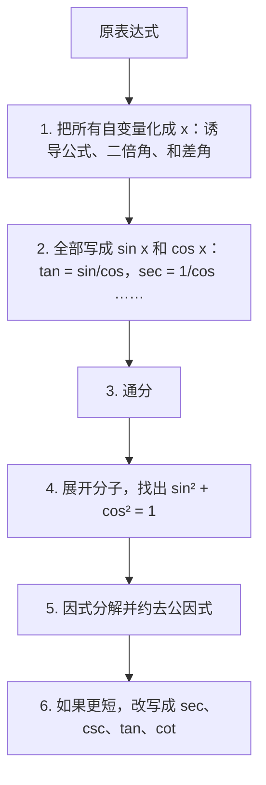
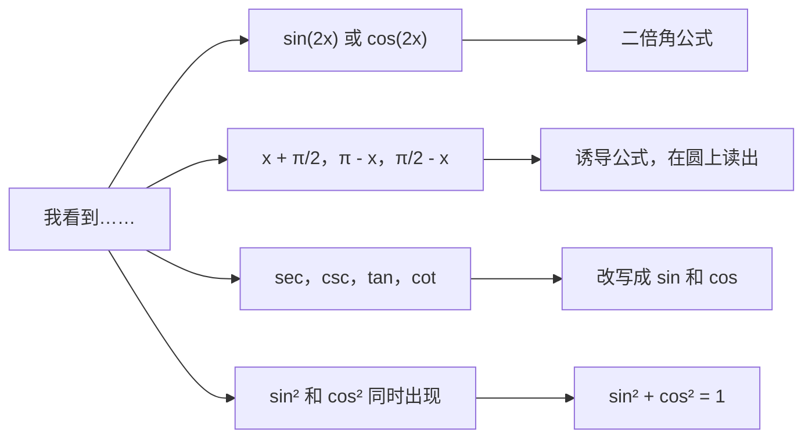

# 4. 三角恒等式与化简

> **目标**：把三角表达式变形，使其中只含自变量 $$(x)$$，然后把它化简到「字符尽可能少」（« Test 1 Pb 3 » 的要求），并证明恒等式。

---

## 1. 引言与定义

**恒等式**（identité）是对变量的**所有**取值（只要两边有定义）都成立的等式（例如 $$\sin^2 x + \cos^2 x = 1$$）。我们把它们当作改写表达式的工具。

### 1.1 必备公式表

**勾股恒等式**

$$\sin^2 x + \cos^2 x = 1 \qquad 1 + \tan^2 x = \sec^2 x \qquad 1 + \cot^2 x = \csc^2 x$$

**和差角公式**（formules d'addition）

$$\sin(a \pm b) = \sin a\cos b \pm \cos a\sin b$$

$$\cos(a \pm b) = \cos a\cos b \mp \sin a\sin b$$

$$\tan(a \pm b) = \frac{\tan a \pm \tan b}{1 \mp \tan a\tan b}$$

**二倍角公式**（formules de duplication，即 $$a = b = x$$ 的情形）

$$\sin(2x) = 2\sin x\cos x$$

$$\cos(2x) = \cos^2 x - \sin^2 x = 2\cos^2 x - 1 = 1 - 2\sin^2 x$$

**降幂公式**（由上式解出 $$\cos^2$$ 或 $$\sin^2$$）

$$\cos^2 x = \frac{1 + \cos(2x)}{2} \qquad \sin^2 x = \frac{1 - \cos(2x)}{2}$$

**诱导公式**（见第 2 章）：例如 $$\sin\left(\frac{\pi}{2} - x\right) = \cos x$$，$$\cos(\pi - x) = -\cos x$$，$$\tan\left(x + \frac{\pi}{2}\right) = -\cot x$$。

> $$\cos(2x)$$ 有**三种**写法：选能消掉某一项的那种。如果旁边有「$$1 +$$」，$$\cos(2x) = 2\cos^2 x - 1$$ 或 $$1 - 2\sin^2 x$$ 常常能把它吸收掉。

### 1.2 什么叫「最简」表达式？

测验中会数字符个数：$$\frac{\sin^2 x}{2}$$ 算 7 个字符。所以目标是 $$2$$、$$\sec x$$、$$\frac{1}{2}\cot x$$、$$-4\sec x\tan x$$、$$4\cos^4 x$$ 这类结果。

---

## 2. 解题方法

### 化简的一般方法

### 证明恒等式 $$A = B$$

- 从**较复杂**的一边出发，把它变形成另一边。
- **不要**从「$$A = B$$」出发同时变形两边直到「$$0 = 0$$」而不写等价关系：这是逻辑错误。
- 每一步写明**所用的性质**（题目经常要求）。

---

## 3. 详细计算示例

### 示例 1：（Test 1 Pb 3，A 卷，a）

$$\frac{1 + \cos(2x) - \cos^2 x}{\sin(2x)}$$

**第 1 步：自变量化为 $$x$$。** 代入 $$\cos(2x) = \cos^2 x - \sin^2 x$$ 和 $$\sin(2x) = 2\sin x\cos x$$：

$$= \frac{1 + \cos^2 x - \sin^2 x - \cos^2 x}{2\sin x\cos x} = \frac{1 - \sin^2 x}{2\sin x\cos x}$$

**第 2 步：勾股恒等式。** $$1 - \sin^2 x = \cos^2 x$$：

$$= \frac{\cos^2 x}{2\sin x\cos x} = \frac{\cos x}{2\sin x} = \frac{1}{2}\cot x$$

### 示例 2：（Test 1 Pb 3，A 卷，b）

$$\frac{\cos x}{1 - \sin x} - \tan x$$

**第 1 步：全部写成正弦和余弦**，公分母为 $$(1 - \sin x)\cos x$$：

$$= \frac{\cos x \cdot \cos x - \sin x(1 - \sin x)}{(1 - \sin x)\cos x} = \frac{\cos^2 x + \sin^2 x - \sin x}{(1 - \sin x)\cos x}$$

**第 2 步：分子用勾股恒等式**：$$\cos^2 x + \sin^2 x = 1$$：

$$= \frac{1 - \sin x}{(1 - \sin x)\cos x} = \frac{1}{\cos x} = \sec x$$

### 示例 3：（Test 1 Pb 3，A 卷，c）

$$\frac{\tan x - \tan\left(x + \frac{\pi}{2}\right)}{\csc\left(\frac{\pi}{2} - x\right)}$$

**第 1 步：诱导公式。** $$\tan\left(x + \frac{\pi}{2}\right) = -\cot x$$，$$\csc\left(\frac{\pi}{2} - x\right) = \frac{1}{\sin\left(\frac{\pi}{2} - x\right)} = \frac{1}{\cos x}$$：

$$= \frac{\tan x + \cot x}{1/\cos x} = \cos x\left(\frac{\sin x}{\cos x} + \frac{\cos x}{\sin x}\right)$$

**第 2 步：通分**：

$$= \cos x \cdot \frac{\sin^2 x + \cos^2 x}{\sin x\cos x} = \cos x \cdot \frac{1}{\sin x\cos x} = \frac{1}{\sin x} = \csc x$$

### 示例 4：结果是常数（Test 1 Pb 3，D 卷）

$$\left[\sec x + \csc x\right]\cdot\left[\sin x + \cos x\right] - 2\csc(2x)$$

**第 1 步**：第一个方括号等于 $$\frac{1}{\cos x} + \frac{1}{\sin x} = \frac{\sin x + \cos x}{\sin x\cos x}$$，而 $$\csc(2x) = \frac{1}{2\sin x\cos x}$$：

$$= \frac{(\sin x + \cos x)^2}{\sin x\cos x} - \frac{2}{2\sin x\cos x} = \frac{(\sin x + \cos x)^2 - 1}{\sin x\cos x}$$

**第 2 步**：完全平方公式和勾股恒等式：$$(\sin x + \cos x)^2 = 1 + 2\sin x\cos x$$：

$$= \frac{2\sin x\cos x}{\sin x\cos x} = 2$$

### 示例 5：证明恒等式（2017 年测验）

*证明 $$\frac{1 - \cos(2x)}{\sin(2x)} = \tan x$$。*

从左边出发：

$$\frac{1 - \cos(2x)}{\sin(2x)} = \frac{1 - (1 - 2\sin^2 x)}{2\sin x\cos x} = \frac{2\sin^2 x}{2\sin x\cos x} = \frac{\sin x}{\cos x} = \tan x$$

所用性质：$$\cos(2x) = 1 - 2\sin^2 x$$（二倍角，选这种写法是为了消去 $$1$$），$$\sin(2x) = 2\sin x\cos x$$（二倍角），约去 $$2\sin x \neq 0$$。

---

## 4. 可视化：选哪个公式？

---

## 5. 练习

### 练习 1：（Test 1 Pb 3，D 卷，a）

化简 $$\dfrac{1 - \sin x}{1 + \sin x} - \dfrac{1 + \sin x}{1 - \sin x}$$。

点击查看提示

公分母是 $$(1 + \sin x)(1 - \sin x) = 1 - \sin^2 x = \cos^2 x$$。分子中展开两个平方。

**详细解答**

1. 通分：

$$\frac{(1 - \sin x)^2 - (1 + \sin x)^2}{(1 + \sin x)(1 - \sin x)}$$

2. 分子：$$(1 - 2\sin x + \sin^2 x) - (1 + 2\sin x + \sin^2 x) = -4\sin x$$。
3. 分母：$$1 - \sin^2 x = \cos^2 x$$。
4. 结果：

$$\frac{-4\sin x}{\cos^2 x} = -4 \cdot \frac{1}{\cos x}\cdot\frac{\sin x}{\cos x} = -4\sec x\tan x$$

### 练习 2：（Test 1 Pb 3，B 卷，b）

化简 $$\left[2\cos x + \sin(2x)\right]\cdot\left[2\cos x - \sin(2x)\right]$$。

点击查看提示

认出 $$(a + b)(a - b) = a^2 - b^2$$，再写 $$\sin(2x) = 2\sin x\cos x$$，提取公因式 $$4\cos^2 x$$。

**详细解答**

1. 平方差公式：$$= 4\cos^2 x - \sin^2(2x)$$。
2. 二倍角：$$\sin^2(2x) = 4\sin^2 x\cos^2 x$$。
3. 提取公因式：

$$4\cos^2 x - 4\sin^2 x\cos^2 x = 4\cos^2 x\left(1 - \sin^2 x\right) = 4\cos^2 x \cdot \cos^2 x = 4\cos^4 x$$

### 练习 3：（Test 1 Pb 3，C 卷）

化简 a) $$\dfrac{1 - \cos(2x) - \sin^2 x}{1 - \sin^2 x}$$ 和 b) $$\dfrac{\sec x + \csc x}{1 + \tan x}$$。

点击查看提示

a) 用 $$\cos(2x) = 1 - 2\sin^2 x$$ 消去 $$1$$。b) 全部写成正弦和余弦，再化简「繁分式」。

**详细解答**

a) 分子：$$1 - (1 - 2\sin^2 x) - \sin^2 x = \sin^2 x$$；分母：$$\cos^2 x$$。所以：

$$\frac{\sin^2 x}{\cos^2 x} = \tan^2 x$$

b) 分子：$$\frac{1}{\cos x} + \frac{1}{\sin x} = \frac{\sin x + \cos x}{\sin x\cos x}$$。分母：$$1 + \frac{\sin x}{\cos x} = \frac{\cos x + \sin x}{\cos x}$$。相除：

$$\frac{\sin x + \cos x}{\sin x\cos x}\cdot\frac{\cos x}{\sin x + \cos x} = \frac{1}{\sin x} = \csc x$$
