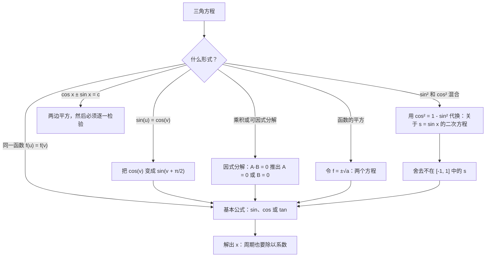
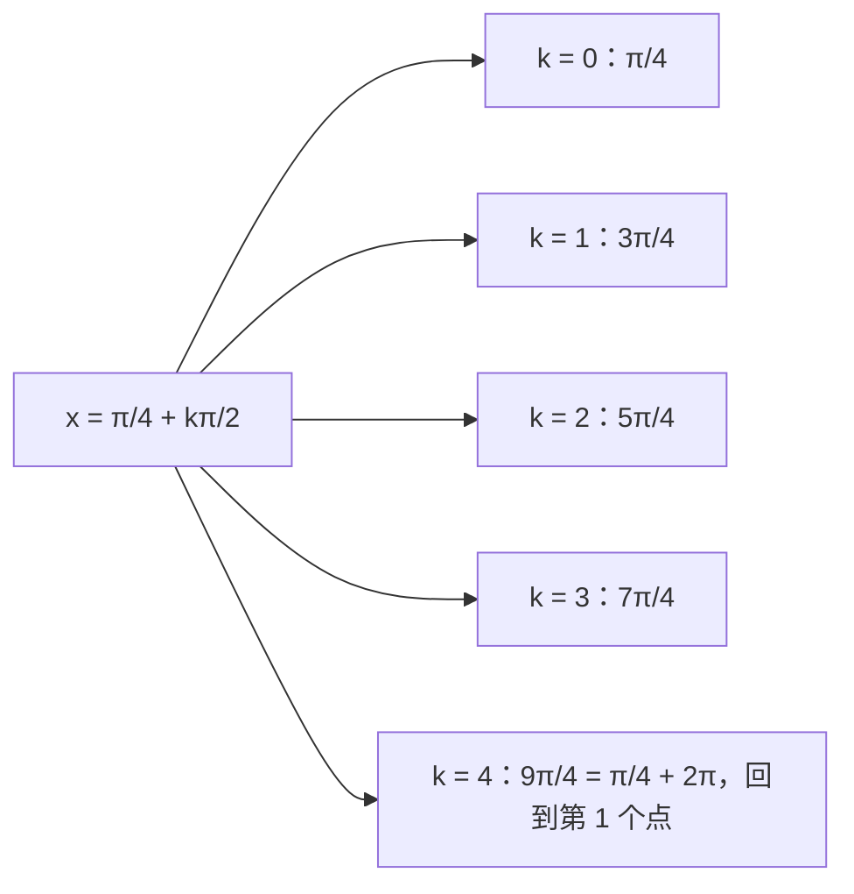

# 5. 三角方程

> **目标**：求出三角方程的**所有**实数解（带上 $$+2k\pi$$ 或 $$+k\pi$$），在圆上表示这些解，并避免增根。对应 « Test 1 Pb 4 » 以及每次 TE F-1 中的「三角方程」题。

---

## 1. 引言与定义

三角函数是**周期函数**：像 $$\sin x = \frac{1}{2}$$ 这样的方程有**无穷多个**解。我们用 $$x = x_0 + 2k\pi$$，$$k \in \mathbb{Z}$$ 这种**解族**来描述它们。

### 1.1 三个基本方程

由三角函数单位圆可得：

**正弦**：圆上两个点纵坐标相同，它们关于 $$Oy$$ 轴对称：

$$\sin u = \sin v \iff u = v + 2k\pi \quad \text{或} \quad u = \pi - v + 2k\pi, \quad k \in \mathbb{Z}$$

**余弦**：两个点横坐标相同，它们关于 $$Ox$$ 轴对称：

$$\cos u = \cos v \iff u = v + 2k\pi \quad \text{或} \quad u = -v + 2k\pi, \quad k \in \mathbb{Z}$$

**正切**：周期为 $$\pi$$，只有一个解族：

$$\tan u = \tan v \iff u = v + k\pi, \quad k \in \mathbb{Z}$$

### 1.2 必须知道的特殊情况

| 方程 | 解 |
| --- | --- |
| $$\sin u = 0$$ | $$u = k\pi$$ |
| $$\cos u = 0$$ | $$u = \frac{\pi}{2} + k\pi$$ |
| $$\sin u = 1$$ | $$u = \frac{\pi}{2} + 2k\pi$$ |
| $$\cos u = -1$$ | $$u = \pi + 2k\pi$$ |
| $$\sin u = a$$，且 $$a > 1$$ 或 $$a < -1$$ | **无**解 |

### 1.3 在不同函数之间转换

为了使两边是「同一种」函数，使用：

$$\cos\theta = \sin\left(\theta + \frac{\pi}{2}\right) \qquad \sin\theta = \cos\left(\frac{\pi}{2} - \theta\right) \qquad -\sin\theta = \sin(-\theta)$$

---

## 2. 解题方法

### 注意事项

1. **周期也要除**：若 $$3x = \frac{\pi}{2} + 2k\pi$$，则 $$x = \frac{\pi}{6} + \frac{2k\pi}{3}$$。周期同样被除以 3！
2. **不要除以可能为零的函数**：在 $$\sin(2x) = \sin x$$ 中，应提取 $$\sin x$$ 作**因式分解**，而不是约去它，否则会丢掉 $$\sin x = 0$$ 的解。
3. **定义条件**：一旦出现 $$\tan x$$ 或 $$\frac{1}{\cos x}$$，写上「假设 $$\cos x \neq 0$$」，并检查解是否满足。
4. **两边平方**会产生增根，必须把每个解族代回原方程检验。

### 在圆上表示解

解族 $$x = x_0 + \frac{2k\pi}{n}$$ 在圆上给出 **$$n$$ 个**等距的点（一个正多边形）。例如 $$x = \frac{\pi}{4} + \frac{k\pi}{2}$$ 给出 4 个点：$$\frac{\pi}{4}$$、$$\frac{3\pi}{4}$$、$$\frac{5\pi}{4}$$、$$\frac{7\pi}{4}$$。

---

## 3. 详细计算示例

### 示例 1：正弦与余弦（Test 1 Pb 4，A 卷，a）

$$\sin\left(2x + \frac{\pi}{3}\right) - \cos\left(x + \frac{\pi}{2}\right) = 0$$

**第 1 步：两边化成同一函数。** $$\cos\theta = \sin\left(\theta + \frac{\pi}{2}\right)$$ 给出：

$$\sin\left(2x + \frac{\pi}{3}\right) = \sin\left(x + \frac{\pi}{2} + \frac{\pi}{2}\right) = \sin(x + \pi)$$

**第 2 步：正弦公式，第一族：**

$$2x + \frac{\pi}{3} = x + \pi + 2k\pi \iff x = \frac{2\pi}{3} + 2k\pi$$

**第 3 步：第二族：**

$$2x + \frac{\pi}{3} = \pi - (x + \pi) + 2k\pi = -x + 2k\pi \iff 3x = -\frac{\pi}{3} + 2k\pi \iff x = -\frac{\pi}{9} + \frac{2k\pi}{3}$$

$$S = \left\{\frac{2\pi}{3} + 2k\pi \;;\; -\frac{\pi}{9} + \frac{2k\pi}{3} \;\middle|\; k \in \mathbb{Z}\right\}$$

### 示例 2：平方（Test 1 Pb 4，A 卷，b）

$$\cot^2\left(3x + \frac{\pi}{6}\right) = 3$$

**第 1 步**：开方时取**正负两个**符号：$$\cot\left(3x + \frac{\pi}{6}\right) = \sqrt{3}$$ 或 $$-\sqrt{3}$$。

**第 2 步**：$$\cot$$ 的周期为 $$\pi$$：

- $$\cot u = \sqrt{3} \iff u = \frac{\pi}{6} + k\pi$$；所以 $$3x + \frac{\pi}{6} = \frac{\pi}{6} + k\pi$$，即 $$x = \frac{k\pi}{3}$$。
- $$\cot u = -\sqrt{3} \iff u = \frac{5\pi}{6} + k\pi$$；所以 $$3x = \frac{2\pi}{3} + k\pi$$，即 $$x = \frac{2\pi}{9} + \frac{k\pi}{3}$$。

$$S = \left\{\frac{k\pi}{3} \;;\; \frac{2\pi}{9} + \frac{k\pi}{3} \;\middle|\; k \in \mathbb{Z}\right\}$$

### 示例 3：因式分解（Test 1 Pb 4，A 卷，c）

$$\sin(2x) - \tan x = 0 \qquad \text{假设：} \cos x \neq 0$$

**第 1 步：自变量化为 $$x$$**：$$2\sin x\cos x - \frac{\sin x}{\cos x} = 0$$。

**第 2 步：提取公因式**（绝对不要约去！）$$\sin x$$：

$$\sin x\left(2\cos x - \frac{1}{\cos x}\right) = 0$$

**第 3 步：乘积为零**：

- $$\sin x = 0 \iff x = k\pi$$（且 $$\cos(k\pi) = \pm 1 \neq 0$$ ✓）。
- $$2\cos x = \frac{1}{\cos x} \iff \cos^2 x = \frac{1}{2} \iff \cos x = \pm\frac{\sqrt{2}}{2}$$，得到模 $$2\pi$$ 的 4 个角 $$\pm\frac{\pi}{4}$$、$$\pm\frac{3\pi}{4}$$，合并为 $$x = \frac{\pi}{4} + \frac{k\pi}{2}$$。

$$S = \left\{k\pi \;;\; \frac{\pi}{4} + \frac{k\pi}{2} \;\middle|\; k \in \mathbb{Z}\right\}$$

### 示例 4：关于 $$\sin x$$ 的二次方程（2017 年测验）

$$2\cos^2 x + 3\sin x = 0$$

**第 1 步：只留一种函数**：$$\cos^2 x = 1 - \sin^2 x$$，得 $$2 - 2\sin^2 x + 3\sin x = 0$$。

**第 2 步：换元** $$s = \sin x$$：$$2s^2 - 3s - 2 = 0$$，判别式 $$\Delta = 9 + 16 = 25$$：

$$s = \frac{3 \pm 5}{4} \quad\Rightarrow\quad s = 2 \quad \text{或} \quad s = -\frac{1}{2}$$

**第 3 步：筛选**：$$\sin x = 2$$ 不可能（正弦只在 $$[-1, 1]$$ 中）。剩下 $$\sin x = -\frac{1}{2} = \sin\left(-\frac{\pi}{6}\right)$$：

$$x = -\frac{\pi}{6} + 2k\pi \quad \text{或} \quad x = \pi + \frac{\pi}{6} + 2k\pi = \frac{7\pi}{6} + 2k\pi$$

### 示例 5：增根（TE F-1，2023）

$$\cos x - \sin x = 1$$

**第 1 步：两边平方**：$$\cos^2 x - 2\sin x\cos x + \sin^2 x = 1 \iff 1 - \sin(2x) = 1 \iff \sin(2x) = 0$$。

**第 2 步**：$$2x = k\pi$$，即 $$x = \frac{k\pi}{2}$$。一圈内的候选值：$$0$$、$$\frac{\pi}{2}$$、$$\pi$$、$$\frac{3\pi}{2}$$。

**第 3 步：代回原方程检验**：

| $$x$$ | $$\cos x - \sin x$$ | 是解吗？ |
| --- | --- | --- |
| $$0$$ | $$1 - 0 = 1$$ | ✓ |
| $$\frac{\pi}{2}$$ | $$0 - 1 = -1$$ | ✗ |
| $$\pi$$ | $$-1 - 0 = -1$$ | ✗ |
| $$\frac{3\pi}{2}$$ | $$0 - (-1) = 1$$ | ✓ |

$$S = \left\{2k\pi \;;\; \frac{3\pi}{2} + 2k\pi \;\middle|\; k \in \mathbb{Z}\right\}$$

平方引入了 $$\cos x - \sin x = -1$$ 的解：必须把它们排除。

### 示例 6：非特殊值（TE F-1，2025）

$$4\cos(2x) + 1 = 0 \iff \cos(2x) = -\frac{1}{4}$$

$$-\frac{1}{4}$$ 不是特殊值：保留 $$\arccos$$（TE 允许用计算器）：

$$2x = \pm\arccos\left(-\frac{1}{4}\right) + 2k\pi \iff x = \pm\frac{1}{2}\arccos\left(-\frac{1}{4}\right) + k\pi \approx \pm 0{,}912 + k\pi$$

---

## 4. 可视化：从方程到圆上的点

不同点的个数等于 $$\frac{2\pi}{\text{解族的周期}}$$；这里 $$\frac{2\pi}{\pi/2} = 4$$：圆内接正方形。

---

## 5. 练习

### 练习 1：（2017 年 TE）

在 $$\mathbb{R}$$ 中解方程：$$\cos(4x) = \sin x$$。

点击查看提示

写成 $$\sin x = \cos\left(\frac{\pi}{2} - x\right)$$，再用 $$\cos u = \cos v \iff u = \pm v + 2k\pi$$。

**详细解答**

1. $$\cos(4x) = \cos\left(\frac{\pi}{2} - x\right)$$。
2. 第一族：$$4x = \frac{\pi}{2} - x + 2k\pi \iff 5x = \frac{\pi}{2} + 2k\pi \iff x = \frac{\pi}{10} + \frac{2k\pi}{5}$$。
3. 第二族：$$4x = -\frac{\pi}{2} + x + 2k\pi \iff 3x = -\frac{\pi}{2} + 2k\pi \iff x = -\frac{\pi}{6} + \frac{2k\pi}{3}$$。

$$S = \left\{\frac{\pi}{10} + \frac{2k\pi}{5} \;;\; -\frac{\pi}{6} + \frac{2k\pi}{3} \;\middle|\; k \in \mathbb{Z}\right\}$$

### 练习 2：（Test 1 Pb 4，C 卷）

解 $$\sec^2\left(4x + \frac{\pi}{6}\right) = 2$$。

点击查看提示

$$\sec^2 u = 2 \iff \cos^2 u = \frac{1}{2} \iff \cos u = \pm\frac{\sqrt{2}}{2}$$。一圈内对应的四个角可以写成一个周期为 $$\frac{\pi}{2}$$ 的解族。

**详细解答**

1. $$\cos^2\left(4x + \frac{\pi}{6}\right) = \frac{1}{2}$$，所以 $$\cos\left(4x + \frac{\pi}{6}\right) = \pm\frac{\sqrt{2}}{2}$$。
2. 满足 $$\cos u = \pm\frac{\sqrt{2}}{2}$$ 的角 $$u$$ 在模 $$2\pi$$ 下为 $$\frac{\pi}{4}, \frac{3\pi}{4}, \frac{5\pi}{4}, \frac{7\pi}{4}$$，即 $$u = \frac{\pi}{4} + \frac{k\pi}{2}$$。
3. 解出 $$x$$：

$$4x + \frac{\pi}{6} = \frac{\pi}{4} + \frac{k\pi}{2} \iff 4x = \frac{\pi}{12} + \frac{k\pi}{2} \iff x = \frac{\pi}{48} + \frac{k\pi}{8}, \quad k \in \mathbb{Z}$$

### 练习 3：（TE F-1，2022）

解 $$\frac{1}{3}\tan^2(2x) - 1 = 0$$，并在三角函数单位圆上表示这些解。

点击查看提示

先得 $$\tan^2(2x) = 3$$，再取 $$\tan(2x) = \pm\sqrt{3}$$；别忘了正切的周期是 $$\pi$$（除以 2 后变成 $$\frac{\pi}{2}$$）。

**详细解答**

1. $$\tan^2(2x) = 3 \iff \tan(2x) = \sqrt{3}$$ 或 $$\tan(2x) = -\sqrt{3}$$。
2. $$\tan(2x) = \sqrt{3} \iff 2x = \frac{\pi}{3} + k\pi \iff x = \frac{\pi}{6} + \frac{k\pi}{2}$$。
3. $$\tan(2x) = -\sqrt{3} \iff 2x = -\frac{\pi}{3} + k\pi \iff x = -\frac{\pi}{6} + \frac{k\pi}{2}$$。

$$S = \left\{\pm\frac{\pi}{6} + \frac{k\pi}{2} \;\middle|\; k \in \mathbb{Z}\right\}$$

4. 在圆上：每个解族给出 4 个点（周期 $$\frac{\pi}{2}$$），共 8 个点：$$\frac{\pi}{6}, \frac{2\pi}{3}, \frac{7\pi}{6}, \frac{5\pi}{3}$$ 以及 $$\frac{\pi}{3}, \frac{5\pi}{6}, \frac{4\pi}{3}, \frac{11\pi}{6}$$。
5. 定义条件：$$\cos(2x) \neq 0$$。这些值都不会使它为零 ✓。
