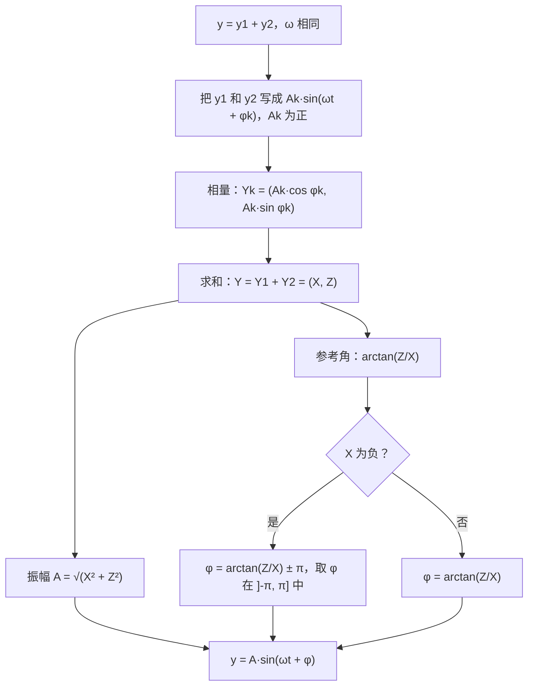

# 6. 简谐振动与相量

> **目标**：读出并画出信号 $$y(t) = A\sin(\omega t + \varphi)$$，确定振幅、周期、频率和相位差，并用相量**把两个振动相加**。对应 « Test 2 Pb 1 » 以及每次 TE F-1 中的「振动 / 叠加」题。

---

## 1. 引言与定义

### 1.1 正弦模型

**简谐信号**（signal harmonique，正弦信号）写作：

$$y(t) = A\sin(\omega t + \varphi)$$

| 符号 | 名称 | 单位 | 在图像上怎么读 |
| --- | --- | --- | --- |
| $$A > 0$$ | 振幅（amplitude） | $$y$$ 的单位 | 波峰相对于横轴的高度 |
| $$\omega > 0$$ | 角速度（角频率，vitesse angulaire） | rad/s | $$\omega = \frac{2\pi}{T}$$ |
| $$T$$ | 周期（période） | s | 两个波峰之间的距离 |
| $$f$$ | 频率（fréquence） | Hz | $$f = \frac{1}{T} = \frac{\omega}{2\pi}$$ |
| $$\varphi$$ | 初相位（angle de phase） | rad | 「起点」的位置 |

正弦的**起点**（« départ »）是曲线**向上**穿过横轴的点（对于 $$\sin$$，就是角 $$0$$）。

### 1.2 相位差：超前与滞后

可以写成 $$y(t) = A\sin\left(\omega\left(t + \frac{\varphi}{\omega}\right)\right)$$。所以这个信号就是基本正弦**在时间上平移**了：

$$\Delta t = \frac{\varphi}{\omega}$$

- 若 $$\varphi > 0$$，起点在 $$t = -\frac{\varphi}{\omega} < 0$$：信号**超前**（avance）$$\frac{\varphi}{\omega}$$。
- 若 $$\varphi < 0$$，起点在 $$t > 0$$：信号**滞后**（retard）。

因为 $$\varphi$$ 可以相差 $$2\pi$$，同一个信号既可以说超前，也可以说滞后（两者相差一个周期 $$T$$）。

> **实用规则**：在图上读出某个起点的横坐标 $$t_0$$，则 $$\varphi = -\omega\, t_0$$。

### 1.3 把余弦变成正弦

为了写成标准形式 $$A\sin(\omega t + \varphi)$$ 且 $$A > 0$$：

$$\cos\theta = \sin\left(\theta + \frac{\pi}{2}\right) \qquad -\sin\theta = \sin(\theta + \pi) \qquad -\cos\theta = \sin\left(\theta - \frac{\pi}{2}\right)$$

### 1.4 相量

对每个振动 $$A\sin(\omega t + \varphi)$$，对应平面上的一个向量，称为**相量**（phaseur）：

$$\vec{Y} = \begin{pmatrix} A\cos\varphi \\ A\sin\varphi \end{pmatrix}$$

这是一个长度为 $$A$$、与水平轴夹角为 $$\varphi$$ 的向量。**基本性质**：对于**角速度 $$\omega$$ 相同**的两个信号，和的相量等于相量的和。所以振动的相加就像向量的相加。

若 $$y_1 + y_2 = A\sin(\omega t + \varphi)$$：

$$A\cos\varphi = A_1\cos\varphi_1 + A_2\cos\varphi_2 \qquad A\sin\varphi = A_1\sin\varphi_1 + A_2\sin\varphi_2$$

$$A = \sqrt{(A\cos\varphi)^2 + (A\sin\varphi)^2} \qquad \tan\varphi = \frac{A\sin\varphi}{A\cos\varphi}$$

等价的直接公式（余弦定理）：

$$A^2 = A_1^2 + A_2^2 + 2A_1A_2\cos(\varphi_1 - \varphi_2)$$

> **象限陷阱**：$$\arctan$$ 给出 $$\left]-\frac{\pi}{2}, \frac{\pi}{2}\right[$$ 中的角。如果水平分量 $$A\cos\varphi$$ 是**负**的，相量在第二或第三象限，必须**加上或减去 $$\pi$$**。

---

## 2. 解题方法

### 方法 A：从图像读出特征量

1. **振幅** $$A$$：最大高度。
2. **周期** $$T$$：两个波峰（或两个起点）之间的距离。
3. $$\omega = \frac{2\pi}{T}$$，$$f = \frac{1}{T}$$。
4. **起点**：找出曲线向上穿过横轴的 $$t_0$$（最接近 $$0$$ 的那个）。
5. $$\varphi = -\omega t_0$$；$$t_0 < 0$$ 为超前，$$t_0 > 0$$ 为滞后。

### 方法 B：画出 $$y(t) = A\sin(\omega t + \varphi)$$

1. 计算 $$T = \frac{2\pi}{\omega}$$ 和起点 $$t_0 = -\frac{\varphi}{\omega}$$。
2. 标出起点，然后每隔四分之一周期标出关键点：起点（$$0$$）、波峰（$$A$$）、下降零点（$$0$$）、波谷（$$-A$$）、新的起点。
3. 选合适的网格：如果 $$T$$ 含 $$\pi$$，横轴按 $$\pi$$ 的倍数刻度，否则按整数刻度。

### 方法 C：两个振动的叠加

---

## 3. 详细计算示例

### 示例 1：读图（Test 2 Pb 1，A 卷）

*一个信号在 $$-3$$ 和 $$3$$ 之间振动；读出两个相邻的起点（向上穿过 $$0$$）在 $$t = -1$$ 和 $$t = 4$$。*

- 振幅：$$A = 3$$。
- 周期：两个起点间的距离 $$T = 4 - (-1) = 5$$ s，所以 $$\omega = \frac{2\pi}{5}$$ rad/s，$$f = \frac{1}{5} = 0{,}2$$ Hz。
- 最接近 $$0$$ 的起点：$$t_0 = -1$$，所以 $$\varphi = -\omega t_0 = \frac{2\pi}{5}$$。
- 信号**超前 1 s**（等价地，若用起点 $$t_0 = 4$$，则滞后 $$4$$ s，此时 $$\varphi = -\frac{8\pi}{5}$$）。

$$y(t) = 3\sin\left(\frac{2\pi}{5}t + \frac{2\pi}{5}\right)$$

检验：波峰在起点之后四分之一周期，即 $$t = -1 + \frac{5}{4} = 0{,}25$$；且 $$y(0) = 3\sin\left(\frac{2\pi}{5}\right) \approx 2{,}85$$，略低于波峰。与图像一致 ✓。

### 示例 2：画信号（Test 2 Pb 1，A 卷）

*画出 $$y(t) = 2\sin\left(\frac{3}{2}t - \frac{9\pi}{8}\right)$$。*

1. $$\omega = \frac{3}{2}$$ rad/s，所以 $$T = \frac{2\pi}{3/2} = \frac{4\pi}{3}$$ s：选按 $$\pi$$ 的倍数刻度的网格。
2. 起点：$$t_0 = -\frac{\varphi}{\omega} = \frac{9\pi/8}{3/2} = \frac{3\pi}{4}$$（滞后）。更接近 $$0$$ 的起点：$$\frac{3\pi}{4} - \frac{4\pi}{3} = -\frac{7\pi}{12}$$。
3. 四分之一周期：$$\frac{T}{4} = \frac{\pi}{3}$$。从 $$t_0 = -\frac{7\pi}{12}$$ 开始：波峰 $$y = 2$$ 在 $$-\frac{\pi}{4}$$，下降零点在 $$\frac{\pi}{12}$$，波谷 $$y = -2$$ 在 $$\frac{5\pi}{12}$$，新起点在 $$\frac{3\pi}{4}$$。

### 示例 3：叠加（Test 2 Pb 1，A 卷）

*$$y_1(t) = 2\sin\left(\frac{2\pi}{7}t - \frac{\pi}{6}\right)$$，$$y_2(t) = 4\sin\left(\frac{2\pi}{7}t - \frac{5\pi}{6}\right)$$。把 $$y_1 + y_2$$ 写成 $$A\sin(\omega t + \varphi)$$。*

**第 1 步：相量的分量。**

$$X = 2\cos\left(-\frac{\pi}{6}\right) + 4\cos\left(-\frac{5\pi}{6}\right) = 2\cdot\frac{\sqrt{3}}{2} + 4\cdot\left(-\frac{\sqrt{3}}{2}\right) = \sqrt{3} - 2\sqrt{3} = -\sqrt{3}$$

$$Z = 2\sin\left(-\frac{\pi}{6}\right) + 4\sin\left(-\frac{5\pi}{6}\right) = 2\cdot\left(-\frac{1}{2}\right) + 4\cdot\left(-\frac{1}{2}\right) = -3$$

**第 2 步：振幅。**

$$A = \sqrt{(-\sqrt{3})^2 + (-3)^2} = \sqrt{3 + 9} = \sqrt{12} = 2\sqrt{3}$$

**第 3 步：相位。** $$\tan\varphi = \frac{-3}{-\sqrt{3}} = \sqrt{3}$$，参考角为 $$\frac{\pi}{3}$$。但 $$X < 0$$ 且 $$Z < 0$$：相量在**第三象限**。减去 $$\pi$$：

$$\varphi = \frac{\pi}{3} - \pi = -\frac{2\pi}{3}$$

$$y_1(t) + y_2(t) = 2\sqrt{3}\sin\left(\frac{2\pi}{7}t - \frac{2\pi}{3}\right)$$

### 示例 4：正弦与余弦混合（TE F-1，2025）

*把 $$y(t) = \cos\left(\pi t + \frac{\pi}{6}\right) - 2\sin\left(-\pi t + \frac{\pi}{2}\right)$$ 写成 $$A\sin(\omega t + \varphi)$$，其中 $$\varphi \in \left]-\pi, \pi\right]$$。*

**第 1 步：每一项写成标准形式。**

- $$y_1 = \cos\left(\pi t + \frac{\pi}{6}\right) = \sin\left(\pi t + \frac{\pi}{6} + \frac{\pi}{2}\right) = \sin\left(\pi t + \frac{2\pi}{3}\right)$$：$$A_1 = 1$$，$$\varphi_1 = \frac{2\pi}{3}$$。
- $$\sin\left(\frac{\pi}{2} - \pi t\right) = \cos(\pi t)$$，所以 $$y_2 = -2\cos(\pi t) = 2\sin\left(\pi t - \frac{\pi}{2}\right)$$：$$A_2 = 2$$，$$\varphi_2 = -\frac{\pi}{2}$$。

**第 2 步：相量。**

$$\vec{Y}_1 = \begin{pmatrix} \cos\frac{2\pi}{3} \\ \sin\frac{2\pi}{3} \end{pmatrix} = \begin{pmatrix} -\frac{1}{2} \\ \frac{\sqrt{3}}{2} \end{pmatrix} \qquad \vec{Y}_2 = \begin{pmatrix} 0 \\ -2 \end{pmatrix} \qquad \vec{Y} = \begin{pmatrix} -\frac{1}{2} \\ \frac{\sqrt{3}}{2} - 2 \end{pmatrix} \approx \begin{pmatrix} -0{,}5 \\ -1{,}134 \end{pmatrix}$$

**第 3 步：振幅和相位。**

$$A = \sqrt{\frac{1}{4} + \left(\frac{\sqrt{3}}{2} - 2\right)^2} = \sqrt{5 - 2\sqrt{3}} \approx 1{,}24$$

相量在第三象限（$$X < 0$$，$$Z < 0$$）：$$\arctan\left(\frac{-1{,}134}{-0{,}5}\right) \approx 1{,}155$$，所以 $$\varphi \approx 1{,}155 - \pi \approx -1{,}99$$ rad。

$$y(t) \approx 1{,}24\sin(\pi t - 1{,}99)$$

### 示例 5：弹簧（TE F-1，2022）

*$$d(t) = 10\cos\left(\frac{\pi}{6}t + \varphi - \frac{\pi}{2}\right)$$（单位 cm）。$$t = 0$$ 时 $$d = 5$$，且物体正在**向下**运动。求 $$\varphi$$，再求 $$A$$、$$T$$、$$f$$ 和相位差。*

**第 1 步：化简**：$$\cos\left(\theta - \frac{\pi}{2}\right) = \sin\theta$$，所以 $$d(t) = 10\sin\left(\frac{\pi}{6}t + \varphi\right)$$。

**第 2 步：初始条件**：$$10\sin\varphi = 5 \iff \sin\varphi = \frac{1}{2}$$，所以 $$\varphi = \frac{\pi}{6}$$ 或 $$\varphi = \frac{5\pi}{6}$$。

**第 3 步：运动方向。**「向下」意味着 $$d$$ 在**减小**。$$t = 0$$ 之后，自变量 $$\frac{\pi}{6}t + \varphi$$ 从 $$\varphi$$ 开始增大：当圆上的点位于正弦递减的部分时 $$d$$ 减小，即 $$\cos\varphi < 0$$。所以 $$\varphi = \frac{5\pi}{6}$$。

**第 4 步：特征量。**

$$A = 10 \text{ cm} \qquad T = \frac{2\pi}{\pi/6} = 12 \text{ s} \qquad f = \frac{1}{12} \text{ Hz} \qquad t_0 = -\frac{\varphi}{\omega} = -\frac{5\pi/6}{\pi/6} = -5 \text{ s}$$

信号超前 5 s（起点在 $$t = -5$$，波峰在 $$t = -2$$，下降零点在 $$t = 1$$）。

---

## 4. 可视化：一个周期中的四个关键点

---

## 5. 练习

### 练习 1：读信号

一个正弦信号在 $$t = 1$$ s 和 $$t = 7$$ s 处有高度为 $$2$$ 的波峰（两者之间没有其他波峰）。求 $$A$$、$$T$$、$$\omega$$、$$f$$、$$\varphi$$（在 $$\left]-\pi, \pi\right]$$ 中）以及表达式 $$y(t)$$。

点击查看提示

起点在波峰**之前**四分之一周期。然后 $$\varphi = -\omega t_0$$。

**详细解答**

1. $$A = 2$$；相邻两个波峰相差一个周期：$$T = 6$$ s。
2. $$\omega = \frac{2\pi}{6} = \frac{\pi}{3}$$ rad/s；$$f = \frac{1}{6}$$ Hz。
3. 起点：$$t_0 = 1 - \frac{T}{4} = 1 - 1{,}5 = -0{,}5$$ s。
4. $$\varphi = -\omega t_0 = \frac{\pi}{3}\cdot 0{,}5 = \frac{\pi}{6}$$（超前 $$0{,}5$$ s）。

$$y(t) = 2\sin\left(\frac{\pi}{3}t + \frac{\pi}{6}\right)$$

检验：$$y(1) = 2\sin\left(\frac{\pi}{3} + \frac{\pi}{6}\right) = 2\sin\frac{\pi}{2} = 2$$ ✓。

### 练习 2：叠加（Test 2 Pb 1，C 卷）

把 $$y_1 + y_2$$ 写成 $$A\sin(\omega t + \varphi)$$，其中 $$y_1(t) = 2\sin\left(\frac{t}{3} + \frac{2\pi}{3}\right)$$，$$y_2(t) = 4\sin\left(\frac{t}{3} - \frac{2\pi}{3}\right)$$。

点击查看提示

计算 $$X = 2\cos\frac{2\pi}{3} + 4\cos\left(-\frac{2\pi}{3}\right)$$ 和 $$Z = 2\sin\frac{2\pi}{3} + 4\sin\left(-\frac{2\pi}{3}\right)$$。注意 $$X$$ 的符号。

**详细解答**

1. $$X = 2\left(-\frac{1}{2}\right) + 4\left(-\frac{1}{2}\right) = -3$$。
2. $$Z = 2\cdot\frac{\sqrt{3}}{2} + 4\left(-\frac{\sqrt{3}}{2}\right) = \sqrt{3} - 2\sqrt{3} = -\sqrt{3}$$。
3. $$A = \sqrt{9 + 3} = 2\sqrt{3}$$。
4. $$\tan\varphi = \frac{-\sqrt{3}}{-3} = \frac{\sqrt{3}}{3}$$，参考角 $$\frac{\pi}{6}$$；第三象限（$$X < 0$$，$$Z < 0$$），所以 $$\varphi = \frac{\pi}{6} - \pi = -\frac{5\pi}{6}$$。

$$y_1 + y_2 = 2\sqrt{3}\sin\left(\frac{t}{3} - \frac{5\pi}{6}\right)$$

### 练习 3：两列波（2017 年测验）

设 $$f(t) = -\sin(4t)$$，$$g(t) = 2\cos\left(4t + \frac{\pi}{6}\right)$$。a) 把 $$f$$ 和 $$g$$ 写成 $$A\sin(4t + \varphi)$$。b) 把 $$h = f + g$$ 写成这种形式。

点击查看提示

$$-\sin\theta = \sin(\theta + \pi)$$，$$\cos\theta = \sin\left(\theta + \frac{\pi}{2}\right)$$。b) 用公式 $$A^2 = A_1^2 + A_2^2 + 2A_1A_2\cos(\varphi_1 - \varphi_2)$$ 很快。

**详细解答**

a) $$f(t) = \sin(4t + \pi)$$：$$A_1 = 1$$，$$\varphi_1 = \pi$$。$$g(t) = 2\sin\left(4t + \frac{\pi}{6} + \frac{\pi}{2}\right) = 2\sin\left(4t + \frac{2\pi}{3}\right)$$：$$A_2 = 2$$，$$\varphi_2 = \frac{2\pi}{3}$$。

b) 振幅：

$$A^2 = 1 + 4 + 2\cdot 1\cdot 2\cos\left(\pi - \frac{2\pi}{3}\right) = 5 + 4\cos\frac{\pi}{3} = 5 + 2 = 7 \quad\Rightarrow\quad A = \sqrt{7}$$

用分量求相位：$$X = \cos\pi + 2\cos\frac{2\pi}{3} = -1 - 1 = -2$$，$$Z = \sin\pi + 2\sin\frac{2\pi}{3} = \sqrt{3}$$。验证 $$X^2 + Z^2 = 4 + 3 = 7$$ ✓。第二象限（$$X < 0$$，$$Z > 0$$）：

$$\varphi = \arctan\left(\frac{\sqrt{3}}{-2}\right) + \pi \approx -0{,}714 + \pi \approx 2{,}43 \text{ rad}$$

$$h(t) = \sqrt{7}\sin(4t + 2{,}43)$$
