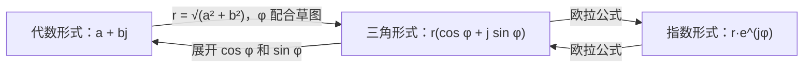
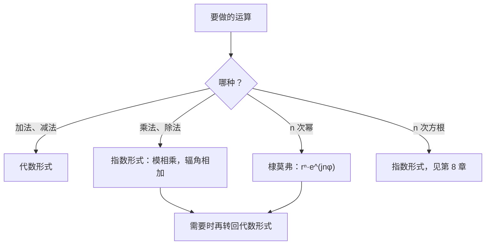

# 7. 复数：形式与运算

> **目标**：熟练地在**代数形式**、**三角形式**和**指数形式**之间转换，计算乘积、商和幂，并在高斯平面上画出点集。对应 « Test 2 Pb 2 »。

> **工程记号**：在 HEIA，虚数单位写作 $$j$$（字母 $$i$$ 留给电流）。有 $$j^2 = -1$$。

---

## 1. 引言与定义

### 1.1 代数形式

复数写作 $$z = a + bj$$，其中 $$a, b \in \mathbb{R}$$：

- $$a = \operatorname{Re}(z)$$ 是**实部**（partie réelle）；
- $$b = \operatorname{Im}(z)$$ 是**虚部**（partie imaginaire，它是一个**实数**！）；
- **共轭复数**（conjugué）是 $$\bar{z} = a - bj$$（关于实轴对称）。

用**高斯平面**（plan de Gauss，复平面：横轴为实轴，纵轴为虚轴）上的点 $$(a; b)$$ 表示 $$z$$。

### 1.2 模与辐角

- **模**（module）：到原点的距离：

$$\lvert z \rvert = r = \sqrt{a^2 + b^2}$$

- **辐角**（argument）：正实轴与向量 $$\overrightarrow{Oz}$$ 之间的角 $$\varphi = \arg(z)$$，相差 $$2\pi$$ 视为相同。有 $$\cos\varphi = \frac{a}{r}$$ 和 $$\sin\varphi = \frac{b}{r}$$。

> 只用 $$\tan\varphi = \frac{b}{a}$$ 是不够的：若 $$a < 0$$，点在左半边，必须在 $$\arctan\frac{b}{a}$$ 上**加 $$\pi$$**。一定要画一个小草图。

### 1.3 三种形式

$$z = \underbrace{a + bj}_{\text{代数形式 (A)}} = \underbrace{r\left(\cos\varphi + j\sin\varphi\right)}_{\text{三角形式 (T)}} = \underbrace{r\,e^{j\varphi}}_{\text{指数形式 (E)}}$$

(T) 与 (E) 之间的联系是**欧拉公式**：

$$e^{j\varphi} = \cos\varphi + j\sin\varphi$$

> 试卷中用圈起来的字母标记：Ⓐ = algébrique（代数），Ⓣ = trigonométrique（三角），Ⓔ = exponentielle（指数）。

### 1.4 运算

| 运算 | 最方便的形式 | 规则 |
| --- | --- | --- |
| 加法、减法 | 代数形式 | 实部与实部相加，虚部与虚部相加 |
| 乘法 | 指数形式 | $$r_1e^{j\varphi_1}\cdot r_2e^{j\varphi_2} = r_1r_2\,e^{j(\varphi_1 + \varphi_2)}$$ |
| 除法 | 指数形式，或代数形式配合共轭 | $$\frac{r_1e^{j\varphi_1}}{r_2e^{j\varphi_2}} = \frac{r_1}{r_2}e^{j(\varphi_1 - \varphi_2)}$$ |
| 乘方 | 指数形式（**棣莫弗公式**，De Moivre） | $$\left(re^{j\varphi}\right)^n = r^n e^{jn\varphi}$$ |

常用性质：$$z\bar{z} = \lvert z \rvert^2$$，$$\lvert z_1z_2 \rvert = \lvert z_1 \rvert\lvert z_2 \rvert$$，$$\arg(z_1z_2) = \arg z_1 + \arg z_2$$。

**代数形式下的除法**：分子分母同乘**分母的共轭**，使分母变成实数：

$$\frac{z_1}{z_2} = \frac{z_1\,\bar{z}_2}{z_2\,\bar{z}_2} = \frac{z_1\,\bar{z}_2}{\lvert z_2 \rvert^2}$$

### 1.5 高斯平面中的点集

设 $$z = x + yj$$：

| 条件 | 翻译 | 图形 |
| --- | --- | --- |
| $$\lvert z \rvert = R$$ | $$x^2 + y^2 = R^2$$ | 圆心 $$O$$、半径 $$R$$ 的圆 |
| $$R_1 \leq \lvert z \rvert \leq R_2$$ | | 圆环 |
| $$\lvert z - z_0 \rvert \leq R$$ | | 圆心 $$z_0$$ 的圆盘 |
| $$\arg z \in [\theta_1, \theta_2]$$ | | 扇形区域（不含原点） |
| $$\operatorname{Re}(z) = c$$ | $$x = c$$ | 竖直线 |
| $$\operatorname{Im}(z) \geq c$$ | $$y \geq c$$ | 上半平面 |

关于 $$\operatorname{Re}$$ 和 $$\operatorname{Im}$$ 的条件选**直角坐标网格**（方格），关于 $$\lvert z \rvert$$ 和 $$\arg z$$ 的条件选**极坐标网格**（同心圆）。

---

## 2. 解题方法

### 方法 A：三种形式之间的转换

### 方法 B：化简「混合」表达式

1. 先算出每一个非标准的部分（例如 $$2j\sin\frac{\pi}{3} = \sqrt{3}\,j$$，或 $$3e^{j\pi/2} = 3j$$）。
2. 全部化成代数形式再**相加**。
3. 把最终结果转换成题目要求的形式。

### 方法 C：关于幂的条件（$$z^n$$ 为实数、纯虚数……）

1. 写成 $$z = re^{j\varphi}$$。
2. $$z^n = r^n e^{jn\varphi} = r^n\left(\cos(n\varphi) + j\sin(n\varphi)\right)$$。
3. **实数** $$\iff \sin(n\varphi) = 0$$；**纯虚数** $$\iff \cos(n\varphi) = 0$$。
4. 解关于 $$n$$ 的三角方程，只保留 $$n \in \mathbb{N}^*$$（正整数）。

### 方法 D：画点集

1. 若条件与 $$\lvert z \rvert$$ 或 $$\arg z$$ 有关：用极坐标网格，直接读出。
2. 否则设 $$z = x + yj$$，化成关于 $$x$$ 和 $$y$$ 的方程或不等式，认出图形（直线、圆、带状区域……）。

---

## 3. 详细计算示例

### 示例 1：三种形式（Test 2 Pb 2，A 卷）

**a)** $$z = -\sqrt{3} + \sqrt{3}\,j$$。

- 模：$$r = \sqrt{3 + 3} = \sqrt{6}$$。
- 点 $$(-\sqrt{3}; \sqrt{3})$$ 在第二象限的角平分线上：$$\varphi = \frac{3\pi}{4}$$。

$$z = \sqrt{6}\left(\cos\frac{3\pi}{4} + j\sin\frac{3\pi}{4}\right) = \sqrt{6}\,e^{j\frac{3\pi}{4}}$$

**b)** $$z = 2e^{j\frac{\pi}{3}} = 2\left(\cos\frac{\pi}{3} + j\sin\frac{\pi}{3}\right) = 2\left(\frac{1}{2} + \frac{\sqrt{3}}{2}j\right) = 1 + \sqrt{3}\,j$$。

**c)** $$z = 3\left[\cos\frac{5\pi}{6} + j\sin\frac{5\pi}{6}\right] = 3e^{j\frac{5\pi}{6}} = 3\left(-\frac{\sqrt{3}}{2} + \frac{1}{2}j\right) = -\frac{3\sqrt{3}}{2} + \frac{3}{2}j$$。

### 示例 2：有陷阱的表达式（Test 2 Pb 2，A 卷）

**a)** $$2j\sin\frac{\pi}{3} = 2j\cdot\frac{\sqrt{3}}{2} = \sqrt{3}\,j = \sqrt{3}\,e^{j\frac{\pi}{2}}$$（正的纯虚数辐角为 $$\frac{\pi}{2}$$）。

**b)** $$4\left[\cos\left(-\frac{\pi}{6}\right) + j\sin\frac{5\pi}{6}\right]$$：**注意，两个角不一样**，这不是三角形式！直接计算：$$\cos\left(-\frac{\pi}{6}\right) = \frac{\sqrt{3}}{2}$$，$$\sin\frac{5\pi}{6} = \frac{1}{2}$$，所以：

$$4\left(\frac{\sqrt{3}}{2} + \frac{1}{2}j\right) = 2\sqrt{3} + 2j = 4e^{j\frac{\pi}{6}}$$

**c)** $$3e^{j\frac{\pi}{2}} + 2 - j = 3j + 2 - j = 2 + 2j = 2\sqrt{2}\,e^{j\frac{\pi}{4}}$$。

### 示例 3：商（Test 2 Pb 3）

**代数形式**：$$\dfrac{2 + 3j}{1 - 2j}$$。分子分母同乘共轭 $$1 + 2j$$：

$$\frac{(2 + 3j)(1 + 2j)}{(1 - 2j)(1 + 2j)} = \frac{2 + 4j + 3j + 6j^2}{1 + 4} = \frac{-4 + 7j}{5} = -\frac{4}{5} + \frac{7}{5}j$$

**指数形式**：$$\dfrac{1 - j}{\sqrt{3} + j}$$。分别转换：$$1 - j = \sqrt{2}\,e^{-j\frac{\pi}{4}}$$，$$\sqrt{3} + j = 2e^{j\frac{\pi}{6}}$$：

$$\frac{\sqrt{2}\,e^{-j\frac{\pi}{4}}}{2e^{j\frac{\pi}{6}}} = \frac{\sqrt{2}}{2}e^{j\left(-\frac{\pi}{4} - \frac{\pi}{6}\right)} = \frac{\sqrt{2}}{2}e^{-j\frac{5\pi}{12}}$$

### 示例 4：纯虚数的幂（Test 2 Pb 3，A 卷）

*对哪些 $$n \in \mathbb{N}^*$$，$$(\sqrt{3} - j)^n$$ 是纯虚数？*

1. $$\sqrt{3} - j = 2\left(\frac{\sqrt{3}}{2} - \frac{1}{2}j\right) = 2e^{-j\frac{\pi}{6}}$$。
2. $$(\sqrt{3} - j)^n = 2^n\left(\cos\left(-\frac{n\pi}{6}\right) + j\sin\left(-\frac{n\pi}{6}\right)\right)$$。
3. 纯虚数 $$\iff \cos\left(\frac{n\pi}{6}\right) = 0$$（余弦是偶函数）$$\iff \frac{n\pi}{6} = \frac{\pi}{2} + k\pi \iff n = 3 + 6k$$。
4. 由 $$n \geq 1$$：$$n \in \{3, 9, 15, 21, \dots\}$$。

### 示例 5：高次幂（2017 年测验）

*$$z = -\frac{\sqrt{2}}{2} + \frac{\sqrt{6}}{2}j$$。求 $$z^{10}$$ 的代数形式，再求使 $$z^n$$ 为实数的最小 $$n \in \mathbb{N}^*$$。*

1. $$r = \sqrt{\frac{2}{4} + \frac{6}{4}} = \sqrt{2}$$。点在第二象限，$$\tan\varphi = \frac{\sqrt{6}}{-\sqrt{2}} = -\sqrt{3}$$：$$\varphi = \pi - \frac{\pi}{3} = \frac{2\pi}{3}$$。
2. 棣莫弗公式：$$z^{10} = \left(\sqrt{2}\right)^{10}e^{j\frac{20\pi}{3}} = 32\,e^{j\frac{20\pi}{3}}$$。而 $$\frac{20\pi}{3} = 6\pi + \frac{2\pi}{3}$$，所以：

$$z^{10} = 32\,e^{j\frac{2\pi}{3}} = 32\left(-\frac{1}{2} + \frac{\sqrt{3}}{2}j\right) = -16 + 16\sqrt{3}\,j$$

3. $$z^n$$ 为实数 $$\iff \sin\left(\frac{2n\pi}{3}\right) = 0 \iff \frac{2n\pi}{3} = k\pi \iff n = \frac{3k}{2}$$。最小的正整数：$$k = 2$$，$$n = 3$$。

### 示例 6：点集（Test 2 Pb 2，A 卷）

- $$\mathcal{A} = \{z : -1 \leq \lvert z \rvert \leq 3\}$$：模总是 $$\geq 0$$，条件 $$-1 \leq$$ 自动成立。这是圆心 $$O$$、半径 $$3$$ 的**闭圆盘**。
- $$\mathcal{B} = \{z : \operatorname{Re}(z) = \lvert \operatorname{Im}(z) - 2 \rvert\}$$：设 $$z = x + yj$$，$$x = \lvert y - 2 \rvert$$。若 $$y \geq 2$$：$$x = y - 2$$，即 $$y = x + 2$$。若 $$y \leq 2$$：$$x = 2 - y$$，即 $$y = 2 - x$$。这是一个顶点在 $$(0; 2)$$、向右张开（$$x \geq 0$$）的**横躺的「V」**。
- $$\mathcal{C} = \left\{z : \arg z \in \left[\frac{2\pi}{3}, \frac{7\pi}{6}\right]\right\}$$：角度在 $$120°$$ 和 $$210°$$ 两条射线之间的扇形区域。
- $$\mathcal{D} = \{z : \lvert z \rvert^2 \leq \operatorname{Im}(z)^2 + 1\}$$：$$x^2 + y^2 \leq y^2 + 1 \iff x^2 \leq 1 \iff -1 \leq x \leq 1$$。这是一条**竖直的带状区域**。

---

## 4. 可视化：哪种运算用哪种形式？

---

## 5. 练习

### 练习 1：转换（Test 2 Pb 2，B 卷）

写出三种形式：a) $$\sqrt{3} + 3j$$；b) $$\sqrt{2}\,e^{j\frac{3\pi}{4}}$$；c) $$4\left[\cos\frac{7\pi}{6} + j\sin\frac{7\pi}{6}\right]$$。

点击查看提示

a) $$r = \sqrt{3 + 9}$$；提出 $$r$$，使 $$\cos\varphi$$ 和 $$\sin\varphi$$ 成为特殊值。b) 和 c) 用三角函数单位圆上的值展开。

**详细解答**

a) $$r = \sqrt{12} = 2\sqrt{3}$$。于是 $$\sqrt{3} + 3j = 2\sqrt{3}\left(\frac{1}{2} + \frac{\sqrt{3}}{2}j\right)$$，所以 $$\varphi = \frac{\pi}{3}$$：

$$\sqrt{3} + 3j = 2\sqrt{3}\left(\cos\frac{\pi}{3} + j\sin\frac{\pi}{3}\right) = 2\sqrt{3}\,e^{j\frac{\pi}{3}}$$

b) $$\sqrt{2}\left(\cos\frac{3\pi}{4} + j\sin\frac{3\pi}{4}\right) = \sqrt{2}\left(-\frac{\sqrt{2}}{2} + \frac{\sqrt{2}}{2}j\right) = -1 + j$$。

c) $$4e^{j\frac{7\pi}{6}} = 4\left(-\frac{\sqrt{3}}{2} - \frac{1}{2}j\right) = -2\sqrt{3} - 2j$$。

### 练习 2：计算（2017 年测验）

求 $$\dfrac{(1 - 2j)^*(1 + j)^2}{2 + j}$$ 的代数形式（星号表示共轭）。

点击查看提示

$$(1 - 2j)^* = 1 + 2j$$，$$(1 + j)^2 = 1 + 2j + j^2 = 2j$$。先算分子，再乘以 $$2 + j$$ 的共轭。

**详细解答**

1. 分子：$$(1 + 2j)\cdot 2j = 2j + 4j^2 = -4 + 2j$$。
2. 除以 $$2 + j$$（共轭 $$2 - j$$，$$\lvert 2 + j \rvert^2 = 5$$）：

$$\frac{(-4 + 2j)(2 - j)}{5} = \frac{-8 + 4j + 4j - 2j^2}{5} = \frac{-8 + 8j + 2}{5} = -\frac{6}{5} + \frac{8}{5}j$$

### 练习 3：幂与点集

a) 对哪些 $$n \in \mathbb{N}^*$$，$$(1 - j)^n$$ 是纯虚数？b) 画出 $$\{z \in \mathbb{C} : \operatorname{Re}(z) + \operatorname{Im}(z) = 2\}$$。

点击查看提示

a) $$1 - j = \sqrt{2}\,e^{-j\frac{\pi}{4}}$$。b) 设 $$z = x + yj$$：这是一条直线的方程。

**详细解答**

a) $$(1 - j)^n = 2^{n/2}\left(\cos\frac{n\pi}{4} - j\sin\frac{n\pi}{4}\right)$$。纯虚数 $$\iff \cos\frac{n\pi}{4} = 0 \iff \frac{n\pi}{4} = \frac{\pi}{2} + k\pi \iff n = 2 + 4k$$。所以 $$n \in \{2, 6, 10, 14, \dots\}$$。检验：$$(1 - j)^2 = 1 - 2j + j^2 = -2j$$ ✓。

b) $$x + y = 2 \iff y = 2 - x$$：经过 $$2$$（实轴上）和 $$2j$$（虚轴上）、斜率为 $$-1$$ 的直线。
