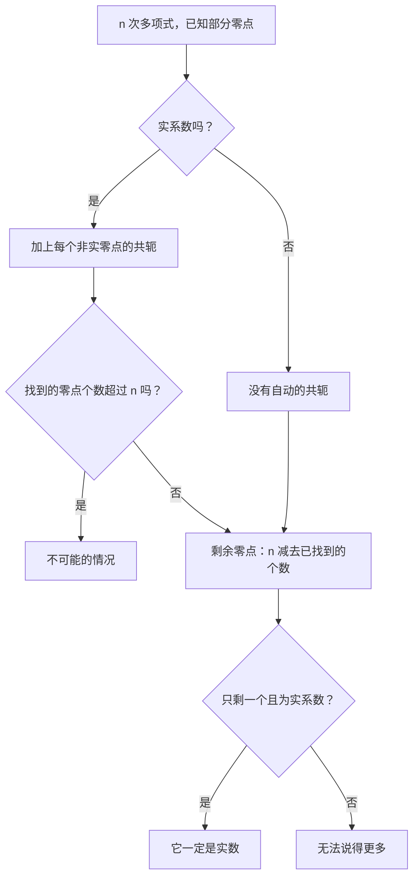
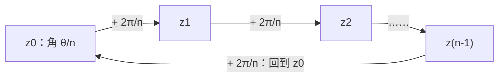

# 8. 复数的根、方程与多项式

> **目标**：求一个复数的全部 $$n$$ 次方根，用代数形式开平方，解复系数的二次方程以及含 $$\lvert z \rvert$$、$$\operatorname{Re}$$、$$\operatorname{Im}$$ 的方程，并推理多项式的零点。对应 « Test 2 Pb 3 和 Pb 4 »。

---

## 1. 引言与定义

### 1.1 $$n$$ 次方根

使 $$z^n = c$$ 成立的每个 $$z$$ 都叫做 $$c \in \mathbb{C}$$ 的 **$$n$$ 次方根**（racine $$n$$-ième）。与实数不同，**每个**非零复数都**恰好有 $$n$$ 个不同的 $$n$$ 次方根**。

若 $$c = \rho\,e^{j\theta}$$，我们找 $$z = r\,e^{j\varphi}$$ 使 $$r^n e^{jn\varphi} = \rho\,e^{j\theta}$$。两个指数形式的复数相等，当且仅当模相等且辐角**相差 $$2k\pi$$**：

$$r^n = \rho \quad\text{且}\quad n\varphi = \theta + 2k\pi$$

由此得到公式：

$$z_k = \sqrt[n]{\rho}\;e^{j\left(\frac{\theta}{n} + \frac{2k\pi}{n}\right)}, \qquad k = 0, 1, \dots, n - 1$$

> **几何意义**：这 $$n$$ 个根是内接于半径为 $$\sqrt[n]{\rho}$$ 的圆的**正 $$n$$ 边形**的顶点。相邻两个根相差角度 $$\frac{2\pi}{n}$$。（$$n = 3$$：等边三角形；$$n = 6$$：正六边形。）

### 1.2 代数形式的平方根

求 $$\sqrt{a + bj}$$ 时，找 $$x + yj$$ 使 $$(x + yj)^2 = a + bj$$，即 $$x^2 - y^2 = a$$ 且 $$2xy = b$$。再加上模相等 $$x^2 + y^2 = \sqrt{a^2 + b^2}$$，得到：

$$x = \pm\sqrt{\frac{\sqrt{a^2 + b^2} + a}{2}} \qquad y = \pm\sqrt{\frac{\sqrt{a^2 + b^2} - a}{2}}$$

符号不能随便取：**$$xy$$ 的符号与 $$b$$ 相同**（因为 $$2xy = b$$）。这样恰好得到**两个**互为相反数的根。

### 1.3 复数域中的二次方程

对 $$az^2 + bz + c = 0$$（$$a, b, c \in \mathbb{C}$$，$$a \neq 0$$），通常的公式仍然成立：

$$z_{1,2} = \frac{-b \pm \sqrt{\Delta}}{2a}, \qquad \Delta = b^2 - 4ac$$

其中 $$\pm\sqrt{\Delta}$$ 表示 $$\Delta$$ 的**两个复平方根**。若 $$\Delta$$ 是负实数，则 $$\sqrt{\Delta} = \pm j\sqrt{-\Delta}$$。

### 1.4 多项式的零点

**代数基本定理**：复系数的 $$n$$ 次多项式在 $$\mathbb{C}$$ 中**恰好有 $$n$$ 个零点**（按重数计算）。

**实系数多项式**：若 $$z_0$$ 是零点，则它的**共轭** $$\bar{z}_0$$ 也是零点。所以非实数零点**成对共轭出现**。推论：**奇数次**实系数多项式**至少有一个实零点**。

---

## 2. 解题方法

### 方法 A：$$n$$ 次方根

1. 把 $$c$$ 写成指数形式 $$\rho\,e^{j\theta}$$（画草图！）。
2. 对 $$k = 0, \dots, n - 1$$ 应用公式。
3. 需要时把每个根转换成代数形式。
4. 画出正多边形；选**极坐标**网格。

### 方法 B：$$z$$ 与 $$\lvert z \rvert$$、$$\bar{z}$$、$$\operatorname{Re}$$、$$\operatorname{Im}$$ 同时出现的方程

这类方程不是「关于 $$z$$ 的多项式方程」：不能用判别式公式。

1. 设 $$z = x + yj$$，$$x, y \in \mathbb{R}$$。
2. 展开，分开**实部**和**虚部**。
3. 一个复数为零当且仅当它的两部分都为零：得到一个**实数方程组**。
4. 因式分解；注意解集可能是**无穷集**（例如一整条直线）。

### 方法 C：推理缺失的零点

---

## 3. 详细计算示例

### 示例 1：立方根（Test 2 Pb 3，A 卷）

*计算 $$\sqrt[3]{-27j}$$。*

**第 1 步：指数形式。** $$-27j$$ 在负虚轴上：$$\rho = 27$$，$$\theta = -\frac{\pi}{2}$$。

**第 2 步：公式**（$$n = 3$$）：$$\sqrt[3]{27} = 3$$，$$\frac{\theta}{3} = -\frac{\pi}{6}$$：

$$z_k = 3\,e^{j\left(-\frac{\pi}{6} + \frac{2k\pi}{3}\right)}, \qquad k = 0, 1, 2$$

**第 3 步：代数形式。**

- $$k = 0$$：$$z_0 = 3e^{-j\frac{\pi}{6}} = 3\left(\frac{\sqrt{3}}{2} - \frac{1}{2}j\right) = \frac{3\sqrt{3}}{2} - \frac{3}{2}j$$。
- $$k = 1$$：$$z_1 = 3e^{j\frac{\pi}{2}} = 3j$$。
- $$k = 2$$：$$z_2 = 3e^{j\frac{7\pi}{6}} = -\frac{3\sqrt{3}}{2} - \frac{3}{2}j$$。

**检验**：$$z_1^3 = (3j)^3 = 27j^3 = -27j$$ ✓。三个点构成内接于半径 $$3$$ 的圆的等边三角形。

### 示例 2：代数形式的平方根（Test 2 Pb 3，A 卷）

*计算 $$\sqrt{5 - 12j}$$。*

1. $$a = 5$$，$$b = -12$$，$$\sqrt{a^2 + b^2} = \sqrt{25 + 144} = 13$$。
2. $$x = \pm\sqrt{\frac{13 + 5}{2}} = \pm 3$$，$$y = \pm\sqrt{\frac{13 - 5}{2}} = \pm 2$$。
3. $$b < 0$$，所以 $$x$$ 和 $$y$$ **异号**：

$$\sqrt{5 - 12j} = \pm(3 - 2j)$$

**检验**：$$(3 - 2j)^2 = 9 - 12j + 4j^2 = 5 - 12j$$ ✓。

### 示例 3：二次方程（Test 2 Pb 4，A 卷）

*解 $$jz^2 - 3(z - 1) = 3jz - 2$$。*

**第 1 步：标准形式。** 全部移到左边：

$$jz^2 - (3 + 3j)z + 5 = 0 \qquad (a = j,\; b = -(3 + 3j),\; c = 5)$$

**第 2 步：判别式。**

$$\Delta = (3 + 3j)^2 - 4\cdot j\cdot 5 = (9 + 18j + 9j^2) - 20j = 18j - 20j = -2j$$

**第 3 步：$$\Delta$$ 的平方根。** $$-2j = 2e^{-j\frac{\pi}{2}}$$，所以 $$\sqrt{\Delta} = \pm\sqrt{2}\,e^{-j\frac{\pi}{4}} = \pm(1 - j)$$。

**第 4 步：求解。**

$$z_{1,2} = \frac{(3 + 3j) \pm (1 - j)}{2j}$$

$$z_1 = \frac{4 + 2j}{2j} = \frac{2 + j}{j} = \frac{(2 + j)(-j)}{j(-j)} = \frac{-2j - j^2}{1} = 1 - 2j$$

$$z_2 = \frac{2 + 4j}{2j} = \frac{1 + 2j}{j} = (1 + 2j)(-j) = 2 - j$$

（除以 $$j$$ 等于乘以 $$-j$$，因为 $$\frac{1}{j} = -j$$。）

### 示例 4：含 $$\lvert z \rvert$$ 和 $$\operatorname{Im}$$ 的方程（Test 2 Pb 4，A 卷）

*解 $$\lvert z \rvert^2 - z^2 = 2\operatorname{Im}(z)$$。*

**第 1 步**：$$z = x + yj$$：$$\lvert z \rvert^2 = x^2 + y^2$$，$$z^2 = x^2 - y^2 + 2xyj$$。

**第 2 步：代入**：

$$x^2 + y^2 - x^2 + y^2 - 2xyj = 2y \iff 2y^2 - 2y - 2xyj = 0$$

**第 3 步：因式分解**：$$2y\left[(y - 1) - xj\right] = 0$$。

- 要么 $$y = 0$$：$$x$$ **任意**。所有实数 $$z \in \mathbb{R}$$ 都是解。
- 要么 $$(y - 1) - xj = 0$$，即 $$y = 1$$ **且** $$x = 0$$：$$z = j$$。

$$S = \mathbb{R} \cup \{j\}$$

### 示例 5：实系数多项式（Test 2 Pb 4，A 卷）

- **$$p_A$$ 实系数、3 次，$$z_1 = 1 + 2j$$**：$$\bar{z}_1 = 1 - 2j$$ 也是零点；第三个零点存在且**一定是实数**（若它不是实数，它的共轭会成为第 4 个零点）。
- **$$p_B$$ 实系数、4 次，$$z_1 = 1 - 2j$$ 和 $$z_2 = 3$$**：$$z_3 = 1 + 2j$$；第 4 个零点 $$z_4$$ 一定是实数。
- **$$p_C$$ 实系数、3 次，零点 $$1 - 2j$$ 和 $$3 + 4j$$**：共轭 $$1 + 2j$$ 和 $$3 - 4j$$ 也是零点，3 次多项式有 **4 个零点**：**不可能**。
- **$$p_D$$ 复系数、3 次，零点 $$1 - 2j$$ 和 $$3 + 4j$$**：没有共轭规则。存在第 3 个零点 $$z_3 \in \mathbb{C}$$，但无法说得更多。

---

## 4. 可视化：根构成一个正多边形

所有 $$z_k$$ 都在半径为 $$\sqrt[n]{\rho}$$ 的**同一个圆**上。

---

## 5. 练习

### 练习 1：立方根（Test 2 Pb 3，C 卷）

求 $$\sqrt[3]{-8}$$ 的全部根的代数形式，并把它们画在高斯平面上。

点击查看提示

$$-8 = 8e^{j\pi}$$。根为 $$2e^{j\left(\frac{\pi}{3} + \frac{2k\pi}{3}\right)}$$，$$k = 0, 1, 2$$。

**详细解答**

1. $$\rho = 8$$，$$\theta = \pi$$；$$\sqrt[3]{8} = 2$$。
2. $$z_0 = 2e^{j\frac{\pi}{3}} = 2\left(\frac{1}{2} + \frac{\sqrt{3}}{2}j\right) = 1 + \sqrt{3}\,j$$。
3. $$z_1 = 2e^{j\pi} = -2$$（预期中的实根）。
4. $$z_2 = 2e^{j\frac{5\pi}{3}} = 1 - \sqrt{3}\,j$$。
5. 图形：内接于半径 $$2$$ 的圆的等边三角形，一个顶点在 $$-2$$，另外两个顶点互为共轭。

### 练习 2：二次方程

a) 解 $$z^2 + 6z + 13 = 0$$。b) 求 $$\sqrt{-3 + 4j}$$ 的代数形式。

点击查看提示

a) $$\Delta$$ 是负实数：$$\sqrt{\Delta} = \pm j\sqrt{-\Delta}$$。b) $$\sqrt{a^2 + b^2} = 5$$，且 $$b > 0$$：$$x$$ 和 $$y$$ 同号。

**详细解答**

a) $$\Delta = 36 - 52 = -16$$，所以 $$\sqrt{\Delta} = \pm 4j$$：

$$z_{1,2} = \frac{-6 \pm 4j}{2} = -3 \pm 2j$$

两个解互为共轭，这很正常（实系数）。

b) $$x = \pm\sqrt{\frac{5 - 3}{2}} = \pm 1$$，$$y = \pm\sqrt{\frac{5 + 3}{2}} = \pm 2$$，同号：$$\sqrt{-3 + 4j} = \pm(1 + 2j)$$。检验：$$(1 + 2j)^2 = 1 + 4j - 4 = -3 + 4j$$ ✓。

### 练习 3：（Test 2 Pb 4，D 卷）

在 $$\mathbb{C}$$ 中解：$$\lvert z \rvert^2 + z^2 = 2\operatorname{Re}(z)$$。

点击查看提示

设 $$z = x + yj$$，展开，然后提取公因式 $$2x$$。

**详细解答**

1. $$x^2 + y^2 + x^2 - y^2 + 2xyj = 2x \iff 2x^2 - 2x + 2xyj = 0 \iff 2x\left[(x - 1) + yj\right] = 0$$。
2. 要么 $$x = 0$$ 且 $$y$$ 任意：所有**纯虚数** $$z = yj$$ 都是解。
3. 要么 $$x - 1 = 0$$ 且 $$y = 0$$：$$z = 1$$。

$$S = \{yj : y \in \mathbb{R}\} \cup \{1\}$$

验证 $$z = 1$$：$$1 + 1 = 2 = 2\operatorname{Re}(1)$$ ✓。验证 $$z = 3j$$：$$9 + (-9) = 0 = 2\cdot 0$$ ✓。
