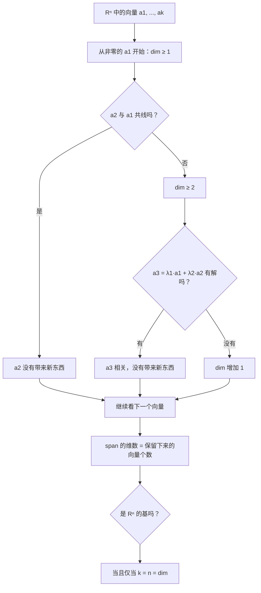

# 9. 向量、线性组合与基

> **目标**：用向量进行计算（点、平行四边形、重心），把一个向量用某组基表示，并判断一组向量是否线性无关、能否张成一个空间、是否构成基。对应 « Test 3 Pb 1 »、« Test 3A » 以及 TE F-2 中的「向量」题。

---

## 1. 引言与定义

### 1.1 向量与点

**向量**（vecteur）$$\vec{v}$$ 由方向、指向和长度确定；它与起点无关。在坐标系中，把它写成**列向量**：

$$\vec{v} = \begin{pmatrix} v_1 \\ v_2 \\ v_3 \end{pmatrix} \in \mathbb{R}^3$$

**点** $$A$$ 由它的**位置向量** $$\overrightarrow{OA}$$ 表示。从 $$A$$ 到 $$B$$ 的向量为：

$$\overrightarrow{AB} = \overrightarrow{OB} - \overrightarrow{OA} \qquad \text{（「终点减起点」）}$$

**沙勒关系**（relation de Chasles，向量加法的三角形法则）：$$\overrightarrow{AB} + \overrightarrow{BC} = \overrightarrow{AC}$$。

### 1.2 常见的图形关系

- **平行四边形** $$ABCD$$（顶点按顺序）：$$\overrightarrow{AB} = \overrightarrow{DC}$$ 且 $$\overrightarrow{AD} = \overrightarrow{BC}$$。
- 线段 $$[AB]$$ 的**中点** $$M$$：$$\overrightarrow{OM} = \frac{1}{2}\left(\overrightarrow{OA} + \overrightarrow{OB}\right)$$。
- **分割线段的点**：若 $$P \in [DC]$$ 且 $$DP : PC = 1 : 3$$，则 $$\overrightarrow{DP} = \frac{1}{4}\overrightarrow{DC}$$。
- 三角形的**重心**（barycentre，centre de gravité）$$S$$：$$\overrightarrow{OS} = \frac{1}{3}\left(\overrightarrow{OA} + \overrightarrow{OB} + \overrightarrow{OC}\right)$$，也可以写成 $$\overrightarrow{AS} = \frac{1}{3}\left(\overrightarrow{AB} + \overrightarrow{AC}\right)$$。

### 1.3 线性组合与张成空间

$$\vec{a}_1, \dots, \vec{a}_k$$ 的**线性组合**（combinaison linéaire）是形如 $$\lambda_1\vec{a}_1 + \dots + \lambda_k\vec{a}_k$$（$$\lambda_i \in \mathbb{R}$$）的向量。

所有这些组合构成的集合是**张成空间**（espace engendré，span）：

$$\operatorname{span}(\vec{a}_1, \dots, \vec{a}_k) = \left\{\lambda_1\vec{a}_1 + \dots + \lambda_k\vec{a}_k : \lambda_i \in \mathbb{R}\right\}$$

它是一个**向量子空间**（包含 $$\vec{0}$$，并且对加法和数乘封闭）。

### 1.4 线性无关

若唯一等于零的组合是平凡组合，则 $$\vec{a}_1, \dots, \vec{a}_k$$ **线性无关**（linéairement indépendants）：

$$\lambda_1\vec{a}_1 + \dots + \lambda_k\vec{a}_k = \vec{0} \implies \lambda_1 = \dots = \lambda_k = 0$$

否则它们**线性相关**（dépendants）：至少有一个向量可以写成其他向量的组合。

快速判断：

- 两个向量相关 $$\iff$$ 它们**共线**（平行）；
- $$\mathbb{R}^3$$ 中三个向量相关 $$\iff$$ 它们**共面**；
- $$\mathbb{R}^n$$ 中**多于 $$n$$ 个**向量**一定**相关；
- 含有 $$\vec{0}$$ 的向量组一定相关。

### 1.5 基、坐标、维数

空间 $$V$$ 的一组**基**（base）是既**线性无关**又能**张成** $$V$$ 的向量组。于是每个向量 $$\vec{v} \in V$$ 都可以**唯一地**写成 $$\vec{v} = \lambda_1\vec{a}_1 + \dots + \lambda_n\vec{a}_n$$；这些 $$\lambda_i$$ 就是它**在基** $$\mathcal{B}$$ **下的坐标**：

$$[\vec{v}]_{\mathcal{B}} = \begin{pmatrix} \lambda_1 \\ \vdots \\ \lambda_n \end{pmatrix}$$

**维数** $$\dim V$$ 是一组基中向量的个数（所有基的向量个数都相同）。所以 $$\dim\mathbb{R}^n = n$$，而 $$\dim\operatorname{span}(\vec{a}_1, \dots, \vec{a}_k)$$ 等于 $$\vec{a}_i$$ 中线性无关向量的**最大**个数。

> 在 $$n$$ 维空间中，**$$n$$ 个线性无关的向量自动构成一组基**：不需要再验证它们能张成整个空间。

---

## 2. 解题方法

### 方法 A：求缺失的顶点

1. 把图形翻译成**向量等式**（平行四边形：$$\overrightarrow{AB} = \overrightarrow{DC}$$；分割：$$\overrightarrow{DP} = \frac{1}{4}\overrightarrow{DC}$$……）。
2. 用「终点减起点」计算已知向量。
3. 用沙勒关系写出所求点的位置向量：$$\overrightarrow{OD} = \overrightarrow{OP} + \overrightarrow{PD}$$。

### 方法 B：求 $$\dim\operatorname{span}(\dots)$$ 并判断是否为基

### 方法 C：在一组基下的坐标

1. 设 $$\vec{v} = \lambda_1\vec{a}_1 + \lambda_2\vec{a}_2 + \lambda_3\vec{a}_3$$。
2. 按分量写出方程组。
3. 求解（代入法或消元法）；若是一组基，解唯一。

### 方法 D：在非标准基下看图读坐标

在图上（方格、正方形），沿 $$\vec{a}_1$$ 和 $$\vec{a}_2$$ 方向「数步数」来表示一个向量：例如从原点走到 $$\vec{v}$$ 的终点，需要「沿 $$\vec{a}_1$$ 后退 2 步，沿 $$\vec{a}_2$$ 前进 1 步」，所以 $$\vec{v} = -2\vec{a}_1 + \vec{a}_2$$，$$[\vec{v}]_{\mathcal{B}} = \begin{pmatrix} -2 \\ 1 \end{pmatrix}$$。

---

## 3. 详细计算示例

### 示例 1：平行四边形（Test 3 Pb 1，A 卷）

*$$ABCD$$ 是平行四边形，$$A(-2; -3)$$，$$B(2; 5)$$；点 $$P(1; 3)$$ 在 $$[DC]$$ 上，更靠近 $$D$$，把 $$[DC]$$ 按 $$\frac{1}{4} : \frac{3}{4}$$ 分开。求 $$C$$ 和 $$D$$。*

**第 1 步**：已知向量：

$$\overrightarrow{AB} = \begin{pmatrix} 2 - (-2) \\ 5 - (-3) \end{pmatrix} = \begin{pmatrix} 4 \\ 8 \end{pmatrix} = \overrightarrow{DC}$$

**第 2 步**：分割：$$\overrightarrow{DP} = \frac{1}{4}\overrightarrow{DC} = \begin{pmatrix} 1 \\ 2 \end{pmatrix}$$。

**第 3 步**：点 $$D$$：

$$\overrightarrow{OD} = \overrightarrow{OP} - \overrightarrow{DP} = \begin{pmatrix} 1 - 1 \\ 3 - 2 \end{pmatrix} = \begin{pmatrix} 0 \\ 1 \end{pmatrix} \quad\Rightarrow\quad D(0; 1)$$

**第 4 步**：点 $$C$$：

$$\overrightarrow{OC} = \overrightarrow{OD} + \overrightarrow{DC} = \begin{pmatrix} 0 + 4 \\ 1 + 8 \end{pmatrix} \quad\Rightarrow\quad C(4; 9)$$

### 示例 2：重心（Test 3 Pb 1，A 卷）

*在空间中，$$\overrightarrow{AB} = \begin{pmatrix} -1 \\ -5 \\ -1 \end{pmatrix}$$，$$\overrightarrow{AC} = \begin{pmatrix} -2 \\ -1 \\ 1 \end{pmatrix}$$，重心为 $$S(3; 3; 2)$$。求 $$A$$、$$B$$、$$C$$。*

**第 1 步：关键关系。** $$\overrightarrow{OS} = \frac{1}{3}\left(\overrightarrow{OA} + \overrightarrow{OB} + \overrightarrow{OC}\right)$$。写成 $$\overrightarrow{OB} = \overrightarrow{OA} + \overrightarrow{AB}$$ 和 $$\overrightarrow{OC} = \overrightarrow{OA} + \overrightarrow{AC}$$，使 $$\overrightarrow{AB}$$ 和 $$\overrightarrow{AC}$$ 出现：

$$\overrightarrow{OS} = \overrightarrow{OA} + \frac{1}{3}\left(\overrightarrow{AB} + \overrightarrow{AC}\right) \quad\Rightarrow\quad \overrightarrow{OA} = \overrightarrow{OS} - \frac{1}{3}\left(\overrightarrow{AB} + \overrightarrow{AC}\right)$$

**第 2 步：数值计算。** $$\overrightarrow{AB} + \overrightarrow{AC} = \begin{pmatrix} -3 \\ -6 \\ 0 \end{pmatrix}$$，它的三分之一是 $$\begin{pmatrix} -1 \\ -2 \\ 0 \end{pmatrix}$$：

$$\overrightarrow{OA} = \begin{pmatrix} 3 + 1 \\ 3 + 2 \\ 2 - 0 \end{pmatrix} = \begin{pmatrix} 4 \\ 5 \\ 2 \end{pmatrix} \Rightarrow A(4; 5; 2) \qquad B = A + \overrightarrow{AB} = (3; 0; 1) \qquad C = A + \overrightarrow{AC} = (2; 4; 3)$$

**检验**：$$\frac{1}{3}(4 + 3 + 2;\; 5 + 0 + 4;\; 2 + 1 + 3) = (3; 3; 2) = S$$ ✓。

### 示例 3：张成空间的维数（Test 3A）

*$$\vec{a}_1 = \begin{pmatrix} 1 \\ 2 \\ 0 \\ 1 \end{pmatrix}$$，$$\vec{a}_2 = \begin{pmatrix} -1 \\ 1 \\ 1 \\ -1 \end{pmatrix}$$，$$\vec{a}_3 = \begin{pmatrix} -1 \\ 4 \\ 2 \\ -1 \end{pmatrix}$$，$$\vec{a}_4 = \begin{pmatrix} 1 \\ 0 \\ -1 \\ 1 \end{pmatrix}$$。$$V = \operatorname{span}(\vec{a}_1, \vec{a}_2, \vec{a}_3, \vec{a}_4)$$ 的维数是多少？*

**第 1 步**：$$\vec{a}_1$$ 与 $$\vec{a}_2$$ 不共线（$$\vec{a}_1$$ 的第 3 个分量为零，而 $$\vec{a}_2$$ 的不是）：$$\dim\operatorname{span}(\vec{a}_1, \vec{a}_2) = 2$$。

**第 2 步**：$$\vec{a}_3 = \lambda_1\vec{a}_1 + \lambda_2\vec{a}_2$$？第 3 个分量给出 $$0\lambda_1 + \lambda_2 = 2$$，所以 $$\lambda_2 = 2$$；第 1 个分量：$$\lambda_1 - 2 = -1$$，所以 $$\lambda_1 = 1$$。验证其余分量：$$2 + 2 = 4$$ ✓，$$1 - 2 = -1$$ ✓。所以 $$\vec{a}_3 = \vec{a}_1 + 2\vec{a}_2$$：它**不增加**维数。

**第 3 步**：$$\vec{a}_4 = \lambda_1\vec{a}_1 + \lambda_2\vec{a}_2$$？第 3 个分量：$$\lambda_2 = -1$$；第 2 个：$$2\lambda_1 - 1 = 0$$，所以 $$\lambda_1 = \frac{1}{2}$$；第 1 个：$$\frac{1}{2} + 1 = \frac{3}{2} \neq 1$$。**矛盾**：$$\vec{a}_4$$ 与 $$\vec{a}_1, \vec{a}_2$$ 线性无关。

**结论**：

- $$\dim V = 3$$。
- $$\vec{a}_1, \dots, \vec{a}_4$$ **不是**线性无关的（否则 $$\dim V = 4$$）。
- 它们**不**构成 $$\mathbb{R}^4$$ 的基（$$\dim V = 3 \neq 4$$）。
- $$\vec{a}_1, \vec{a}_2, \vec{a}_3$$ 不构成 $$V$$ 的基：它们线性相关，只张成一个 2 维空间。

### 示例 4：在 $$\mathbb{R}^3$$ 的一组基下的坐标（Test 3A，2015）

*$$\vec{a}_1 = \begin{pmatrix} 1 \\ -1 \\ 1 \end{pmatrix}$$，$$\vec{a}_2 = \begin{pmatrix} 1 \\ 1 \\ 0 \end{pmatrix}$$，$$\vec{a}_3 = \begin{pmatrix} 0 \\ 1 \\ 2 \end{pmatrix}$$，$$\vec{v} = \begin{pmatrix} 1 \\ 0 \\ 0 \end{pmatrix}$$。求 $$\vec{v}$$ 在 $$\mathcal{B} = (\vec{a}_1, \vec{a}_2, \vec{a}_3)$$ 下的坐标。*

解 $$\lambda_1\vec{a}_1 + \lambda_2\vec{a}_2 + \lambda_3\vec{a}_3 = \vec{v}$$：

$$\begin{cases} \lambda_1 + \lambda_2 = 1 \\ -\lambda_1 + \lambda_2 + \lambda_3 = 0 \\ \lambda_1 + 2\lambda_3 = 0 \end{cases}$$

由第 1 式：$$\lambda_2 = 1 - \lambda_1$$；由第 3 式：$$\lambda_3 = -\frac{\lambda_1}{2}$$。代入第 2 式：$$-\lambda_1 + 1 - \lambda_1 - \frac{\lambda_1}{2} = 0 \iff \frac{5}{2}\lambda_1 = 1 \iff \lambda_1 = \frac{2}{5}$$。所以 $$\lambda_2 = \frac{3}{5}$$，$$\lambda_3 = -\frac{1}{5}$$：

$$[\vec{v}]_{\mathcal{B}} = \frac{1}{5}\begin{pmatrix} 2 \\ 3 \\ -1 \end{pmatrix}$$

解是**唯一的**，这也顺便证明了 $$\mathcal{B}$$ 是一组基。

---

## 4. 可视化：三个关键概念

---

## 5. 练习

### 练习 1：平行四边形（Test 3 Pb 1，C 卷）

$$ABCD$$ 是平行四边形，$$A(-1; -3)$$，$$B(3; 5)$$，$$P(4; 8)$$ 在 $$[DC]$$ 上，更靠近 $$C$$，按 $$\frac{3}{4} : \frac{1}{4}$$ 分开。求 $$C$$ 和 $$D$$。

点击查看提示

「更靠近 $$C$$」且比例为 $$\frac{3}{4} : \frac{1}{4}$$，意味着 $$\overrightarrow{DP} = \frac{3}{4}\overrightarrow{DC}$$。

**详细解答**

1. $$\overrightarrow{AB} = \begin{pmatrix} 3 - (-1) \\ 5 - (-3) \end{pmatrix} = \begin{pmatrix} 4 \\ 8 \end{pmatrix} = \overrightarrow{DC}$$。
2. $$\overrightarrow{DP} = \frac{3}{4}\begin{pmatrix} 4 \\ 8 \end{pmatrix} = \begin{pmatrix} 3 \\ 6 \end{pmatrix}$$。
3. $$\overrightarrow{OD} = \overrightarrow{OP} - \overrightarrow{DP} = \begin{pmatrix} 4 - 3 \\ 8 - 6 \end{pmatrix} = \begin{pmatrix} 1 \\ 2 \end{pmatrix}$$，所以 $$D(1; 2)$$。
4. $$\overrightarrow{OC} = \overrightarrow{OD} + \overrightarrow{DC} = \begin{pmatrix} 5 \\ 10 \end{pmatrix}$$，所以 $$C(5; 10)$$。
5. 检验：$$\overrightarrow{AD} = \begin{pmatrix} 2 \\ 5 \end{pmatrix} = \overrightarrow{BC}$$ ✓，且 $$\overrightarrow{AD}$$ 与 $$\overrightarrow{AB}$$ 不共线：平行四边形没有被「压扁」。

> 一定要做这个几何检验：有一份考卷的数据得出 $$D = A$$ 和 $$C = B$$，也就是一个**退化**的平行四边形。这种情况要在答案中指出来。

### 练习 2：重心

三角形 $$ABC$$ 的重心为 $$S(-2; 1; -1)$$，$$\overrightarrow{AB} = \begin{pmatrix} 6 \\ 3 \\ -4 \end{pmatrix}$$，$$\overrightarrow{AC} = \begin{pmatrix} 0 \\ 6 \\ -2 \end{pmatrix}$$。求 $$A$$、$$B$$ 和 $$C$$。

点击查看提示

$$\overrightarrow{OA} = \overrightarrow{OS} - \frac{1}{3}\left(\overrightarrow{AB} + \overrightarrow{AC}\right)$$。

**详细解答**

1. $$\overrightarrow{AB} + \overrightarrow{AC} = \begin{pmatrix} 6 \\ 9 \\ -6 \end{pmatrix}$$，它的三分之一是 $$\begin{pmatrix} 2 \\ 3 \\ -2 \end{pmatrix}$$。
2. $$\overrightarrow{OA} = \begin{pmatrix} -2 - 2 \\ 1 - 3 \\ -1 + 2 \end{pmatrix} = \begin{pmatrix} -4 \\ -2 \\ 1 \end{pmatrix}$$，所以 $$A(-4; -2; 1)$$。
3. $$B = A + \overrightarrow{AB} = (2; 1; -3)$$，$$C = A + \overrightarrow{AC} = (-4; 4; -1)$$。
4. 检验：$$\frac{1}{3}(-4 + 2 - 4;\; -2 + 1 + 4;\; 1 - 3 - 1) = (-2; 1; -1)$$ ✓。

### 练习 3：判断对错（Test 3A）

a) 满足 $$\vec{a} + \vec{b} = \vec{c}$$ 的三个向量 $$\vec{a}, \vec{b}, \vec{c}$$ 一定线性相关。b) 若 $$0\cdot\vec{a} + 0\cdot\vec{b} + 0\cdot\vec{c} = \vec{0}$$，则 $$\vec{a}, \vec{b}, \vec{c}$$ 线性无关。c) $$\mathbb{R}^2$$ 中的三个向量一定线性相关。d) 若 $$\vec{a}_1, \vec{a}_2 \in \mathbb{R}^3$$，$$V = \operatorname{span}(\vec{a}_1, \vec{a}_2)$$，则 $$\dim V \leq 2$$。e) $$\mathbb{R}^2$$ 是 $$\mathbb{R}^3$$ 的向量子空间。

点击查看提示

回到线性无关的**定义**：它是一个关于**所有**零组合的**蕴含**关系。e) $$\mathbb{R}^2$$ 中的元素有 3 个分量吗？

**详细解答**

a) **对**：$$\vec{a} + \vec{b} - \vec{c} = \vec{0}$$ 是一个非平凡的零组合（系数 $$1, 1, -1$$）。

b) **错**：平凡组合对任何向量**永远**等于零，它什么也证明不了。

c) **对**：$$\mathbb{R}^2$$ 中多于 $$n = 2$$ 个向量一定线性相关。

d) **对**：两个向量张成的空间维数为 0、1 或 2。

e) **错**：$$\mathbb{R}^2$$ 的向量有 2 个分量，$$\mathbb{R}^3$$ 的有 3 个；$$\mathbb{R}^2$$ 并不**包含于** $$\mathbb{R}^3$$（$$\mathbb{R}^3$$ 中的平面 $$\{z = 0\}$$ 与它「很像」，但那是另一个集合）。
