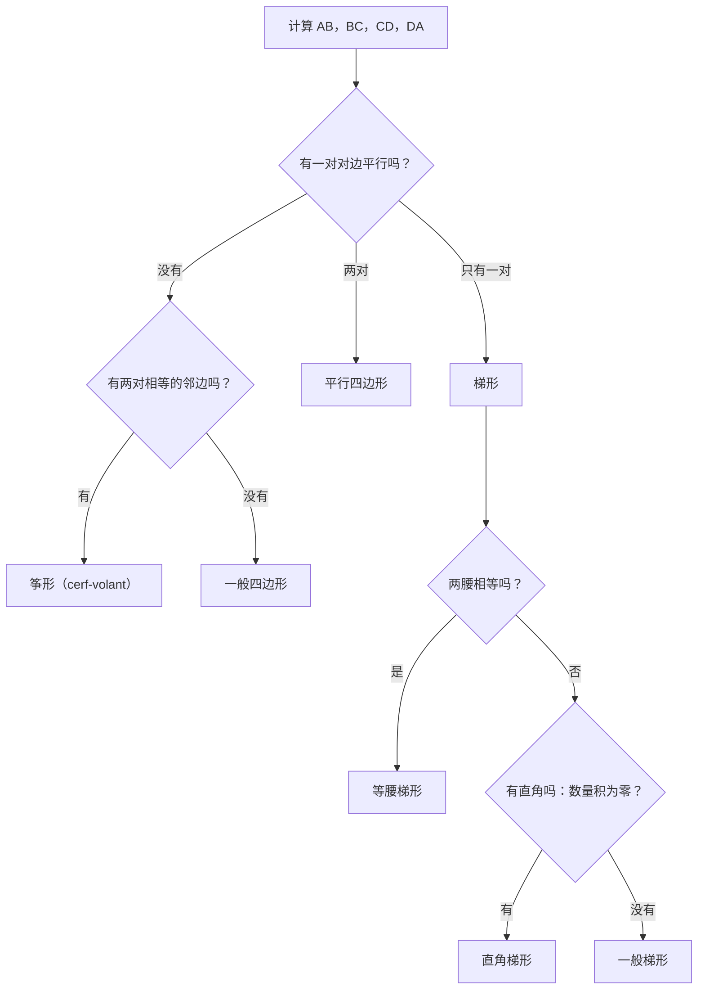
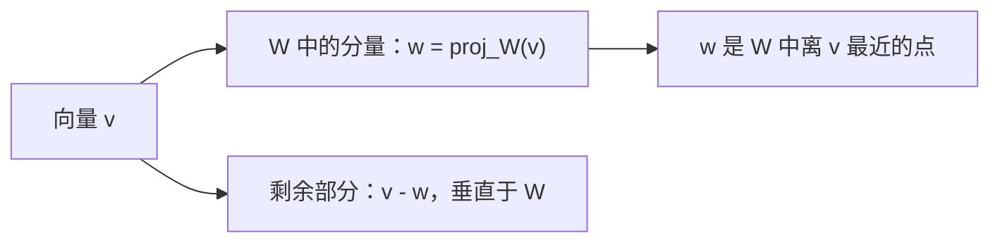

# 10. 数量积、范数、夹角与正交投影

> **目标**：用欧几里得数量积计算长度和夹角，判断四边形的类型，把向量投影到直线或子空间上，并求一个信号的**最佳逼近**。对应 « Test 3 Pb 2 和 Pb 3 »。

---

## 1. 引言与定义

### 1.1 欧几里得数量积

对 $$\vec{a}, \vec{b} \in \mathbb{R}^n$$，**数量积**（produit scalaire，也叫内积、点积，记作 $$(\vec{a}, \vec{b})_2$$ 或 $$\vec{a}\cdot\vec{b}$$）是一个**数**：

$$(\vec{a}, \vec{b})_2 = a_1b_1 + a_2b_2 + \dots + a_nb_n$$

性质：对称 $$(\vec{a}, \vec{b}) = (\vec{b}, \vec{a})$$；线性 $$(\alpha\vec{a} + \beta\vec{b}, \vec{c}) = \alpha(\vec{a}, \vec{c}) + \beta(\vec{b}, \vec{c})$$；$$(\vec{a}, \vec{a}) \geq 0$$。

### 1.2 范数与距离

**欧几里得范数**（norme，长度）：

$$\lVert\vec{a}\rVert_2 = \sqrt{(\vec{a}, \vec{a})} = \sqrt{a_1^2 + \dots + a_n^2}$$

两点之间的**距离**：$$d(A, B) = \lVert\overrightarrow{AB}\rVert$$。**单位向量**的范数为 $$1$$；把 $$\vec{a}$$ 单位化就是计算 $$\frac{\vec{a}}{\lVert\vec{a}\rVert}$$。

### 1.3 两个向量的夹角

数量积包含了夹角的信息：

$$(\vec{a}, \vec{b}) = \lVert\vec{a}\rVert\,\lVert\vec{b}\rVert\cos\gamma \quad\Rightarrow\quad \gamma = \arccos\left(\frac{(\vec{a}, \vec{b})}{\lVert\vec{a}\rVert\,\lVert\vec{b}\rVert}\right) \in [0, \pi]$$

| $$(\vec{a}, \vec{b})$$ 的符号 | 夹角 | 解释（「意见」） |
| --- | --- | --- |
| $$> 0$$ | 锐角 | 方向**相似** |
| $$= 0$$ | 直角：$$\vec{a} \perp \vec{b}$$ | **无关**，互补 |
| $$< 0$$ | 钝角 | 方向**相反** |

商 $$\cos\gamma$$ 也叫**余弦相似度**：用来比较各种「画像」（问卷答案、文档……）。

### 1.4 向量上的正交投影

$$\vec{v}$$ 在 $$\vec{a}$$ 方向上的**正交投影**（projection orthogonale）就是 $$\vec{v}$$ 在 $$\vec{a}$$ 所在直线上的「影子」：

$$\operatorname{proj}_{\vec{a}}(\vec{v}) = \frac{(\vec{v}, \vec{a})}{(\vec{a}, \vec{a})}\,\vec{a}$$

剩余部分 $$\vec{v} - \operatorname{proj}_{\vec{a}}(\vec{v})$$ 与 $$\vec{a}$$ **垂直**。

### 1.5 子空间 $$W = \operatorname{span}(\vec{a}_1, \vec{a}_2)$$ 上的投影

投影 $$\vec{w} = \operatorname{proj}_W(\vec{v}) = \alpha_1\vec{a}_1 + \alpha_2\vec{a}_2$$ 是 $$W$$ 中**最接近** $$\vec{v}$$ 的向量：它使 $$\lVert\vec{v} - \vec{w}\rVert_2$$ 最小。它的特征是：**$$\vec{v} - \vec{w}$$ 与 $$\vec{a}_1$$ 和 $$\vec{a}_2$$ 都正交**。由此得到**正规方程**：

$$\begin{cases} (\vec{a}_1, \vec{a}_1)\,\alpha_1 + (\vec{a}_1, \vec{a}_2)\,\alpha_2 = (\vec{a}_1, \vec{v}) \\ (\vec{a}_2, \vec{a}_1)\,\alpha_1 + (\vec{a}_2, \vec{a}_2)\,\alpha_2 = (\vec{a}_2, \vec{v}) \end{cases}$$

> 若 $$\vec{a}_1 \perp \vec{a}_2$$，方程组解耦，就得到各投影之和：$$\alpha_k = \frac{(\vec{a}_k, \vec{v})}{(\vec{a}_k, \vec{a}_k)}$$。**但是**如果 $$\vec{a}_1$$ 和 $$\vec{a}_2$$ 不正交，这个公式就是**错的**（经典的判断题）。

需要知道的性质（Test 3 Pb 3）：$$\vec{w} \in W$$；$$(\vec{v} - \vec{w}) \perp \vec{a}_1$$ 且 $$\perp \vec{a}_2$$；若 $$\vec{w} = \vec{0}$$，则 $$\vec{v} \perp W$$；若 $$\vec{w} = \vec{v}$$，则 $$\vec{v} \in W$$；对**$$W$$ 中的**任意 $$\vec{z}$$，$$\lVert\vec{v} - \vec{w}\rVert \leq \lVert\vec{v} - \vec{z}\rVert$$（不是对整个空间中的任意 $$\vec{z}$$）。

---

## 2. 解题方法

### 方法 A：判断四边形 $$ABCD$$ 的类型

两边的向量**成比例**（例如 $$\overrightarrow{BC} = -\frac{1}{2}\overrightarrow{DA}$$）则两边**平行**。两条相邻边的数量积为零则该角为**直角**。

### 方法 B：求满足夹角和长度条件的系数

1. 用数量积写出夹角条件：$$(\vec{v}, \vec{c}) = \lVert\vec{v}\rVert\lVert\vec{c}\rVert\cos\gamma$$；由线性得到关于 $$\alpha, \beta$$ 的**一次**方程。
2. 写出长度条件 $$\lVert\vec{v}\rVert^2 = L^2$$：**二次**方程。
3. 代入求解。

### 方法 C：最佳逼近（最小二乘）

1. 确定 $$\vec{y}$$（目标）和 $$W$$ 中的向量 $$\vec{s}_1, \vec{s}_2$$。
2. 先算出数量积 $$(\vec{s}_i, \vec{s}_j)$$ 和 $$(\vec{s}_i, \vec{y})$$。
3. 解关于 $$\alpha_1, \alpha_2$$ 的正规方程。
4. 写出 $$\vec{s} = \alpha_1\vec{s}_1 + \alpha_2\vec{s}_2$$。

---

## 3. 详细计算示例

### 示例 1：什么四边形？（Test 3 Pb 2，A 卷）

*$$A(3; 2; -1)$$，$$B(4; 0; 1)$$，$$C(2; -2; 3)$$，$$D(-1; -2; 3)$$。*

**第 1 步：各边**（「终点减起点」）：

$$\overrightarrow{AB} = \begin{pmatrix} 1 \\ -2 \\ 2 \end{pmatrix} \quad \overrightarrow{BC} = \begin{pmatrix} -2 \\ -2 \\ 2 \end{pmatrix} \quad \overrightarrow{CD} = \begin{pmatrix} -3 \\ 0 \\ 0 \end{pmatrix} \quad \overrightarrow{DA} = \begin{pmatrix} 4 \\ 4 \\ -4 \end{pmatrix}$$

**第 2 步：平行。** $$\overrightarrow{BC} = -\frac{1}{2}\overrightarrow{DA}$$：边 $$[BC]$$ 与 $$[DA]$$ 平行。$$\overrightarrow{AB}$$ 与 $$\overrightarrow{CD}$$ 不成比例。这是**梯形**。

**第 3 步：两腰的长度。**

$$\lVert\overrightarrow{AB}\rVert = \sqrt{1 + 4 + 4} = 3 \qquad \lVert\overrightarrow{CD}\rVert = 3$$

两腰长度相等：这是**等腰梯形**。

### 示例 2：给定条件的系数（Test 3 Pb 2，A 卷）

*求 $$\alpha, \beta$$，使 $$\vec{v} = \alpha\begin{pmatrix} 2 \\ -3 \\ 1 \end{pmatrix} + \beta\begin{pmatrix} 2 \\ 0 \\ 1 \end{pmatrix}$$ 与 $$\vec{c} = \begin{pmatrix} 1 \\ 0 \\ 1 \end{pmatrix}$$ 的夹角为 $$30°$$，且长度为 $$\sqrt{6}$$。*

把两个向量记作 $$\vec{a}$$ 和 $$\vec{b}$$。

**第 1 步：夹角条件。** $$(\vec{a}, \vec{c}) = 2 + 0 + 1 = 3$$，$$(\vec{b}, \vec{c}) = 3$$。由线性：

$$3\alpha + 3\beta = \lVert\vec{v}\rVert\,\lVert\vec{c}\rVert\cos 30° = \sqrt{6}\cdot\sqrt{2}\cdot\frac{\sqrt{3}}{2} = \frac{\sqrt{36}}{2} = 3 \quad\Rightarrow\quad \alpha = 1 - \beta$$

**第 2 步：长度条件。** 由 $$\alpha = 1 - \beta$$：$$\vec{v} = \vec{a} + \beta(\vec{b} - \vec{a})$$，$$\vec{b} - \vec{a} = \begin{pmatrix} 0 \\ 3 \\ 0 \end{pmatrix}$$。

$$\lVert\vec{v}\rVert^2 = (\vec{a}, \vec{a}) + 2\beta(\vec{a}, \vec{b} - \vec{a}) + \beta^2(\vec{b} - \vec{a}, \vec{b} - \vec{a}) = 14 - 18\beta + 9\beta^2$$

**第 3 步：求解** $$14 - 18\beta + 9\beta^2 = 6$$，即 $$9\beta^2 - 18\beta + 8 = 0$$：

$$\beta = \frac{18 \pm\sqrt{324 - 288}}{18} = \frac{18 \pm 6}{18} \quad\Rightarrow\quad \beta = \frac{4}{3},\ \alpha = -\frac{1}{3} \quad\text{或}\quad \beta = \frac{2}{3},\ \alpha = \frac{1}{3}$$

### 示例 3：受访者的意见（Test 3 Pb 2，A 卷）

*对问题 $$Q_1$$ 到 $$Q_5$$ 的回答（从 $$-2$$ 到 $$2$$）：$$\vec{a} = (-1, 2, 2, 0, 1)$$，$$\vec{b} = (-1, -2, 1, 0, -1)$$，$$\vec{c} = (1, 0, 2, -1, 1)$$。哪两位受访者的意见最相似、最相反、互补？*

$$(\vec{a}, \vec{b}) = 1 - 4 + 2 + 0 - 1 = -2 \qquad (\vec{a}, \vec{c}) = -1 + 0 + 4 + 0 + 1 = 4 \qquad (\vec{b}, \vec{c}) = -1 + 0 + 2 + 0 - 1 = 0$$

- $$A$$ 和 $$C$$：锐角 → 意见最**相似**。
- $$A$$ 和 $$B$$：钝角 → 意见最**相反**。
- $$B$$ 和 $$C$$：直角 → 意见**互补**（无关）。

### 示例 4：用投影作筝形（Test 3 Pb 3，A 卷）

*$$A(-1; 3; 2)$$，$$B(3; 3; 0)$$，$$C(2; -3; -1)$$。求 $$D$$，使 $$ABCD$$ 是以 $$(AC)$$ 为对称轴的筝形：$$S$$ 是从 $$B$$ 向 $$(AC)$$ 作垂线的垂足，$$D$$ 是 $$B$$ 关于 $$S$$ 的对称点。*

**第 1 步：投影。**

$$\overrightarrow{AB} = \begin{pmatrix} 4 \\ 0 \\ -2 \end{pmatrix} \quad \overrightarrow{AC} = \begin{pmatrix} 3 \\ -6 \\ -3 \end{pmatrix} \quad (\overrightarrow{AB}, \overrightarrow{AC}) = 12 + 0 + 6 = 18 \quad (\overrightarrow{AC}, \overrightarrow{AC}) = 54$$

$$\overrightarrow{AS} = \operatorname{proj}_{\overrightarrow{AC}}\left(\overrightarrow{AB}\right) = \frac{18}{54}\overrightarrow{AC} = \begin{pmatrix} 1 \\ -2 \\ -1 \end{pmatrix} \quad\Rightarrow\quad S = A + \overrightarrow{AS} = (0; 1; 1)$$

**第 2 步：对称点。** $$\overrightarrow{BS} = \begin{pmatrix} -3 \\ -2 \\ 1 \end{pmatrix}$$，$$\overrightarrow{SD} = \overrightarrow{BS}$$：

$$D = S + \overrightarrow{BS} = (-3; -1; 2)$$

**检验**：$$(\overrightarrow{BS}, \overrightarrow{AC}) = -9 + 12 - 3 = 0$$ ✓（对角线 $$[BD]$$ 确实垂直于 $$[AC]$$）。

### 示例 5：重建信号（Test 3 Pb 3，A 卷）

*在 $$t = 1, 2, 3, 4$$ s 采样的信号：$$\vec{y} = (-1, 2, 1, 4)$$，$$\vec{s}_1 = (0, 2, -1, 0)$$，$$\vec{s}_2 = (-1, 1, 2, 2)$$。求使 $$\lVert\vec{y} - \vec{s}\rVert_2$$ 最小的 $$\vec{s} = \alpha_1\vec{s}_1 + \alpha_2\vec{s}_2$$。*

**第 1 步：数量积。**

$$(\vec{s}_1, \vec{s}_1) = 5 \quad (\vec{s}_1, \vec{s}_2) = 0 + 2 - 2 + 0 = 0 \quad (\vec{s}_2, \vec{s}_2) = 10 \quad (\vec{s}_1, \vec{y}) = 0 + 4 - 1 + 0 = 3 \quad (\vec{s}_2, \vec{y}) = 1 + 2 + 2 + 8 = 13$$

**第 2 步：正规方程。** 因为 $$(\vec{s}_1, \vec{s}_2) = 0$$，方程组解耦：

$$5\alpha_1 = 3 \Rightarrow \alpha_1 = \frac{3}{5} \qquad 10\alpha_2 = 13 \Rightarrow \alpha_2 = \frac{13}{10}$$

**第 3 步：结果。**

$$\vec{s} = \frac{6}{10}\begin{pmatrix} 0 \\ 2 \\ -1 \\ 0 \end{pmatrix} + \frac{13}{10}\begin{pmatrix} -1 \\ 1 \\ 2 \\ 2 \end{pmatrix} = \frac{1}{10}\begin{pmatrix} -13 \\ 25 \\ 20 \\ 26 \end{pmatrix}$$

---

## 4. 可视化：正交分解

$$\vec{v} = \underbrace{\operatorname{proj}_W(\vec{v})}_{\in W} + \underbrace{\left(\vec{v} - \operatorname{proj}_W(\vec{v})\right)}_{\perp W}$$

---

## 5. 练习

### 练习 1：点在直线上的投影（Test 3 Pb 3，2023）

设 $$A(1; 3; 1)$$，$$B(3; 1; 1)$$，$$C(0; 4; 3)$$。求 $$C$$ 在直线 $$(AB)$$ 上的正交投影 $$C'$$ 的坐标，再求 $$C$$ 到这条直线的距离。

点击查看提示

$$\overrightarrow{AC'} = \operatorname{proj}_{\overrightarrow{AB}}\left(\overrightarrow{AC}\right)$$；所求距离为 $$\lVert\overrightarrow{C'C}\rVert$$。

**详细解答**

1. $$\overrightarrow{AB} = \begin{pmatrix} 2 \\ -2 \\ 0 \end{pmatrix}$$，$$\overrightarrow{AC} = \begin{pmatrix} -1 \\ 1 \\ 2 \end{pmatrix}$$。
2. $$(\overrightarrow{AC}, \overrightarrow{AB}) = -2 - 2 + 0 = -4$$，$$(\overrightarrow{AB}, \overrightarrow{AB}) = 8$$。
3. $$\overrightarrow{AC'} = \frac{-4}{8}\overrightarrow{AB} = \begin{pmatrix} -1 \\ 1 \\ 0 \end{pmatrix}$$，所以 $$C' = (0; 4; 1)$$。
4. $$\overrightarrow{C'C} = \begin{pmatrix} 0 \\ 0 \\ 2 \end{pmatrix}$$，距离 $$= 2$$。检验：$$(\overrightarrow{C'C}, \overrightarrow{AB}) = 0$$ ✓。

### 练习 2：四边形（Test 3 Pb 2，B 卷）

$$A(1; 0; -1)$$，$$B(3; 1; 0)$$，$$C(1; 3; 2)$$，$$D(0; 1; 0)$$。这是什么类型的四边形？

点击查看提示

找两条成比例的边，再用数量积检查各个角。

**详细解答**

1. $$\overrightarrow{AB} = \begin{pmatrix} 2 \\ 1 \\ 1 \end{pmatrix}$$，$$\overrightarrow{BC} = \begin{pmatrix} -2 \\ 2 \\ 2 \end{pmatrix}$$，$$\overrightarrow{CD} = \begin{pmatrix} -1 \\ -2 \\ -2 \end{pmatrix}$$，$$\overrightarrow{DA} = \begin{pmatrix} 1 \\ -1 \\ -1 \end{pmatrix}$$。
2. $$\overrightarrow{BC} = -2\,\overrightarrow{DA}$$：$$[BC] \parallel [DA]$$；$$\overrightarrow{AB}$$ 与 $$\overrightarrow{CD}$$ 不成比例。这是**梯形**。
3. 两腰：$$\lVert\overrightarrow{AB}\rVert = \sqrt{6}$$，$$\lVert\overrightarrow{CD}\rVert = 3$$：不是等腰。
4. $$B$$ 处的角：$$(\overrightarrow{AB}, \overrightarrow{BC}) = -4 + 2 + 2 = 0$$。直角！这是**直角梯形**。

### 练习 3：最佳逼近（Test 3 Pb 3，2023）

设 $$\vec{v} = (4, 0, -4, 3) \in \mathbb{R}^4$$，$$\vec{a}_1 = (1, 0, -3, 1)$$，$$\vec{a}_2 = (-1, -1, 1, 2)$$。向量 $$\vec{v}^* = 2\vec{a}_1 + \vec{a}_2$$ 是 $$\vec{v}$$ 在 $$\operatorname{span}(\vec{a}_1, \vec{a}_2)$$ 中的最佳逼近吗？如果不是，求出最佳逼近。

点击查看提示

$$\vec{v}^*$$ 是最佳逼近当且仅当 $$\vec{v} - \vec{v}^*$$ 与 $$\vec{a}_1$$ **和** $$\vec{a}_2$$ 都正交。

**详细解答**

1. $$\vec{v}^* = (2, 0, -6, 2) + (-1, -1, 1, 2) = (1, -1, -5, 4)$$，$$\vec{v} - \vec{v}^* = (3, 1, 1, -1)$$。
2. 检验：$$(\vec{v} - \vec{v}^*, \vec{a}_1) = 3 + 0 - 3 - 1 = -1 \neq 0$$。**不是**投影。
3. 正规方程：$$(\vec{a}_1, \vec{a}_1) = 11$$，$$(\vec{a}_1, \vec{a}_2) = -1 + 0 - 3 + 2 = -2$$，$$(\vec{a}_2, \vec{a}_2) = 7$$，$$(\vec{a}_1, \vec{v}) = 4 + 12 + 3 = 19$$，$$(\vec{a}_2, \vec{v}) = -4 - 4 + 6 = -2$$：

$$\begin{cases} 11\alpha_1 - 2\alpha_2 = 19 \\ -2\alpha_1 + 7\alpha_2 = -2 \end{cases}$$

4. 由第 2 式：$$\alpha_1 = \frac{7\alpha_2 + 2}{2}$$。代入第 1 式：$$\frac{11(7\alpha_2 + 2)}{2} - 2\alpha_2 = 19 \iff 77\alpha_2 + 22 - 4\alpha_2 = 38 \iff \alpha_2 = \frac{16}{73}$$，然后 $$\alpha_1 = \frac{7\cdot 16/73 + 2}{2} = \frac{112 + 146}{146} = \frac{129}{73}$$。
5. $$\vec{w} = \frac{129}{73}\vec{a}_1 + \frac{16}{73}\vec{a}_2 = \frac{1}{73}(113, -16, -371, 161)$$。
6. 检验：$$(\vec{v} - \vec{w}, \vec{a}_2) = \frac{1}{73}\left[(292 - 113)(-1) + 16(-1) + (-292 + 371)(1) + (219 - 161)(2)\right] = \frac{1}{73}(-179 - 16 + 79 + 116) = 0$$ ✓。
