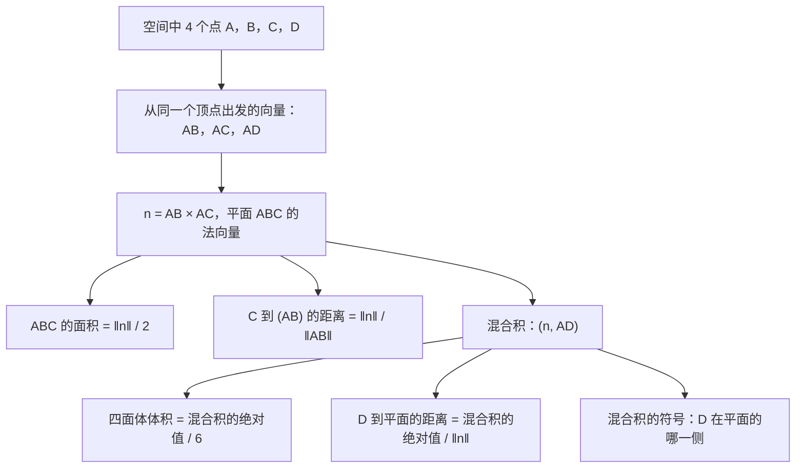
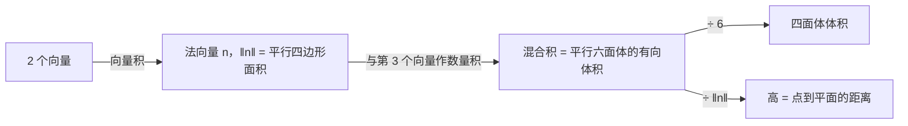

# 11. 向量积与混合积

> **目标**：计算向量积和混合积，从而得到**面积**、**体积**、**距离**（点到直线、点到平面）以及空间中的夹角。对应 « Test 3 Pb 4 » 以及 TE F-2 中的「兔子的房子」（« Maison des lapins crétins »）题。

---

## 1. 引言与定义

### 1.1 向量积（只在 $$\mathbb{R}^3$$ 中）

$$\vec{a}\times\vec{b} = \begin{pmatrix} a_1 \\ a_2 \\ a_3 \end{pmatrix}\times\begin{pmatrix} b_1 \\ b_2 \\ b_3 \end{pmatrix} = \begin{pmatrix} a_2b_3 - a_3b_2 \\ a_3b_1 - a_1b_3 \\ a_1b_2 - a_2b_1 \end{pmatrix}$$

> **计算技巧**：求第 1 个分量时，遮住第 1 行，对第 2、3 行「交叉相乘」；求第 2 个分量时，遮住第 2 行，按第 3 行再第 1 行；求第 3 个分量时，用第 1、2 行。

**几何性质**：结果是一个**向量**（produit vectoriel，叉积）：

- 与 $$\vec{a}$$ 和 $$\vec{b}$$ 都**垂直**（它是这两个向量所张平面的法向量）；
- 方向由**右手定则**决定（$$\vec{a}$$ = 拇指，$$\vec{b}$$ = 食指，$$\vec{a}\times\vec{b}$$ = 中指）；
- 它的范数等于以 $$\vec{a}$$ 和 $$\vec{b}$$ 为边的**平行四边形面积**：

$$\lVert\vec{a}\times\vec{b}\rVert = \lVert\vec{a}\rVert\,\lVert\vec{b}\rVert\sin\gamma$$

**代数性质**：反交换 $$\vec{b}\times\vec{a} = -\vec{a}\times\vec{b}$$；$$\vec{a}\times\vec{a} = \vec{0}$$；$$\vec{a}\times\vec{b} = \vec{0} \iff \vec{a} \parallel \vec{b}$$；**不满足结合律**：一般 $$\vec{a}\times(\vec{b}\times\vec{c}) \neq (\vec{a}\times\vec{b})\times\vec{c}$$。

**拉格朗日恒等式**（不算向量积也能求面积）：

$$\lVert\vec{a}\times\vec{b}\rVert^2 = \lVert\vec{a}\rVert^2\lVert\vec{b}\rVert^2 - (\vec{a}, \vec{b})^2$$

### 1.2 混合积

$$\mathbb{R}^3$$ 中三个向量的**混合积**（produit mixte）是一个**数**：

$$[\vec{a}, \vec{b}, \vec{c}] = (\vec{a}\times\vec{b}, \vec{c}) = \det\begin{pmatrix} a_1 & b_1 & c_1 \\ a_2 & b_2 & c_2 \\ a_3 & b_3 & c_3 \end{pmatrix}$$

- $$\lvert[\vec{a}, \vec{b}, \vec{c}]\rvert$$ 是以这三个向量为棱的**平行六面体的体积**。
- $$[\vec{a}, \vec{b}, \vec{c}] = 0 \iff$$ 三个向量**共面**（线性相关）。
- 循环置换不变：$$[\vec{a}, \vec{b}, \vec{c}] = [\vec{b}, \vec{c}, \vec{a}] = [\vec{c}, \vec{a}, \vec{b}]$$；交换两个向量则变号。
- 它的**符号**表示 $$\vec{c}$$ 在平面 $$(\vec{a}, \vec{b})$$ 的哪一侧：若 $$\vec{c}$$ 与 $$\vec{a}\times\vec{b}$$ 在同一侧则为正。

### 1.3 几何公式表

| 量 | 公式 |
| --- | --- |
| 平行四边形 $$ABDC$$ 的面积 | $$\lVert\overrightarrow{AB}\times\overrightarrow{AC}\rVert$$ |
| 三角形 $$ABC$$ 的面积 | $$\frac{1}{2}\lVert\overrightarrow{AB}\times\overrightarrow{AC}\rVert$$ |
| 点 $$C$$ 到直线 $$(AB)$$ 的距离 | $$\dfrac{\lVert\overrightarrow{AB}\times\overrightarrow{AC}\rVert}{\lVert\overrightarrow{AB}\rVert}$$（面积 / 底） |
| 平行六面体的体积 | $$\lvert[\overrightarrow{AB}, \overrightarrow{AC}, \overrightarrow{AD}]\rvert$$ |
| 四面体 $$ABCD$$ 的体积 | $$\frac{1}{6}\lvert[\overrightarrow{AB}, \overrightarrow{AC}, \overrightarrow{AD}]\rvert$$ |
| 底面为平行四边形的棱锥体积 | $$\frac{1}{3}\lvert[\dots]\rvert$$（两个四面体） |
| 点 $$D$$ 到平面 $$(ABC)$$ 的距离 | $$\dfrac{\lvert[\overrightarrow{AB}, \overrightarrow{AC}, \overrightarrow{AD}]\rvert}{\lVert\overrightarrow{AB}\times\overrightarrow{AC}\rVert}$$（体积 / 底面积） |

两个距离公式来自「面积 = 底 × 高」和「体积 = 底面积 × 高」。

---

## 2. 解题方法

**建议**：

- 三个向量一定要从**同一个顶点**出发。
- $$\vec{n} = \overrightarrow{AB}\times\overrightarrow{AC}$$ **只算一次**，然后反复使用。
- 检验向量积：$$(\vec{n}, \overrightarrow{AB}) = 0$$ 且 $$(\vec{n}, \overrightarrow{AC}) = 0$$。

---

## 3. 详细计算示例

### 示例 1：完整的题目（Test 3 Pb 4，A 卷）

*$$A(1; -1; 2)$$，$$B(2; 0; 1)$$，$$C(3; -4; 1)$$，$$D(2; 1; 5)$$，单位为米。$$\mathcal{P}$$ 是平面 $$(ABC)$$，$$\mathcal{L}$$ 是直线 $$(AD)$$。*

**基本向量：**

$$\overrightarrow{AB} = \begin{pmatrix} 1 \\ 1 \\ -1 \end{pmatrix} \qquad \overrightarrow{AC} = \begin{pmatrix} 2 \\ -3 \\ -1 \end{pmatrix} \qquad \overrightarrow{AD} = \begin{pmatrix} 1 \\ 2 \\ 3 \end{pmatrix}$$

**向量积：**

$$\overrightarrow{AB}\times\overrightarrow{AC} = \begin{pmatrix} 1\cdot(-1) - (-1)(-3) \\ (-1)\cdot 2 - 1\cdot(-1) \\ 1\cdot(-3) - 1\cdot 2 \end{pmatrix} = \begin{pmatrix} -4 \\ -1 \\ -5 \end{pmatrix}, \qquad \lVert\cdot\rVert = \sqrt{16 + 1 + 25} = \sqrt{42}$$

检验：$$(\vec{n}, \overrightarrow{AB}) = -4 - 1 + 5 = 0$$ ✓。

**a) 三角形 $$ABC$$ 的面积**：$$\frac{\sqrt{42}}{2} \approx 3{,}24$$ m²。

**b) $$C$$ 到 $$(AB)$$ 的距离**：$$\frac{\sqrt{42}}{\sqrt{3}} = \sqrt{14} \approx 3{,}74$$ m。

**混合积：**

$$[\overrightarrow{AB}, \overrightarrow{AC}, \overrightarrow{AD}] = (-4)(1) + (-1)(2) + (-5)(3) = -21$$

**c) $$D$$ 到平面的距离**：$$\frac{\lvert -21 \rvert}{\sqrt{42}} = \frac{21}{\sqrt{42}} = \frac{\sqrt{42}}{2} \approx 3{,}24$$ m（碰巧与面积数值相同）。

**d) 四面体体积**：$$\frac{21}{6} = \frac{7}{2} = 3{,}5$$ m³。

**e) $$\vec{n}$$（指向 $$D$$ 一侧的法向量）与 $$\overrightarrow{AD}$$ 的夹角。** 混合积为**负**：$$D$$ 在 $$\overrightarrow{AB}\times\overrightarrow{AC}$$ 的**反**方向一侧。所以指向 $$D$$ 的法向量是 $$\vec{n} = \begin{pmatrix} 4 \\ 1 \\ 5 \end{pmatrix}$$：

$$\cos\gamma = \frac{(\vec{n}, \overrightarrow{AD})}{\lVert\vec{n}\rVert\,\lVert\overrightarrow{AD}\rVert} = \frac{4 + 2 + 15}{\sqrt{42}\,\sqrt{14}} = \frac{21}{14\sqrt{3}} = \frac{\sqrt{3}}{2} \quad\Rightarrow\quad \gamma = 30°$$

**f) $$\mathcal{L}$$ 上与 $$D$$ 同侧、使 $$V(ABCX) = 7$$ m³ 的点 $$X$$。** 设 $$\overrightarrow{AX} = \lambda\overrightarrow{AD}$$，$$\lambda > 0$$。混合积是线性的：

$$V(ABCX) = \frac{1}{6}\lvert[\overrightarrow{AB}, \overrightarrow{AC}, \lambda\overrightarrow{AD}]\rvert = \frac{21\lambda}{6} = 7 \quad\Rightarrow\quad \lambda = 2$$

$$\overrightarrow{OX} = \overrightarrow{OA} + 2\overrightarrow{AD} = \begin{pmatrix} 1 + 2 \\ -1 + 4 \\ 2 + 6 \end{pmatrix} \quad\Rightarrow\quad X(3; 3; 8)$$

### 示例 2：直接计算（Test 3 Pb 4，A 卷）

*$$\vec{a} = \begin{pmatrix} 1 \\ 1 \\ 0 \end{pmatrix}$$，$$\vec{b} = \begin{pmatrix} 1 \\ -1 \\ 3 \end{pmatrix}$$，$$\vec{c} = \begin{pmatrix} 3 \\ 1 \\ -1 \end{pmatrix}$$：计算 $$(\vec{a}, \vec{b})$$、$$\vec{a}\times\vec{b}$$、$$[\vec{a}, \vec{b}, \vec{c}]$$。*

$$(\vec{a}, \vec{b}) = 1 - 1 + 0 = 0 \qquad \vec{a}\times\vec{b} = \begin{pmatrix} 1\cdot 3 - 0\cdot(-1) \\ 0\cdot 1 - 1\cdot 3 \\ 1\cdot(-1) - 1\cdot 1 \end{pmatrix} = \begin{pmatrix} 3 \\ -3 \\ -2 \end{pmatrix}$$

$$[\vec{a}, \vec{b}, \vec{c}] = (\vec{a}\times\vec{b}, \vec{c}) = 9 - 3 + 2 = 8$$

### 示例 3：棱锥（TE F-2，「兔子的房子」）

*棱锥的底面是地面上的正方形 $$ABCD$$，$$A(1; 1; 0)$$，$$B(5; -1; 0)$$，$$C(7; 3; 0)$$，$$D(3; 5; 0)$$，顶点 $$S(4; 2; 9)$$。证明底面是正方形，并求体积。*

**正方形**：$$\overrightarrow{AB} = \begin{pmatrix} 4 \\ -2 \\ 0 \end{pmatrix}$$，$$\overrightarrow{AD} = \begin{pmatrix} 2 \\ 4 \\ 0 \end{pmatrix}$$，$$\overrightarrow{DC} = \begin{pmatrix} 4 \\ -2 \\ 0 \end{pmatrix} = \overrightarrow{AB}$$（平行四边形）。$$\lVert\overrightarrow{AB}\rVert = \lVert\overrightarrow{AD}\rVert = \sqrt{20}$$（菱形），且 $$(\overrightarrow{AB}, \overrightarrow{AD}) = 8 - 8 = 0$$（直角）：这是**正方形**。

**体积**：棱锥可以分成两个体积相同的四面体 $$ABDS$$ 和 $$BCDS$$，所以 $$V = 2\cdot\frac{1}{6}\lvert[\overrightarrow{AB}, \overrightarrow{AD}, \overrightarrow{AS}]\rvert = \frac{1}{3}\lvert[\dots]\rvert$$：

$$\overrightarrow{AB}\times\overrightarrow{AD} = \begin{pmatrix} 0 \\ 0 \\ 16 + 4 \end{pmatrix} = \begin{pmatrix} 0 \\ 0 \\ 20 \end{pmatrix} \qquad \overrightarrow{AS} = \begin{pmatrix} 3 \\ 1 \\ 9 \end{pmatrix} \qquad [\dots] = 20\cdot 9 = 180$$

$$V = \frac{180}{3} = 60 \text{ 立方单位}$$

用中学公式检验：底面积 $$20$$，高 $$9$$，$$V = \frac{1}{3}\cdot 20\cdot 9 = 60$$ ✓。

---

## 4. 可视化：从面积到体积

---

## 5. 练习

### 练习 1：基础计算（Test 3 Pb 4，B 卷）

对 $$\vec{a} = \begin{pmatrix} 1 \\ 2 \\ 0 \end{pmatrix}$$，$$\vec{b} = \begin{pmatrix} -1 \\ 1 \\ 2 \end{pmatrix}$$，$$\vec{c} = \begin{pmatrix} 2 \\ 1 \\ -1 \end{pmatrix}$$，计算 $$(\vec{a}, \vec{b})$$、$$\vec{a}\times\vec{b}$$ 和 $$[\vec{a}, \vec{b}, \vec{c}]$$。这三个向量共面吗？

点击查看提示

逐个分量计算 $$\vec{a}\times\vec{b}$$，检验它与 $$\vec{a}$$ 正交，再与 $$\vec{c}$$ 作数量积。

**详细解答**

1. $$(\vec{a}, \vec{b}) = -1 + 2 + 0 = 1$$。
2. $$\vec{a}\times\vec{b} = \begin{pmatrix} 2\cdot 2 - 0\cdot 1 \\ 0\cdot(-1) - 1\cdot 2 \\ 1\cdot 1 - 2\cdot(-1) \end{pmatrix} = \begin{pmatrix} 4 \\ -2 \\ 3 \end{pmatrix}$$。检验：$$(\vec{a}\times\vec{b}, \vec{a}) = 4 - 4 + 0 = 0$$ ✓。
3. $$[\vec{a}, \vec{b}, \vec{c}] = 8 - 2 - 3 = 3 \neq 0$$：这些向量**不**共面。

### 练习 2：四面体（Test 3 Pb 4，2023）

$$A(1; 2; 2)$$，$$B(2; 1; -2)$$，$$C(1; 1; 1)$$，$$D(0; -2; 3)$$。计算 a) 四面体 $$ABCD$$ 的体积；b) 三角形 $$ABC$$ 的面积；c) $$D$$ 到平面 $$(ABC)$$ 的距离。

点击查看提示

从 $$A$$ 出发：$$\overrightarrow{AB}$$，$$\overrightarrow{AC}$$，$$\overrightarrow{AD}$$。计算 $$\vec{n} = \overrightarrow{AB}\times\overrightarrow{AC}$$，再算 $$(\vec{n}, \overrightarrow{AD})$$。

**详细解答**

1. $$\overrightarrow{AB} = \begin{pmatrix} 1 \\ -1 \\ -4 \end{pmatrix}$$，$$\overrightarrow{AC} = \begin{pmatrix} 0 \\ -1 \\ -1 \end{pmatrix}$$，$$\overrightarrow{AD} = \begin{pmatrix} -1 \\ -4 \\ 1 \end{pmatrix}$$。
2. $$\vec{n} = \overrightarrow{AB}\times\overrightarrow{AC} = \begin{pmatrix} (-1)(-1) - (-4)(-1) \\ (-4)\cdot 0 - 1\cdot(-1) \\ 1\cdot(-1) - (-1)\cdot 0 \end{pmatrix} = \begin{pmatrix} -3 \\ 1 \\ -1 \end{pmatrix}$$，$$\lVert\vec{n}\rVert = \sqrt{11}$$。
3. 混合积：$$(\vec{n}, \overrightarrow{AD}) = 3 - 4 - 1 = -2$$。

a) $$V = \frac{\lvert -2 \rvert}{6} = \frac{1}{3}$$。

b) 面积 $$= \frac{\sqrt{11}}{2} \approx 1{,}66$$。

c) $$d = \frac{2}{\sqrt{11}} \approx 0{,}60$$。

### 练习 3：判断对错（Test 3 Pb 4，2023）

a) 对所有 $$\vec{a}, \vec{b} \in \mathbb{R}^3$$：$$(\vec{a} + \vec{b})\times(\vec{a} - \vec{b}) = 2(\vec{b}\times\vec{a})$$。b) 若 $$\vec{a}, \vec{b}, \vec{c}$$ 共面，则 $$(\vec{a}\times\vec{b})\times\vec{c} = \vec{0}$$。c) 若 $$\lVert\overrightarrow{AB}\rVert = 4$$，$$\lVert\overrightarrow{AC}\rVert = 3$$，$$\angle BAC = 30°$$，则 $$\lVert\overrightarrow{AB}\times\overrightarrow{AC}\rVert = 6$$。d) 对标准基 $$\vec{e}_1, \vec{e}_2, \vec{e}_3$$，$$[\vec{e}_1, \vec{e}_2, \vec{e}_3] = 1$$。

点击查看提示

a) 利用 $$\vec{a}\times\vec{a} = \vec{0}$$ 和反交换性展开。b) $$\vec{a}\times\vec{b}$$ 相对于平面在哪里？它与 $$\vec{c}$$ 平行吗？c) $$\lVert\vec{a}\times\vec{b}\rVert = \lVert\vec{a}\rVert\lVert\vec{b}\rVert\sin\gamma$$。

**详细解答**

a) **对**：$$(\vec{a} + \vec{b})\times(\vec{a} - \vec{b}) = \vec{a}\times\vec{a} - \vec{a}\times\vec{b} + \vec{b}\times\vec{a} - \vec{b}\times\vec{b} = \vec{0} + \vec{b}\times\vec{a} + \vec{b}\times\vec{a} - \vec{0} = 2(\vec{b}\times\vec{a})$$。

b) **错**：$$\vec{a}\times\vec{b}$$ 垂直于平面，而 $$\vec{c}$$ 在平面内；它们正交，所以它们的**数量积**为零，但它们的**向量积**的范数是 $$\lVert\vec{a}\times\vec{b}\rVert\lVert\vec{c}\rVert$$，一般不为零。

c) **对**：$$4\cdot 3\cdot\sin 30° = 12\cdot\frac{1}{2} = 6$$。

d) **对**：$$\vec{e}_1\times\vec{e}_2 = \vec{e}_3$$，且 $$(\vec{e}_3, \vec{e}_3) = 1$$（单位立方体的体积）。
