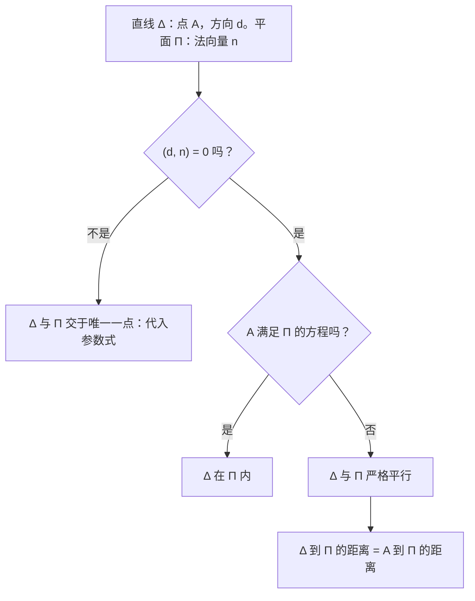
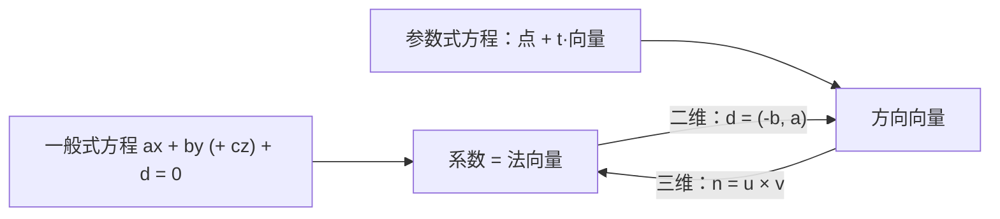

# 12. 直线与平面（解析几何）

> **目标**：在不同的方程形式之间转换（一般式 ↔ 参数式），计算平面上直线、空间中直线与平面的交点、距离和夹角。对应 TE F-2 中的「直线等」（« Droites & Co »）和「平面」（« Plan »）题。

---

## 1. 引言与定义

### 1.1 平面 $$\mathbb{R}^2$$ 中的直线

一条直线可以写成三种形式：

| 形式 | 方程 | 能直接读出的信息 |
| --- | --- | --- |
| 一般式（隐式，cartésienne） | $$ax + by + c = 0$$ | **法向量** $$\vec{n} = (a; b)$$ |
| 斜截式（显式，explicite） | $$y = mx + p$$ | 斜率 $$m$$，纵截距 $$p$$ |
| 参数式（paramétrique） | $$x = x_0 + t\,d_1$$ 且 $$y = y_0 + t\,d_2$$，$$t \in \mathbb{R}$$ | 点 $$(x_0; y_0)$$，**方向向量** $$\vec{d} = (d_1; d_2)$$ |

联系：$$ax + by + c = 0$$ 的一个方向向量是 $$\vec{d} = \begin{pmatrix} -b \\ a \end{pmatrix}$$；斜率为 $$m = \frac{d_2}{d_1}$$。竖直线 $$x = c$$ 没有斜截式。

### 1.2 空间 $$\mathbb{R}^3$$ 中的直线与平面

**直线**：只有**参数式**（单独一个一般式方程描述的是平面！）：

$$\Delta : \begin{pmatrix} x \\ y \\ z \end{pmatrix} = \begin{pmatrix} x_0 \\ y_0 \\ z_0 \end{pmatrix} + t\begin{pmatrix} d_1 \\ d_2 \\ d_3 \end{pmatrix}, \quad t \in \mathbb{R}$$

**平面**：

- **一般式** $$ax + by + cz + d = 0$$，法向量 $$\vec{n} = \begin{pmatrix} a \\ b \\ c \end{pmatrix}$$；
- **参数式**：一个点加上**两个**不共线的方向向量：

$$\Pi : \begin{pmatrix} x \\ y \\ z \end{pmatrix} = \overrightarrow{OP} + k\,\vec{u} + r\,\vec{v}, \quad k, r \in \mathbb{R}$$

参数式 → 一般式：$$\vec{n} = \vec{u}\times\vec{v}$$，再令 $$P$$ 满足方程求出 $$d$$。

### 1.3 距离

**$$\mathbb{R}^2$$ 中点到直线**与 **$$\mathbb{R}^3$$ 中点到平面**（结构相同）：

$$d\left(P_0, \Delta\right) = \frac{\lvert ax_0 + by_0 + c \rvert}{\sqrt{a^2 + b^2}} \qquad d\left(P_0, \Pi\right) = \frac{\lvert ax_0 + by_0 + cz_0 + d \rvert}{\sqrt{a^2 + b^2 + c^2}}$$

**$$\mathbb{R}^3$$ 中点到直线**：$$d = \frac{\lVert\overrightarrow{AP_0}\times\vec{d}\rVert}{\lVert\vec{d}\rVert}$$（见第 11 章）。

### 1.4 夹角

- 两条直线之间：方向向量之间的**锐角**，$$\cos\theta = \frac{\lvert(\vec{d}_1, \vec{d}_2)\rvert}{\lVert\vec{d}_1\rVert\lVert\vec{d}_2\rVert}$$。
- 两个平面之间：**法向量**之间的夹角（同一公式，用 $$\vec{n}_1, \vec{n}_2$$）。
- 直线与平面之间：$$\sin\theta = \frac{\lvert(\vec{d}, \vec{n})\rvert}{\lVert\vec{d}\rVert\lVert\vec{n}\rVert}$$（与法向量夹角的余角）。

---

## 2. 解题方法

### 方法 A：参数式 → 一般式（平面上）

从一个方程中解出 $$t$$，代入另一个方程。

### 方法 B：交点

- **$$\mathbb{R}^2$$ 中两条一般式直线**：解 $$2\times 2$$ 方程组。
- **参数式直线 ∩ 一般式平面**：把 $$x(t), y(t), z(t)$$ 代入平面方程 → 一个关于 $$t$$ 的方程。
- **两个平面**：交线的方向为 $$\vec{n}_1\times\vec{n}_2$$；固定一个坐标（例如 $$z = 0$$），解剩下的方程组得到一个点。
- **平面与坐标轴**：令两个坐标为零。

### 方法 C：直线与平面的位置关系

### 方法 D：三条直线是否共点？

先求其中两条的交点，再检验这个点是否在第三条上。

---

## 3. 详细计算示例

### 示例 1：平面上的直线（TE F-2，2023，« Droites & Co »）

*$$\Delta_1 : -x + 2y + 1 = 0$$；$$\Delta_2 : x = -3t,\ y = t - \frac{4}{3}$$；$$\Delta_3 : x = -\frac{1}{2}$$。*

**a) $$\Delta_2$$ 的一般式。** 由 $$x = -3t$$：$$t = -\frac{x}{3}$$。代入第 2 个方程：

$$y = -\frac{x}{3} - \frac{4}{3} \iff 3y = -x - 4 \iff x + 3y + 4 = 0$$

**b) 三条直线共点吗？**

- $$\Delta_1 \cap \Delta_3$$：把 $$x = -\frac{1}{2}$$ 代入 $$\Delta_1$$：$$\frac{1}{2} + 2y + 1 = 0 \iff y = -\frac{3}{4}$$。点 $$I_1\left(-\frac{1}{2}; -\frac{3}{4}\right)$$。
- $$\Delta_2 \cap \Delta_3$$：$$-\frac{1}{2} + 3y + 4 = 0 \iff y = -\frac{7}{6}$$。点 $$I_2\left(-\frac{1}{2}; -\frac{7}{6}\right)$$。
- $$I_1 \neq I_2$$：三条直线**不**交于同一点。

**c) 点 $$P(-4; -7)$$ 到 $$\Delta_1$$ 的距离**：

$$d = \frac{\lvert -(-4) + 2(-7) + 1 \rvert}{\sqrt{1 + 4}} = \frac{\lvert 4 - 14 + 1 \rvert}{\sqrt{5}} = \frac{9}{\sqrt{5}} \approx 4{,}02$$

**d) $$\Delta_1$$ 与 $$\Delta_3$$ 的夹角。** 方向向量：$$\vec{d}_1 = \begin{pmatrix} 2 \\ 1 \end{pmatrix}$$（因为 $$\vec{n}_1 = \begin{pmatrix} -1 \\ 2 \end{pmatrix}$$），$$\vec{d}_3 = \begin{pmatrix} 0 \\ 1 \end{pmatrix}$$：

$$\cos\theta = \frac{\lvert 0 + 1 \rvert}{\sqrt{5}\cdot 1} = \frac{1}{\sqrt{5}} \quad\Rightarrow\quad \theta \approx 63{,}4°$$

**e) 法向量 $$\vec{n}_1$$ 在方向向量 $$\vec{d}_2 = \begin{pmatrix} -3 \\ 1 \end{pmatrix}$$ 上的投影**：

$$\operatorname{proj}_{\vec{d}_2}(\vec{n}_1) = \frac{(\vec{n}_1, \vec{d}_2)}{(\vec{d}_2, \vec{d}_2)}\vec{d}_2 = \frac{3 + 2}{10}\begin{pmatrix} -3 \\ 1 \end{pmatrix} = \begin{pmatrix} -\frac{3}{2} \\ \frac{1}{2} \end{pmatrix}$$

### 示例 2：一个平面（TE F-2，2023，« Plan »）

*$$\Pi : 3x - 2y + 4z - 2 = 0$$。*

**a) 与坐标轴的交点**（令两个坐标为零）：

- $$Ox$$ 轴（$$y = z = 0$$）：$$3x = 2$$，$$I_x\left(\frac{2}{3}; 0; 0\right)$$；
- $$Oy$$ 轴：$$-2y = 2$$，$$I_y(0; -1; 0)$$；
- $$Oz$$ 轴：$$4z = 2$$，$$I_z\left(0; 0; \frac{1}{2}\right)$$。

**b) 参数式。** 点 $$P = I_y$$；方向向量 $$\vec{u} = \overrightarrow{I_yI_x} = \begin{pmatrix} \frac{2}{3} \\ 1 \\ 0 \end{pmatrix}$$，$$\vec{v} = \overrightarrow{I_yI_z} = \begin{pmatrix} 0 \\ 1 \\ \frac{1}{2} \end{pmatrix}$$：

$$\Pi : \begin{cases} x = \frac{2}{3}k \\ y = -1 + k + r \\ z = \frac{1}{2}r \end{cases}, \quad k, r \in \mathbb{R}$$

检验：$$3\cdot\frac{2}{3}k - 2(-1 + k + r) + 4\cdot\frac{1}{2}r - 2 = 2k + 2 - 2k - 2r + 2r - 2 = 0$$ ✓。

**c) 与 $$\Delta : x = -1 - t,\ y = 4 + t,\ z = 2 - t$$ 的交点。** 代入：

$$3(-1 - t) - 2(4 + t) + 4(2 - t) - 2 = 0 \iff -3 - 3t - 8 - 2t + 8 - 4t - 2 = 0 \iff -9t - 5 = 0 \iff t = -\frac{5}{9}$$

$$I = \left(-1 + \frac{5}{9};\ 4 - \frac{5}{9};\ 2 + \frac{5}{9}\right) = \left(-\frac{4}{9};\ \frac{31}{9};\ \frac{23}{9}\right)$$

### 示例 3：与平面平行的直线（TE F-2，2026）

*$$\Delta : x = 2 + t,\ y = 1 - 4t,\ z = -2t$$；$$\Pi : 6x - y + 5z + 5 = 0$$。*

1. $$\vec{d} = \begin{pmatrix} 1 \\ -4 \\ -2 \end{pmatrix}$$，$$\vec{n} = \begin{pmatrix} 6 \\ -1 \\ 5 \end{pmatrix}$$：$$(\vec{d}, \vec{n}) = 6 + 4 - 10 = 0$$。直线与平面**平行**。
2. $$A(2; 1; 0) \in \Delta$$：$$12 - 1 + 0 + 5 = 16 \neq 0$$，所以 $$A \notin \Pi$$。直线**不在**平面内。
3. 距离：

$$d(\Delta, \Pi) = d(A, \Pi) = \frac{\lvert 16 \rvert}{\sqrt{36 + 1 + 25}} = \frac{16}{\sqrt{62}} \approx 2{,}03$$

### 示例 4：两个平面（TE F-2，2024，« Plans »）

*$$\Pi_1 : x = 1 + k,\ y = 2 + r,\ z = 3 - k + 4r$$，$$\Pi_2 : 2x + y - z - 1 = 0$$。*

**a) $$\Pi_1$$ 的一般式。** $$\vec{u} = \begin{pmatrix} 1 \\ 0 \\ -1 \end{pmatrix}$$，$$\vec{v} = \begin{pmatrix} 0 \\ 1 \\ 4 \end{pmatrix}$$：

$$\vec{n}_1 = \vec{u}\times\vec{v} = \begin{pmatrix} 0\cdot 4 - (-1)\cdot 1 \\ (-1)\cdot 0 - 1\cdot 4 \\ 1\cdot 1 - 0\cdot 0 \end{pmatrix} = \begin{pmatrix} 1 \\ -4 \\ 1 \end{pmatrix}$$

$$x - 4y + z + d = 0$$ 经过 $$(1; 2; 3)$$：$$1 - 8 + 3 + d = 0$$，所以 $$d = 4$$。$$\Pi_1 : x - 4y + z + 4 = 0$$。

**b) 两个平面相交吗？** $$\vec{n}_1 = (1, -4, 1)$$ 与 $$\vec{n}_2 = (2, 1, -1)$$ 不共线：相交。交线方向：

$$\vec{n}_1\times\vec{n}_2 = \begin{pmatrix} (-4)(-1) - 1\cdot 1 \\ 1\cdot 2 - 1\cdot(-1) \\ 1\cdot 1 - (-4)\cdot 2 \end{pmatrix} = \begin{pmatrix} 3 \\ 3 \\ 9 \end{pmatrix} \parallel \begin{pmatrix} 1 \\ 1 \\ 3 \end{pmatrix}$$

**c) 两平面的夹角**：

$$\cos\theta = \frac{\lvert(\vec{n}_1, \vec{n}_2)\rvert}{\lVert\vec{n}_1\rVert\lVert\vec{n}_2\rVert} = \frac{\lvert 2 - 4 - 1 \rvert}{\sqrt{18}\sqrt{6}} = \frac{3}{\sqrt{108}} = \frac{1}{2\sqrt{3}} \quad\Rightarrow\quad \theta \approx 73{,}2°$$

---

## 4. 可视化：法向量还是方向向量？

---

## 5. 练习

### 练习 1：平面上的直线（TE F-2，2024）

$$\Delta_1 : \frac{1}{2}x - y - \frac{1}{2} = 0$$，$$\Delta_2 : x = -3 - 3t,\ y = t - \frac{1}{3}$$。a) 把 $$\Delta_2$$ 写成一般式。b) 求 $$\Delta_1$$ 与 $$\Delta_2$$ 的交点。c) 求两直线的夹角。

点击查看提示

a) $$t = y + \frac{1}{3}$$，代入 $$x$$。b) 解 $$2\times 2$$ 方程组。c) 用方向向量 $$\vec{d}_1 = \begin{pmatrix} 2 \\ 1 \end{pmatrix}$$ 和 $$\vec{d}_2 = \begin{pmatrix} -3 \\ 1 \end{pmatrix}$$。

**详细解答**

a) $$x = -3 - 3\left(y + \frac{1}{3}\right) = -4 - 3y$$，所以 $$\Delta_2 : x + 3y + 4 = 0$$。

b) 由 $$\Delta_1$$：$$x = 2y + 1$$。代入 $$\Delta_2$$：$$2y + 1 + 3y + 4 = 0 \iff y = -1$$，然后 $$x = -1$$。交点 $$(-1; -1)$$。

c) $$\cos\theta = \frac{\lvert -6 + 1 \rvert}{\sqrt{5}\sqrt{10}} = \frac{5}{\sqrt{50}} = \frac{1}{\sqrt{2}}$$，所以 $$\theta = 45°$$。

### 练习 2：直线与平面

设 $$\Pi : 2x - y + 2z - 6 = 0$$，$$\Delta : x = 1 + t,\ y = 2t,\ z = 3 - t$$。a) 位置关系？b) 原点到平面的距离。c) $$\Delta$$ 与 $$\Pi$$ 的夹角。

点击查看提示

计算 $$(\vec{d}, \vec{n})$$。c) 直线与平面的夹角用**正弦**计算。

**详细解答**

a) $$\vec{d} = (1, 2, -1)$$，$$\vec{n} = (2, -1, 2)$$：$$(\vec{d}, \vec{n}) = 2 - 2 - 2 = -2 \neq 0$$。有唯一交点：$$2(1 + t) - 2t + 2(3 - t) - 6 = 0 \iff 2 - 2t = 0 \iff t = 1$$，点 $$(2; 2; 2)$$。

b) $$d(O, \Pi) = \frac{\lvert -6 \rvert}{\sqrt{4 + 1 + 4}} = \frac{6}{3} = 2$$。

c) $$\sin\theta = \frac{\lvert -2 \rvert}{\sqrt{6}\cdot 3} = \frac{2}{3\sqrt{6}} \approx 0{,}272$$，所以 $$\theta \approx 15{,}8°$$。

### 练习 3：过三点的平面

求过 $$A(1; 0; 0)$$、$$B(0; 2; 0)$$、$$C(0; 0; 3)$$ 的平面的一般式方程，再求 $$D(1; 2; 3)$$ 到这个平面的距离。

点击查看提示

$$\vec{n} = \overrightarrow{AB}\times\overrightarrow{AC}$$，再用点 $$A$$ 求 $$d$$。（技巧：与坐标轴交于 $$a$$、$$b$$、$$c$$ 的平面方程为 $$\frac{x}{a} + \frac{y}{b} + \frac{z}{c} = 1$$。）

**详细解答**

1. $$\overrightarrow{AB} = (-1, 2, 0)$$，$$\overrightarrow{AC} = (-1, 0, 3)$$。
2. $$\vec{n} = \begin{pmatrix} 2\cdot 3 - 0\cdot 0 \\ 0\cdot(-1) - (-1)\cdot 3 \\ (-1)\cdot 0 - 2\cdot(-1) \end{pmatrix} = \begin{pmatrix} 6 \\ 3 \\ 2 \end{pmatrix}$$。
3. $$6x + 3y + 2z + d = 0$$ 过 $$A$$：$$6 + d = 0$$，$$d = -6$$。平面：$$6x + 3y + 2z - 6 = 0$$（等价于 $$\frac{x}{1} + \frac{y}{2} + \frac{z}{3} = 1$$ ✓）。
4. $$d(D, \Pi) = \frac{\lvert 6 + 6 + 6 - 6 \rvert}{\sqrt{36 + 9 + 4}} = \frac{12}{7} \approx 1{,}71$$。
