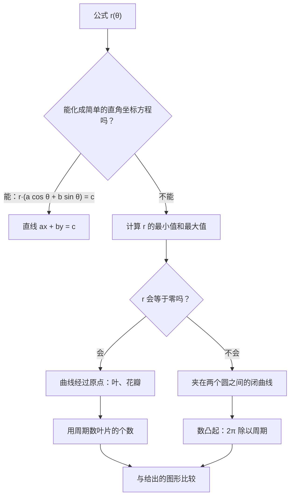
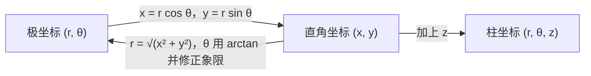

# 13. 极坐标与极坐标曲线

> **目标**：在直角坐标与极坐标（或柱坐标）之间转换，根据公式认出极坐标曲线 $$r(\theta)$$，并根据 $$r$$ 关于 $$\theta$$ 的图像画出曲线草图。对应 TE F-2 中的「极坐标曲线」（« Courbes polaires »）题。

---

## 1. 引言与定义

### 1.1 用距离和角度确定一个点

除了给出 $$(x; y)$$，也可以给出：

- $$r \geq 0$$：点到原点的**距离**；
- $$\theta$$：$$Ox$$ 轴正方向与射线 $$[OP)$$ 之间的**角**。

这就是**极坐标**（coordonnées polaires）$$(r; \theta)$$。它正好是复数的模和辐角（第 7 章）。

**极坐标 → 直角坐标**：

$$x = r\cos\theta \qquad y = r\sin\theta$$

**直角坐标 → 极坐标**：

$$r = \sqrt{x^2 + y^2} \qquad \tan\theta = \frac{y}{x} \quad \text{（注意修正象限！）}$$

> 和复数的辐角一样，若 $$x < 0$$，必须在 $$\arctan\frac{y}{x}$$ 上加 $$\pi$$。

### 1.2 柱坐标（空间中）

保留高度 $$z$$，在水平面上用极坐标：$$(r; \theta; z)$$，其中 $$x = r\cos\theta$$，$$y = r\sin\theta$$，$$z = z$$。

### 1.3 极坐标曲线

**极坐标曲线**是当 $$\theta$$ 取遍一个区间时点 $$(r(\theta); \theta)$$ 的集合。可以像**雷达**一样读它：对每个方向 $$\theta$$，从原点出发走距离 $$r(\theta)$$。

| 极坐标方程 | 直角坐标方程 | 曲线 |
| --- | --- | --- |
| $$r = R$$ | $$x^2 + y^2 = R^2$$ | 圆心为 $$O$$ 的圆 |
| $$\theta = \theta_0$$ | $$y = \tan(\theta_0)\,x$$ | 从 $$O$$ 出发的射线 |
| $$r = \frac{c}{a\cos\theta + b\sin\theta}$$ | $$ax + by = c$$ | 直线 |
| $$r = 2a\sin\theta$$ | $$x^2 + (y - a)^2 = a^2$$ | 过 $$O$$ 的圆 |
| $$r = a + b\cos(n\theta)$$，$$a > b > 0$$ | | 有 $$n$$ 个凸起的「花」 |
| $$r = a\,\theta$$ | | 阿基米德螺线 |

### 1.4 如何读极坐标曲线

- **凸起的个数**：函数 $$r = a + b\cos(n\theta)$$ 或 $$a + b\sin(n\theta)$$ 的周期为 $$\frac{2\pi}{n}$$，所以一圈内有 **$$n$$ 个凸起**。如果有**平方**（$$\cos^2(n\theta)$$），周期再减半：$$2n$$ 个凸起。
- **最小/最大半径**：$$r$$ 的上下界给出曲线在其间摆动的内圆和外圆。
- **是否经过原点**：看 $$r(\theta) = 0$$ 的地方。
- **对称性**：若 $$r(-\theta) = r(\theta)$$，曲线关于 $$Ox$$ 轴对称。

---

## 2. 解题方法

### 方法 A：把公式与图形配对

### 方法 B：根据 $$r(\theta)$$ 的图像画曲线

1. 读出关键角的 $$r$$：$$\theta = 0$$（$$Ox$$ 正半轴上的点）、$$\frac{\pi}{2}$$（$$Oy$$ 正半轴）、$$\pi$$ 和 $$-\pi$$（$$Ox$$ 负半轴）、$$-\frac{\pi}{2}$$（$$Oy$$ 负半轴）。
2. 找出 $$r = 0$$（曲线碰到原点）和 $$r \to +\infty$$（曲线沿该方向跑向无穷远）的地方。
3. 按 $$\theta$$ 增大的方向把点连起来。

### 方法 C：直角坐标方程与极坐标方程互化

- 代入 $$x = r\cos\theta$$，$$y = r\sin\theta$$，$$x^2 + y^2 = r^2$$。
- 反过来，必要时两边乘以 $$r$$，使 $$r\cos\theta$$、$$r\sin\theta$$ 或 $$r^2$$ 出现。

---

## 3. 详细计算示例

### 示例 1：公式与图形配对（TE F-2，2026）

*把每条曲线与正确的图形配对：a) $$r = 1 + \sin(2\theta)$$；b) $$r = \frac{2}{\cos\theta + 2\sin\theta}$$；c) $$r = 2 + \cos^2(4\theta)$$。*

**b)** 两边乘以分母：$$r\cos\theta + 2r\sin\theta = 2$$，即 $$x + 2y = 2$$。这是一条与坐标轴交于 $$(2; 0)$$ 和 $$(0; 1)$$ 的**直线**。

**c)** $$\cos^2(4\theta) \in [0, 1]$$，所以 $$r \in [2, 3]$$：曲线**不经过**原点，夹在半径 $$2$$ 和 $$3$$ 的圆之间。$$\cos^2(4\theta)$$ 的周期为 $$\frac{\pi}{4}$$，所以有 $$\frac{2\pi}{\pi/4} = 8$$ 个凸起。这是一朵**有 8 个凸起的花**。

**a)** $$r = 1 + \sin(2\theta) \in [0, 2]$$：

- 当 $$\sin(2\theta) = -1$$，即 $$\theta = -\frac{\pi}{4}$$ 和 $$\theta = \frac{3\pi}{4}$$ 时 $$r = 0$$：曲线在第二、第四象限方向**碰到原点**；
- 当 $$\theta = \frac{\pi}{4}$$ 或 $$\frac{5\pi}{4}$$ 时 $$r = 2$$（最大值）：在第一和第三象限有两个大叶片。

这是一条沿角平分线 $$y = x$$ 方向、有**两个叶片**的曲线。

### 示例 2：坐标转换

*a) 把 $$P(r = 4;\ \theta = \frac{5\pi}{6})$$ 转成直角坐标。b) 把 $$Q(-2; -2\sqrt{3})$$ 转成极坐标。*

a) $$x = 4\cos\frac{5\pi}{6} = 4\cdot\left(-\frac{\sqrt{3}}{2}\right) = -2\sqrt{3}$$，$$y = 4\sin\frac{5\pi}{6} = 2$$。所以 $$P(-2\sqrt{3}; 2)$$。

b) $$r = \sqrt{4 + 12} = 4$$。$$\tan\theta = \frac{-2\sqrt{3}}{-2} = \sqrt{3}$$，参考角 $$\frac{\pi}{3}$$，但 $$Q$$ 在**第三象限**：$$\theta = \frac{\pi}{3} + \pi = \frac{4\pi}{3}$$（或 $$-\frac{2\pi}{3}$$）。

### 示例 3：柱坐标（TE F-2，2024）

*建筑物的顶点 $$G(10; 1{,}5; 10)$$：求柱坐标。*

$$r = \sqrt{10^2 + 1{,}5^2} = \sqrt{102{,}25} \approx 10{,}11 \qquad \theta = \arctan\left(\frac{1{,}5}{10}\right) \approx 0{,}149 \text{ rad} \approx 8{,}5° \qquad z = 10$$

（$$x > 0$$，所以不需要修正象限。）

### 示例 4：根据 $$r(\theta)$$ 的图像画草图（TE F-2，2026）

*在 $$-\pi < \theta < \pi$$ 的 $$r(\theta)$$ 图像上读出：$$\theta \to \pm\pi$$ 时 $$r \to +\infty$$；$$r(-\frac{\pi}{2}) = 0$$；$$r(0) = 1$$；$$r(\frac{\pi}{2}) = 2$$。*

1. $$\theta = -\frac{\pi}{2}$$：$$r = 0$$，曲线经过**原点**。
2. $$\theta = 0$$：$$Ox$$ 正半轴上的点 $$(1; 0)$$。
3. $$\theta = \frac{\pi}{2}$$：$$Oy$$ 正半轴上的点 $$(0; 2)$$。
4. $$\theta \to \pm\pi$$：沿 $$Ox$$ **负**半轴方向 $$r \to \infty$$：曲线向左跑。

连起来：曲线从左边无穷远处（在横轴下方，$$\theta$$ 接近 $$-\pi$$）出发，到达原点，经过 $$(1; 0)$$，上升到 $$(0; 2)$$，然后又向左跑到无穷远处（在横轴上方）。

---

## 4. 可视化：坐标转换

---

## 5. 练习

### 练习 1：坐标转换

a) 转成直角坐标：$$A(r = 2;\ \theta = -\frac{3\pi}{4})$$。b) 转成极坐标：$$B(0; -5)$$ 和 $$C(-\sqrt{3}; 1)$$。

点击查看提示

$$C$$ 在第二象限。参考角由 $$\tan\theta = \frac{1}{-\sqrt{3}}$$ 得到。

**详细解答**

a) $$x = 2\cos\left(-\frac{3\pi}{4}\right) = -\sqrt{2}$$，$$y = 2\sin\left(-\frac{3\pi}{4}\right) = -\sqrt{2}$$：$$A(-\sqrt{2}; -\sqrt{2})$$。

b) $$B$$ 在 $$Oy$$ 负半轴上：$$r = 5$$，$$\theta = -\frac{\pi}{2}$$（或 $$\frac{3\pi}{2}$$）。

$$C$$：$$r = \sqrt{3 + 1} = 2$$；$$\arctan\left(\frac{1}{-\sqrt{3}}\right) = -\frac{\pi}{6}$$，修正（第二象限）：$$\theta = -\frac{\pi}{6} + \pi = \frac{5\pi}{6}$$。

### 练习 2：认出曲线（TE F-2，2023）

描述（凸起个数、极值半径、是否过原点）：a) $$r = 3 + \sin(8\theta)$$；b) $$r = 3 + \cos(6\theta)$$；c) $$r = \frac{3}{\sin\theta}$$。

点击查看提示

a) 和 b)：计算三角函数的周期和 $$r$$ 的上下界。c) 两边乘以 $$\sin\theta$$。

**详细解答**

a) 周期 $$\frac{2\pi}{8} = \frac{\pi}{4}$$：**8 个凸起**；$$r \in [2, 4]$$；不过原点。凸起的顶点在 $$\theta = \frac{\pi}{16} + \frac{k\pi}{4}$$（$$\sin(8\theta) = 1$$ 处）。

b) 周期 $$\frac{\pi}{3}$$：**6 个凸起**；$$r \in [2, 4]$$；一个顶点在 $$Ox$$ 正半轴上（$$\theta = 0$$ 时 $$r = 4$$）。

c) $$r\sin\theta = 3 \iff y = 3$$：**水平直线** $$y = 3$$。

### 练习 3：直角坐标化为极坐标

写成极坐标方程：a) 圆 $$x^2 + y^2 = 4y$$；b) 直线 $$x - y = 2$$。再写成直角坐标方程：c) $$r = 6\cos\theta$$。

点击查看提示

把 $$x^2 + y^2$$ 换成 $$r^2$$，$$y$$ 换成 $$r\sin\theta$$。c) 两边乘以 $$r$$。

**详细解答**

a) $$r^2 = 4r\sin\theta \iff r = 4\sin\theta$$（约去 $$r$$；原点 $$r = 0$$ 在 $$\theta = 0$$ 时已在曲线上）。这是圆心 $$(0; 2)$$、半径 $$2$$ 的圆。

b) $$r\cos\theta - r\sin\theta = 2 \iff r = \frac{2}{\cos\theta - \sin\theta}$$。

c) $$r^2 = 6r\cos\theta \iff x^2 + y^2 = 6x \iff (x - 3)^2 + y^2 = 9$$：圆心 $$(3; 0)$$、半径 $$3$$ 的圆。
