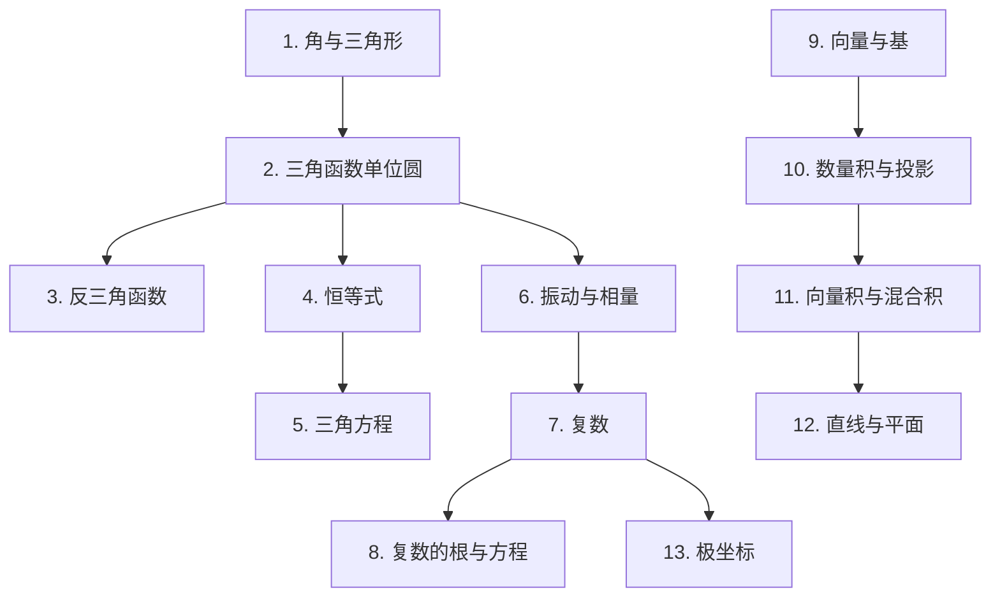

# 线性代数 1（Algèbre linéaire 1）

本课程逐章重建线性代数 1（ISC，HEIA-FR）各次测验和笔试中**考过的全部内容**：15 分钟的小测（« 不用计算器、不带总结、不带书 »），以及 90 分钟的 TE F-1 / F-2。

## 课程目录

| # | 章节 | 考试出处 |
| --- | --- | --- |
| 1 | [角、三角形与圆周运动](01-angles-et-triangles.md) | Test 1 Pb 1，TE F-1 « Triangle & Co »，« Vous avez dit crétins ? » |
| 2 | [三角函数单位圆](02-cercle-trigonometrique.md) | Test 1 Pb 1，TE F-1 « Comparaison d'angles » |
| 3 | [反三角函数](03-fonctions-trigonometriques-reciproques.md) | Test 1 Pb 2 |
| 4 | [三角恒等式与化简](04-identites-trigonometriques.md) | Test 1 Pb 3 |
| 5 | [三角方程](05-equations-trigonometriques.md) | Test 1 Pb 4，TE F-1 |
| 6 | [简谐振动与相量](06-oscillations-harmoniques.md) | Test 2 Pb 1，TE F-1 « Oscillations » |
| 7 | [复数：形式与运算](07-nombres-complexes.md) | Test 2 Pb 2 和 Pb 3 |
| 8 | [复数的根、方程与多项式](08-racines-et-equations-complexes.md) | Test 2 Pb 3 和 Pb 4 |
| 9 | [向量、线性组合与基](09-vecteurs-et-bases.md) | Test 3 Pb 1，Test 3A，TE F-2 |
| 10 | [数量积、夹角与正交投影](10-produit-scalaire-et-projection.md) | Test 3 Pb 2 和 Pb 3 |
| 11 | [向量积与混合积](11-produit-vectoriel-et-mixte.md) | Test 3 Pb 4，TE F-2 « Maison des lapins crétins » |
| 12 | [直线与平面](12-droites-et-plans.md) | TE F-2 « Droites & Co »，« Plan » |
| 13 | [极坐标与极坐标曲线](13-coordonnees-polaires.md) | TE F-2 « Courbes polaires » |

## 各章之间的联系

## 每一章的结构

1. **引言与定义**：一步一步讲解理论。
2. **解题方法**：针对每一类考题的「做题步骤」。
3. **详细示例**：取自考卷，并解释每一步**为什么**这样做。
4. **可视化**：一张总结图。
5. **练习**：可折叠的提示，然后是完整解答。

> **建议**：小测**不允许用计算器**。请亲手把例题重做一遍，尤其是三角函数单位圆上的值和复数的形式转换。

> **法语小词典**：考卷是法语的。每个重要概念第一次出现时，括号里都给出了法语名称，例如 向量（vecteur）、基（base）、数量积（produit scalaire）。
