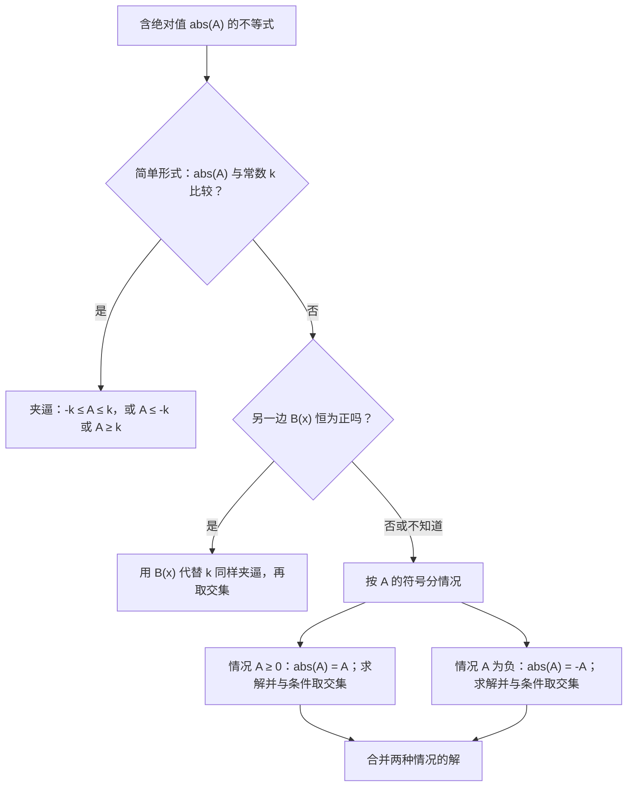
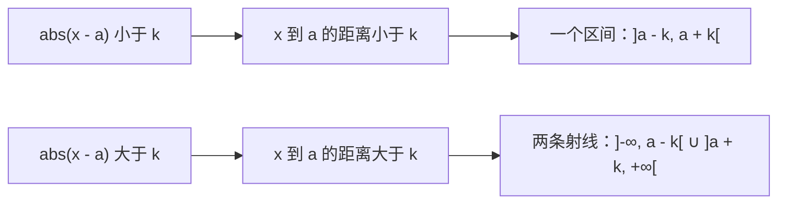

# 1. 不等式、符号表与绝对值

> **目标**：解任何多项式不等式、分式不等式或含绝对值的不等式，并用**区间**写出解集。这几乎是分析 1 **每一次**笔试的第一题（TE 1 « Révision et limites »，« Inéquations »）。

---

## 1. 引言与定义

### 1.1 不等式与解集

**不等式**（inéquation）用 $$<$$、$$\leq$$、$$>$$ 或 $$\geq$$ 比较两个表达式。解不等式就是找出满足它的**所有实数构成的集合 $$S$$**。用区间表示：

| 记号 | 含义 |
| --- | --- |
| $$[a, b]$$ | $$a \leq x \leq b$$（包含端点） |
| $$]a, b[$$ | $$a < x < b$$（不含端点，即中国写法的 $$(a, b)$$） |
| $$]-\infty, a]$$ | $$x \leq a$$（$$\infty$$ **永远**不包含） |
| $$A \cup B$$ | $$x$$ 在 $$A$$ 中**或**在 $$B$$ 中 |
| $$\mathbb{R} \setminus \{a\}$$ | 除 $$a$$ 以外的所有实数 |
| $$\varnothing$$ | 无解 |

> 法式写法：开区间用**向外的方括号** $$]a, b[$$，而不是圆括号。考试中请使用法式写法。

### 1.2 变形规则

- 两边可以**加上**或**减去**同一个数。
- 两边**乘以**或**除以**同一个**正数**，方向不变。
- 乘以或除以**负数**，**不等号方向改变**：$$-2x < 6 \iff x > -3$$。
- **绝不**乘以一个含 $$x$$、符号未知的表达式（例如分母 $$x - 2$$）。应该把所有项移到同一边，然后做**符号表**（tableau de signes）。

### 1.3 一次因式和二次三项式的符号

- $$ax + b$$ 在 $$x = -\frac{b}{a}$$ 处为零；在这个根的**右边与 $$a$$ 同号**，左边与 $$a$$ 异号。
- $$ax^2 + bx + c$$，判别式 $$\Delta = b^2 - 4ac$$：
  - 若 $$\Delta > 0$$：两个根 $$x_1 < x_2$$；三项式在两根**之外与 $$a$$ 同号**，在两根**之间**与 $$a$$ 异号；
  - 若 $$\Delta = 0$$：一个二重根；其他地方与 $$a$$ 同号；
  - 若 $$\Delta < 0$$：无实根；**处处与 $$a$$ 同号**。

### 1.4 绝对值

$$\lvert A \rvert = \begin{cases} A & \text{若 } A \geq 0 \\ -A & \text{若 } A < 0 \end{cases}$$

几何上，$$\lvert x - a \rvert$$ 是数轴上 $$x$$ 与 $$a$$ 之间的**距离**。对 $$k > 0$$：

$$\lvert A \rvert < k \iff -k < A < k \qquad \lvert A \rvert > k \iff A < -k \ \text{或}\ A > k$$

若 $$k < 0$$：$$\lvert A \rvert < k$$ **无**解，$$\lvert A \rvert > k$$ **恒**成立。若 $$k$$ 换成一个**恒为正**的表达式 $$B(x)$$，这些等价关系依然成立。

---

## 2. 解题方法

### 方法 A：多项式或分式不等式

1. 把所有项移到**同一边**：$$\text{表达式} \;\square\; 0$$。
2. 必要时**通分**。
3. 把分子和分母尽可能**因式分解**。
4. 找出**临界值**（每个因式的零点）；标出**禁止值**（分母的零点）。
5. 画**符号表**：每个因式一行，乘积/商一行。
6. 读出区间；禁止值**永远不包含**。

### 方法 B：含绝对值的不等式

### 方法 C：连不等式

对 $$a \leq \dots \leq b$$，**三部分同时做相同的运算**（若乘以负数，两个不等号都要反向）。

---

## 3. 详细计算示例

### 示例 1：二次不等式（TE 1，2024）

$$x^2 - x \geq 6$$

1. 移到一边：$$x^2 - x - 6 \geq 0$$。
2. 因式分解：根 $$x = \frac{1 \pm\sqrt{1 + 24}}{2} = \frac{1 \pm 5}{2}$$，即 $$3$$ 和 $$-2$$：$$(x - 3)(x + 2) \geq 0$$。
3. 符号表：

| $$x$$ | $$-\infty$$ 到 $$-2$$ | $$-2$$ | $$-2$$ 到 $$3$$ | $$3$$ | $$3$$ 到 $$+\infty$$ |
| --- | --- | --- | --- | --- | --- |
| $$x + 2$$ | $$-$$ | $$0$$ | $$+$$ | $$+$$ | $$+$$ |
| $$x - 3$$ | $$-$$ | $$-$$ | $$-$$ | $$0$$ | $$+$$ |
| 乘积 | $$+$$ | $$0$$ | $$-$$ | $$0$$ | $$+$$ |

$$S = \left]-\infty, -2\right] \cup \left[3, +\infty\right[$$

### 示例 2：绝对值与一次式（TE 1，2024）

$$\lvert 3x - 2 \rvert < 8x + 5$$

右边 $$8x + 5$$ 可能为负：按 $$3x - 2$$ 的符号**分情况**（它在 $$x = \frac{2}{3}$$ 处变号）。

**情况 1：$$x \geq \frac{2}{3}$$**，此时 $$\lvert 3x - 2 \rvert = 3x - 2$$：

$$3x - 2 < 8x + 5 \iff -7 < 5x \iff x > -\frac{7}{5}$$

与条件 $$x \geq \frac{2}{3}$$ 取交集：$$S_1 = \left[\frac{2}{3}, +\infty\right[$$。

**情况 2：$$x < \frac{2}{3}$$**，此时 $$\lvert 3x - 2 \rvert = -3x + 2$$：

$$-3x + 2 < 8x + 5 \iff -3 < 11x \iff x > -\frac{3}{11}$$

与条件取交集：$$S_2 = \left]-\frac{3}{11}, \frac{2}{3}\right[$$。

**合并**：

$$S = S_1 \cup S_2 = \left]-\frac{3}{11}, +\infty\right[$$

### 示例 3：右边恒为正（TE 2，2019）

$$\lvert 3x - 5 \rvert < x^2 - 3x + 4$$

1. $$x^2 - 3x + 4$$ 的判别式 $$9 - 16 < 0$$ 且 $$a = 1 > 0$$：它**恒为正**。所以可以夹逼：

$$-(x^2 - 3x + 4) < 3x - 5 < x^2 - 3x + 4$$

2. **右边的不等式**：$$0 < x^2 - 6x + 9 = (x - 3)^2$$，对所有 $$x \neq 3$$ 成立。
3. **左边的不等式**：$$-x^2 + 3x - 4 < 3x - 5 \iff 1 < x^2 \iff x < -1$$ 或 $$x > 1$$。
4. 两个条件取**交集**：

$$S = \left]-\infty, -1\right[ \cup \left]1, 3\right[ \cup \left]3, +\infty\right[$$

### 示例 4：平方与绝对值（TE，2025）

$$(x + 1)^2 \leq \lvert x + 3 \rvert$$

**情况 1：$$x \geq -3$$**：$$x^2 + 2x + 1 \leq x + 3 \iff x^2 + x - 2 \leq 0 \iff (x + 2)(x - 1) \leq 0 \iff x \in [-2, 1]$$。整个区间都满足 $$x \geq -3$$：$$S_1 = [-2, 1]$$。

**情况 2：$$x < -3$$**：$$x^2 + 2x + 1 \leq -x - 3 \iff x^2 + 3x + 4 \leq 0$$。判别式 $$9 - 16 < 0$$ 且 $$a > 0$$：三项式恒**严格为正**。$$S_2 = \varnothing$$。

$$S = [-2, 1]$$

### 示例 5：分式不等式（TE，2023）

$$\frac{3}{x + 1} > \frac{2}{x - 2}$$

1. 禁止值：$$x \neq -1$$ 且 $$x \neq 2$$。
2. 移到一边，通分：

$$\frac{3}{x + 1} - \frac{2}{x - 2} > 0 \iff \frac{3(x - 2) - 2(x + 1)}{(x + 1)(x - 2)} > 0 \iff \frac{x - 8}{(x + 1)(x - 2)} > 0$$

3. 符号表（临界值 $$-1$$、$$2$$、$$8$$）：

| $$x$$ | $$x < -1$$ | $$-1 < x < 2$$ | $$2 < x < 8$$ | $$x > 8$$ |
| --- | --- | --- | --- | --- |
| $$x - 8$$ | $$-$$ | $$-$$ | $$-$$ | $$+$$ |
| $$x + 1$$ | $$-$$ | $$+$$ | $$+$$ | $$+$$ |
| $$x - 2$$ | $$-$$ | $$-$$ | $$+$$ | $$+$$ |
| 商 | $$-$$ | $$+$$ | $$-$$ | $$+$$ |

$$S = \left]-1, 2\right[ \cup \left]8, +\infty\right[$$

> 经典错误：「交叉相乘」得到 $$3(x - 2) > 2(x + 1)$$。这是**错的**，因为乘以了符号会变化的 $$(x + 1)(x - 2)$$！

---

## 4. 可视化：绝对值就是距离

---

## 5. 练习

### 练习 1：（TE 1，2022）

解不等式并用区间表示解集：a) $$-\frac{1}{2} \leq \frac{2x + 3}{5} < \frac{3}{2}$$；b) $$\lvert 2x - 9 \rvert > 3$$；c) $$\lvert 16 - 3y \rvert \leq 5$$。

点击查看提示

a) 三部分都乘以 $$5$$，减去 $$3$$，再除以 $$2$$。c) 注意：除以 $$-3$$ 时两个不等号都要反向。

**详细解答**

a) $$-\frac{5}{2} \leq 2x + 3 < \frac{15}{2} \iff -\frac{11}{2} \leq 2x < \frac{9}{2} \iff -\frac{11}{4} \leq x < \frac{9}{4}$$。所以 $$S = \left[-\frac{11}{4}, \frac{9}{4}\right[$$。

b) $$2x - 9 > 3$$ 或 $$2x - 9 < -3$$，即 $$x > 6$$ 或 $$x < 3$$。$$S = \left]-\infty, 3\right[ \cup \left]6, +\infty\right[$$。

c) $$-5 \leq 16 - 3y \leq 5 \iff -21 \leq -3y \leq -11 \iff 7 \geq y \geq \frac{11}{3}$$。$$S = \left[\frac{11}{3}, 7\right]$$。

### 练习 2：（TE 1，2019）

解：a) $$x^2 + 3x \geq -2$$；b) $$\frac{-2}{\lvert x - 4 \rvert} < -3$$；c) $$5x^2 < -2$$。

点击查看提示

b) 两边乘以 $$-1$$（方向改变），然后注意到 $$\lvert x - 4 \rvert > 0$$：此时可以放心地乘以 $$\lvert x - 4 \rvert$$。

**详细解答**

a) $$x^2 + 3x + 2 \geq 0 \iff (x + 1)(x + 2) \geq 0$$。三项式（$$a > 0$$）在两根之外为正：$$S = \left]-\infty, -2\right] \cup \left[-1, +\infty\right[$$。

b) 禁止值 $$x = 4$$。$$\frac{2}{\lvert x - 4 \rvert} > 3$$；因为 $$\lvert x - 4 \rvert > 0$$：$$2 > 3\lvert x - 4 \rvert \iff \lvert x - 4 \rvert < \frac{2}{3} \iff \frac{10}{3} < x < \frac{14}{3}$$。去掉 $$4$$：

$$S = \left]\frac{10}{3}, 4\right[ \cup \left]4, \frac{14}{3}\right[$$

c) 对所有 $$x$$，$$5x^2 \geq 0 > -2$$：平方不可能为负。$$S = \varnothing$$。

### 练习 3：（TE，2023）

解：a) $$x^3 - 4x^2 < -3x$$；b) $$\ln(x) > \ln(5x - 2)$$。

点击查看提示

a) 提取公因式 $$x$$。b) 先求定义域（对数的真数严格为正），再利用 $$\ln$$ 严格递增。

**详细解答**

a) $$x^3 - 4x^2 + 3x < 0 \iff x(x^2 - 4x + 3) < 0 \iff x(x - 1)(x - 3) < 0$$。

| $$x$$ | $$x < 0$$ | $$0 < x < 1$$ | $$1 < x < 3$$ | $$x > 3$$ |
| --- | --- | --- | --- | --- |
| $$x$$ | $$-$$ | $$+$$ | $$+$$ | $$+$$ |
| $$x - 1$$ | $$-$$ | $$-$$ | $$+$$ | $$+$$ |
| $$x - 3$$ | $$-$$ | $$-$$ | $$-$$ | $$+$$ |
| 乘积 | $$-$$ | $$+$$ | $$-$$ | $$+$$ |

$$S = \left]-\infty, 0\right[ \cup \left]1, 3\right[$$。

b) 定义域：$$x > 0$$ 且 $$5x - 2 > 0$$，所以 $$x > \frac{2}{5}$$。因为 $$\ln$$ 严格递增：$$x > 5x - 2 \iff x < \frac{1}{2}$$。结合定义域：$$S = \left]\frac{2}{5}, \frac{1}{2}\right[$$。
